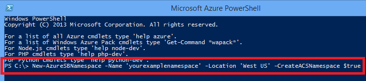

<properties
	pageTitle="How to use Service Bus topics (Ruby) - Azure"
	description="Learn how to use Service Bus topics and subscriptions in Azure. Code samples are written for Ruby applications."
	services="service-bus"
	documentationCenter="ruby"
	authors="tfitzmac"
	manager="wpickett"
	editor=""/>

<tags
	ms.service="service-bus"
	ms.workload="tbd"
	ms.tgt_pltfrm="na"
	ms.devlang="ruby"
	ms.topic="article"
	ms.date="03/20/2015"
	ms.author="tomfitz"/>

# How to Use Service Bus Topics/Subscriptions

This guide will show you how to use Service Bus topics and subscriptions from Ruby applications. The scenarios covered include **creating topics and subscriptions, creating subscription filters, sending messages** to a topic, **receiving messages from a subscription**, and **deleting topics and subscriptions**. For more information on topics and subscriptions, see the [Next Steps](#NextSteps) section.

## What are Service Bus Topics and Subscriptions

Service Bus topics and subscriptions support a **publish/subscribe
messaging communication** model. When using topics and subscriptions,
components of a distributed application do not communicate directly with
each other, they instead exchange messages via a topic, which acts as an
intermediary.

In contrast to Service Bus queues, where each message is processed by a
single consumer, topics and subscriptions provide a **one-to-many** form
of communication, using a publish/subscribe pattern. It is possible to
register multiple subscriptions to a topic. When a message is sent to a
topic, it is then made available to each subscription to handle/process
independently.

A topic subscription resembles a virtual queue that receives copies of
the messages that were sent to the topic. You can optionally register
filter rules for a topic on a per-subscription basis, which allows you
to filter/restrict which messages to a topic are received by which topic
subscriptions.

Service Bus topics and subscriptions enable you to scale to process a
very large number of messages across a very large number of users and
applications.

## Create a Service Namespace

To begin using Service Bus queues in Azure, you must first create a service namespace. A service namespace provides a scoping container for addressing Service Bus resources within
your application. You must create the namespace through the command-line interface because the Portal does not create the service bus with an ACS connection.

To create a namespace:

1. Open an Azure Powershell console.

2. Type the command to create an Azure service bus namespace as shown below. Provide your own namespace value and specify the same region as your application.

      New-AzureSBNamespace -Name 'yourexamplenamespace' -Location 'West US' -NamespaceType 'Messaging' -CreateACSNamespace $true

      

## Obtain Default Management Credentials for the Namespace

In order to perform management operations, such as creating a queue on the new
namespace, you must obtain the management credentials for the namespace.

The PowerShell cmdlet you ran to create the Azure service bus namespace displays
the key you can use to manage the namespace. Copy the **DefaultKey** value. You
will use this value in your code later in this tutorial.

      

> [AZURE.NOTE]
> You can also find this key if you log on to the
> [Azure Management Portal](http://manage.windowsazure.com/) and navigate to the
> connection information for your service bus namespace.

## Create a Ruby Application

Create a Ruby application. For instructions, see [Create a Ruby Application on Azure](/develop/ruby/tutorials/web-app-with-linux-vm/).

## Configure Your Application to Use Service Bus

To use Azure service bus, you need to download and use the Ruby azure package, which includes a set of convenience libraries that communicate with the storage REST services.

### Use RubyGems to obtain the package

1. Use a command-line interface such as **PowerShell** (Windows), **Terminal** (Mac), or **Bash** (Unix).

2. Type "gem install azure" in the command window to install the gem and dependencies.

### Import the package

Use your favorite text editor, add the following to the top of the Ruby file where you intend to use storage:

    require "azure"

## Setup an Azure Service Bus Connection

The azure module will read the environment variables **AZURE\_SERVICEBUS\_NAMESPACE** and **AZURE\_SERVICEBUS\_ACCESS\_KEY**
for information required to connect to your Azure service bus namespace. If these environment variables are not set, you must specify the namespace information before using **Azure::ServiceBusService** with the following code:

    Azure.config.sb_namespace = "<your azure service bus namespace>"
    Azure.config.sb_access_key = "<your azure service bus access key>"

Set the service bus namespace value to the value you created rather than the entire URL. For example, use **"yourexamplenamespace"**, not "yourexamplenamespace.servicebus.windows.net".

## How to Create a Topic

The **Azure::ServiceBusService** object lets you work with topics. The following code creates an **Azure::ServiceBusService** object. To create a topic, use the **create\_topic()** method. The following example creates a topic or print out the error if there is any.

	azure_service_bus_service = Azure::ServiceBusService.new
	begin
      topic = azure_service_bus_service.create_queue("test-topic")
    rescue
      puts $!
    end

You can also pass in a **Azure::ServiceBus::Topic** object with additional options, which allows you to override default topic settings such as message time to live or maximum queue size. The following example shows setting the maximum queue size to 5GB and time to live to 1 minute:

	topic = Azure::ServiceBus::Topic.new("test-topic")
    topic.max_size_in_megabytes = 5120
    topic.default_message_time_to_live = "PT1M"

    topic = azure_service_bus_service.create_topic(topic)

## How to Create Subscriptions

Topic subscriptions are also created with the **Azure::ServiceBusService** object. Subscriptions are named and can have an optional filter that restricts the set of messages delivered to the subscription's virtual queue.

Subscriptions are persistent and will continue to exist until either they, or the topic they are associated with, are deleted. If your application contains logic to create a subscription, it should first check if the subscription already exists by using the getSubscription method.

### Create a Subscription with the default (MatchAll) Filter

The **MatchAll** filter is the default filter that is used if no filter is specified when a new subscription is created. When the **MatchAll** filter is used, all messages published to the topic are placed in the subscription's virtual queue. The following example creates a subscription named "all-messages" and uses the default **MatchAll** filter.

	subscription = azure_service_bus_service.create_subscription("test-topic",
	  "all-messages")

### Create Subscriptions with Filters

You can also setup filters that allow you to scope which messages sent to a topic should show up within a specific topic subscription.

The most flexible type of filter supported by subscriptions is the **Azure::ServiceBus::SqlFilter**, which implements a subset of SQL92. SQL filters operate on the properties of the messages that are published to the topic. For more details about the expressions that can be used with a SQL filter, review the [SqlFilter.SqlExpression](http://msdn.microsoft.com/library/windowsazure/microsoft.servicebus.messaging.sqlfilter.sqlexpression.aspx) syntax.

Filters can be added to a subscription by using the **create\_rule()** method of the **Azure::ServiceBusService** object. This method allows you to add new filters to an existing subscription.

Since the default filter is applied automatically to all new subscriptions, you must first remove the default filter or the **MatchAll** will override any other filters you may specify. You can remove the default rule by using the **delete\_rule()** method of the **Azure::ServiceBusService** object.

The examples below creates a subscription named "high-messages" with a **Azure::ServiceBus::SqlFilter** that only selects messages that have a custom **message\_number** property greater than 3:

	subscription = azure_service_bus_service.create_subscription("test-topic",
	  "high-messages")
	azure_service_bus_service.delete_rule("test-topic", "high-messages",
	  "$Default")

	rule = Azure::ServiceBus::Rule.new("high-messages-rule")
	rule.topic = "test-topic"
	rule.subscription = "high-messages"
	rule.filter = Azure::ServiceBus::SqlFilter.new({
	  :sql_expression => "message_number > 3" })
	rule = azure_service_bus_service.create_rule(rule)

Similarly, the following example creates a subscription named "low-messages" with a **Azure::ServiceBus::SqlFilter** that only selects messages that have a **message_number** property less than or equal to 3:

	subscription = azure_service_bus_service.create_subscription("test-topic",
	  "low-messages")
	azure_service_bus_service.delete_rule("test-topic", "low-messages",
	  "$Default")

	rule = Azure::ServiceBus::Rule.new("low-messages-rule")
	rule.topic = "test-topic"
	rule.subscription = "low-messages"
	rule.filter = Azure::ServiceBus::SqlFilter.new({
	  :sql_expression => "message_number <= 3" })
	rule = azure_service_bus_service.create_rule(rule)

When a message is now sent to "test-topic", it will always be delivered to receivers subscribed to the "all-messages" topic subscription, and selectively delivered to receivers subscribed to the "high-messages" and "low-messages" topic subscriptions (depending upon the message content).

## How to Send Messages to a Topic

To send a message to a Service Bus topic, your application must use the **send\_topic\_message()** method of the **Azure::ServiceBusService** object. Messages sent to Service Bus Topics are **Azure::ServiceBus::BrokeredMessage** objects. **Azure::ServiceBus::BrokeredMessage** objects have a set of standard properties (such as **label** and **time\_to\_live**), a dictionary that is used to hold custom application specific properties, and a body of string data. An application can set the body of the message by passing a string value to the **send\_topic\_message()** method and any required standard properties will be populated by default values.

The following example demonstrates how to send five test messages to "test-topic". Note that the **message_number** custom property value of each message varies on the iteration of the loop (this will determine which subscription receive it):

	5.times do |i|
	  message = Azure::ServiceBus::BrokeredMessage.new("test message " + i,
	    { :message_number => i })
	  azure_service_bus_service.send_topic_message("test-topic", message)
	end

Service Bus topics support a maximum message size of 256 MB (the header, which includes the standard and custom application properties, can have a maximum size of 64 MB). There is no limit on the number of messages held in a topic but there is a cap on the total size of the messages held by a topic. This topic size is defined at creation time, with an upper limit of 5 GB.

## How to Receive Messages from a Subscription

Messages are received from a subscription using the **receive\_subscription\_message()** method on the **Azure::ServiceBusService** object. By default, messages are read(peak) and locked without deleting it from the subscription. You can read and delete the message from the subscription by setting the **peek\_lock** option to **false**.

The default behavior makes the reading and deleting into a two stage operation, which makes it possible to support applications that cannot tolerate missing messages. When service bus receives a request, it finds the next message to be consumed, locks it to prevent other consumers receiving it, and then returns it to the application. After the application finishes processing the message (or stores it reliably for future processing), it completes the second stage of the receive process by calling **delete\_subscription\_message()** method and providing the message to be deleted as a parameter. The **delete\_subscription\_message()** method will mark the message as being consumed and remove it from the subscription.

If the **:peek\_lock** parameter is set to **false**, reading and deleting the message becomes the simplest model, and works best for scenarios in which an application can tolerate not processing a message in the event of a failure. To understand this, consider a scenario in which the consumer issues the receive request and then crashes before processing it. Because Service Bus will have marked the message as being consumed, then when the application restarts and begins consuming messages again, it will have missed the message that was consumed prior to the crash.

The example below demonstrates how messages can be received and processed using **receive\_subscription\_message()**. The example first receives and deletes a message from the "low-messages" subscription by using **:peek\_lock** set to **false**, then it receives another message from the "high-messages" and then deletes the message using **delete\_subscription\_message()**:

    message = azure_service_bus_service.receive_subscription_message(
	  "test-topic", "low-messages", { :peek_lock => false })
    message = azure_service_bus_service.receive_subscription_message(
	  "test-topic", "high-messages")
    azure_service_bus_service.delete_subscription_message(message)

## How to Handle Application Crashes and Unreadable Messages

Service bus provides functionality to help you gracefully recover from errors in your application or difficulties processing a message. If a receiver application is unable to process the message for some reason, then it can call the **unlock\_subscription\_message()** method on the **Azure::ServiceBusService** object. This will cause service bus to unlock the message within the subscription and make it available to be received again, either by the same consuming application or by another consuming application.

There is also a timeout associated with a message locked within the subscription, and if the application fails to process the message before the lock timeout expires (e.g., if the application crashes), then service bus will unlock the message automatically and make it available to be received again.

In the event that the application crashes after processing the message but before the **delete\_subscription\_message()** method is called, then the message will be redelivered to the application when it restarts. This is often called **At Least Once Processing**, that is, each message will be processed at least once but in certain situations the same message may be redelivered. If the scenario cannot tolerate duplicate processing, then application developers should add additional logic to their application to handle duplicate message delivery. This is often achieved using the **message\_id** property of the message, which will remain constant across delivery attempts.

## How to Delete Topics and Subscriptions

Topics and subscriptions are persistent, and must be explicitly deleted either through the [Azure Management Portal](https://manage.windowsazure.com) or programmatically. The example below demonstrates how to delete the topic named "test-topic".

	azure_service_bus_service.delete_topic("test-topic")

Deleting a topic will also delete any subscriptions that are registered with the topic. Subscriptions can also be deleted independently. The following code demonstrates how to delete the subscription named "high-messages" from the "test-topic" topic:

	azure_service_bus_service.delete_subscription("test-topic", "high-messages")

## Next Steps

Now that you've learned the basics of Service Bus topics, follow these links to learn more.

-   See the MSDN Reference: [Queues, Topics, and Subscriptions](http://msdn.microsoft.com/library/windowsazure/hh367516.aspx)
-   API reference for [SqlFilter](http://msdn.microsoft.com/library/windowsazure/microsoft.servicebus.messaging.sqlfilter.aspx)
-	Visit the [Azure SDK for Ruby](https://github.com/WindowsAzure/azure-sdk-for-ruby) repository on GitHub
