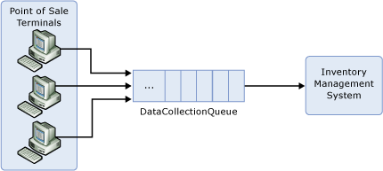
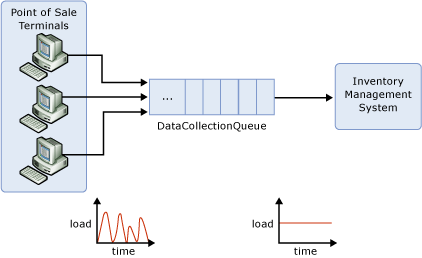

<properties 
    pageTitle="Write applications that use Service Bus queues | Microsoft Azure"
    description="How to write a simple queue-based application that uses Service Bus."
    services="service-bus"
    documentationCenter="na"
    authors="sethmanheim"
    manager="timlt"
    editor="" />
<tags 
    ms.service="service-bus"
    ms.devlang="na"
    ms.topic="article"
    ms.tgt_pltfrm="na"
    ms.workload="na"
    ms.date="06/21/2016"
    ms.author="sethm" />

# Create applications that use Service Bus queues

This topic describes Service Bus queues and shows how to write a simple queue-based application that uses Service Bus.

Consider a scenario from the world of retail in which sales data from individual Point-of-Sale (POS) terminals must be routed to an inventory management system that uses the data to determine when stock has to be replenished. This solution uses Service Bus messaging for the communication between the terminals and the inventory management system, as illustrated in the following figure:



Each POS terminal reports its sales data by sending messages to the **DataCollectionQueue**. These messages remain in this queue until they are retrieved by the inventory management system. This pattern is often termed *asynchronous messaging*, because the POS terminal does not have to wait for a reply from the inventory management system to continue processing.

## Why queuing?

Before we look at the code that is required to set up this application, consider the advantages of using a queue in this scenario instead of having the POS terminals talk directly (synchronously) to the inventory management system.

### Temporal decoupling

With the asynchronous messaging pattern, producers and consumers do not have to be online at the same time. The messaging infrastructure reliably stores messages until the consuming party is ready to receive them. This means the components of the distributed application can be disconnected, either voluntarily; for example, for maintenance, or due to a component crash, without affecting the whole system. Furthermore, the consuming application may only have to be online during certain times of the day. For example, in this retail scenario, the inventory management system may only have to come online after the end of the business day.

### Load leveling

In many applications system load varies over time, whereas the processing time required for each unit of work is typically constant. Intermediating message producers and consumers with a queue means that the consuming application (the worker) only has to be provisioned to service an average load rather than a peak load. The depth of the queue will grow and contract as the incoming load varies. This directly saves money with regard to the amount of infrastructure required to service the application load.



### Load balancing

As the load increases, more worker processes can be added to read from the worker queue. Each message is processed by only one of the worker processes. Furthermore, this pull-based load balancing allows for optimum usage of the worker computers even if the worker computers differ with regard to processing power, as they will pull messages at their own maximum rate. This pattern is often termed the competing consumer pattern.


### Loose coupling

Using message queuing to intermediate between message producers and consumers provides an intrinsic loose coupling between the components. Because producers and consumers are not aware of each other, a consumer can be upgraded without having any effect on the producer. Furthermore, the messaging topology can evolve without affecting the existing endpoints. We’ll discuss this more when we talk about publish/subscribe.

## Show me the code

The following section shows how to use Service Bus to build this application.

### Sign up for an Azure account

You’ll need an Azure account in order to start working with Service Bus. If you do not already have one, you can sign up for a free account [here](https://azure.microsoft.com/pricing/free-trial/?WT.mc_id=A85619ABF).

### Create a service namespace

Once you have a subscription, you can [create a new namespace](service-bus-create-namespace-portal.md). Each namespace acts as a scoping container for a set of Service Bus entities. Give your new namespace a unique name across all Service Bus accounts. 

### Install the NuGet package

To use the Service Bus namespace, an application must reference the Service Bus assembly, specifically Microsoft.ServiceBus.dll. You can find this assembly as part of the Microsoft Azure SDK, and the download is available at the [Azure SDK download page](https://azure.microsoft.com/downloads/). However, the [Service Bus NuGet package](https://www.nuget.org/packages/WindowsAzure.ServiceBus) is the easiest way to get the Service Bus API and to configure your application with all of the Service Bus dependencies.

### Create the queue

Management operations for Service Bus messaging entities (queues and publish/subscribe topics) are performed via the [NamespaceManager](https://msdn.microsoft.com/library/azure/microsoft.servicebus.namespacemanager.aspx) class. Service Bus uses a [Shared Access Signature (SAS)](service-bus-sas-overview.md) based security model. The [TokenProvider](https://msdn.microsoft.com/library/azure/microsoft.servicebus.tokenprovider.aspx) class represents a security token provider with built-in factory methods returning some well-known token providers. We’ll use a [CreateSharedAccessSignatureTokenProvider](https://msdn.microsoft.com/library/azure/microsoft.servicebus.tokenprovider.createsharedaccesssignaturetokenprovider.aspx) method to hold the SAS credentials. The [NamespaceManager](https://msdn.microsoft.com/library/azure/microsoft.servicebus.namespacemanager.aspx) instance is then constructed with the base address of the Service Bus namespace and the token provider.

The [NamespaceManager](https://msdn.microsoft.com/library/azure/microsoft.servicebus.namespacemanager.aspx) class provides methods to create, enumerate and delete messaging entities. The code that is shown here shows how the [NamespaceManager](https://msdn.microsoft.com/library/azure/microsoft.servicebus.namespacemanager.aspx) instance is created and used to create the **DataCollectionQueue** queue.

```
Uri uri = ServiceBusEnvironment.CreateServiceUri("sb", 
                "test-blog", string.Empty);
string name = "RootManageSharedAccessKey";
string key = "abcdefghijklmopqrstuvwxyz";
 
TokenProvider tokenProvider = 
    TokenProvider.CreateSharedAccessSignatureTokenProvider(name, key);
NamespaceManager namespaceManager = 
    new NamespaceManager(uri, tokenProvider);
namespaceManager.CreateQueue("DataCollectionQueue");
```

Note that there are overloads of the [CreateQueue](https://msdn.microsoft.com/library/azure/hh322663.aspx) method that enable properties of the queue to be tuned. For example, you can set the default time-to-live (TTL) value for messages sent to the queue.

### Send messages to the queue

For run-time operations on Service Bus entities; for example, sending and receiving messages, an application must first create a [MessagingFactory](https://msdn.microsoft.com/library/azure/microsoft.servicebus.messaging.messagingfactory.aspx) object. Similar to the [NamespaceManager](https://msdn.microsoft.com/library/azure/microsoft.servicebus.namespacemanager.aspx) class, the [MessagingFactory](https://msdn.microsoft.com/library/azure/microsoft.servicebus.messaging.messagingfactory.aspx) instance is created from the base address of the service namespace and the token provider.

```
 BrokeredMessage bm = new BrokeredMessage(salesData);
 bm.Label = "SalesReport";
 bm.Properties["StoreName"] = "Redmond";
 bm.Properties["MachineID"] = "POS_1";
```

Messages sent to, and received from Service Bus queues are instances of the [BrokeredMessage](https://msdn.microsoft.com/library/azure/microsoft.servicebus.messaging.brokeredmessage.aspx) class. This class consists of a set of standard properties (such as [Label](https://msdn.microsoft.com/library/azure/microsoft.servicebus.messaging.brokeredmessage.label.aspx) and [TimeToLive](https://msdn.microsoft.com/library/azure/microsoft.servicebus.messaging.brokeredmessage.timetolive.aspx)), a dictionary that is used to hold application properties, and a body of arbitrary application data. An application can set the body by passing in any serializable object (the following example passes in a **SalesData** object that represents the sales data from the POS terminal), which will use the [DataContractSerializer](https://msdn.microsoft.com/library/azure/system.runtime.serialization.datacontractserializer.aspx) to serialize the object. Alternatively, a [Stream](https://msdn.microsoft.com/library/azure/system.io.stream.aspx) object can be provided.

The easiest way to send messages to a given queue, in our case the **DataCollectionQueue**, is to use [CreateMessageSender](https://msdn.microsoft.com/library/azure/hh322659.aspx) to create a [MessageSender](https://msdn.microsoft.com/library/azure/microsoft.servicebus.messaging.messagesender.aspx) object directly from the [MessagingFactory](https://msdn.microsoft.com/library/azure/microsoft.servicebus.messaging.messagingfactory.aspx) instance.

```
MessageSender sender = factory.CreateMessageSender("DataCollectionQueue");
sender.Send(bm);
```

### Receiving messages from the queue

To receive messages from the queue, you can use a [MessageReceiver](https://msdn.microsoft.com/library/azure/microsoft.servicebus.messaging.messagereceiver.aspx) object which you create directly from the [MessagingFactory](https://msdn.microsoft.com/library/azure/microsoft.servicebus.messaging.messagingfactory.aspx) using [CreateMessageReceiver](https://msdn.microsoft.com/library/azure/hh322642.aspx). Message receivers can work in two different modes: **ReceiveAndDelete** and **PeekLock**. The [ReceiveMode](https://msdn.microsoft.com/library/azure/microsoft.servicebus.messaging.receivemode.aspx) is set when the message receiver is created, as a parameter to the [CreateMessageReceiver](https://msdn.microsoft.com/library/azure/hh322642.aspx) call.


When using the **ReceiveAndDelete** mode, the receive is a single-shot operation; that is, when Service Bus receives the request, it marks the message as being consumed and returns it to the application. **ReceiveAndDelete** mode is the simplest model and works best for scenarios in which the application can tolerate not processing a message if a failure were to occur. To understand this, consider a scenario in which the consumer issues the receive request and then crashes before processing it. Since Service Bus marked the message as being consumed, when the application restarts and starts consuming messages again, it will have missed the message that was consumed before the crash.

In **PeekLock** mode, the receive becomes a two-stage operation, which makes it possible to support applications that cannot tolerate missing messages. When Service Bus receives the request, it finds the next message to be consumed, locks it to prevent other consumers receiving it, and then returns it to the application. After the application finishes processing the message (or stores it reliably for future processing), it completes the second stage of the receive process by calling [Complete](https://msdn.microsoft.com/library/azure/microsoft.servicebus.messaging.brokeredmessage.complete.aspx) on the received message. When Service Bus sees the [Complete](https://msdn.microsoft.com/library/azure/microsoft.servicebus.messaging.brokeredmessage.complete.aspx) call, it marks the message as being consumed.

Two other outcomes are possible. First, if the application is unable to process the message for some reason, it can call [Abandon](https://msdn.microsoft.com/library/azure/hh181837.aspx) on the received message (instead of [Complete](https://msdn.microsoft.com/library/azure/microsoft.servicebus.messaging.brokeredmessage.complete.aspx)). This causes Service Bus to unlock the message and make it available to be received again, either by the same consumer or by another completing consumer. Second, there is a time-out associated with the lock and if the application cannot process the message before the lock time-out expires (for example, if the application crashes), then Service Bus will unlock the message and make it available to be received again (essentially performing an [Abandon](https://msdn.microsoft.com/library/azure/hh181837.aspx) operation by default).

Note that if the application crashes after it processes the message but before the [Complete](https://msdn.microsoft.com/library/azure/microsoft.servicebus.messaging.brokeredmessage.complete.aspx) request was issued, the message will be redelivered to the application when it restarts. This is often termed *At Least Once * processing. This means that each message will be processed at least once but in certain situations the same message may be redelivered. If the scenario cannot tolerate duplicate processing, then additional logic is required in the application to detect duplicates. This can be achieved based on the [MessageId](https://msdn.microsoft.com/library/azure/microsoft.servicebus.messaging.brokeredmessage.messageid.aspx) property of the message. The value of this property remains constant across delivery attempts. This is termed *Exactly Once* processing.

The code that is shown here receives and processes a message using the **PeekLock** mode, which is the default if no [ReceiveMode](https://msdn.microsoft.com/library/azure/microsoft.servicebus.messaging.receivemode.aspx) value is explicitly provided.

```
MessageReceiver receiver = factory.CreateMessageReceiver("DataCollectionQueue");
BrokeredMessage receivedMessage = receiver.Receive();
try
{
    ProcessMessage(receivedMessage);
    receivedMessage.Complete();
}
catch (Exception e)
{
    receivedMessage.Abandon();
}
```

### Use the queue client

The examples earlier in this section created [MessageSender](https://msdn.microsoft.com/library/azure/microsoft.servicebus.messaging.messagesender.aspx) and [MessageReceiver](https://msdn.microsoft.com/library/azure/microsoft.servicebus.messaging.messagereceiver.aspx) objects directly from the [MessagingFactory](https://msdn.microsoft.com/library/azure/microsoft.servicebus.messaging.messagingfactory.aspx) to send and receive messages from the queue, respectively. An alternative approach is to use the [QueueClient](https://msdn.microsoft.com/library/azure/microsoft.servicebus.messaging.queueclient.aspx) class, which supports both send and receive operations in addition to more advanced features, such as sessions.

```
QueueClient queueClient = factory.CreateQueueClient("DataCollectionQueue");
queueClient.Send(bm);
            
BrokeredMessage message = queueClient.Receive();

try
{
    ProcessMessage(message);
    message.Complete();
}
catch (Exception e)
{
    message.Abandon();
} 
```

## Next steps

Now that you've learned the basics of queues, see [Create applications that use Service Bus topics and subscriptions](service-bus-create-topics-subscriptions.md) to continue this discussion using the publish/subscribe capabilities of Service Bus topics and subscriptions.