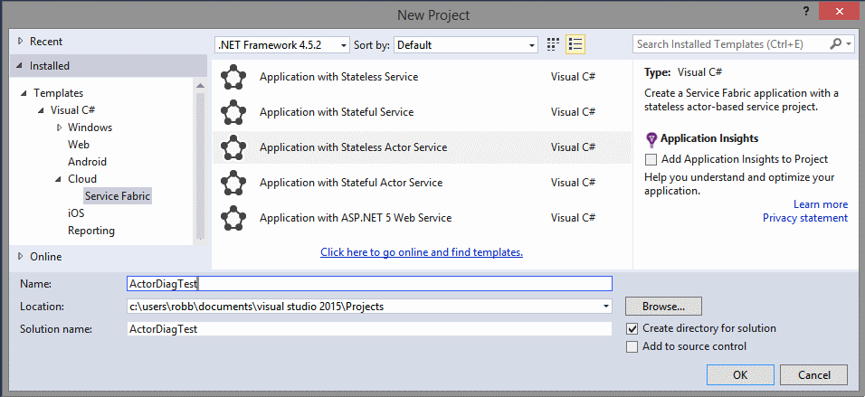

<properties
   pageTitle="Microsoft Azure Service Fabric How to monitor and diagnose services locally"
   description="This article describes how you can monitor and diagnose your services written using Microsoft Azure Service Fabric on a local development machine."
   services="service-fabric"
   documentationCenter=".net"
   authors="kunaldsingh"
   manager="samgeo"
   editor=""/>

<tags
   ms.service="service-fabric"
   ms.devlang="dotnet"
   ms.topic="article"
   ms.tgt_pltfrm="NA"
   ms.workload="NA"
   ms.date="04/22/2015"
   ms.author="kunalds"/>

# Monitoring and Diagnosing Services in a local machine development setup
Monitoring, detecting, diagnosing and troubleshooting allows for services to continue with minimal disruption to user experience. While it is critical in an actual deployed production environment, the efficacy will depend on adopting a similar model during development of services to ensure that it works when you move to a real world setup. Service Fabric makes it easy for service developers to implement diagnostics that can seamlessly work across single machine local development and real world production cluster setups.

## Tracing and logging
[Event Tracing for Windows](https://msdn.microsoft.com/library/windows/desktop/bb968803.aspx) (ETW) is the recommended technology for tracing messages in Service Fabric. Reasons for this are:

* ETW is fast. It was built as a tracing technology that has a minimal impact on your code execution times.
* ETW tracing works seamlessly across local development environments and also real world cluster setups. This  means you don't have to rewrite your tracing code when you are ready to deploy your code to a real cluster.
* Service Fabric system code also uses ETW for internal tracing. This allows you to view your application traces interleaved with Service Fabric system traces, making it easier to understand the and sequences and interrelationships between your application code and events in the underlying system.
* There is built-in support in Service Fabric Visual Studio tools to view ETW events.

## View Service Fabric system events in Visual Studio

Service Fabric emits ETW events to help application developers understand what is happening in the platform. To view these events follow these steps:

1. You must have the following pre-requisties installed.
   * Visual Studio 2015
   * Service Fabric SDK
2. Launch Visual Studio as an administrator.
3. Create (or open an existing) project for a stateful or stateless Actor or Service.

4. Press F5 to debug the application. The Service Fabric events should show up in the Diagnostics Events window. Each event has standard metadata information which tells you the node, application and service the event is coming from. You can also filter the list of events using the "Filter events" box at the top of the windows, for example you can filter on Node Name or Service Name.

5. If the Diagnostics Events window does not automatically show, Go to Server Explorer tab in Visual Studio, right-click the Service Fabric cluster and choose "View Diagnostic Events" in the context menu.

## Add your own custom traces to the application code
The Service Fabric Visual Studio project templates contain sample code. The code shows how to add custom application code ETW traces which show up in the Visual Studio ETW viewer alongside system traces from Service Fabric. The advantage of this method is that metadata is automatically added to traces, and the Visual Studio Diagnostic Viewer is already configured to display them.

For projects created from the **service templates** (stateless or stateful):

1. Open the **Service.cs** file. The call to `ServiceEventSource.Current.Message` in the *RunAsync* method shows an example of a custom ETW trace from the application code.
2. In the **ServiceEventSource.cs** file, the overloads of the `ServiceEventSource.Message` method show an option of how to write custom ETW traces.

For projects created from the **actor templates** (stateless or stateful):

1. Open the **"ProjectName".cs** file where *ProjectName* is the name you chose for your Visual Studio project.  
2. Find the code `ActorEventSource.Current.ActorMessage(this, "Doing Work");` in the *DoWorkAsync* method.  This is an example of a custom ETW trace from application code.  
3. In file **ActorEventSource.cs**, the overloads for the `ActorEventSource.ActorMessage` method show an option of how to write custom ETW traces.

After adding custom ETW tracing to your service code, you can build, deploy, and run the application again to see your event(s) in the Diagnostic Viewer. If you debug the application with F5, the Diagnostic Viewer will  open automatically.

##Coming soon
The same tracing code that you added to your application above for local diagnostics will work with tools that you can use to view these events when running the same code on an Azure cluster. Details for this are coming soon.

## Next steps

* [Service Fabric Health Introduction](service-fabric-health-introduction.md)
* [Application Insights setup](service-fabric-diagnostics-application-insights-setup.md)
* [Azure Service Fabric Actors Diagnostics and Performance Monitoring](service-fabric-reliable-actors-diagnostics.md)
* [Stateful Reliable Service Diagnostics](service-fabric-reliable-services-diagnostics.md)
