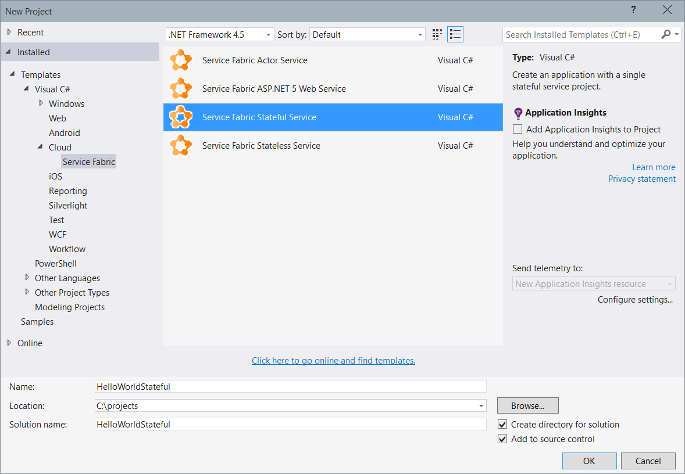
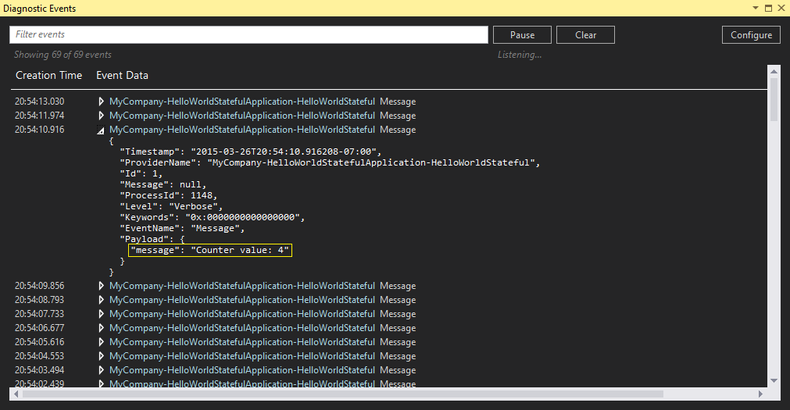
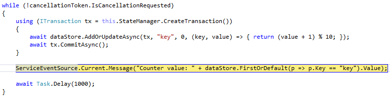
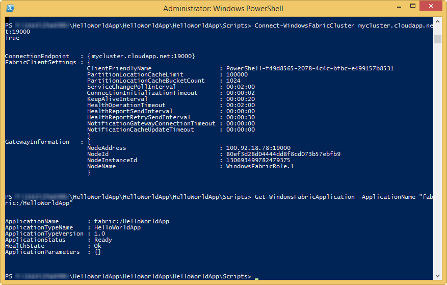
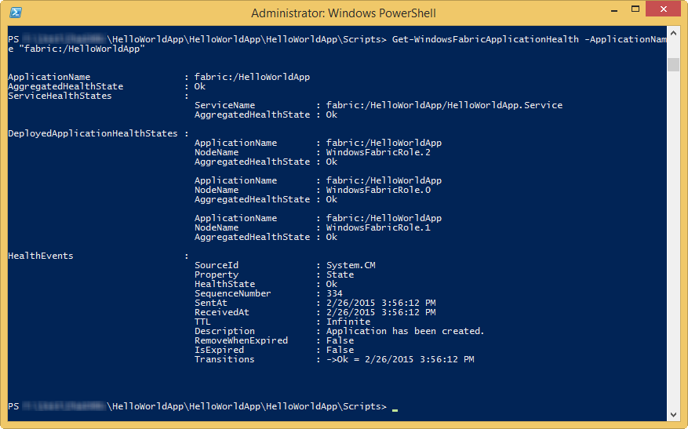

<properties 
   pageTitle="Stateful Service Hello World" 
   description="FabSrv" 
   services="service-fabric" 
   documentationCenter=".net" 
   authors="vturecek" 
   manager="timlt" 
   editor=""/>

<tags
   ms.service="service-fabric"
   ms.devlang="dotnet"
   ms.topic="article"
   ms.tgt_pltfrm="na"
   ms.workload="required" 
   ms.date="04/17/2015"
   ms.author="vturecek@microsoft.com"/>

# Getting Started with Microsoft Azure Service Fabric Stateful Services (VS 2015 CTP 6)

>**NOTE**: The official name of the service is **Microsoft Azure Service Fabric**, or **Service Fabric** in short. However, the tools and libraries haven't been refreshed to use this new name yet. In the following text and screen shots you'll see reference to *Windows Fabric*, which is the internal code name.

A Service Fabric Application contains one or more services. Services run your business logic. This tutorial walks you through the steps of creating a "Hello World" Service Fabric Application with a single stateful service. A stateful service allows you to maintain state reliably within the service itself, made highly available by Service Fabric without the need to persist state to an external store. In this tutorial, you'll implement a stateful service that keeps an internal counter. The counter state is made reliable by Service Fabric so that if the service execution is interrupted for any reason in the middle of counting, it can pick up right where it left off.

You'll learn:

- How to implement a simple stateful service.
- How to test your service locally using a development cluster.
- How to deploy your service to Azure.

Tutorial segments

- [Implement the service](#implement)
- [Test and debug the service locally](#testlocally) 
- [Deploy the service to Azure](#deploy)

<a name="prerequisites"></a>
## Prerequisites

- Download and unpack the March Preview zip file to a local folder of your choice. This folder will be referred as _DropFolder_ hereafter in this tutoral. Then, follow the steps in the **Service Fabric - Getting Started Guide - v0.3.docx** file to configure your development environment. 
- Install and configure [Azure PowerShell](http://azure.microsoft.com/en-us/documentation/articles/install-configure-powershell/).
- If you want to deploy the service to Azure, you need an active Azure subscription. If you don't have one, you can get a free trial at [azure.microsoft.com](http://azure.microsoft.com/en-gb/pricing/free-trial/).

<a name="implement"></a>
## Implement the service

In Service Fabric, a service can run any business logic whatsoever. The API provided by the Service Framework provides two entry points for your business logic:
 
 - An open-ended entry point method where you can begin executing any workload you want, intended mainly for long-running compute workloads.
 - A communication entry point where you can plug in your communication stack of choice, such as Web API, where you can start receiving requests from users or other services.

In this tutorial, we will focus on the open-ended entry point method where you can immediately start running business logic. Communication will be covered in a later tutorial.

1. Launch Visual Studio 2015 CTP 6 as an **Administrator**, and create a new **Windows Fabric Stateful Service** Project (named _HelloWorldStateful_):

	
	
	You will see 2 projects in the created solution. The first project is the application project (_HelloWorldStatefulApplication_), which  contains application manifest and a number of PowerShell scripts that help you to deploy your application. The second is the service project (_HelloworldStateful_), which contains the actual service implementation.

2. Open the **Service.cs** file in the service project.

3. Import namespaces:

	```c#

    using System.Fabric.Data;
    using System.Fabric.Data.Collections;
    using System.Fabric.Services;

	```

4. Implement the **RunAsync()** method as shown here to keep a rolling count in a Reliable Dictionary:

	```c#

	protected override async Task RunAsync(CancellationToken cancellationToken)
	{
		IReliableDictionary<string, int> dataStore = await this.StateManager.GetOrAddAsync<IReliableDictionary<string, int>>("dictionary1");

		while (!cancellationToken.IsCancellationRequested)
		{
			using (ITransaction tx = this.StateManager.CreateTransaction())
			{
				await dataStore.AddOrUpdateAsync(tx, "key", 0, (key, value) => value++);
				await tx.CommitAsync();
			}

			ServiceEventSource.Current.Message("Counter value: " + dataStore.FirstOrDefault(p => p.Key == "key").Value);

			await Task.Delay(TimeSpan.FromSeconds(1), cancellationToken);
		}
	}
	
    ```

    Service Fabric makes your service and its internal state reliable and highly available. The **IReliableDictionary** is an instance of Reliable Dictionary, part of Service Fabric's built-in **Reliable Collections**. With Service Fabric and Reliable Collections, you can now store data directly in your service reliably without the need for an external persistent store. Service Fabric accomplishes this by creating and managing multiple *replicas* of your service for you while providing an API that abstracts away the complexities of managing those replicas and their state transitions. 

    There are a few key concepts to note in this code:

    ### StateManager

	```c#

    IReliableDictionary<string, int> dataStore = await this.StateManager.GetOrAddAsync<IReliableDictionary<string, int>>("dictionary1");
    
    ```

    The **StateManager** takes care of managing the Reliable Collections for you. Simply ask the StateManager for a reliable collection by name at any time and any place in your service and it ensures you get a reference back. Saving references to Reliable Collection instances in class member variables or properties is not recommended, as special care must be taken to ensure the reference is set to an instance at all times in the service lifecycle. The StateManager handles this work for you, optimized for repeat visits. 

    ### Transactional and asynchronous
    ```c#

    using (ITransaction tx = this.StateManager.CreateTransaction())
	{
		await dataStore.AddOrUpdateAsync(tx, "key", 0, (key, value) => value++);
		await tx.CommitAsync();
	}
    
    ```

    Reliable Collections have many of the same operations as their System.Collections.Generic counterparts - including LINQ. However, operations on Reliable Collections are asynchronous, because most operations on Reliable Collections are *replicated*, that is, the operation is sent to other replicas of the service for high-availability.

    They also support *transactional* operations so you can keep state consistent between multiple Reliable Collections. For example, you may dequeue a work item from a Reliable Queue, perform an operation on it, and save the result in a Reliable Dictionary, all within a single transaction. This is treated as an atomic operation, guaranteeing that either the entire operation will succeed, or none of it will - so if an error occurs after you've dequeued the item but before you could save the result, the entire transaction is rolled back and the item remains on the queue for processing. 

    ### RunAsync

    The platform calls **RunAsync** when your service is placed and ready to execute. For stateful services, that means when the service *replica* is opened and is in a ready state with write access to its state. A cancellation token is provided to coordinate when the workload on your service replica needs to stop. In Service Fabric, this open-close cycle of **RunAsync** in a service replica can occur many times over the lifetime of your service as a whole, because the system may move your service replicas around for resource balancing, when faults occur, or when the underlying hardware experiences an outage. This orchestration is managed by the system in the interest of keeping your service highly available and properly balanced.

    **RunAsync** is executed in its own Task. Note in the code snippet here we jump right into a while loop - there is no need to schedule a separate task for your workload. Cancellation of your workload is a cooperative effort orchestrated by the provided cancellation token. The system will wait for your task to end (either by successful completion, cancellation, or faulted) before it moves on, so it is important to honor the cancellation token, finish up any work, and exit the RunAsync method as quickly as possible when cancellation is requested by the system. 
	
5. Rebuild the solution to make sure everything builds.

<a name="testlocally"></a>
## Test and debug the service locally

1. If you haven't done so, you need to launch a local cluster first. Launch **Windows PowerShell** as **administrator** and execute the **DevClusterSetup.ps1** script under the _DropFolder_**\ClusterSetup\Local** folder.

	>**NOTE**: Your local cluster might be already running, in which case the script will fail with many errors. If you want to clean up the local cluster, run the **CleanCluster.ps1** script under the same folder.

2. You can now build and deploy your service. Press **F5**, and your application will be built and deployed. Once the service is running, you can see the generated ETW events in a **Diagnostic Events** window. You can pause the stream by clicking the **Pause* button, and then examine message details by expanding a message:

	

3. Breakpoints can be set normally through Visual Studio for debugging. Set a break point at the line you modified in the **RynAsync** method. The break point should get hit:

	

<a name="deploy"></a>
## Deploy the service to Azure

You can deploy your Service Fabric services to a Service Fabric cluster on Azure or on-premises servers. Please see [Deploy to Azure](../DeployToAzure) tutorial for detailed instructions on how to provision a Service Fabric cluster on Azure.

1.  In **Visual Studio**, open the file **Publish-FabricApplication.ps1** located in the **Scripts** folder of the application project **HelloWorldStatefulApplication**. Locate the line that calls *Connect-WindowsFabricCluster* and add as a parameter the address of your Service Fabric cluster. For example, if your Service Fabric Cluster is located at *mycluster.cloudapp.net*, the modified line should look like this:

		[void](Connect-WindowsFabricCluster mycluster.cloudapp.net:19000)

2.  Similarly, edit the file **Create-FabricApplication.ps1** located in the **Scripts** folder of the application project **HelloWorldStatefulApplication** and add the address of your Service Fabric cluster to the line that calls *Connect-WindowsFabricCluster*. 

		[void](Connect-WindowsFabricCluster mycluster.cloudapp.net:19000)

3. Right click on the **HelloWorldStatefulApplication** project and select **Deploy**.

	

4. Open **Windows Powershell** running as **Administrator**.
	
	> NOTE: If you haven't configured Windows PowerShell with your Azure subscription, you can run
	
	>`Add-AzureAccount`
	
	> to sign on to your Azure subscription. Then, select the correct subscription to use by running
	
	>`Select-AzureSubscription -SubscriptionName <your subscription name>`

5. To verify that everything went well, in **Powershell** run the following commands:
```powershell
Connect-WindowsFabricCluster mycluster.cloudapp.net:19000
Get-WindowsFabricApplication -ApplicationName "fabric:/HelloWorldStatefulApplication"
```	
The output should look like this:


6. Then execute:
```powershell
Get-WindowsFabricApplicationHealth -ApplicationName "fabric:/HelloWorldApp"
```
The output should look like this:


## Conclusion
In this tutorial, you created a stateful service, tested and debugged it locally, and then deployed it to Microsoft Azure. Creating a stateless service follows a very similar process. Please see [Getting Started with Microsoft Azure Service Fabric Stateless Service](..\HelloWorldStateless\Tutorial.md) for details.	
This service doesn't take requests from any client or any other services. To receive requests, you need to implement the _ICommunicationListener_ interface. Please see [Tutorial: Getting Started with Service Fabric Web API Service (HelloWorldWebAPI)](Tutorials/HelloWorldWebAPI/Tutorial.md) for a tutorial of using a communication listener to take client requests.

