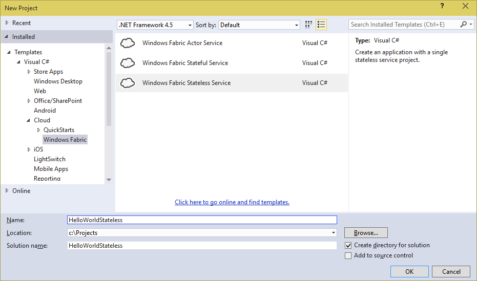

<properties 
   pageTitle="Stateless Service Hello World" 
   description="FabSrv" 
   services="service-fabric" 
   documentationCenter=".net" 
   authors="hbai" 
   manager="timlt" 
   editor=""/>

<tags
   ms.service="service-fabric"
   ms.devlang="dotnet"
   ms.topic="article"
   ms.tgt_pltfrm="na"
   ms.workload="required" 
   ms.date="04/17/2015"
   ms.author="hbai@microsoft.com"/>

# Getting Started with Microsoft Azure Service Fabric Stateless Services (VS 2015 CTP 6)


>**NOTE**: The official name of the service is **Microsoft Azure Service Fabric**, or **Service Fabric** in short. However, the tools and libraries haven't been refreshed to use this new name yet. In the following text and screen shots you'll see reference to *Windows Fabric*, which is the internal code name.

A Service Fabric Application contains one or more services. Services run your business logic. This tutorial walks you through the steps of creating a "Hello World" Service Fabric Application with a single stateless service. As the name implies, a stateless service does not maintain any state for the application. It is intended to run a workload or handle requests independently without any contextual information, or persist state to an external storage. 

Tutorial segments

- [How to implement a simple stateless service](#implement)
- [How to test and debug your service locally using a development cluster](#testlocally) 
- [How to deploy your service to Azure](#deploy)

## <a name="prerequisites"></a>Prerequisites

- Download and unpack the March Preview zip file to a local folder of your choice. This folder will be referred as _DropFolder_ hereafter in this tutoral. Then, follow the steps in the **Service Fabric - Getting Started Guide - v0.3.docx** file to configure your development environment. 
- Install and configure [Azure PowerShell](http://azure.microsoft.com/en-us/documentation/articles/install-configure-powershell/).
- If you want to deploy the service to Azure, you need an active Azure subscription. If you don't have one, you can get a free trial at [azure.microsoft.com](http://azure.microsoft.com/en-gb/pricing/free-trial/).

## <a name="implement"></a>Implement the service
 
In Service Fabric, a service can run any business logic whatsoever. The API provided by the Service Framework provides two entry points for your business logic:
 
 - An open-ended entry point method where you can begin executing any workload you want, intended mainly for long-running compute workloads.
 - A communication entry point where you can plug in your communication stack of choice, such as Web API, where you can start receiving requests from users or other services.

In this tutorial, we will focus on the open-ended entry point method where you can immediately start running business logic. Communication will be covered in a later tutorial.

1. Launch Visual Studio 2015 CTP 6 as **Administrator**, and create a new **Windows Fabric Stateless Service** Project named **HelloWorldStateless**.

	
	
	You will see 2 projects in the created solution. The first project is the application project (_HelloWorldStatelessApplication_), which contains the application manifest and a number of PowerShell scripts that help you to deploy your application. The second is the service project (_HelloWorldStateless_), which contains the actual service implementation.

2. Open **Service.cs** in the **HelloWorldStateless** project, examine the code in **RunAsync()** method.  The **RunAsync** method is your compute workload entry point. 
		
	```c#
	protected override async Task RunAsync(CancellationToken cancellationToken)
	{
		// TODO: Replace the following with your own logic.
		while (!cancellationToken.IsCancellationRequested)
		{
			ServiceEventSource.Current.Message("Working");
			await Task.Delay(1000);
		}
	}
	```
	>**NOTE**: The ServiceEventSource class is an automatically genreated subclass of EventSource, which provides the ability to create events for Event Tracing For Windows (ETW). 

    ### RunAsync

    The platform calls this method when an instance of your service is placed and ready to execute. For stateless services, that simply means when the service instance is opened. A cancellation token is provided to coordinate when your service instance needs to be closed. In Service Fabric, this open-close cycle of a service instance can occur many times over the lifetime of your service as a whole, because the system may move your service instances around for resource balancing, when faults occur, or when the underlying hardware experiences an outage. This orchestration is managed by the system in the interest of keeping your service highly available and properly balanced.

    **RunAsync** is executed in its own Task. Note in the code snippet here we jump right into a while loop - there is no need to schedule a separate task for your workload. Cancellation of your workload is a cooperative effort orchestrated by the provided cancellation token. The system will wait for your task to end (either by successful completion, cancellation, or faulted) before it moves on, so it is important to honor the cancellation token, finish up any work, and exit the RunAsync method as quickly as possible when cancellation is requested by the system. 

3. To see your Hello World service at work, modify the first line in the while loop to log current time to ETW:

	```c#
	ServiceEventSource.Current.Message("Hello World! at " + DateTime.Now.ToLongTimeString());
	```	

## <a name="testlocally"></a>Test and debug the service locally

1. If you haven't done so, you need to launch a local cluster first. Launch **Windows PowerShell** as **administrator** and execute the **DevClusterSetup.ps1** script under the _DropFolder_**\ClusterSetup\Local** folder.

	>**NOTE**: Your local cluster might be already running, in which case the script will fail with many errors. If you want to clean up the local cluster, run the **CleanCluster.ps1** script under the same folder.

2. You can now build and deploy your service. Press **F5** in Visual Studio, and your application will be built and deployed. Once the service is running, you can see the generated ETW events in a **Diagnostic Events** window. You can pause the stream by clicking the **Pause** button, and then examine message details by expanding a message:

	

3. Breakpoints can be set normally through Visual Studio for debugging. Set a break point at the line you modified in the **RynAsync** method. The break point should get hit:

	
4. Stop the program.

## <a name="deploy"></a>Deploy the service to Azure
You can deploy your Service Fabric services to a Service Fabric cluster on Azure or on-premises servers. Please see [Deploy to Azure](../DeployToAzure) tutorial for detailed instructions on how to provision a Service Fabric cluster on Azure.

1.  In **Visual Studio**, open the file **Deploy-FabricApplication.ps1** located in the **Scripts** folder of the application project **HelloWorldStatelessApplicaiton**. Locate the line that calls *Connect-WindowsFabricCluster* and add as a parameter the address of your Service Fabric cluster. For example, if your Service Fabric Cluster is located at *mycluster.cloudapp.net*, the modified line should look like this:

		[void](Connect-WindowsFabricCluster mycluster.cloudapp.net:19000)

2.  Similarly, edit the file **Create-FabricApplication.ps1** located in the **Scripts** folder of the application project **HelloWorldApp** and add the address of your Service Fabric cluster to the line that calls *Connect-WindowsFabricCluster*. 

		[void](Connect-WindowsFabricCluster mycluster.cloudapp.net:19000)

3. Right click on the **HelloWorldApp** project and select **Deploy**.

	


4. Open **Windows Powershell** running as **Administrator**.
	
	> NOTE: If you haven't configured Windows PowerShell with your Azure subscription, you can run
	
	>`Add-AzureAccount`
	
	> to sign on to your Azure subscription. Then, select the correct subscription to use by running
	
	>`Select-AzureSubscription -SubscriptionName <your subscription name>`

5. To verify that everything went well, in **Powershell** run the following commands:

		Connect-WindowsFabricCluster mycluster.cloudapp.net:19000
		Get-WindowsFabricApplication -ApplicationName "fabric:/HelloWorldApp"
	
	The output should look like this:

	


9. Then execute:

		Get-WindowsFabricApplicationHealth -ApplicationName "fabric:/HelloWorldStatelessApplication"

	The output should look like this:

	

## Conclusion
In this tutorial, you created a stateless service, tested and debugged it locally, and then deployed it to Microsoft Azure. Creating a stateful service follows a very similar process. Please see [Getting Started with Microsoft Azure Service Fabric Stateful Service](..\HelloWorldStateless\Tutorial.md) for details.	
This service doesn't take requests from any client or any other services. To receive requests, you need to implement the _ICommunicationListener_ interface. Please see [Tutorial: Getting Started with Service Fabric Web API Service (HelloWorldWebAPI)](Tutorials/HelloWorldWebAPI/Tutorial.md) for a tutorial of using a communication listener to take client requests.