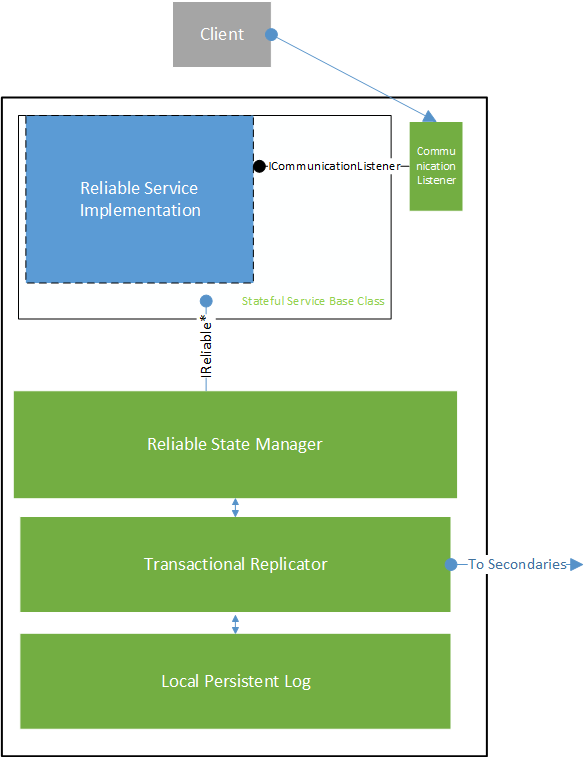
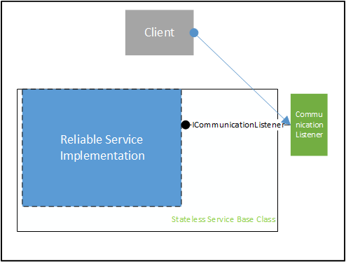

<properties 
   pageTitle="service-fabric-fabsrv-platform-architecture" 
   description="High-level overview of the reliable service architecture" 
   services="service-fabric" 
   documentationCenter=".net" 
   authors="alanwar" 
   manager="richhas" 
   editor=""/>

<tags
   ms.service="service-fabric"
   ms.devlang="dotnet"
   ms.topic="article"
   ms.tgt_pltfrm="na"
   ms.workload="required" 
   ms.date="03/17/2015"
   ms.author="alanwar"/>

<properties
   pageTitle="Service Fabric Reliable Service Architecture"
   description="A conceptual overview of placement constraints in Service Fabric"
   services="Service-Fabric"
   documentationCenter=".net"
   authors="alanwar"
   manager="richhas"
   editor=""/>

<tags
   ms.service="Service-Fabric"
   ms.devlang="dotnet"
   ms.topic="article"
   ms.tgt_pltfrm="NA"
   ms.workload="NA"
   ms.date="04/13/2015"
   ms.author="alanwar"/>

# Reliable Service Architecture

A Service Fabric Reliable Services may be a stateful or stateless service. Each type of service runs within a specific architecture described in this article. 
See [Reliable Service Overview](../service-fabric-fabsrv-service-introduction) for more information about the differences between stateful and stateless services.

## Reliable Stateful Service

### Reliable Stateful Service Architecture Diagram

### Reliable Stateful Service

A reliable stateful service implementation derives from the StatefulService or StatefulServiceBase class. Both of these base classes are provided by Service Fabric and
provide various levels of support and abstraction for a stateful service implementation to interface with Service Fabric and participate as a service within the Service Fabric Cluster. 
Internally StatefulService derives from StatefulServiceBase; StatefulServiceBase offers services more flexibility but requires more understanding of the internals of service fabric.

Both base classes manages the
lifetime and role of the service implememtation; the service implementation may override virtual methods of either base class if the service implementation has work to do
at those points in the service implementation lifecycle. 

The service implementation may override the RunAsync method if it wishes to perform actions when service starts operating and when it is shutting down.

The service implementation may override the CreateCommunicationListener method if the service implementation wants to have a communication channel for clients of the service to 
communicate with it. A communication listener exposes the ICommunicationListener interface which is used by the StatefulService base class to control the lifetime of the communication
listener. Although a service implementation may implement its own communication listener object exposing ICommunicationListener, in the diagram below the communication listener is
implemented by Service Fabric as the service implementation does not implement its own.

The service implementation is able to use the reliable state manager to take advantage of reliable collections which are data structures that are highly available to the service, 
that is, are always available regardless of service failovers. For more information on reliable collections see TODO [Reliable Collections Overview](../service-fabric-fabsrv-reliable-collections)

### Reliable State Manager And Providers

The reliable state manager is the object that manages reliable state providers and has functionality to create, delete, enumerate and ensure that the reliable state providers are
persisted and highly available. A reliable state provider instance represents an instance of a persisted and highly available data structure such as a 
dictionary or a queue. Each reliable state provider exposes an interface that is used by the service implementation to interact with the reliable state provider. For example 
IReliableDictionary is used to interface with the reliable dictionary while IReliableQueue is used to interface with the reliable queue.

The reliable state manager has an interface named IReliableStateManager which allows access to it by the stateful service implementation. Interfaces to reliable state providers
are returned through IReliableStateManager.  

The reliable state manager is architected in a way that would allow new types of state providers to be plugged in. 

The reliable dictionary and reliable queue are built upon the implementation of a high performance versioned differental store.

### Transactional Replicator

The transactional replicator component is responsible to ensuring that the state of the service implementation, that is the state within the reliable state manager and reliable collections,
is consistent across all replicas running this service implementation and also persisted in the log for each replica. The reliable state manager interfaces with the transactional replicator
via a private mechanism.

The transactional replicator uses private network protocol to communicate state with other replicas of the service instance so that all replicas have up to date state information.

The transactional replicator uses a log to persist state information so that the state information survives process or node crashes. The interface to the log is via a private mechanism. 

### Log

The log component provides a high performance persistent store that can be optimized for writing to spinning or solid state disks. The design of the log is for the persistent storage (ie, hard disks) 
to be local to
the node that is running the stateful service. This allows for low latencies and high throughput as compared to persistent storage that is not local to the node. Each replica has its own dedicated 
log which has only state information for that replica. The dedicated log is contained within a single file in the service's work directory.

When the log component is configured for solid state disks the state information is written directly to the dedicated log. When the log component is configured for spinning disks the
state information is first written to a node-wide shared log and then lazily destaged to the dedicated log in the background. The node-wide shared log is expected to be on a disk that
is reserved only for the shared log. In using this approach the state information is written to the shared log with low latency to allow the service to make progress more quickly. On
a node with a number of replicas writing state information simultaneously writes to the shared log disk are optimized as compared to writing only to dedicated logs.

The log component can be optimized for maximum write performance by preallocating disk space for the logs. Or the log component can be optimized for using minimal disk space by use
of NTFS sparse files that underly the log.

Aside from a minimal user mode interface to the log, the log is written as a kernel mode driver.

## Reliable Stateless Service

### Reliable Stateless Service Architecture Diagram

### Reliable Stateless Service

Stateless services are written by deriving from the StatelessService or StatelessServiceBase class. Similarly to the StatefulService base classes, deriving from the StatelessServiceBase allows more flexibility 
and the service implementation may override virtual methods. Both base classes manages the
lifetime and role of the service implememtation; the service implementation may override virtual methods of either base class if the service implementation has work to do
at those points in the service implementation lifecycle. 

The service implementation may override the RunAsync method if it wishes to perform actions when service starts operating and when it is shutting down.

The service implementation may override the CreateCommunicationListener method if the service implementation wants to have a communication channel for clients of the service to 
communicate with it. A communication listener exposes the ICommunicationListener interface which is used by the StatefulService base class to control the lifetime of the communication
listener. Although a service implementation may implement its own communication listener object exposing ICommunicationListener, in the diagram below the communication listener is
implemented by Service Fabric as the service implementation does not implement its own.

<!--Every topic should have next steps and links to the next logical set of content to keep the customer engaged-->
## Next steps
For more information: [Reliable Service Overview](../service-fabric-fabsrv-service-overview).
