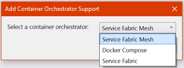
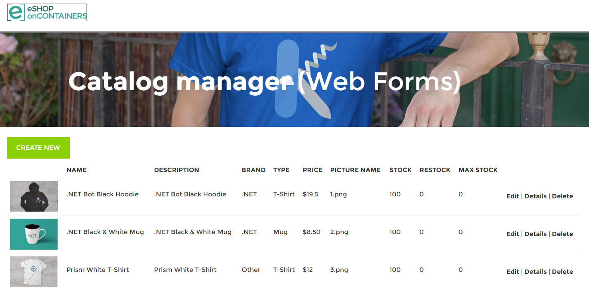

# Containerize an existing .NET app for Service Fabric Mesh

This article shows you how to add Service Fabric Mesh container orchestration support to an existing .NET app.

In Visual Studio 2017, you can add containerization support to ASP.NET and Console projects that use the full .NET framework.

> [!NOTE]
> .NET **Core** projects are not currently supported.

## Prerequisites

* If you don't have an Azure subscription, you can [create a free account](https://azure.microsoft.com/free/?WT.mc_id=A261C142F) before you begin.

* Make sure that you've [set up your development environment](service-fabric-mesh-howto-setup-developer-environment-sdk.md). This includes installing the Service Fabric runtime, SDK, Docker, Visual Studio 2017, and creating a local cluster.

## Open an existing .NET app

Open the app to which you want to add container orchestration support.

If you'd like to try an example, you can use the [eShop](https://github.com/MikkelHegn/ContainersSFLab) code sample. The rest of this article will assume that we're using that project, although you can apply these steps to your own project.

Get a copy of the **eShop** project:

```git
git clone https://github.com/MikkelHegn/ContainersSFLab.git
```

Once that has downloaded, in Visual Studio 2017 open **ContainersSFLab\eShopLegacyWebFormsSolution\eShopLegacyWebForms.sln**.

## Add container support
 
Add container orchestration support to an existing ASP.NET or Console project using the Service Fabric Mesh tools as follows:

In the Visual Studio solution explorer, right-click the project name (in the example, **eShopLegacyWebForms**) and then choose **Add** > **Container Orchestrator Support**.
The **Add Container Orchestrator Support** dialog appears.



Choose **Service Fabric Mesh** from the drop-down, and then click **OK**.

The tool then verifies that Docker is installed, adds a Dockerfile to your project, and pulls down a docker image for your project.  
A Service Fabric Mesh application project is added to your solution. It contains your Mesh publish profiles and configuration files. The name of the project is the same as your project name, with 'Application' concatenated to the end, for example, **eShopLegacyWebFormsApplication**. 

In the new Mesh project you'll see a two folders you should be aware of:
- **App Resources** which contains YAML files that describe additional Mesh resources such as the network.
- **Service Resources** which contains a service.yaml file which describes how your app should run when deployed.

Once container orchestration support is added to your app, you can press **F5** to debug your .NET app on your local Service Fabric Mesh cluster. Here is the eShop ASP.NET app running on a Service Fabric Mesh cluster: 



You can now publish the app to Azure Service Fabric Mesh.

## Next steps

See how to publish an app to Service Fabric Mesh: [Tutorial- Deploy a Service Fabric Mesh application](service-fabric-mesh-tutorial-deploy-service-fabric-mesh-app.md)