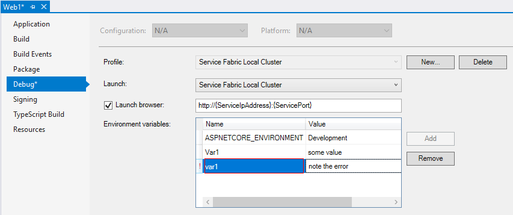

# Define environment variables in a Service Fabric Mesh app using Visual Studio | Microsoft Docs

The 6.4 Service Fabric Mesh Tools extension for Visual Studio allows you to easily create and modify environment variables that you can check at runtime from your Service Fabric Mesh code.

Among other scenarios, this allows you to write code that can differentiate between development and production, as well as define other variables that you want to consume at runtime in your service.

## Set a debug variable

To set or modify environment variables in your Service Fabric Mesh application, from the Solution Explorer right-click on the service project and choose **Properties**.

Select the **Debug** tab on the left and you will see the **Environment variables** section in the debug pane.

Modify an existing environment variable by double-clicking on its value and typing in a new one.

Create an environment variable by clicking 'Add' and typing in the new environment variable name and its value.

> [!Note]
> Environment variables are case-insensitive. 
> That is `var1` and `Var1` define the same environment variable. If you attempt to define two environment variables that differ only by case, the Environment variables editor will display a red exclamation point as illustrated below:



Press Ctrl+S to save your changes.  Your environment variables are saved in the **launchSettings.json** file.

## Read the value of a debug variable

You can read the variable of a debug environment variable using the `GetEnvironmentVariable()` function:

```csharp
string value = $"{Environment.GetEnvironmentVariable("variableName")}";
```