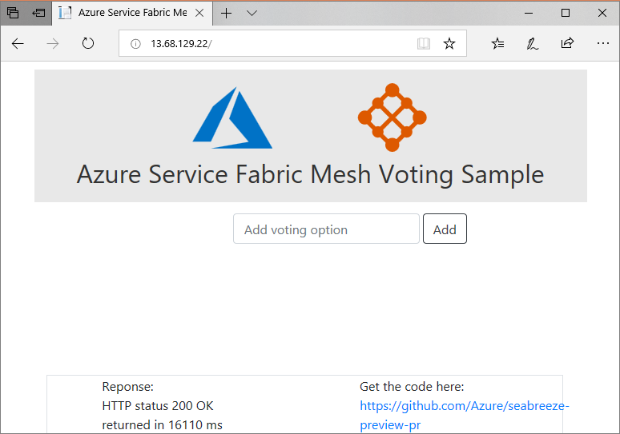

# Deploy a Service Fabric Mesh application to Service Fabric Mesh using a template
This article shows how to deploy a .NET Core application to Service Fabric Mesh using a template. When you're finished, you have a voting application with an ASP.NET Core web front-end that saves voting results in a back-end service in the cluster. The front-end uses DNS to resolve the address of the back-end service.

## Set up Service Fabric Mesh CLI 
You can use the Azure Cloud Shell or a local installation of the Azure CLI to complete this task. Install Azure Service Fabric Mesh CLI extension module by following these [instructions](service-fabric-mesh-howto-setup-cli.md).

## Sign in to Azure
Sign in to Azure and set your subscription.

```azurecli-interactive
az login
az account set --subscription "<subscriptionID>"
```

## Create resource group
Create a resource group to deploy the application to. You can use an existing resource group and skip this step. 

```azurecli-interactive
az group create --name myResourceGroup --location eastus 
```

## Deploy the application
Create your application in the resource group using the `deployment create` command.

```azurecli-interactive
az mesh deployment create --resource-group myResourceGroup --template-uri https://sfmeshsamples.blob.core.windows.net/templates/voting/mesh_rp.windows.json --parameters "{\"location\": {\"value\": \"eastus\"}}"
```

The preceding command deploys a Windows application using [mesh_rp.windows.json template](https://sfmeshsamples.blob.core.windows.net/templates/voting/mesh_rp.windows.json). If you want to deploy a Linux application, use [mesh_rp.linux.json template](https://sfmeshsamples.blob.core.windows.net/templates/voting/mesh_rp.linux.json). Windows container images are larger than Linux container images and may take more time to deploy.

In a few minutes, your command should return with:

`VotingApp has been deployed successfully on VotingAppNetwork with public ip address <IP address>` 

## Open the application
Once the application successfully deploys, get the public IP address for the service endpoint, and open it on a browser. It displays following web page. 



You can now add voting options to the application and vote on it, or delete the voting options.

The deployment command returns the public IP address of the service endpoint. Optionally, You can also query the network resource to find the public IP address of the service endpoint. 

The network resource name for this application is `VotingAppNetwork`, fetch information about it using the following command. 

```azurecli-interactive
az mesh network show --resource-group myResourceGroup --name VotingAppNetwork
```

## Check the application details
You can check the application's status using the `app show` command. The application name for the deployed application is "VotingApp", so fetch its details. 

```azurecli-interactive
az mesh app show --resource-group myResourceGroup --name VotingApp
```

## List the deployed applications
You can use the "app list" command to get a list of applications you have deployed to your subscription. 

```azurecli-interactive
az mesh app list -o table
```

## Clean up resources
When you no longer need the application and it's related resources, delete the resource group containing them. 

```azurecli-interactive
az group delete --resource-group myResourceGroup  
``` 

## Next steps
- View the voting sample application on [GitHub](https://github.com/Azure-Samples/service-fabric-mesh/tree/master/src/votingapp).
- To learn more about Service Fabric Mesh, read the [Service Fabric Mesh overview](service-fabric-mesh-overview.md).


