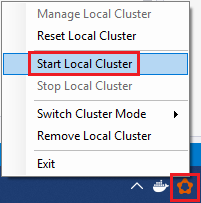

# Set up your Windows development environment to build Service Fabric Mesh apps

To build and run Azure Service Fabric Mesh applications on your Windows development machine, you'll need:

* Docker
* Visual Studio 2017 or later
* Service Fabric Mesh runtime
* Service Fabric Mesh SDK, and tools.

And one of the following versions of Windows:

* Windows 10 (Enterprise, Professional, or Education) versions 1709 (Fall Creators update) or 1803 (Windows 10 April 2018 update)
* Windows Server version 1709
* Windows Server version 1803

The following instructions will help you get everything installed based on the version of Windows you're running.

[!INCLUDE [preview note](./includes/include-preview-note.md)]

## Visual Studio

Visual Studio 2017 or later is required to deploy Service Fabric Mesh applications. [Install version 15.6.0][download-visual-studio] or greater and enable the following workloads:

* ASP.NET and web development
* Azure Development

## Install Docker

If you already have Docker installed, ensure that you have the latest version. Docker may  prompt you when a new version is out, but check manually to ensure you have the latest version.

#### Install Docker on Windows 10

Download and install the latest version of [Docker Community Edition for Windows][download-docker] to support the containerized Service Fabric apps used by Service Fabric Mesh.

During installation, select **Use Windows containers instead of Linux containers** when asked.

If Hyper-V isn't enabled on your machine, Docker's installer will offer to enable it. Click **OK** to do so if prompted.

#### Install Docker on Windows Server 2016

If you don't have the Hyper-V role enabled, open PowerShell as an administrator and run the following command to enable Hyper-V, and then restart your computer. For more information, see [Docker Enterprise Edition for Windows Server][download-docker-server].

```powershell
Install-WindowsFeature -Name Hyper-V -IncludeManagementTools
```

Restart your computer.

Open PowerShell as an administrator and run the following commands to install Docker:

```powershell
Install-Module DockerMsftProvider -Force
Install-Package Docker -ProviderName DockerMsftProvider -Force
Install-WindowsFeature Containers
```

## SDK and tools

Install the Service Fabric Mesh runtime, SDK, and tools in the following order.

1. Install the [Service Fabric Mesh SDK][download-sdkmesh] using Web Platform Installer. This will also install the Microsoft Azure Service Fabric SDK and runtime.
2. Install the [Visual Studio Service Fabric Mesh Tools (preview) extension][download-tools] from Visual Studio Marketplace.

## Build a cluster

> [!IMPORTANT]
> Docker **must** be running before you can build a cluster.
> Test that Docker is running by opening a terminal window and running `docker ps` to see if an error occurs. If the response does not indicate an error, Docker is running and you're ready to build a cluster.

> [!Note]
> If you are developing on the Windows Fall Creators update (version 1709) machine, you can only use Windows version 1709 docker images.
> If you are developing on the Windows 10 April 2018 update (version 1803) machine, you can use either Windows version 1709 or 1803 docker images.

If you're using Visual Studio, you can skip this section because Visual Studio will create a local cluster for you if you don't have one.

For the best debugging performance when you're creating and running a single Service Fabric app at a time, create a single-node local development cluster. If you're running multiple applications at a time, create a five-node local development cluster. The cluster must be running whenever you deploy or debug a Service Fabric Mesh project.

After you install the runtime, SDKs, Visual Studio tools, Docker, and have Docker running, create a development cluster.

1. Close your PowerShell window.
2. Open a new, elevated PowerShell window as an administrator. This step is necessary to load the Service Fabric modules that were recently installed.
3. Run the following PowerShell command to create a development cluster:

    ```powershell
    . "C:\Program Files\Microsoft SDKs\Service Fabric\ClusterSetup\DevClusterSetup.ps1" -CreateMeshCluster -CreateOneNodeCluster
    ```
4. To start the local cluster manager tool, run the following PowerShell command:

    ```powershell
    . "C:\Program Files\Microsoft SDKs\Service Fabric\Tools\ServiceFabricLocalClusterManager\ServiceFabricLocalClusterManager.exe"
    ```
5. Once the Service cluster manager tool is running (it appears in your system tray), right-click it and click **Start Local Cluster**.



You're now ready to create Service Fabric Mesh applications!

## Next steps

Read through the [Create an Azure Service Fabric app](service-fabric-mesh-tutorial-create-dotnetcore.md) tutorial.

Find answers to [common questions and known issues](service-fabric-mesh-faq.md).

[azure-cli-install]: https://docs.microsoft.com/cli/azure/install-azure-cli
[download-docker]: https://store.docker.com/editions/community/docker-ce-desktop-windows
[download-docker-server]: https://docs.docker.com/install/windows/docker-ee/
[download-runtime]: https://aka.ms/sfruntime
[download-sdk]: https://www.microsoft.com/web/handlers/webpi.ashx?command=getinstallerredirect&appid=MicrosoftAzure-ServiceFabric-CoreSDK
[download-sdkmesh]: https://www.microsoft.com/web/handlers/webpi.ashx?command=getinstallerredirect&appid=MicrosoftAzure-ServiceFabric-SDK-Mesh
[download-tools]: https://aka.ms/sfmesh_vs2017tools
[download-visual-studio]: https://www.visualstudio.com/downloads/