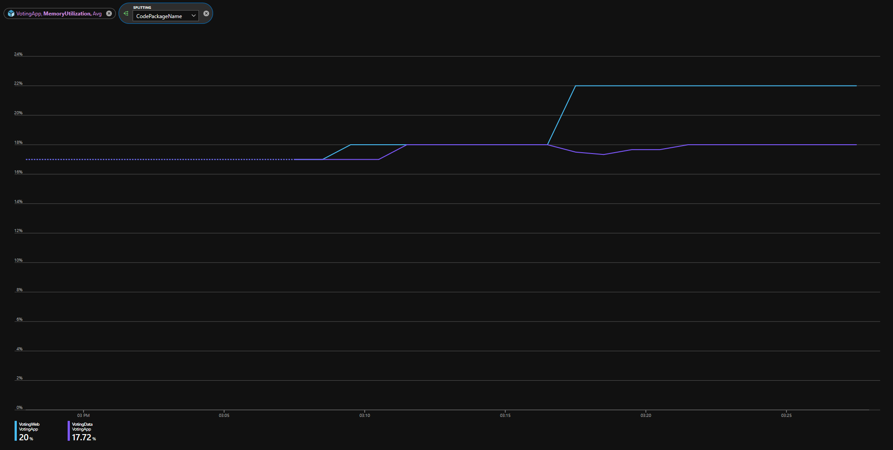
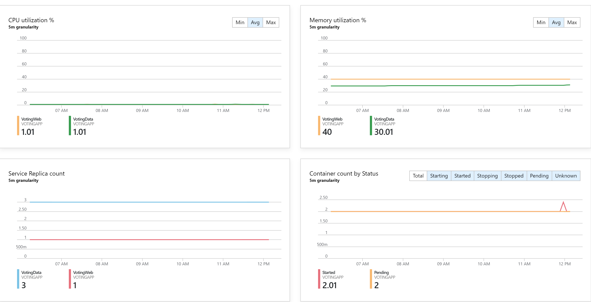

# Monitoring and diagnostics
Azure Service Fabric Mesh is a fully managed service that enables developers to deploy microservices applications without managing virtual machines, storage, or networking. Monitoring and diagnostics for Service Fabric Mesh is categorized into three main types of diagnostics data:

- Application logs - these are defined as the logs from your containerized applications, based on how you have instrumented your application (e.g. docker logs)
- Platform events - events from the Mesh platform relevant to your container operation, currently including container activation, deactivation, and termination.
- Container metrics - resource utilization and performance metrics for your containers (docker stats)

This article discusses the monitoring and diagnostics options for the latest preview version available.

## Application logs

You can view your docker logs from your deployed containers, on a per container basis. In the Service Fabric Mesh application model, each container is a code package in your application. To see the associated logs with a code package, use the following command:

```cli
az mesh code-package-log get --resource-group <nameOfRG> --app-name <nameOfApp> --service-name <nameOfService> --replica-name <nameOfReplica> --code-package-name <nameOfCodePackage>
```

> [!NOTE]
> You can use the "az mesh service-replica" command to get the replica name. Replica names are incrementing integers from 0.

Here is what this looks like for seeing the logs from the VotingWeb.Code container from the voting application:

```cli
az mesh code-package-log get --resource-group <nameOfRG> --application-name SbzVoting --service-name VotingWeb --replica-name 0 --code-package-name VotingWeb.Code
```

## Container metrics 

The Mesh environment exposes a handful of metrics indicating how your containers are performing. The following metrics are available via the Azure portal and Azure monitor CLI:

| Metric | Description | Units|
|----|----|----|
| CpuUtilization | ActualCpu/AllocatedCpu as a percentage | % |
| MemoryUtilization | ActualMem/AllocatedMem as a percentage | % |
| AllocatedCpu | Cpu allocated as per Azure Resource Manager template | Millicores |
| AllocatedMemory | Memory allocated as per Azure Resource Manager template | MB |
| ActualCpu | CPU usage | Millicores |
| ActualMemory | Memory usage | MB |
| ContainerStatus | 0 - Invalid: The container status is unknown <br> 1 - Pending: The container has scheduled to start <br> 2 - Starting: The container is in the process of starting <br> 3 - Started: The container has started successfully <br> 4 - Stopping: The container is being stopped <br> 5 - Stopped: The container has stopped successfully | N/A |
| ApplicationStatus | 0 - Unknown: The status is not retrievable <br> 1 - Ready: The application is running successfully <br> 2 - Upgrading: There is an upgrade in progress <br> 3 - Creating: The application is being created <br> 4 - Deleting: The application is being deleted <br> 5 - Failed: The application failed to deploy | N/A |
| ServiceStatus | 0 - Invalid: The service does not currently have a health status <br> 1 - Ok: The service is healthy  <br> 2 - Warning: There may be something wrong requiring investigation <br> 3 - Error: There is something wrong that needs investigation <br> 4 - Unknown: The status is not retrievable | N/A |
| ServiceReplicaStatus | 0 - Invalid: The replica does not currently have a health status <br> 1 - Ok: The service is healthy  <br> 2 - Warning: There may be something wrong requiring investigation <br> 3 - Error: There is something wrong that needs investigation <br> 4 - Unknown: The status is not retrievable | N/A | 
| RestartCount | Number of container restarts | N/A |

> [!NOTE]
> The ServiceStatus and ServiceReplicaStatus values are the same as the [HealthState](https://docs.microsoft.com/dotnet/api/system.fabric.health.healthstate?view=azure-dotnet) in Service Fabric. 

Each metric is available on different dimensions so you can see aggregates at different levels. The current list of dimensions are as follows:

* ApplicationName
* ServiceName
* ServiceReplicaName
* CodePackageName

> [!NOTE]
> The CodePackageName dimension is not available for Linux applications. 

Each dimension corresponds to different components of the [Service Fabric Application model](service-fabric-mesh-service-fabric-resources.md#applications-and-services)

### Azure Monitor CLI

A full list of commands is available in the [Azure Monitor CLI docs](https://docs.microsoft.com/cli/azure/monitor/metrics?view=azure-cli-latest#az-monitor-metrics-list) but we have included a few helpful examples below 

In each example, the Resource ID follows this pattern

`"/subscriptions/<your sub ID>/resourcegroups/<your RG>/providers/Microsoft.ServiceFabricMesh/applications/<your App name>"`


* CPU Utilization of the containers in an application

```cli
    az monitor metrics list --resource <resourceId> --metric "CpuUtilization"
```
* Memory Utilization for each Service Replica
```cli
    az monitor metrics list --resource <resourceId> --metric "MemoryUtilization" --dimension "ServiceReplicaName"
``` 

* Restarts for each container in a 1 hour window 
```cli
    az monitor metrics list --resource <resourceId> --metric "RestartCount" --start-time 2019-02-01T00:00:00Z --end-time 2019-02-01T01:00:00Z
``` 

* Average CPU Utilization across services named "VotingWeb" in a 1 hour window
```cli
    az monitor metrics list --resource <resourceId> --metric "CpuUtilization" --start-time 2019-02-01T00:00:00Z --end-time 2019-02-01T01:00:00Z --aggregation "Average" --filter "ServiceName eq 'VotingWeb'"
``` 

### Metrics explorer

Metrics explorer is a blade in the portal in which you can visualize all the metrics for your Mesh application. This blade is accessible in the application's page in the portal and the Azure monitor blade, the latter of which you can use to view metrics for all your Azure resources that support Azure Monitor. 




<!--
### Container Insights

In addition to the metrics explorer, we also have a dashboard available out of the box that shows sample metrics over time under the Insights blade in the application's page in the portal. 


-->

## Next steps
* To learn more about Service Fabric Mesh, read the [Service Fabric Mesh overview](service-fabric-mesh-overview.md).
* To learn more about the Azure Monitor metrics commands, check out the [Azure Monitor CLI docs](https://docs.microsoft.com/cli/azure/monitor/metrics?view=azure-cli-latest#az-monitor-metrics-list).
