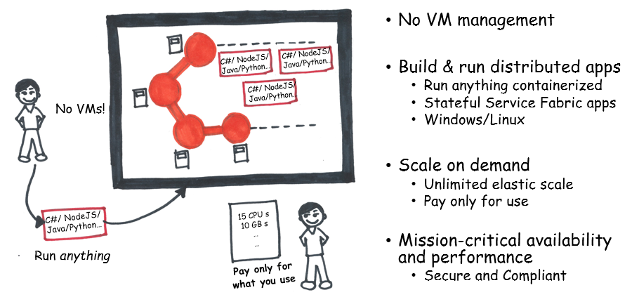

# What is Service Fabric Mesh?

Service Fabric Mesh is a server-less application platform hosted and managed by Microsoft Azure. With Service Fabric Mesh, you can deploy and scale your containerized application without worrying about infrastructure needs. Service Fabric Mesh automatically allocates the infrastructure needed by your application and also handles infrastructure failures, making sure your app is always available. Also, Service Fabric Mesh handles service discovery, data-partitioning, upgrades, and other features needed by highly available hyper-scalable applications.

<!--
NEW DIAGRAM NEEDED

-->

## Focus on your app

With Service Fabric Mesh, you only need to specify the limits of the resources your application needs. Azure handles all of the infrastructure setup required to host your application. All applications and services you create are deployed as docker containers running either Linux or Windows.

If you have a monolithic application, you can easily host the entire application in a single container. This makes it easy to port an application to the cloud even though it may not have been designed for the cloud. As time permits, you can break up the monolithic app into smaller, self-contained services. 

Azure pre-provisions popular container base-images (such as Ubuntu or Windows Server) for quick deployment. You can provide your own container image with [Azure Container Registry](../container-registry/container-registry-intro.md). And, because all applications on Service Fabric Mesh are deployed through containers, you're not restricted to any single coding framework, language, or platform SDK.

## Get started

If you don't already have an Azure account, [create a free account](https://azure.microsoft.com/free/) before you begin.

[!INCLUDE [cloud-shell-try-it.md](../../includes/cloud-shell-try-it.md)]

You can use the Azure Cloud Shell or a local installation of the Azure CLI. If you choose to install and use the CLI locally, install Azure CLI version 2.0.31 or later. To find the version, run `az --version`. To install or upgrade to the latest version of the CLI, see [Install Azure CLI 2.0](/cli/azure/install-azure-cli).

<!--
Test the Service Fabric Mesh extension with `az sbz -h`

```azurecli
> az sbz -h

Group
    az sbz: (PREVIEW) Manage Azure SeaBreeze Resources.

Subgroups:
    app           : Manage SeaBreeze applications.
    codepackage   : Manage SeaBreeze service replica code packages.
    deployment    : Manage SeaBreeze deployments.
    network       : Manage networks.
    service       : Manage SeaBreeze services.
    servicereplica: Manage SeaBreeze service replicas.
    volume        : Manage volumes.

```
-->


## Next steps

Use the [Deploy a container](service-fabric-mesh-quickstart-deploy-container.md) quickstart to quickly test Service Fabric Mesh.
