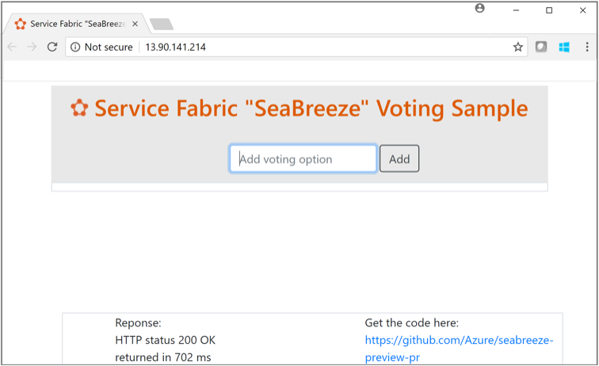

# Quickstart: Deploy a Service Fabric application in Azure
Azure Service Fabric Mesh is a fully managed service that enables developers to deploy containerized applications without managing VMs, storage, or networking. 

This quickstart shows how to deploy your first .NET Core application to Service Fabric Mesh. When you're finished, you have a voting application with an ASP.NET Core web front end that saves voting results in a stateful back-end service in the cluster.

You can easily create a free Azure subscription, [create a free account](https://azure.microsoft.com/free/) before you begin. 

[!INCLUDE [preview note](./includes/include-preview-note.md)]

[!INCLUDE [cloud-shell-try-it.md](../../includes/cloud-shell-try-it.md)] 

You can use the Azure Cloud Shell or a local installation of the Azure CLI to complete this quickstart. If you choose to install and use the CLI locally, this quickstart requires that you're running the Azure CLI version 2.0.30 or later. Run `az --version` to find the version. To install or upgrade to the latest version of the CLI, see [Install Azure CLI 2.0][azure-cli-install]. 


## Deploy the application
Login to Azure and set your subscription to the one that has been white-listed for the preview.

```azurecli-interactive
az login
az account set --subscription "<subscriptionName>"
```

Create a resource group to deploy the application to. You can use an existing resource group and skip this step. 

```azurecli-interactive
az group create --name <resourceGroupName> --location eastus 
```

Create your application in the resource group using the `deployment create` command:

```azurecli-interactive
az mesh deployment create --resource-group <resourceGroupName> --template-uri https://seabreezequickstart.blob.core.windows.net/templates/quickstart/sbz_rp.linux.json
```

In a few seconds, your command should return with `"provisioningState": "Succeeded"` . 

## Check the application deployment status
Your application is now deployed. You can check the application's status using the `app show` command. The application name for the deployed quickstart application is "SbzVoting", so fetch its details. 

```azurecli-interactive
az mesh app show --resource-group <resourceGroupName> --name SbzVoting
```

## List the deployed applications
You can use the "app list" command to get a list of applications you have deployed to your subscription. 

```azurecli-interactive
az mesh app list -o table
```

## Open the application
Once the application status is returned as ""provisioningState": "Succeeded", get the ingress endpoint of the service.  Query the network resource to find the IP address of the container where the service is deployed.

The network resource for the quickstart application is "SbzVotingNetwork", so fetch its details.

```azurecli-interactive
az mesh network show --resource-group <resourceGroupName> --name SbzVotingNetwork
```
The command should now return with the following information:

```json
{
  "addressPrefix": "10.0.0.4/22",
  "description": "Private network for application",
  "id": "/subscriptions/<subscription-id>/resourcegroups/votinggroup/providers/Microsoft.ServiceFabric/networks/SbzVotingNetwork",
  "ingressConfig": {
    "layer4": [
      {
        "applicationName": "SbzVoting",
        "endpointName": "Endpoint1",
        "publicPort": "80",
        "serviceName": "VotingWeb"
      }
    ],
    "publicIpAddress": "52.226.32.193",
    "qosLevel": "Bronze"
  },
  "location": "eastus",
  "name": "SbzVotingNetwork",
  "provisioningState": "Succeeded",
  "resourceGroup": "votinggroup",
  "tags": {},
  "type": "Microsoft.ServiceFabric/networks"
}
```

From the output, copy the public IP address of the service (52.226.32.193 in the preceding example) and open in a browser.



You can now add voting options to the application and vote on it, or delete the voting options.


## Walk through the voting sample application
The voting application consists of two services:
- Web front-end service (VotingWeb)- An ASP.NET Core web front-end service, which serves the web page and exposes web APIs to communicate with the backend service.
- Back-end service (VotingData)- An ASP.NET Core web service, which exposes an API to store the vote results in a reliable dictionary persisted on disk.


When you vote in the application, the following events occur:
1. A JavaScript sends the vote request to the web API in the web front-end service as an HTTP PUT request.
2. The web front-end service uses a proxy to locate and forward an HTTP PUT request to the back-end service.
3. The back-end service takes the incoming request, and stores the updated result in a reliable dictionary, which gets replicated to multiple nodes within the cluster and persisted on disk. All the application's data is stored in the cluster, so no database is needed.

## Clean up resources
When you no longer need the application and it's related resources, delete the resource group containing them. 

```azurecli-interactive
az group delete --resource-group <resourceGroupName>  
```

## Next steps
To learn more about Service Fabric Mesh, read the overview:
> [!div class="nextstepaction"]
> [Service Fabric Mesh overview](service-fabric-mesh-overview.md)


[azure-cli-install]: /cli/azure/install-azure-cli