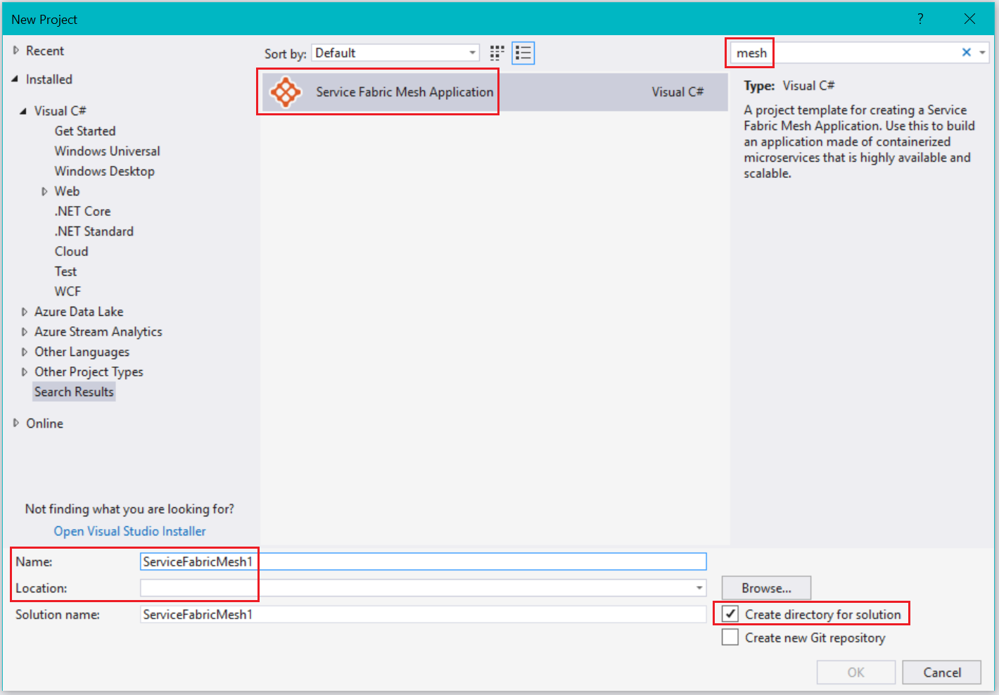
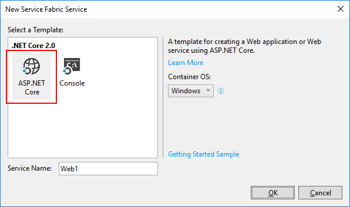
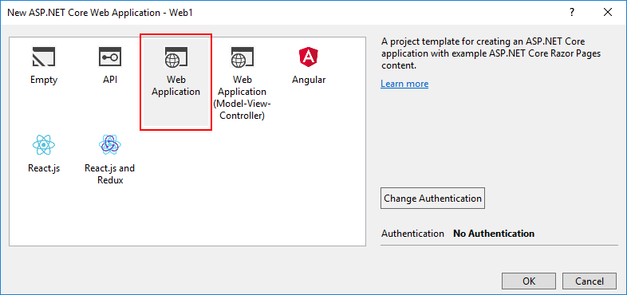
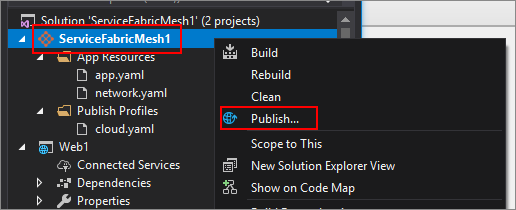
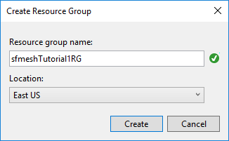
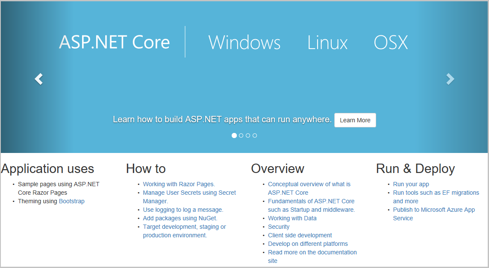

# Quickstart: Create and deploy a web app to Azure Service Fabric Mesh

Azure Service Fabric Mesh is a fully managed service that enables developers to deploy microservices applications without managing virtual machines, storage, or networking.

In this quickstart you'll create a new Service Fabric Mesh application consisting of an ASP.NET Core web app, run it on the local development cluster, and then publish it to run on Azure.

You'll need an Azure subscription. If you don't have one, you can easily create a free Azure subscription, [create a free account](https://azure.microsoft.com/free/) before you begin. You will also need to [setup your developer environment](service-fabric-mesh-howto-setup-developer-environment-sdk.md)

[!INCLUDE [preview note](./includes/include-preview-note.md)]

## Create a Service Fabric Mesh project

Open Visual Studio and select **File** > **New** > **Project...**

In the **New Project** dialog **Search** box at the top, type `mesh`. Select the **Service Fabric Mesh Application** template. (If you don't see the template, make sure that you installed the Mesh SDK and the VS tools preview as described in [set up your development environment](service-fabric-mesh-howto-setup-developer-environment-sdk.md). 

In the **Name** box, type **ServiceFabricMesh1** and in the **Location** box, set the folder path of where the files for the project will be stored.

Make sure that **Create directory for solution** is checked, and click **OK** to create the Service Fabric Mesh project.



### Create a service

After you click **OK**, the **New Service Fabric Service** dialog appears. Select the **ASP.NET Core** project type, make sure **Container OS** is set to **Windows** and click **OK** to create the ASP.NET Core project. 



The **New ASP.NET Core Web Application** dialog appears. Select **Web Application** and then click **OK**.



Visual Studio creates the Service Fabric Mesh application project and the ASP.NET Core project.

## Build and publish to your local cluster

A Docker image is automatically built and published to your local cluster as soon as your project loads. This process may take some time. You can monitor the progress of the Service Fabric tools in the **Output** window if you want by selecting the **Service Fabric Tools** item in the **Output** window dropdown. You can continue to work while the docker image is being deployed.

After the project has been created, click **F5** to debug your service locally. When the local deployment is finished, and Visual Studio is running your project, a browser window will open with a sample webpage.

When you're done browsing the deployed service, stop debugging your project by pressing **Shift+F5** in Visual Studio.

## Publish to Azure

To publish your Service Fabric Mesh project to Azure, right-click on the **Service Fabric Mesh project** in Visual studio and select **Publish...**



You will see a **Publish Service Fabric Application** dialog.


Select your Azure account and subscription. Choose a **Location**. This article uses **East US**.

Under **Resource group**, select **\<Create New Resource Group...>**. The **Create Resource Group** dialog appears. Set the **Resource group name** and **Location**.  This quickstart uses the **East US** location and names the group **sfmeshTutorial1RG** (if your organization has multiple people using the same subscription, choose a unique resource group name).  Click **Create** to create the resource group and return to the publish dialog.



Back in the **Publish Service Fabric Application** dialog, under **Azure Container Registry**, select **\<Create New Container Registry...>**. In the **Create Container Registry** dialog, use a unique name for the **Container registry name**. Specify a **Location** (this quickstart uses **East US**). Select the **Resource group** that you created in the previous step in the drop-down, for example, **sfmeshTutorial1RG**. Set the **SKU** to **Basic** and then click **Create** to return to the publish dialog.


In the publish dialog, click the **Publish** button to deploy your Service Fabric Mesh application to Azure.

When you publish to Azure for the first time, the docker image is pushed to the Azure Container Registry (ACR) which takes time depending on the size of the image. Subsequent publishes of the same project will be faster. You can monitor the progress of the deployment by selecting **Service Fabric Tools** in the Visual Studio **Output** window dropdown. Once the deployment has finished, the **Service Fabric Tools** output will display the IP address and port of your application in the form of a URL.

```
Packaging Application...
Building Images...
Web1 -> C:\Code\ServiceFabricMesh1\Web1\bin\Any CPU\Release\netcoreapp2.0\Web1.dll
Uploading the images to Azure Container Registry...
Deploying application to remote endpoint...
The application was deployed successfully and it can be accessed at http://...
```

Open a web browser and navigate to the URL to see the website running in Azure:



## Clean up resources

When no longer needed, delete all of the resources you created for this quickstart. Since you created a new resource group to host both the ACR and Service Fabric Mesh service resources, you can safely delete this resource group, which is an easy way to delete all of the resources  associated with it.

```azurecli
az group delete --resource-group sfmeshTutorial1RG
```

```powershell
Connect-AzureRmAccount
Remove-AzureRmResourceGroup -Name sfmeshTutorial1RG
```

Alternatively, you can delete the resource group [from the Azure portal](https://portal.azure.com).

## Next steps

To learn more about creating and deploying Service Fabric Mesh applications, continue to the tutorial.
> [!div class="nextstepaction"]
> [Create, debug, and deploy a multi-service web application to Service Fabric Mesh](service-fabric-mesh-tutorial-create-dotnetcore.md)
