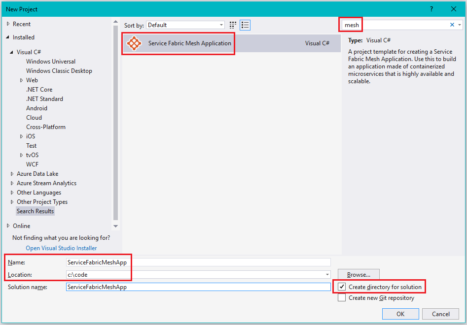
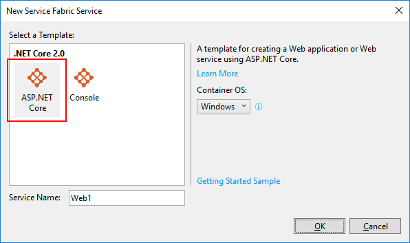
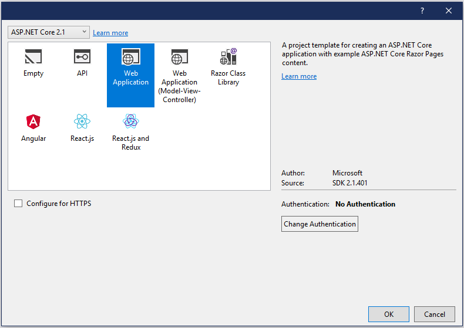
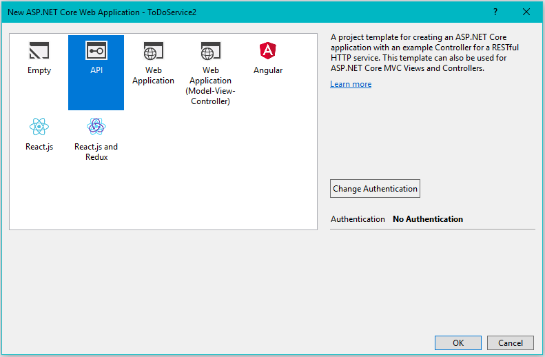
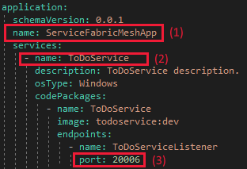
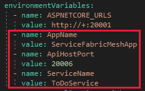

# Tutorial: Create, debug, deploy and upgrade a multi-service Service Fabric Mesh app

This tutorial is part one of a series. You'll learn how to use Visual Studio to create an Azure Service Fabric Mesh app that has an ASP.NET web front-end and an ASP.NET Core Web API back-end service. Then you'll debug the app on your local development cluster. You'll publish the app to Azure and then make config and code changes and upgrade the app. Finally, you'll clean up unused Azure resources so that you are not charged for what you aren't using.

When you're finished, you'll have walked through most of the phases of app lifecycle management and have built an app that demonstrates a service-to-service call in a Service Fabric Mesh app.

If you don't want to manually create the to-do application, you can [download the source code](https://github.com/azure-samples/service-fabric-mesh) for the completed application  and skip ahead to [Debug the app locally](service-fabric-mesh-tutorial-debug-service-fabric-mesh-app.md).

In part one of the series, you learn how to:

> [!div class="checklist"]
> * Use Visual Studio to create a Service Fabric Mesh app consisting of an ASP.NET web front end.
> * Create a model to represent to-do items.
> * Create a back-end service & retrieve data from it.
> * Add a controller and DataContext as part of that Model View Controller pattern for the back-end service.
> * Create a web page to display to-do items.
> * Create environment variables that identify the back-end service

In this tutorial series you learn how to:
> [!div class="checklist"]
> * Create a Service Fabric Mesh app in Visual Studio
> * [Debug a Service Fabric Mesh app running in your local development cluster](service-fabric-mesh-tutorial-debug-service-fabric-mesh-app.md)
> * [Deploy a Service Fabric Mesh app](service-fabric-mesh-tutorial-deploy-service-fabric-mesh-app.md)
> * [Upgrade a Service Fabric Mesh app](service-fabric-mesh-tutorial-upgrade.md)
> * [Clean up Service Fabric Mesh resources](service-fabric-mesh-tutorial-cleanup-resources.md)

[!INCLUDE [preview note](./includes/include-preview-note.md)]

## Prerequisites

Before you begin this tutorial:

* If you don't have an Azure subscription, you can [create a free account](https://azure.microsoft.com/free/?WT.mc_id=A261C142F) before you begin.

* Make sure that you've [set up your development environment](service-fabric-mesh-howto-setup-developer-environment-sdk.md) which includes installing the Service Fabric runtime, SDK, Docker, and Visual Studio 2017.

## Create a Service Fabric Mesh project in Visual Studio

Run Visual Studio and select **File** > **New** > **Project...**

In the **New Project** dialog **Search** box at the top, type `mesh`. Select the **Service Fabric Mesh Application** template. (If you don't see the template, make sure that you installed the Mesh SDK and the VS tools preview as described in [set up your development environment](service-fabric-mesh-howto-setup-developer-environment-sdk.md).  

In the **Name** box, type `todolistapp` and in the **Location** box, set the folder path to where you want to store the files for the project.

Make sure that **Create directory for solution** is checked, and click **OK** to create the Service Fabric Mesh project.



Next you'll see the **New Service Fabric Service** dialog.

### Create the web front-end service

In the **New Service Fabric Service** dialog, select the **ASP.NET Core** project type, make sure **Container OS** is set to **Windows**.

Set the **Service Name** to **WebFrontEnd**. Press **OK** to create the ASP.NET Core service.



Next you'll see the ASP.NET Core Web Application dialog. Select **Web Application** and then click **OK**.



Now you have a Service Fabric Mesh application. Next, create the model for to-do information.

## Create the to-do items model

For simplicity, the to-do items are stored in a list in memory. Create a class library for the to-do items and a list to hold them. In Visual Studio, which currently has the **todolistapp** solution loaded, select **File** > **Add** > **New Project**.

In the **Add New Project** dialog **Search** box at the top, type `C# .net core class`. Select the **Class Library (.NET Core)** template.

In the **Name** box, type `Model`. Click **OK** to create the class library.

In the Solution explorer, under **Model**, right-click **Class1.cs** and choose **Rename**. Rename the class **ToDoItem.cs**. When a prompt appears asking whether to rename all references, click **Yes**.

Replace the contents of the empty `class ToDoItem` with:

```csharp
public class ToDoItem
{
    public string Description { get; set; }
    public int Index { get; set; }
    public bool Completed { get; set; }

    public ToDoItem(string description)
    {
        Description = description;
        Index = 0;
    }

    public static ToDoItem Load(string description, int index, bool completed)
    {
        ToDoItem newItem = new ToDoItem(description)
        {
            Index = index,
            Completed = completed
        };

        return newItem;
    }
}
```

This class represents to-do items.

In Visual Studio, right-click the **Model** class library, and select **Add** > **Class...** to create a list to hold the to-do items. The **Add New Item** dialog will appear. Set the **Name** to `ToDoList.cs` and click **Add**.

In **ToDoList.cs**, replace the empty `class ToDoList` with:

```csharp
public class ToDoList
{
    private List<ToDoItem> _items;

    public string Name { get; set; }
    public IEnumerable<ToDoItem> Items { get => _items; }

    public ToDoList(string name)
    {
        Name = name;
        _items = new List<ToDoItem>();
    }

    public ToDoItem Add(string description)
    {
        var item = new ToDoItem(description);
        _items.Add(item);
        item.Index = _items.IndexOf(item);
        return item;
    }
    public void Add(ToDoItem item)
    {
        _items.Add(item);
        item.Index = _items.Count - 1;
    }

    public ToDoItem RemoveAt(int index)
    {
        if (index >= 0 && index < _items.Count)
        {
            var result = _items[index];
            _items.RemoveAt(index);

            // Reorder items
            for (int i = index; i < _items.Count; i++)
            {
                _items[i].Index = i;
            }

            return result;
        }
        else
        {
            throw new IndexOutOfRangeException();
        }
    }
}
```

Next, create the service fabric service that will track the to-do items.

## Create the back-end service

In the Visual Studio **Solution Explorer** window, right-click **todolistapp** and click **Add** > **New Service Fabric Service...**

The **New Service Fabric Service** dialog appears. Select the **ASP.NET Core** project type, and make sure **Container OS** is set to **Windows**. Set the **Service Name** to **ToDoService**. Click **OK** to create the ASP.NET Core service.

Next, the **New ASP.NET Core Web Application** dialog will appear. In that dialog select **API** and then **OK**, and a project for the service is added to the solution.



Because the back-end service doesn't provide any UI, turn off launching the browser when the service is launched. In the **Solution Explorer**, right-click **ToDoService**, and select **Properties**. In the properties window that appears, select the **Debug** tab on the left, and uncheck **Launch browser**. Press **Ctrl+S** to save the change.

Because this service maintains the to-do information, add a reference to the Model class library. In the Solution Explorer, right-click **ToDoService** and then select **Add** > **Reference...**. The **Reference Manager** dialog will appear.

In the **Reference Manager**, select the checkbox for **Model** and click **OK**.

### Add a data context

Next create a data context that coordinates serving up the data from the data model.

To add the data context class, in the solution explorer right-click **ToDoService** and then **Add** > **Class**.
In the **Add New Item** dialog that appears, make sure that **Class** is selected, and set the **Name** to `DataContext.cs` and click **Add**.

In **DataContext.cs**, replace the contents of the empty `class DataContext` with:

```csharp
public static class DataContext
{
    public static Model.ToDoList ToDoList { get; } = new Model.ToDoList("Azure learning List");

    static DataContext()
    {
        // Seed to-do list
        ToDoList.Add(Model.ToDoItem.Load("Learn about microservices", 0, true));
        ToDoList.Add(Model.ToDoItem.Load("Learn about Service Fabric", 1, true));
        ToDoList.Add(Model.ToDoItem.Load("Learn about Service Fabric Mesh", 2, false));
    }
}
```

This minimal data context populates some sample to-do items and provides access to them.

### Add a controller

A default controller, which handles the HTTP requests and creates the HTTP response, was provided by the template when the **ToDoService** project was created. In the **Solution Explorer**, under **ToDoService**, open the **Controllers** folder to see the **ValuesController.cs** file. 

Right-click **ValuesController.cs** and then **Rename**. Rename the file to `ToDoController.cs`. If a prompt appears to rename all references, click **Yes**.

Open the **ToDoController.cs** file and replace the contents of `class ToDoController` with:

```csharp
[Route("api/[controller]")]
public class ToDoController : Controller
{
    // GET api/todo
    [HttpGet]
    public IEnumerable<Model.ToDoItem> Get()
    {
        return DataContext.ToDoList.Items;
    }

    // GET api/todo/5
    [HttpGet("{index}")]
    public Model.ToDoItem Get(int index)
    {
        return DataContext.ToDoList.Items.ElementAt(index);
    }

    //// POST api/values
    //[HttpPost]
    //public void Post([FromBody]string value)
    //{
    //}

    //// PUT api/values/5
    //[HttpPut("{id}")]
    //public void Put(int id, [FromBody]string value)
    //{
    //}

    // DELETE api/values/5
    [HttpDelete("{index}")]
    public void Delete(int index)
    {
    }
}
```

This tutorial does not implement add, delete, and so on, to keep the focus on communicating with another service.

## Create the web page that displays to-do items

With the back-end service implemented, code the web site that will display the to-do items it provides. The following steps take place within the **WebFrontEnd** project.

The web page that displays the to-do items needs access to the **ToDoItem** class and list.
In the **Solution Explorer**, add a reference to the Model project by right-clicking **WebFrontEnd** and selecting **Add** > **Reference...** The **Reference Manager** dialog will appear.

In the **Reference Manager**, click the checkbox for **Model** and click **OK**.

In the **Solution Explorer**, open the Index.cshtml page by navigating to **WebFrontEnd** > **Pages** > **Index.cshtml**. Open **Index.cshtml**.

Replace the contents of the entire file with the following HTML that defines a simple table to display to-do items:

```HTML
@page
@model IndexModel
@{
    ViewData["Title"] = "Home page";
}

<div>
    <table class="table-bordered">
        <thead>
            <tr>
                <th>Description</th>
                <th>Done?</th>
            </tr>
        </thead>
        <tbody>
            @foreach (var item in Model.Items)
            {
                <tr>
                    <td>@item.Description</td>
                    <td>@item.Completed</td>
                </tr>
            }
        </tbody>
    </table>
</div>
```

Click on the dropdown icon of the **Index.cshtml** file in the **Solution Explorer** and then open **Index.cshtml.cs**.

At the top of **Index.cshtml.cs**, add `using System.Net.Http;`

Replace the contents of `public class IndexModel` with:

```csharp
public class IndexModel : PageModel
{
    public Model.ToDoItem[] Items = new Model.ToDoItem[] { };

    public void OnGet()
    {
        HttpClient client = new HttpClient();

        using (HttpResponseMessage response = client.GetAsync(backendUrl).GetAwaiter().GetResult())
        {
            if (response.StatusCode == System.Net.HttpStatusCode.OK)
            {
                Items = Newtonsoft.Json.JsonConvert.DeserializeObject<Model.ToDoItem[]>(response.Content.ReadAsStringAsync().Result);
            }
        }
    }

    private static string backendDNSName = $"{Environment.GetEnvironmentVariable("ToDoServiceName")}";
    private static Uri backendUrl = new Uri($"http://{backendDNSName}:{Environment.GetEnvironmentVariable("ApiHostPort")}/api/todo");
}
```

### Create environment variables

The URL for the back-end service is required  to communicate with that service. For the purpose of this tutorial, the following code excerpt (which is defined above as part of the IndexModel) reads environment variables to compose the URL:

```csharp
private static string backendDNSName = $"{Environment.GetEnvironmentVariable("ToDoServiceName")}";
private static Uri backendUrl = new Uri($"http://{backendDNSName}:{Environment.GetEnvironmentVariable("ApiHostPort")}/api/todo");
```

The URL is composed of the service name and the port. All of this information is found in the service.yaml file found in the **ToDoService** project.

> [!IMPORTANT]
> In the following steps, YAML files will be modified.
> Spaces, not tabs, must be used to indent the variables in the service.yaml file or it won't compile. Visual Studio may insert tabs as you create the environment variables. Replace all tabs with spaces. Although you'll see errors in the **build** debug output, the app will still launch but it won't until you convert the tabs to spaces and rebuild. To ensure that no tabs are in the service.yaml file, you can make whitespace visible in the Visual Studio editor with  **Edit**  > **Advanced**  > **View White Space**.
> Note that service.yaml files are processed using the English locale. If you need to use a decimal separator, use a period rather than a comma, for example.

Navigate in **Solution Explorer** to the **ToDoService** project and open **Service Resources** > **service.yaml**.



 The service name, `ToDoService`, is found under `services:` See (1) in the figure above.

* The port, `80`, is found under `endpoints:` See (2) in the figure above. Your project's port number will probably be different.

Next, we need to define environment variables representing the service name and port number in the WebFrontEnd project so it can call the back-end service.

In **Solution Explorer**, navigate  to **WebFrontEnd** > **Service Resources** > **service.yaml** to define the variables that specify the back-end service address.

In the service.yaml file, add the following variables under `environmentVariables:` (You will first need to remove the `#` to uncomment `environmentVariables:`) The spacing is important so align the variables you add with the other variables under `environmentVariables:`. It is very important that the value for ApiHostPort match the port value for ToDoServiceListener which was previously seen in the service.yaml file of the ToDoService.

```yaml
- name: ApiHostPort
  value: 
- name: ToDoServiceName
  value: ToDoService
```

> [!Tip]
> There are two ways to specify the value for `ToDoServiceName`: 
> - Just the service name, which will resolve both in a debugging scenario on Windows 10 as well as when deploying the service to Azure Service Fabric Mesh.
> - Fully qualified as servicename.appname. This will only work when debugging on Windows 10.
> It is a good practice to only use the service name for service resolution.

Your **WebFrontEnd** project's **service.yaml** file should look something like this although your `ApiHostPort` value will probably be different:




Now you are ready to build and deploy the image the Service Fabric Mesh application, along with the back-end web service, to your local cluster.

## Next steps

In this part of the tutorial, you learned how to:

> [!div class="checklist"]
> * Create a Service Fabric Mesh app consisting of an ASP.NET web front-end.
> * Create a model to represent to-do items.
> * Create a back-end service & retrieve data from it.
> * Add a controller and DataContext as part of that Model View Controller pattern for the back-end service.
> * Create a web page to display to-do items.
> * Create environment variables that identify the back-end service

Advance to the next tutorial:
> [!div class="nextstepaction"]
> [Debug a Service Fabric Mesh application running in your local development cluster](service-fabric-mesh-tutorial-debug-service-fabric-mesh-app.md)