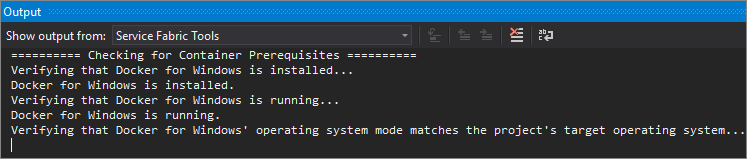
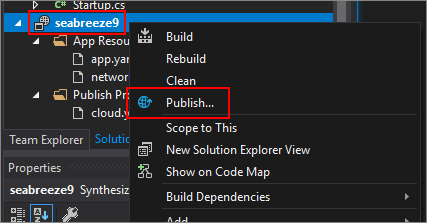

# Tutorial: Create an ASP.NET Core website for Service Fabric Mesh

In this tutorial you will create a new Service Fabric Mesh project, add an ASP.NET Core website to it, and run it locally in the Service Fabric cluster. After that, you will deploy the project to Azure.

In this tutorial you learn how to:
> [!div class="checklist"]
> * Create a new Service Fabric Mesh project
> * Deploy the service to the local cluster
> * Deploy the service to Azure

If you don’t have an Azure subscription, [create a free account](https://azure.microsoft.com/free/?WT.mc_id=A261C142F) before you begin.

|     |
| --- |
| Service Fabric Mesh is in currently in preview, and only supports the **East US** region. Previews are made available to you on the condition that you agree to the [supplemental terms of use](https://azure.microsoft.com/support/legal/preview-supplemental-terms/). Some aspects of this feature may change prior to general availability (GA). |

## Prerequisites

Before you get started, make sure that you've set up your development environment. This process includes installing the Service Fabric Mesh SDK and Visual Studio 2017. 

<!--
For more information on installing the prerequisites, see [Set up your developer machine]().
-->


## Create a Service Fabric Mesh project

After you've installed the Service Fabric Mesh SDK, new templates for Service Fabric Mesh are available in Visual Studio. Open Run Visual Studio and select **File** > **New** > **Project...**

In the **New Project** dialog, type **mesh** into the **Search** box at the top. Select the **Service Fabric Mesh Application** template. Next, Make sure that **Create directory for solution** is checked.

In the **Name** box, type **ServiceFabricMesh1** and in the **Location** box, set the folder path of where the files for the project will be stored.

Press **OK** to create the Service Fabric Mesh project.


A new dialog is displayed, **New Service Fabric Service**. Select the **ASP.NET Core** project type, make sure **Container OS** is set to **Windows**.

You may change the **Service Name** to something unique. Why? Because the name of the service is used as the repository name of the Docker image. If you have an existing Docker image with the same repository name, it will be overwritten by Visual Studio. Use the command `docker image list` to verify your name is unique.

Press **OK** to create the ASP.NET Core project. 


A new dialog is displayed, **New ASP.NET Core Web Application** dialog. Select **Web Application** and then press **OK**.


Visual Studio will create your Service Fabric Mesh project and then the ASP.NET Core project. A Docker image will automatically be built and deployed to your local Docker host. This process may take some time. You can monitor the progress of the Service Fabric tools in the **Output** pane. Select the **Service Fabric Tools** item in the pane.



>**Possible failure**  
>The NuGet package **Microsoft.VisualStudio.Azure.SFApp.Targets** is required and may not be available, causing the project build to fail. You may need to temporarily add the NuGet package from the Service Fabric extension install directory. This is different on each computer but is generally located somewhere in the folder `C:\Program Files (x86)\Microsoft Visual Studio\2017\Enterprise\Common7\IDE\Extensions\[UNIQUE NAME]\Nuget`. The `[UNIQUE NAME]` is different for each install and is named something similar to `x2lwnl23.hto`. Scan each directory (sort by *last modified date*) for a file named `Microsoft.VisualStudio.Azure.SFApp.Targets.0.6.0.nupkg`. Add this folder as a package source to NuGet in Visual Studio. For more information on adding package sources, see [Package Manager UI](/nuget/tools/package-manager-ui#package-sources).
>
> If you run into this problem, and after you have added the NuGet source, rebuild the app to verify the package can be found. Then, close your solution and reload it. Or, restart Visual Studio and reload your solution.


Verify that the image has been created by running `docker image list` in your CLI of choice. In the results, there's a **REPOSITORY** value named the same as your ASP.NET Core project name.

```cli
> docker image list
REPOSITORY             TAG     IMAGE ID            CREATED             SIZE
web1                   dev     2394cbc74553        6 days ago          482MB
microsoft/aspnetcore   2.0     6636e7059d8d        7 days ago          482MB
```

## Build and deploy

After the project has been created, press **F5** to run it. Whenever the project is run and debugged locally, Visual Studio will: 

1. Make sure that Docker for Windows is installed and running.
2. Make sure that Docker for Windows is set to use Windows as the container operating system.
3. Downloads any missing Docker base images.
4. Builds (or rebuilds) the Docker image used to host your code project.
5. Deploys and runs the container on the local Service Fabric development cluster.
6. Launches the web browser and navigates to the project website.

After the local deployment is finished, and your web browser has popped up, you can query Docker for state. For example, use `docker ps` to see the running container hosting your app.

```cli
> docker ps
CONTAINER ID        IMAGE               COMMAND                    CREATED             STATUS              PORTS                      NAMES
a4997407f7c2        web3:dev            "C:\\remote_debugger\\…"   2 minutes ago       Up 2 minutes        0.0.0.0:20000->20000/tcp   sf-5-0082a275-aaf4-4657-9f90-7885a16a9dd9_97be639e-67dc-456a-a614-241c1e4040bd
```

Use the **CONTAINER ID** with the `docker inspect` command to find the IP address the container is using. This command returns you a **json** formatted string that gives you details about the docker container. The last part of the output should be the network settings, which provide you the IP address.

```cli
> docker inspect a4997407f7c2
[
    {
        "Id": "a4997407f7c2b9edeed0fd041207e7dd11075e0aa8e0a4f0d660f0305c63015d",

... <CUT FOR SPACE> ...

            "Networks": {
                "nat": {
                    "IPAMConfig": null,
                    "Links": null,
                    "Aliases": null,
                    "NetworkID": "d9068c71d74865bc95b36d168b8a6f346c72e7b95ad2a143b6bf6d1f65563d95",
                    "EndpointID": "099056ab00076606aa0138c57b3dda392015bfb4d45b173f6be917c2c08ae5df",
                    "Gateway": "172.16.16.1",
                    "IPAddress": "172.16.24.220",
                    "IPPrefixLen": 16,
                    "IPv6Gateway": "",
                    "GlobalIPv6Address": "",
                    "GlobalIPv6PrefixLen": 0,
                    "MacAddress": "00:15:dd:cf:3a:a5",
                    "DriverOpts": null
                }
            }
        }
    }
]
```

In Visual Studio, press **Shift+F5** to stop debugging.

## Deploy to Azure

To deploy your Service Fabric Mesh project to Azure, right-click on the **Service Fabric Mesh project** in Visual studio and select **Publish...**



You will see a **Publish Service Fabric Application** dialog.


Select your Azure account and subscription. The **Location** must be set to **East US**. 

Under **Resource group**, select **\<Create New Resource Group...>**. This will show you a dialog where you will create a new resource group. Choose the **East US** location and name the group **sfmeshTutorial1RG**. Press **Create** to create the resource group and return to the publish dialog.


Back in the **Publish Service Fabric Application** dialog, under **Azure Container Registry**, select **\<Create New Container Registry...>**. In the **Create Container Registry** dialog, use a unique name for the **Container registry name**. For **Location**, pick **East US**. Select the **sfmeshTutorial1RG** resource group. Set the **SKU** to **Basic** and then press **Create** to return to the publish dialog.


In the publish dialog, press the **Publish** button to deploy your Service Fabric application to Azure.

When you publish to Azure for the first time, it can take up to 10 or more minutes. Subsequent publishes of the same project generally take around five minutes. Obviously, these estimates will vary based on your internet connection speed and other factors. You can monitor the progress of the deployment by selecting the **Service Fabric Tools** item in the Visual Studio **Output** pane. Once the deployment has finished, the **Service Fabric Tools** output will display the IP address and port of your application in the form of a URL.

```json
Packaging Application...
Building Images...
Web1 -> C:\Code\ServiceFabricMesh1\Web1\bin\Any CPU\Release\netcoreapp2.0\Web1.dll
Uploading the images to Azure Container Registy...
Deploying application to remote endpoint...
The application was deployed successfully and it can be accessed at http://10.000.38.000:20000.
```

Open a web browser and navigate to the URL to see the website running in Azure.

## Clean up resources

When no longer needed, delete all of the resources you created. Since you created a new resource group to host both the ACR and Service Fabric Mesh service resources, you can safely delete this resource group.

```cli
az group delete --resource-group sfmeshTutorial1RG
```

```powershell
Remove-AzureRmResourceGroup -Name sfmeshTutorial1RG
```

Alternatively, you can delete the resource group [from the portal](../azure-resource-manager/resource-group-portal.md#delete-resource-group-or-resources).

## Next steps

Explore the [samples](https://github.com/Azure/seabreeze-preview-pr/tree/master/samples) for Service Fabric Mesh.