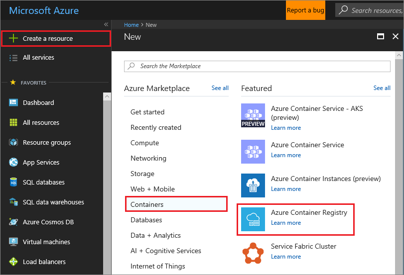
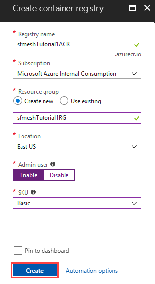

# Tutorial: Create an ASP.NET Core website for Service Fabric Mesh

In this tutorial you will create a new Service Fabric Mesh project, add an ASP.NET Core website to it, and run it locally in the Service Fabric cluster. After that, you will deploy the project to Azure.

In this tutorial you learn how to:
> [!div class="checklist"]
> * Create a new Service Fabric Mesh project
> * Deploy the service to the local cluster
> * Deploy the service to Azure

If you don’t have an Azure subscription, [create a free account](https://azure.microsoft.com/free/?WT.mc_id=A261C142F) before you begin.

|     |
| --- |
| Service Fabric Mesh is in currently in preview, and only supports the **East US** region. Previews are made available to you on the condition that you agree to the [supplemental terms of use](https://azure.microsoft.com/support/legal/preview-supplemental-terms/). Some aspects of this feature may change prior to general availability (GA). |

## Prerequisites

Before you get started, make sure that you've set up your development environment. This process includes installing the Service Fabric Mesh SDK and Visual Studio 2017. 

<!--
For more information on installing the prerequisites, see [Set up your developer machine]().
-->


## Create a Service Fabric Mesh project

After you've installed the Service Fabric Mesh SDK, new templates for Service Fabric Mesh are available in Visual Studio. Open Run Visual Studio and select **File** > **New** > **Project...**

In the **New Project** dialog, type **SeaBreeze** into the **Search** box at the top. Select the **SeaBreeze Application** template. Next, Make sure that **Create directory for solution** is checked.

In the **Name** box, type **ServiceFabricMesh1** and in the **Location** box, set the folder path of where the files for the project will be stored.

Press **OK** to create the Service Fabric Mesh project.


A new dialog is displayed, **New SeaBreeze Service**. Leave the defaults as they are. However, you may change the **Service Name** to something unique. Why? Because the name of the service is used as the repository name of the Docker image. If you have an existing Docker image with the same repository name, it will be overwritten by Visual Studio. Use the command `docker image list` to verify your name is unique.

Press **OK** to create the ASP.NET Core project. 

A new dialog is displayed, **New ASP.NET Core Web Application** dialog. Select **Web Application** and then press **OK**.


Visual Studio will create your Service Fabric Mesh project and then the ASP.NET Core project. A Docker image will automatically be built and deployed to your local Docker host. This process may take some time. You can monitor the progress of the Service Fabric Mesh tools in the **Output** pane. Select the **SeaBreeze Tools** item in the pane.


Verify that the image has been created by running `docker image list` in your CLI of choice. In the results, there's a **REPOSITORY** value named the same as your ASP.NET Core project name.

```cli
> docker image list
REPOSITORY             TAG     IMAGE ID            CREATED             SIZE
web1                   dev     2394cbc74553        6 days ago          482MB
microsoft/aspnetcore   2.0     6636e7059d8d        7 days ago          482MB
```

## Build and deploy

After the project has been created, press **F5** to run it. Whenever the project is run and debugged locally, Visual Studio will: 

1. Make sure that Docker for Windows is installed and running.
2. Make sure that Docker for Windows is set to use Windows as the container operating system.
3. Downloads any missing Docker base images.
4. Builds (or rebuilds) the Docker image used to host your code project.
5. Deploys and runs the container on the local Service Fabric development cluster.
6. Launches the web browser and navigates to the project website.

After the local deployment is finished, and your web browser has popped up, you can query Docker for state. For example, use `docker ps` to see the running container hosting your app.

```cli
> docker ps
CONTAINER ID        IMAGE               COMMAND                    CREATED             STATUS              PORTS                            NAMES
a4997407f7c2        web3:dev            "C:\\remote_debugger\\…"   2 minutes ago       Up 2 minutes        80/tcp, 0.0.0.0:8080->8080/tcp   sf-5-0082a275-aaf4-4657-9f90-7885a16a9dd9_97be639e-67dc-456a-a614-241c1e4040bd
```

Use the **CONTAINER ID** with the `docker inspect` command to find the IP address the container is using. This command returns you a **json** formatted string that gives you details about the docker container. The last part of the output should be the network settings, which provide you the IP address.

```cli
> docker inspect a4997407f7c2
[
    {
        "Id": "a4997407f7c2b9edeed0fd041207e7dd11075e0aa8e0a4f0d660f0305c63015d",

... <CUT FOR SPACE> ...

            "Networks": {
                "nat": {
                    "IPAMConfig": null,
                    "Links": null,
                    "Aliases": null,
                    "NetworkID": "d9068c71d74865bc95b36d168b8a6f346c72e7b95ad2a143b6bf6d1f65563d95",
                    "EndpointID": "099056ab00076606aa0138c57b3dda392015bfb4d45b173f6be917c2c08ae5df",
                    "Gateway": "172.16.16.1",
                    "IPAddress": "172.16.24.220",
                    "IPPrefixLen": 16,
                    "IPv6Gateway": "",
                    "GlobalIPv6Address": "",
                    "GlobalIPv6PrefixLen": 0,
                    "MacAddress": "00:15:dd:cf:3a:a5",
                    "DriverOpts": null
                }
            }
        }
    }
]
```

In Visual Studio, press **Shift+F5** to stop debugging.

## Prepare to deploy to Azure

It's easy to deploy your Service Fabric Mesh project to Azure. But first, some tweaking needs to happen. Currently, Service Fabric Mesh is using port **8080** in the container hosting your project. This port is routed to port **80** on the development cluster's network adapter. However, Azure cannot use this port currently and you must change any reference of port **8080** to **80**, before publishing. There are two files you need to edit, **service.yaml** and **network.yaml**. 

The **service.yaml** file is located in Visual Studio at **[.NET Core Project Name]** > **Service Resources** > **service.yaml**. You can see in this example that the **endpoints** definition has **port** set to **8080**, change that value to **80**.

```yaml
## Service definition ##
application:
  schemaVersion: 0.0.1
  name: seabreeze9
  services:
    - name: breeze1
      description: breeze1 description.
      osType: Windows
      codePackages:
        - name: breeze1
          image: breeze1:dev
          endpoints:
            - name: breeze1Listener
              port: 8080
          resources:
            requests:
              cpu: 1
              memoryInGB: 1
      replicaCount: 1
      networkRefs:
        - seabreeze9Network
```

The **network.yaml** file is located in Visual Studio at **[Service Fabric Mesh Project Name]** > **App Resources** > **network.yaml**. You can see in this example that the **layer4** definition has **publicPort** set to **8080**, change that value to **80**. 

```yaml
## Network definition ##
network:
  schemaVersion: 0.0.1
  name: seabreeze9Network
  description: seabreeze9Network description.
  addressPrefix: 10.0.0.4/22
  ingressConfig:
    layer4:
      - name: breeze1Ingress
        publicPort: 8080
        applicationName: seabreeze9
        serviceName: breeze1
        endpointName: breeze1Listener
```

By changing the port to **80** in these two files, Visual Studio reacts badly and will no longer debug and deploy to the local cluster. Revert these changes after you deploy to Azure if you want to continue to work locally.

## Create an ACR

Service Fabric Mesh services are hosted in containers. The Service Fabric Mesh tools will automatically build and deploy a container image containing your services. This image can be stored in the public Docker Registry, or in an Azure Container Registry (ACR). Currently, Service Fabric Mesh with Visual Studio only supports using ACR, while the command line tools allow you to use the Docker Registry. For the purposes of this tutorial, create a new ACR in the **East US** location.

Sign in to the Azure portal at https://portal.azure.com. Select **Create a resource** > **Containers** > **Azure Container Registry**.



For **Registry name**, use something unique; the value `sfmeshTutorial1ACR` is used in this tutorial. For **Resource group**, create a new one with the name `sfmeshTutorial1RG`.

Set **Location** to `East US` and **SKU** to `Basic`. Under **Admin user**, select `Enable`, and then select **Create** to create ACR instance.



The Azure portal will display a **Deployment succeeded** status message when the ACR has been created. After it is created, you can continue on and deploy your Service Fabric Mesh project.

## Deploy to Azure

To deploy your Service Fabric Mesh project to Azure, right-click on the **Service Fabric Mesh project** in Visual studio and select **Publish...**


You will be presented with a **Publish SeaBreeze Application** dialog.


Provide your Azure account and subscription. The **Location** must be set to **eastus**. Unselect **New resource group** and then choose the same resource group you previously created, `sfmeshTutorial1RG`. Select the Azure Container Registry you created in the previous section. Press **Publish** to start the deployment.

When you publish to Azure for the first time, it can take up to 10 or more minutes. Subsequent publishes of the same project generally take around five minutes. Obviously, these estimates will vary based on your internet connection speed and other factors. You can monitor the progress of the Service Fabric Mesh tools by selecting the **SeaBreeze Tools** item in the Visual Studio **Output** pane. Once the deployment has finished, the **SeaBreeze Tools** output will display the network information of the hosting container for Service Fabric Mesh.

```json
Network Information:
{
  "type": "Microsoft.ServiceFabric/networks",
  "location": "eastus",
  "id": "/subscriptions/ba2s53e145-3c4e-bbbb-bbbb-c755f8df945e/resourcegroups/sfmeshTutorial1RG/providers/Microsoft.ServiceFabric/networks/seabreeze9Network",
  "name": "seabreeze9Network",
  "tags": {},
  "properties": {
    "provisioningState": "Succeeded",
    "description": "seabreeze9Network description.",
    "addressPrefix": "10.0.0.4/22",
    "ingressConfig": {
      "qosLevel": "Bronze",
      "publicIPAddress": "52.111.111.11",
      "layer4": [
        {
          "publicPort": 80,
          "applicationName": "seabreeze9",
          "serviceName": "breeze1",
          "endpointName": "breeze1Listener"
        }
      ]
    }
  }
}
```

Open a web browser and navigate to the IP address in the **publicIPAddress** field of the results.

## Clean up resources

When no longer needed, delete all of the resources you created. Since you created a new resource group to host both the ACR and Service Fabric Mesh service resources, you can safely delete this resource group.

```cli
az group delete --resource-group sfmeshTutorial1RG
```

```powershell
Remove-AzureRmResourceGroup -Name sfmeshTutorial1RG
```

Alternatively, you can delete the resource group [from the portal](../azure-resource-manager/resource-group-portal.md#delete-resource-group-or-resources).

## Next steps

Explore the [samples](https://github.com/Azure/seabreeze-preview-pr/tree/master/samples) for Service Fabric Mesh.