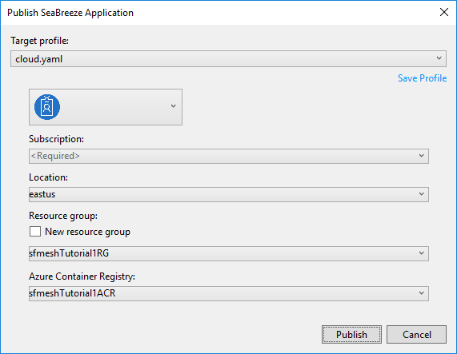
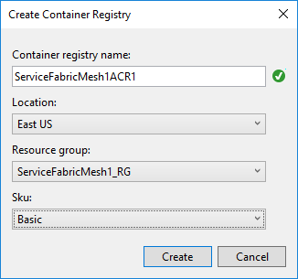

# Tutorial: Deploy a Service Fabric Mesh application

This tutorial is part three of a series and shows you how to publish an Azure Service Fabric Mesh web application directly from Visual Studio.

In this tutorial you learn how to:
> [!div class="checklist"]
> * Publish the app to Azure using Visual Studio.
> * Check application deployment status
> * See all applications currently deployed to your subscription

In this tutorial series you learn how to:
> [!div class="checklist"]
> * [Create a Service Fabric Mesh app in Visual Studio](service-fabric-mesh-tutorial-create-dotnetcore.md)
> * [Debug a Service Fabric Mesh app running in your local development cluster](service-fabric-mesh-tutorial-debug-service-fabric-mesh-app.md)
> * Deploy a Service Fabric Mesh app
> * [Upgrade a Service Fabric Mesh app](service-fabric-mesh-tutorial-upgrade.md)
> * [Clean up Service Fabric Mesh resources](service-fabric-mesh-tutorial-cleanup-resources.md)

[!INCLUDE [preview note](./includes/include-preview-note.md)]

## Prerequisites

Before you begin this tutorial:

* If you don't have an Azure subscription, you can [create a free account](https://azure.microsoft.com/free/?WT.mc_id=A261C142F) before you begin.

* Make sure that you've [set up your development environment](service-fabric-mesh-howto-setup-developer-environment-sdk.md) which includes installing the Service Fabric runtime, SDK, Docker, and Visual Studio 2017.

## Download the to-do sample application

If you did not build the to-do sample application in [part two of this tutorial series](service-fabric-mesh-tutorial-debug-service-fabric-mesh-app.md), you can download it. In a command window, run the following command to clone the sample app repository to your local machine.

```
git clone https://github.com/azure-samples/service-fabric-mesh
```

The application is under the `src\todolistapp` directory.

## Publish to Azure

To publish your Service Fabric Mesh project to Azure, right-click on **todolistapp** in Visual Studio and select **Publish...**

Next, you'll see a **Publish Service Fabric Application** dialog.



Select your Azure account and subscription. Choose a **Location**. This article uses **East US**.

Under **Resource group**, select **\<Create New Resource Group...>**. A dialog appears where you will create a new resource group. This article uses the **East US** location and names the group **sfmeshTutorial1RG** (if your organization has multiple people using the same subscription, choose a unique group name).  Press **Create** to create the resource group and return to the publish dialog.


Back in the **Publish Service Fabric Application** dialog, under **Azure Container Registry**, select **\<Create New Container Registry...>**. In the **Create Container Registry** dialog, use a unique name for the **Container registry name**. Specify a **Location** (this tutorial uses **East US**). Select the **Resource group** that you created in the previous step in the drop-down, for example, **sfmeshTutorial1RG**. Set the **SKU** to **Basic** and then press **Create** to create the private Azure container registry and return to the publish dialog.



If you get an error that a resource provider has not been registered for your subscription, you can register it. First see if the resource provider is available for your subscription:

```Powershell
Get-AzureRmResourceProvider -ListAvailable
```

If the container registry provider (`Microsoft.ContainerRegistry`) is available, register it from Powershell:

```Powershell
Connect-AzureRmAccount
Register-AzureRmResourceProvider -ProviderNamespace Microsoft.ContainerRegistry
```

In the publish dialog, press the **Publish** button to deploy your Service Fabric application to Azure.

When you publish to Azure for the first time, the docker image is pushed to the Azure Container Registry (ACR) which takes time depending on the size of the image. Subsequent publishes of the same project will be faster. You can monitor the progress of the deployment by selecting the **Service Fabric Tools** pane in the Visual Studio **Output** window. Once the deployment has finished, the **Service Fabric Tools** output will display the IP address and port of your application in the form of a URL.

```
Packaging Application...
Building Images...
Web1 -> C:\Code\ServiceFabricMeshApp\ToDoService\bin\Any CPU\Release\netcoreapp2.0\ToDoService.dll
Uploading the images to Azure Container Registry...
Deploying application to remote endpoint...
The application was deployed successfully and it can be accessed at http://10.000.38.000:20000.
```

Open a web browser and navigate to the URL to see the website running in Azure.

## Set up Service Fabric Mesh CLI

You can use the Azure Cloud Shell or a local installation of the Azure CLI for the remaining steps. Install Azure Service Fabric Mesh CLI extension module by following these [instructions](service-fabric-mesh-howto-setup-cli.md).

## Check application deployment status

At this point, your application has been deployed. You can check to see its status by using the `app show` command. 

The application name for the tutorial app is `todolistapp`. Gather the details on the application with the following command:

```azurecli-interactive
az mesh app show --resource-group $rg --name todolistapp
```

## Get the IP address of your deployment

If you want to get the IP address for your application, use the following command:
  
```azurecli-interactive
az mesh gateway show --resource-group myResourceGroup --name todolistappGateway
```

## See all applications currently deployed to your subscription

You can use the "app list" command to get a list of applications you have deployed to your subscription.

```azurecli-interactive
az mesh app list --output table
```

## Next steps

In this part of the tutorial, you learned how to:
> [!div class="checklist"]
> * Publish the app to Azure.
> * Check application deployment status
> * See all the application you have currently deployed to your subscription

Advance to the next tutorial:
> [!div class="nextstepaction"]
> [Upgrade a Service Fabric Mesh app](service-fabric-mesh-tutorial-upgrade.md)

[azure-cli-install]: https://docs.microsoft.com/cli/azure/install-azure-cli?view=azure-cli-latest
