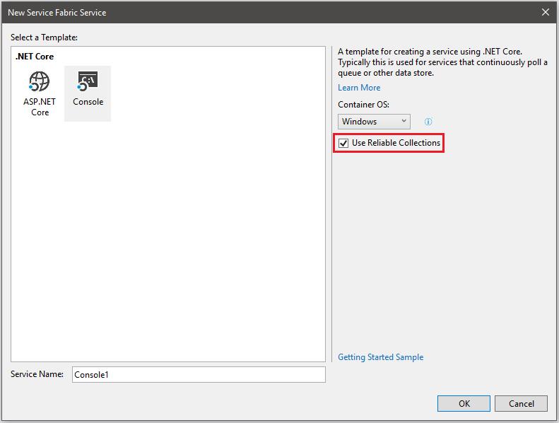

# Use Reliable Collections in your Service Fabric Mesh app

Service Fabric Mesh offers a stateful programming model to .NET and Java developers via Reliable Collections. Reliable Collections provide reliable dictionary and reliable queue classes. When you use these classes, your state is replicated (for availability), and transacted within a partition (for ACID semantics).

In this topic, we'll look at how to use the reliable dictionary in a .NET service.

## Prerequisites

* If you don't have an Azure subscription, you can [create a free account](https://azure.microsoft.com/free/?WT.mc_id=A261C142F) before you begin.

* Make sure that you've [set up your development environment](service-fabric-mesh-howto-setup-developer-environment-sdk.md) which includes installing the Service Fabric runtime, SDK, Docker, and Visual Studio 2017.

## Create a Service Fabric Mesh project with Reliable Collection support in Visual Studio

Run Visual Studio and select **File** > **New** > **Project...**

In the **New Project** dialog **Search** box at the top, type `mesh`. Select the **Service Fabric Mesh Application** template. (If you don't see the template, make sure that you installed the Mesh SDK and the VS tools preview as described in [set up your development environment](service-fabric-mesh-howto-setup-developer-environment-sdk.md).  

Give your project a name and location and click **OK** to create the Service Fabric Mesh project.



Next you'll see the **New Service Fabric Service** dialog.

Select the **Console** template.
Select the checkbox for **Use Reliable Collections**. This will add the support that we need to use reliable collections to your project. Then click **OK** to create the service.

## Create a Reliable Collection dictionary

We will write code that reads and writes data to a Reliable Collection dictionary. 

Open **Program.cs** and replace the contents of `class Program` with the following:

```csharp
class Program
{

    static void Main(string[] args)
    {
        MainAsync().GetAwaiter().GetResult();
    }

    static async Task MainAsync()
    {
        ReliableCollectionsExtensions.UseReliableCollectionsService("ConsoleAppType", ReliableCollectionMode.Standalone | ReliableCollectionMode.CreateAsNew);
        await AddToCollection("apple").ConfigureAwait(false);
        await AddToCollection("orange").ConfigureAwait(false);
        await AddToCollection("apple").ConfigureAwait(false);
    }

    private static async Task AddToCollection(string word)
    {
        IReliableStateManager stateManager = ReliableCollectionsExtensions.GetReliableStateManager(0);
        long value = 0;

        retry:

        try 
        {
            using (ITransaction txn = stateManager.CreateTransaction())
            {
                var dict = await stateManager.GetOrAddAsync<IReliableDictionary<string, long>>(txn, "ConsoleDict");
                var result = await dict.TryGetValueAsync(txn, word);
                if (result.HasValue)
                {
                    value = result.Value + 1;
                    await dict.TryUpdateAsync(txn, word, result.Value + 1, result.Value);
                }
                else
                {
                    value = 1;
                    await dict.AddAsync(txn, word, 1);
                }
                await txn.CommitAsync();
            }
        } catch (TimeoutException)
        {
            await Task.Delay(100);
            goto retry;
        }
    } // AddToCollection
}// class Program
```

You need to first register your app to use the reliable collection service. This is done above with a call to `ReliableCollectionsExtensions.UseReliableCollectionsService()`.
Then you need to get an [IReliableStateManager](https://docs.microsoft.com/dotnet/api/microsoft.servicefabric.data.ireliablestatemanager?view=azure-dotnet). In this case, because this service is written as a console app, we get one by calling `ReliableCollectionsExtensions.GetReliableStateManager(0)`.  The `0` is the partition key. This example doesn't use multiple partitions so it is hard coded.

If you are writing an ASP.NET Core service, you can get an instance of the IReliableStateManager by writing a constructor for your controller that takes an IReliableStateManager, and an instance will be provided via dependency injection.

```csharp
private readonly IReliableStateManager _stateManager;

public ValuesController(IReliableStateManager stateManager)
{
    _stateManager = stateManager;
}
```

Operations on reliable dictionary objects (except for [ClearAsync](https://docs.microsoft.com/dotnet/api/microsoft.servicefabric.data.collections.ireliablecollection-1.clearasync?view=azure-dotnet#Microsoft_ServiceFabric_Data_Collections_IReliableCollection_1_ClearAsync), which is not undoable), require an [ITransaction](https://docs.microsoft.com/dotnet/api/microsoft.servicefabric.data.itransaction?view=azure-dotnet) object. This object tracks all of the changes you’re attempting to make to any reliable dictionary and/or reliable queue objects within a single partition. You acquire an ITransaction object by calling the partition’s [IReliableStateManager.CreateTransaction](https://docs.microsoft.com/dotnet/api/microsoft.servicefabric.data.ireliablestatemanager.createtransaction?view=azure-dotnet) method.

Next you get the reliable collection dictionary, by name, via the [IReliableStateManager.GetOrAddAsync](https://docs.microsoft.com/dotnet/api/microsoft.servicefabric.data.ireliablestatemanager.getoraddasync?view=azure-dotnet) method. If the dictionary exists, it is returned. If not, it is created.

In the code above, the ITransaction object is passed to the reliable dictionary’s [TryGetValueAsync](https://docs.microsoft.com/en-us/dotnet/api/microsoft.servicefabric.data.collections.ireliabledictionary-2.trygetvalueasync?view=azure-dotnet#Microsoft_ServiceFabric_Data_Collections_IReliableDictionary_2_TryGetValueAsync_Microsoft_ServiceFabric_Data_ITransaction__0_) method. If a value is found for the specified key, the code increments its value. Think of it as a way of counting how many times the AddToCollection function is called for the same key.  If a value is not found, it is added to the dictionary.

Internally, dictionary methods that accept a key take a reader/writer lock associated with the key. If the method modifies the key’s value, the method takes a write lock on the key. If the method only reads from the key’s value, then a read lock is taken on the key. Since [TryUpdateAsync](https://docs.microsoft.com/dotnet/api/microsoft.servicefabric.data.collections.ireliabledictionary-2.tryupdateasync?view=azure-dotnet) and [AddAsync](https://docs.microsoft.com/dotnet/api/microsoft.servicefabric.data.collections.ireliabledictionary-2.addasync?view=azure-dotnet) modify the key’s value to the new, passed-in value, the key’s write lock is taken. If two (or more) threads attempt to add values with the same key at the same time, one thread will acquire the write lock and the other threads will block. By default, methods block for up to 4 seconds to acquire the lock. After 4 seconds, the methods throw a [TimeoutException](https://docs.microsoft.com/dotnet/api/system.timeoutexception?view=netframework-4.7.2). Method overloads exist that allow you to specify an explicit timeout value if you’d prefer.

Usually, you write your code to react to a **TimeoutException** by catching it and retrying the entire operation. In the simple code above, a timeout is followed by delaying 100 milliseconds before trying again. In reality, you might be better off using some kind of exponential back-off delay instead.

Once the lock is acquired, **AddAsync** adds the key and value object references to an internal temporary dictionary associated with the **ITransaction** object. This is done to provide you with read-your-own-writes semantics. That is, after you call **AddAsync**, a later call to **TryGetValueAsync** (using the same **ITransaction** object) will return the value even if you have not yet committed the transaction. Next, **AddAsync** serializes your key and value objects to byte arrays and appends these byte arrays to a log file on the local node. Finally, **AddAsync** sends the byte arrays to all the secondary replicas so they have the same key/value information. Even though the key/value information has been written to a log file, the information is not considered part of the dictionary until the transaction that they are associated with has been committed.

In the code above, the call to **CommitAsync** commits all of the transaction’s operations. Specifically, it appends commit information to the log file on the local node and also sends the commit record to all the secondary replicas. Once a quorum (majority) of the replicas have replied, all data changes are considered permanent and any locks associated with keys that were manipulated via the **ITransaction** object are released so other threads/transactions can manipulate the same keys and their values.

If **CommitAsync** is not called (usually due to an exception being thrown), then the **ITransaction** object gets disposed. When disposing an uncommitted **ITransaction** object, Service Fabric appends abort information to the local node’s log file and nothing needs to be sent to any of the secondary replicas. And then, any locks associated with keys that were manipulated via the transaction are released.

## Common pitfalls and how to avoid them

Now that you understand how the reliable collections work internally, let’s take a look at some common misuses of them. See the code below:

```csharp
using (ITransaction tx = StateManager.CreateTransaction()) {
   // AddAsync serializes the name/user, logs the bytes,
   // & sends the bytes to the secondary replicas.
   await m_dic.AddAsync(tx, name, user);

   // The line below updates the property’s value in memory only; the
   // new value is NOT serialized, logged, & sent to secondary replicas.
   user.LastLogin = DateTime.UtcNow;  // Corruption!

   await tx.CommitAsync();
}
```

When working with a regular .NET dictionary, you can add a key/value to the dictionary and then change the value of a property on the value you added (such as LastLogin). However, this code will not work correctly with a reliable dictionary.

Remember that the call to AddAsync serializes the key/value objects to byte arrays and then saves the arrays to a local file and also sends them to the secondary replicas. If you later change a property, this changes the property’s value in memory only; it does not impact the local file or the data sent to the replicas. If the process crashes, what’s in memory is thrown away. When a new process starts or if another replica becomes primary, then the old property value is what is available.

It is extreemly easy to make the kind of mistake shown above. And, you will only learn about the mistake if/when the process goes down. The correct way to write the code is simply to reverse the two lines:


```csharp
using (ITransaction tx = StateManager.CreateTransaction()) {
   user.LastLogin = DateTime.UtcNow;  // Do this BEFORE calling AddAsync
   await m_dic.AddAsync(tx, name, user);
   await tx.CommitAsync();
}
```

Here is another example showing a common mistake:

```csharp

using (ITransaction tx = StateManager.CreateTransaction()) {
   // Use the user’s name to look up their data
   ConditionalValue<User> user =
      await m_dic.TryGetValueAsync(tx, name);

   // The user exists in the dictionary, update one of their properties.
   if (user.HasValue) {
      // The line below updates the property’s value in memory only; the
      // new value is NOT serialized, logged, & sent to secondary replicas.
      user.Value.LastLogin = DateTime.UtcNow; // Corruption!
      await tx.CommitAsync();
   }
}
```

Again, with regular .NET dictionaries, the code above works fine and is a common pattern: the developer uses a key to look up a value. If the value exists, the developer changes a property’s value. However, with reliable collections, this code exhibits the same problem as already discussed: **you MUST not modify an object once you have given it to a reliable collection.** because the modified object will not be reflected in what gets written to the reliable collection.

The correct way to update a value in a reliable collection, is to get a reference to the existing value and consider the object referred to by this reference immutable. Then, create a new object which is an exact copy of the original object. Now, you can modify the state of this new object and write the new object into the collection so that it gets serialized to byte arrays, appended to the local file and sent to the replicas. After committing the change(s), the in-memory objects, the local file, and all the replicas have the same exact state. All is good!

The code below shows the correct way to update a value in a reliable collection:

```csharp

using (ITransaction tx = StateManager.CreateTransaction()) {
   // Use the user’s name to look up their data
   ConditionalValue<User> currentUser =
      await m_dic.TryGetValueAsync(tx, name);

   // The user exists in the dictionary, update one of their properties.
   if (currentUser.HasValue) {
      // Create new user object with the same state as the current user object.
      // NOTE: This must be a deep copy; not a shallow copy. Specifically, only
      // immutable state can be shared by currentUser & updatedUser object graphs.
      User updatedUser = new User(currentUser);

      // In the new object, modify any properties you desire
      updatedUser.LastLogin = DateTime.UtcNow;

      // Update the key’s value to the updateUser info
      await m_dic.SetValue(tx, name, updatedUser);

      await tx.CommitAsync();
   }
}
```

## Define immutable data types to prevent programmer error

To avoid potential programmer bugs, we highly recommend that you define the types you use with reliable collections as immutable types. Specifically, this means that you stick to core value types (such as numbers [Int32, UInt64, etc.], String, DateTime, Guid, TimeSpan, and the like). It is best to avoid collection properties as serializing and deserializing them can hurt performance. However, if you want to use collection properties, we highly recommend the use of .NET’s immutable collections library ([System.Collections.Immutable](https://www.nuget.org/packages/System.Collections.Immutable/)). This library can be downloaded from http://nuget.org. We also recommend sealing your classes and making fields read-only whenever possible.

The UserInfo type below demonstrates how to define an immutable type taking advantage of aforementioned recommendations.

```csharp

[DataContract]
// If you don’t seal the class, you must ensure that any derived classes are also immutable
public sealed class UserInfo {
   private static readonly IEnumerable<ItemId> NoBids = ImmutableList<ItemId>.Empty;

   public UserInfo(String email, IEnumerable<ItemId> itemsBidding = null) {
      Email = email;
      ItemsBidding = (itemsBidding == null) ? NoBids : itemsBidding.ToImmutableList();
   }

   [OnDeserialized]
   private void OnDeserialized(StreamingContext context) {
      // Convert the deserialized collection to an immutable collection
      ItemsBidding = ItemsBidding.ToImmutableList();
   }

   [DataMember]
   public readonly String Email;

   // Ideally, this would be a readonly field but it can't be because OnDeserialized
   // has to set it. So instead, the getter is public and the setter is private.
   [DataMember]
   public IEnumerable<ItemId> ItemsBidding { get; private set; }

   // Since each UserInfo object is immutable, we add a new ItemId to the ItemsBidding
   // collection by creating a new immutable UserInfo object with the added ItemId.
   public UserInfo AddItemBidding(ItemId itemId) {
      return new UserInfo(Email, ((ImmutableList<ItemId>)ItemsBidding).Add(itemId));
   }
}
```

The ItemId type is also an immutable type as shown here:

```csharp

[DataContract]
public struct ItemId {

   [DataMember] public readonly String Seller;
   [DataMember] public readonly String ItemName;
   public ItemId(String seller, String itemName) {
      Seller = seller;
      ItemName = itemName;
   }
}
```

## Schema versioning (upgrades)

Internally, Reliable Collections serialize your objects using .NET’s DataContractSerializer. The serialized objects are persisted to the primary replica’s local disk and are also transmitted to the secondary replicas. As your service matures, it’s likely you’ll want to change the kind of data (schema) your service requires. You must approach versioning of your data with great care. First and foremost, you must always be able to deserialize old data. Specifically, this means your deserialization code must be backward compatible: Version 333 of your service code must be able to operate on data placed in a reliable collection by version 1 of your service code 5 years ago.

Furthermore, service code is upgraded one upgrade domain at a time. So, during an upgrade, you may have two different versions of your service code running simultaneously. You must avoid having the new version of your service code use the new schema as old versions of your service code might not be able to handle the new schema. When possible, you should design each version of your service to be forward compatible by one version. Specifically, this means that V1 of your service code should be able to simply ignore any schema elements it does not explicitly handle. However, it must be able to save any data it doesn’t explicitly know about and simply write it back out when updating a dictionary key or value.

> [!WARNING]
> While you can modify the schema of a key, you must ensure that your key’s hash code and equals algorithms are stable. If you change how either of these algorithms operate, you will not be able to look up the key within the reliable dictionary.

Alternatively, you can perform what is typically referred to as a two-phase upgrade. With a two-phase upgrade, you upgrade your service from version 1 to version 2: Version2 contains the code that knows how to deal with the new schema change but this code doesn’t execute. When the version 2 code reads version 1 data, it operates on it and writes version 1 data. Then, after the upgrade is complete across all upgrade domains, you can signal to the running version 2 instances that the upgrade is complete. (One way to signal this is to roll out a configuration upgrade; this is what makes this a 2-phase upgrade.) Now, the version 2 instances can read version 1 data, convert it to version 2 data, operate on it, and write it out as version 2 data. When other instances read version 2 data, they do not need to convert it, they just operate on it, and write out version 2 data.

## Next Steps

To learn about creating forward compatible data contracts, see [Forward-Compatible Data Contracts](https://msdn.microsoft.com/library/ms731083.aspx).

To learn best practices on versioning data contracts, see [Data Contract Versioning](https://msdn.microsoft.com/library/ms731138.aspx).

To learn how to implement version tolerant data contracts, see [Version-Tolerant Serialization Callbacks](https://msdn.microsoft.com/library/ms733734.aspx).

To learn how to provide a data structure that can interoperate across multiple versions, see [IExtensibleDataObject](https://msdn.microsoft.com/library/system.runtime.serialization.iextensibledataobject.aspx).
