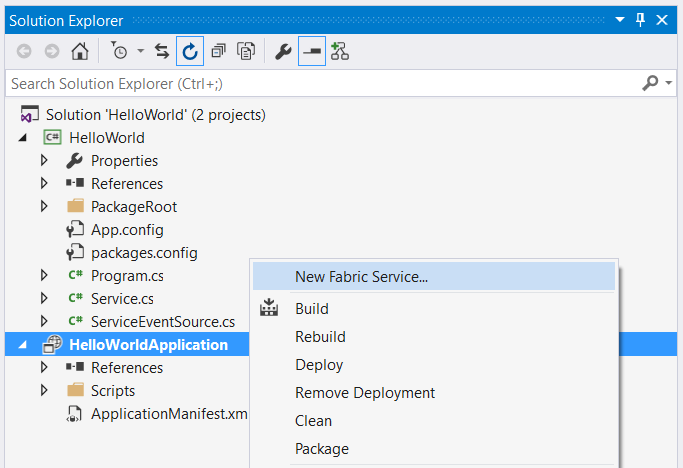
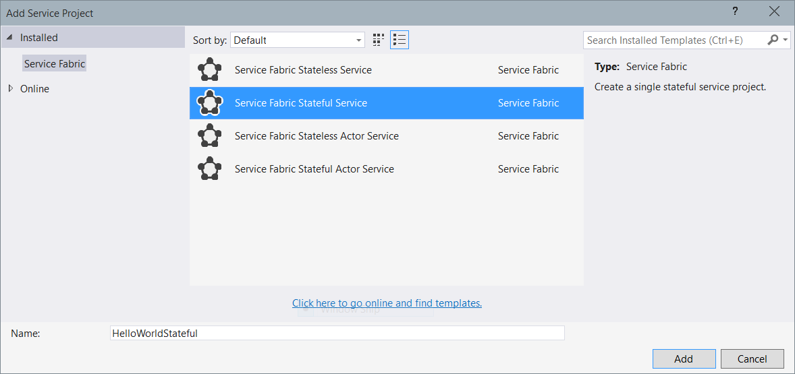

<properties
   pageTitle="Getting Started with Microsoft Azure Service Fabric Reliable Services"
   description="Service Fabric supports both stateless and stateful services. This article walks you through the steps of creating a Service Fabric Application with stateless and stateful services."
   services="service-fabric"
   documentationCenter=".net"
   authors="vturecek"
   manager="timlt"
   editor=""/>

<tags
   ms.service="service-fabric"
   ms.devlang="dotnet"
   ms.topic="article"
   ms.tgt_pltfrm="na"
   ms.workload="na"
   ms.date="04/17/2015"
   ms.author="vturecek@microsoft.com"/>

# Getting Started with Microsoft Azure Service Fabric Reliable Services

A Service Fabric Application contains one or more services that run your code. This tutorial walks you through the steps of creating both stateless and stateful "Hello World" Service Fabric Applications using the [*Reliable Services* programming model](service-fabric-reliable-services-introduction.md).

A stateless service is the type of service that mostly exists in cloud applications today. The service is considered stateless because the service itself does not contain data that needs to be stored reliably or made highly available - in other words, if an instance of a stateless service shuts down, all of its internal state is lost. In these types of services, state must be persisted to an external store, such as Azure Tables or a SQL database, to be made highly-available and reliable.

Service Fabric introduces a new kind of service that is stateful: A service that can maintain state reliably within the service itself, co-located with the code that's using it. Your state is  made highly available by Service Fabric without the need to persist state to an external store.

In this tutorial, you'll implement both a stateless service and a stateful service that keeps an internal counter. In the stateless service, the value of the counter is lost when the service restarts or moves. However, in the stateful service, the counter state is made reliable by Service Fabric so that if the service execution is interrupted for any reason in the middle of counting, it can pick up right where it left off.

## Create a Stateless Service

Let's start with a stateless service.

Launch Visual Studio 2015 RC as **Administrator**, and create a new **Service Fabric Stateless Service** Project named *HelloWorld*:


You will see 2 projects in the created solution:

 + **HelloWorldApplication**: This is the *application* project that contains your *services*. It also contains the application manifest that describes the application and a number of PowerShell scripts that help you to deploy your application.
 + **HelloWorld** This is the service project, which contains the stateless service implementation.


## Implement the service

Open the **Service.cs** file in the service project. In Service Fabric, a service can run any business logic whatsoever. The service API provides two entry points for your code:

 - An open-ended entry point method called *RunAsync* where you can begin executing any workload you want, such as long-running compute workloads.

```C#

protected override async Task RunAsync(CancellationToken cancellationToken)
{
    ...
}

```

 - A communication entry point where you can plug in your communication stack of choice, such as Web API, where you can start receiving requests from users or other services.

```C#

protected override ICommunicationListener CreateCommunicationListener()
{
    ...
}

```

In this tutorial, we will focus on the `RunAsync()` entry point method where you can immediately start running your code.
The project template includes an example implementation of `RunAsync()` that increments a rolling count.

 > [AZURE.NOTE] For details on working with a communication stack, check out [Getting Started with Microsoft Azure Service Fabric Web API Services with OWIN self-host](service-fabric-reliable-services-communication-webapi.md)


### RunAsync

```C#

protected override async Task RunAsync(CancellationToken cancellationToken)
{
    // TODO: Replace the following with your own logic.

    int iterations = 0;
    while (!cancellationToken.IsCancellationRequested)
    {
        ServiceEventSource.Current.ServiceMessage(this, "Working-{0}", iterations++);
        await Task.Delay(TimeSpan.FromSeconds(1), cancellationToken);
    }
}

```

The platform calls this method when an instance of your service is placed and ready to execute. For stateless services, that simply means when the service instance is opened. A cancellation token is provided to coordinate when your service instance needs to be closed. In Service Fabric, this open-close cycle of a service instance can occur many times over the lifetime of your service as a whole, because the system may move your service instances around for resource balancing, when faults occur, during application or system upgrades, or when the underlying hardware experiences an outage. This orchestration is managed by the system in the interest of keeping your service highly available and properly balanced.

`RunAsync()` is executed in its own Task. Note in the code snippet here we jump right into a while loop - there is no need to schedule a separate task for your workload. Cancellation of your workload is a cooperative effort orchestrated by the provided cancellation token. The system will wait for your task to end (either by successful completion, cancellation, or faulted) before it moves on, so it is *important* to honor the cancellation token, finish up any work, and exit `RunAsync()` as quickly as possible when cancellation is requested by the system.

In the this stateless service example, the count is stored in a local variable. But because this is a stateless service, the value that's being stored only exists for the current lifecycle of the service instance that it's in. When the service moves or restarts, the value is lost.

## Create a Stateful Service

To make our counter value highly-available and persistent even when the service moves or restarts, we need a stateful service.

In the same **HelloWorld** application, add a new service by right-clicking on the application project and selecting "New Fabric Service"



Select **Service Fabric Stateful Service** and name it "HelloWorldStateful". Click **Add**.



Your application should now have two services: the stateless service *HelloWorld* and the stateful service *HelloWorldStateful*. Open **Service.cs** in *HelloWorldStateful*:

```C#

protected override async Task RunAsync(CancellationToken cancellationToken)
{
    // TODO: Replace the following with your own logic.
    IReliableDictionary<string, long>  myDictionary = await this.StateManager.GetOrAddAsync<IReliableDictionary<string, long>>("myDictionary");

    while (!cancellationToken.IsCancellationRequested)
    {
        using (ITransaction tx = this.StateManager.CreateTransaction())
        {
            var result = await myDictionary.TryGetValueAsync(tx, "Counter-1");
            ServiceEventSource.Current.ServiceMessage(
                this,
                "Current Counter Value: {0}",
                result.HasValue ? result.Value.ToString() : "Value does not exist.");

            await myDictionary.AddOrUpdateAsync(tx, "Counter-1", 0, (k, v) => ++v);

            await tx.CommitAsync();
        }

        await Task.Delay(TimeSpan.FromSeconds(1), cancellationToken);
    }
}

```

### RunAsync

A stateful service has the same entry points as a stateless service. The main difference is the availability of *Reliable Collections* and the *State Manager*. `RunAsync()` in a stateful service operates similar to a stateless service, except that in a stateful service the platform performs additional work on your behalf before executing `RunAsync()`, such as ensuring the *State Manager* and *Reliable Collections* are ready for use.

### Reliable Collections and State Manager

```C#

IReliableDictionary<string, long> myDictionary = await this.StateManager.GetOrAddAsync<IReliableDictionary<string, long>>("myDictionary");

```

**IReliableDictionary** represents a dictionary that lets you store state locally in the service reliably, part of Service Fabric's built-in [Reliable Collections](service-fabric-reliable-services-reliable-collections.md). Service Fabric makes your service and the state you store in Reliable Collections highly available.  With Service Fabric and Reliable Collections, you can now store data directly in your service reliably without the need for an external persistent store. Service Fabric accomplishes this by creating and managing multiple *replicas* of your service for you while providing an API that abstracts away the complexities of managing those replicas and their state transitions.

Reliable Collections can store any .NET type - including your custom types - with a couple of caveats:

 1. Service Fabric makes your state highly-available by *replicating* state across nodes and storing it to local disk. This means everything that is stored in a Reliable Collection must be *serializable*. By default, Reliable Collections use [DataContract](https://msdn.microsoft.com/library/system.runtime.serialization.datacontractattribute%28v=vs.110%29.aspx) for serialization, so it's important to make sure your types are [supported by the Data Contract Serializer](https://msdn.microsoft.com/library/ms731923%28v=vs.110%29.aspx) when using the default serializer.

 2. Objects are replicated for high-availability when you commit a transaction on a Reliable Collection. Objects stored in Reliable Collections are kept in local memory in your service, which means you have a local reference to the object. It is important that you do not mutate local instances of those objects without performing an update operation on the Reliable Collection in a transaction, as those changes will not be replicated automatically.

The *StateManager* takes care of managing Reliable Collections for you. Simply ask the StateManager for a reliable collection by name at any time, any place in your service and it ensures you get a reference back. Saving references to Reliable Collection instances in class member variables or properties is not recommended, as special care must be taken to ensure the reference is set to an instance at all times in the service lifecycle. The StateManager handles this work for you, optimized for repeat visits.

### Transactional and asynchronous

```C#

using (ITransaction tx = this.StateManager.CreateTransaction())
{
    var result = await myDictionary.TryGetValueAsync(tx, "Counter-1");

    await myDictionary.AddOrUpdateAsync(tx, "Counter-1", 0, (k, v) => ++v);

    await tx.CommitAsync();
}

```

Reliable Collections have many of the same operations as their System.Collections.Generic and System.Collections.Concurrent counterparts - including LINQ. However, operations on Reliable Collections are asynchronous, because write operations on Reliable Collections are *replicated*, that is, the operation is sent to other replicas of the service on different nodes for high-availability.

They also support *transactional* operations so you can keep state consistent between multiple Reliable Collections. For example, you may dequeue a work item from a Reliable Queue, perform an operation on it, and save the result in a Reliable Dictionary, all within a single transaction. This is treated as an atomic operation, guaranteeing that either the entire operation will succeed, or none of it will - so if an error occurs after you've dequeued the item but before you could save the result, the entire transaction is rolled back and the item remains on the queue for processing.

## Run the application

You can now build and deploy your services. Press **F5**, and your application will be built and deployed to your local cluster. Once the services are running, you can see the generated ETW events in a **Diagnostic Events** window. Note that there are events displayed from both the stateless service and the stateful service in the application. You can pause the stream by clicking the *Pause* button, and then examine message details by expanding a message.

  > [AZURE.NOTE] Before running the application, make sure you have a local development cluster running. Check out the [Getting Started Guide](service-fabric-get-started.md) to get your local environment set up.


## Next Steps

[Debugging your Service Fabric Application in Visual Studio](service-fabric-debugging-your-application.md)

[Getting Started with Microsoft Azure Service Fabric Web API Services with OWIN self-host](service-fabric-reliable-services-communication-webapi.md)

[Learn more about Reliable Collections](service-fabric-reliable-services-reliable-collections.md)

[Manage a Service Fabric service](service-fabric-manage-your-service-index.md)
