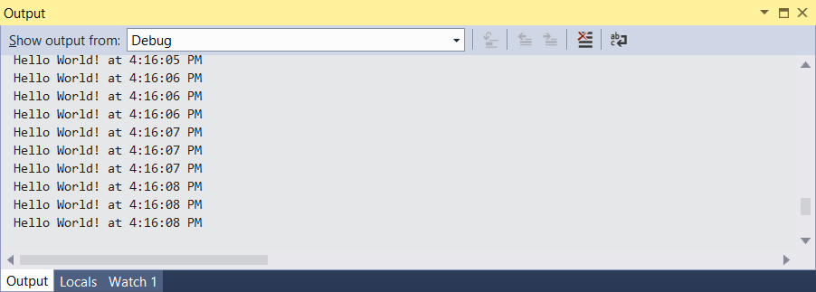
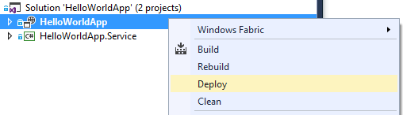

<properties 
   pageTitle="getting-started-with-microsoft-azure-service-fabric-stateless-services" 
   description="The tutorial walks you through the steps of creating, debugging and deploying a 'Hello World' stateless Service Fabric service." 
   services="service-fabric" 
   documentationCenter=".net" 
   authors="haishibai" 
   manager="larar" 
   editor=""/>

<tags
   ms.service="service-fabric"
   ms.devlang="dotnet"
   ms.topic="article"
   ms.tgt_pltfrm="NA"
   ms.workload="multiple" 
   ms.date="03/17/2015"
   ms.author="hbai"/>

# Getting Started with Microsoft Azure Service Fabric Stateless Services

The tutorial walks you through the steps of creating a "Hello World" stateless Service Fabric service. You’ll learn how to write a simple service, test it locally, and then push it to Microsoft Azure.

Tutorial segments

- [Implement the service](#implement)
- [Test the service locally](#testlocally) 
- [Deploy the service to Azure](#deploy)

##Implement the service

In this tutorial, you’ll implement a simple “Hello World” service that prints out current date and time periodically. The service is an example of a background worker that runs constantly. This pattern is very similar to how a Cloud Service Worker Role is implemented.

1. Launch Visual Studio 2015 CTP 6 as **Administrator**, and create a new **Windows Fabric Stateless Service** Project named **HelloWorldApp**.

	
	
	You will see 2 projects in the created solution. The first project is the application project (_HelloWorldApp_), which contains the application manifest and a number of PowerShell scripts that help you to deploy your application. The second is the service project (_StatelessService1_), which contains the actual service implementation.

	>**NOTE**: The solution should build out-of-box. If the solution fails to build, please check if you've extracted *FabActSdk.zip* to your *%SystemDrive%* root folder.

5. Open **Service.cs** in the **StatelessService1** project, import the following namespaces:

		using System.Diagnostics;

6. Replace the code in **RunAsync()** method:

       	protected override async Task RunAsync(CancellationToken cancellationToken)
		{
			Trace.WriteLine("Starting Hello World service.");

			while (!cancellationToken.IsCancellationRequested)
			{
				cancellationToken.ThrowIfCancellationRequested();
				Trace.WriteLine("Hello World! at " + DateTime.Now.ToLongTimeString());
				await Task.Delay(TimeSpan.FromSeconds(1), cancellationToken);
			}
		}

##Test locally

1.  If you haven't done so, you need to launch a local cluster first. Launch **Windows PowerShell** as **administrator** and execute the **DevClusterSetup.ps1** script under the **_FabActSdk_\ClusterSetup\Local** folder (see step 4 of installation).

	>**NOTE**: Your local cluster might be already running, in which case the script will fail with many errors. If you want to clean up the local cluster, run the **CleanCluster.ps1** script under the same folder.

2. You can now build and deploy your service. Press **F5**, and your service will be started. Once the service is running, you can see its output on the **Output** window of Visual Studio.

	

	>**NOTE**: You see repeated outputs in each second because by default when a service is deployed it has three instances running for load-balancing and high-availability. The number of instances is controlled by the **Instance** attribute in **ApplicationManifest.xml**, which you can find under the _HelloWorldApp_ project.

3. Stop the program.

	>**NOTE**: To debug locally, set break points at the lines of interest. 

##Deploy the service to Azure
You can deploy your Service Fabric services to a Service Fabric cluster on Azure or on-premises servers. 

1. In Visual studio, open the **Parameters.json** file under HelloWorldApp's **Scripts** folder.
2. Add a parameter **clusterConnectionString** to your Service Fabric cluster address. For example, if your Service Fabric cluster is located at _mycluster.cloudapp.net_, then the modified JSON file should look like the following:

		{
	    	"clusterConnectionString": "mycluster.cloudapp.net:19000"
		}

	 There seems to be a bug with the Deploy menu at the moment: It registers the application package with _Register-WindowsFabricApplicationType_ call, but it doesn't invoke _New-WindowsFabricApplication_. You will execute some steps before and after deploying to workaround this issue.

3.  In **Visual Studio**, open the file **Publish-FabricApplication.ps1** located in the **Scripts** folder of the application project **HelloWorldApp**. Locate the line that calls *Connect-WindowsFabricCluster* and add as a parameter the address of your Service Fabric cluster. For example, if your Service Fabric Cluster is located at *mycluster.cloudapp.net*, the modified line should look like this:

		[void](Connect-WindowsFabricCluster mycluster.cloudapp.net:19000)

4.  Similarly, edit the file **New-FabricApplication.ps1** located in the **Scripts** folder of the application project **HelloWorldApp** and add the address of your Service Fabric cluster to the line that calls *Connect-WindowsFabricCluster*. 

		[void](Connect-WindowsFabricCluster mycluster.cloudapp.net:19000)

5. Right click on the **HelloWorldApp** project and select **Deploy**.

	

6.  Open **Windows Powershell** running as **Administrator** and change to the **Scripts** folder of your **HelloWorldApp** project.
	
	> NOTE: If you haven't configured Windows PowerShell with your Azure subscription, you can run
	
	>`Add-AzureAccount`
	
	> to sign on to your Azure subscription. Then, select the correct subscription to use by running
	
	>`Select-AzureSubscription -SubscriptionName <your subscription name>`

7.   In Powershell, execute the following command:

		.\New-FabricApplication.ps1 -ParameterFile Parameters.json -ApplicationPackagePath ..\

	The output should look like this:

	

8. To verify that everything went well, in **Powershell** run the following commands:

		Connect-WindowsFabricCluster mycluster.cloudapp.net:19000
		Get-WindowsFabricApplication -ApplicationName "fabric:/HelloWorldApp"
	
	The output should look like this:

	

9.  Then execute:

		Get-WindowsFabricApplicationHealth -ApplicationName "fabric:/HelloWorldApp"

	The output should look like this:

	

##Conclusion
In this tutorial, you created a "Hello World" stateless service, tested it locally, and then deployed it to Microsoft Azure.