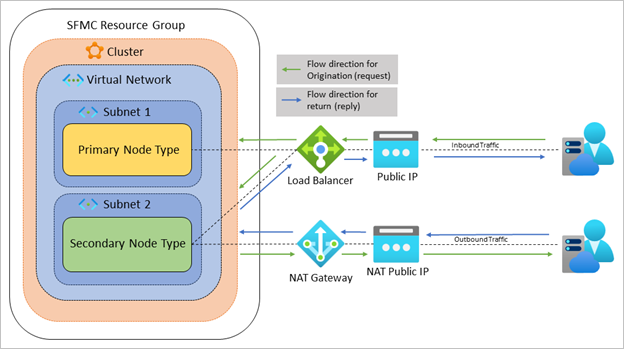
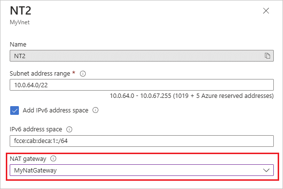

# Use a NAT gateway on a Service Fabric managed cluster

Service Fabric managed clusters have external facing IPs that allows external clients to access the resources of the cluster. However, in some scenarios, it may be preferable to provide internet access to these resources without exposing them directly to the internet. NAT gateways enable this function.

If your cluster has resources that need to receive inbound traffic from the internet but also has private resources that need to be protected, a NAT gateway can help. Additionally, if you have applications that need to make connections outside of the cluster to access secrets, storage, and other private resources, a NAT gateway can help.

Here are some of the benefits of using a NAT gateway for your managed cluster:
* Improved security: Azure NAT Gateway is built on the zero trust network security model and is secure by default. With NAT gateway, private instances within a subnet don't need public IP addresses to reach the internet. Private resources can reach external sources outside the virtual network by Source Network Address Translating (SNAT) to the NAT gateway's static public IP addresses or prefixes. You can provide a contiguous set of IPs for outbound connectivity by using a public IP prefix, and you can configure destination firewall rules based on this predictable IP list.
* Resiliency: Azure NAT Gateway is fully managed and distributed service. It doesn't depend on individual compute instances such as VMs or a single physical gateway device. A NAT gateway always has multiple fault domains and can sustain multiple failures without service outage. Software defined networking makes a NAT gateway highly resilient.
* Simplified network architecture: NAT gateways allow you to simplify your network architecture by eliminating the need for a bastion host or VPN connection to access instances in private subnets. 
* Performance: Azure NAT Gateway is [performant and stable](../nat-gateway/nat-gateway-resource.md#performance).

The following diagram depicts a cluster with a primary and secondary node type where each node type has their own subnet. The secondary node type is placed behind a NAT gateway, and all its outgoing traffic is routed through the gateway. When traffic originates from the secondary node type, the public IP address is that of the NAT gateway. Because all outgoing requests are routed through the NAT gateway, you can implement additional NSG rules, which improve security and prevents external services from discovering internal services.



The following scenarios are supported use cases for NAT gateways on Service Fabric managed clusters:
* Customers can attach a NAT gateway to any node type and subnet configuration under the [Bring your own virtual network section of the Configure managed cluster network settings article](how-to-managed-cluster-networking.md#bring-your-own-virtual-network).
* Customers can attach a NAT gateway to secondary node types using a dedicated subnet as outlined in the [Bring your own Azure Load Balancer section of the Configure managed cluster network settings article](how-to-managed-cluster-networking.md#bring-your-own-azure-load-balancer). When you add your own load balancer and NAT gateway, you get increased control over your network traffic.

## Prerequisites

For your scenario, make sure you follow the steps to configure your managed cluster's network properly.

* [Bring your own virtual network](how-to-managed-cluster-networking.md#bring-your-own-virtual-network)
* [Bring your own Azure Load Balancer](how-to-managed-cluster-networking.md#bring-your-own-azure-load-balancer)


## Bring your own virtual network with NAT gateway

The following steps describe how to attach a NAT gateway to your virtual network subnets.

1. Follow the steps in the [Azure NAT Gateway quickstart](../nat-gateway/quickstart-create-nat-gateway-portal.md) to create a NAT gateway.

1. Provide the Service Fabric resource provider permission to modify the NAT gateway's settings using role assignment. Follow the first two steps in [Bring your own virtual network section of the Configure managed cluster network settings article](how-to-managed-cluster-networking.md#bring-your-own-virtual-network), injecting your NAT gateway's information into subnet parameters.

1. Now, you're ready to attach the NAT gateway to your virtual network's subnet. You can use an ARM template, the Azure CLI, Azure PowerShell, or the Azure portal.

### ARM template 
 
Modify and deploy the following ARM template to introduce the NAT gateway into your subnet's properties:

```json
{ 
    "apiVersion": "[variables('networkApiVersion')]", 
    "type": "Microsoft.Network/virtualNetworks", 
    "name": "[parameters('vnetName')]", 
    "location": "[resourcegroup().location]", 
    "dependsOn": [ 
      "[parameters('natGatewayId'))]" 
    ], 
    "properties": { 
        "subnets": [ 
          { 
            "name": "[parameters('subnetName')]", 
            "properties": { 
              "addressPrefix": "[parameters('subnetAddressPrefix')]", 
              "natGateway": { 
                "id": "[parameters('natGatewayId'))]" 
              } 
            } 
          } 
        ] 
    } 
} 
```

### Azure CLI

Modify and run the following Azure CLI command with your information:

```azurecli
az network vnet subnet update --resource-group myResourceGroup --vnet-name mvVNet --name mySubnet --nat-gateway myNATGateway
```

### Azure PowerShell

1. Place the virtual network into a variable

    ```powershell
    $net = @{
      Name = `myVNet`
      ResourceGroupName = 'myResourceGroup'
    }
    $vnet = Get-AzVirtualNetwork @net
    ```

1. Place the NAT gateway into a variable

    ```powershell
    $nat = @{
      Name = 'myNATgateway'  
      ResourceGroupName = 'myResourceGroup'
    } 
    $natGateway = Get-AzNatGateway @nat 
    ```

1. Set the subnet configuration

    ```powershell
    $subnet = @{  
      Name = 'mySubnet' 
      VirtualNetwork = $vnet 
      NatGateway = $natGateway 
      AddressPrefix = '10.0.2.0/24'  
    } 
    Set-AzVirtualNetworkSubnetConfig @subnet
    ```

1. Save the configuration to the virtual network

    ```powershell
    $vnet | Set-AzVirtualNetwork
    ```

### Azure portal

1. On the [Azure portal](https://portal.azure.com), navigate to your virtual network resource.

1. Under **Settings**, select **Subnets**.

1. Select the subnet you want to associate with your NAT gateway.

1. Open the **NAT gateway** dropdown and select your NAT gateway.

    

1. Click **Save**.

## Bring your own load balancer with Azure NAT Gateway

The following steps describe how to attach a NAT gateway to your virtual network subnets.

> [!NOTE]
> This scenario is only supported via ARM template.

1. Follow the steps in the [Azure NAT Gateway quickstart](../nat-gateway/quickstart-create-nat-gateway-portal.md) to create a NAT gateway.

1. Provide the Service Fabric resource provider permission to modify the NAT gateway's settings using role assignment. Follow the first two steps in [Bring your own virtual network section of the Configure managed cluster network settings article](how-to-managed-cluster-networking.md#bring-your-own-virtual-network), injecting your NAT gateway's information into subnet parameters.

1. Add the following property to your deployment to attach the NAT gateway to your dedicated subnet:

```json
{ 
    "apiVersion": "2023-03-01-preview", 
    "type": "Microsoft.ServiceFabric/managedclusters/nodetypes", 
    "name": "[concat(parameters('clusterName'), '/', parameters('nodeTypeName'))]", 
    "location": "[parameters('clusterLocation')]", 
    "properties": { 
   ... 
        "isPrimary": false, 
        "natGatewayId": "[variables('natID')]", 
        "frontendConfigurations": [...], 
   ... 
} 
```

## Next steps

* Review the [Service Fabric managed cluster networking scenarios](how-to-managed-cluster-networking.md) outlined in this article.
* Review [Service Fabric managed cluster configuration options](how-to-managed-cluster-configuration.md).

