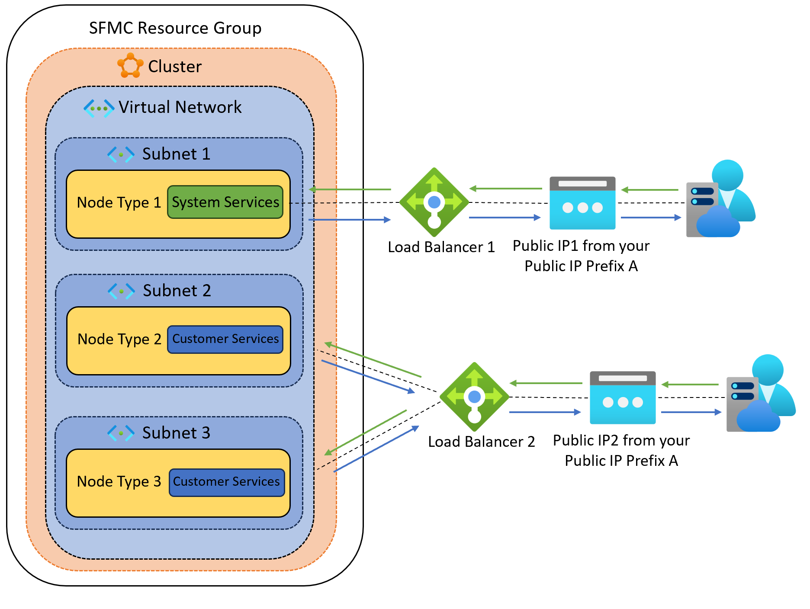

# Use a Public IP address prefix in a Service Fabric managed cluster

A public IP address prefix allows you to reserve a range of [public IP addresses](../virtual-network/ip-services/public-ip-addresses.md) for your public endpoints in Azure. Service Fabric managed cluster supports using IP addresses from [Azure Public IP prefix](../virtual-network/ip-services/public-ip-address-prefix.md). Public IP prefixes are assigned from a pool of addresses in each Azure region. You can create a public IP address prefix in an Azure region and subscription by specifying a name and [prefix size](../virtual-network/ip-services/public-ip-address-prefix.md#prefix-sizes), which is the number of addresses available for use. For example, if you would like to configure virtual machine scale sets, application gateways, or load balancers to be public facing, you need public IP addresses for them. A public IP prefix enables you to use one prefix to manage all IP addresses effectively.
In regions with Availability Zones, Public IP address prefixes can be created as zone-redundant or associated with a specific availability zone. If public IP prefix is created as zone-redundant, the IPs in the prefix are chosen from the pool that is replicated across SLB servers in all zones.

Here are some of the benefits of using a Public IP Prefix for your managed cluster:

- Improved fleet management: If you manage a fleet of Service Fabric managed clusters, associating each cluster with a public IP from the same prefix can simplify the management of the entire fleet and reduce management overhead. For example, you can add an entire prefix with a single firewall rule that adds all IP addresses of the prefix associated with the SF managed clusters to an allowlist in the firewall.

- Enhanced control and security: By associating a public IP from a prefix to Service Fabric managed cluster, you can simplify the control and security of your cluster's public IP address space. Because the cluster is always assigned a public IP from the reserved range of IPs within the IP prefix, you can easily assign network access control lists (ACLs) and other network rules specific to that range. The IP prefix simplifies your control allowing you to easily manage which resources can access the cluster and vice versa.

- Effective resource management: A Public IP prefix enables you to use one prefix to manage all your public endpoints with predictable, contiguous IP range that doesn’t change as you scale. You can see which IP addresses are allocated and available within the prefix range. 

As seen in the diagram, a service fabric managed cluster with three node types having their own subnets has all their inbound and outbound traffic routed through the two load balancers. If external services would like to communicate with SFMC cluster, they would use the public IP addresses (allocated from public IP prefix, let’s say A) associated with the front end of the load balancers.



>[!NOTE] 
> The public IP address prefix in Service Fabric managed cluster only supports IPv4 addresses as of now. The support for IPv6 addresses will be enabled in near future.


## Use a public IP prefix in a Service Fabric managed cluster

### Requirements
- Use Service Fabric API version `2023-03-01-Preview` or later.

### Steps
The following section describes the steps that should be taken to implement public IP prefix in a Service Fabric managed cluster:

1.	Follow the steps in the [Create a public IP address prefix](../virtual-network/ip-services/create-public-ip-prefix-portal.md).
2.  Use a [sample ARM deployment template](https://github.com/Azure-Samples/service-fabric-cluster-templates/tree/master/SF-Managed-Standard-SKU-1-NT-PIPrefix) for public IP prefix configuration as part of the service fabric managed cluster creation.
3.	You can also modify your existing ARM template and add new property `PublicIPPrefixId` under `Microsoft.ServiceFabric/managedClusters` resource that takes the resource ID of the public IP prefix.
#### ARM Template:

```json
{ 
    "type": "Microsoft.ServiceFabric/managedclusters/", 
    "properties": { 
                  "publicIPPrefixId": "string" 
                  } 
} 
```

#### Azure CLI:

1. Create a resource group and a public IP address prefix as outlined in the [Create public IP prefix - Azure CLI](../virtual-network/ip-services/create-public-ip-prefix-cli.md)
2. Modify your existing ARM template and add new property `PublicIPPrefixId` under `Microsoft.ServiceFabric/managedClusters` resource that takes the resource ID of the public IP prefix and deploy the template.

  ```azurecli-interactive
    az deployment group create \
  	--name ExampleDeployment \
  	--resource-group ExampleGroup \
  	--template-file <path-to-template> 
```


#### Azure PowerShell:

1. Create a resource group and a public IP address prefix as outlined in the [Create public IP prefix - PowerShell](../virtual-network/ip-services/create-public-ip-prefix-powershell.md)
2. Modify your existing ARM template and add new property `PublicIPPrefixId` under `Microsoft.ServiceFabric/managedClusters` resource that takes the resource ID of the public IP prefix and deploy the template.

```azurepowershell-interactive
New-AzResourceGroupDeployment -ResourceGroupName "ExampleGroup" -TemplateFile <path-to-template> -TemplateParameterFile <path-to-template-parameter-file>
```
  

## Next steps

> [!div class="nextstepaction"]
> [Review the Service Fabric managed cluster networking scenarios](how-to-managed-cluster-networking.md).
> 
> [!div class="nextstepaction"]
> [Review Service Fabric managed cluster configuration options](how-to-managed-cluster-configuration.md).
