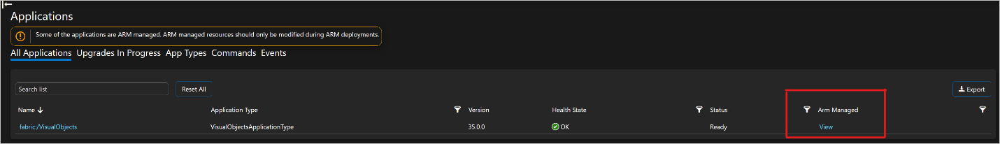
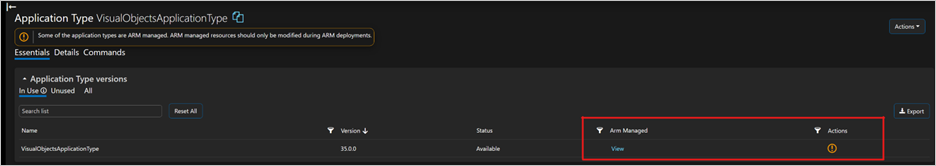
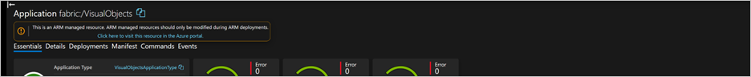
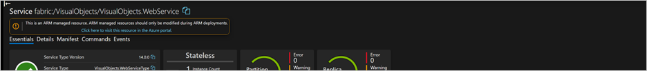

# Service Fabric Explorer blocking operations

When you create a Service Fabric managed cluster along with applications and services through ARM, portal, or Az cmdlets, the cluster is managed by ARM. Accordingly, these resources should have all their management operations performed at ARM level. Running commands directly against the cluster bypasses ARM, whether this is through a Service Fabric Explorer command or an SF cmdlet. Bypassing ARM can cause synchronization issues, as ARM isn't alerted to any changes that result from the operations. When the cluster is out of sync with its definition in ARM, there's a risk of degraded ability to manage the cluster safely and reliably.

To help prevent synchronization issues, ARM-managed application management is blocked by Service Fabric Explorer.

## Service Fabric Explorer interface

Applications that are managed by ARM are now labelled in the list, as shown in the following screen capture.

   

Application type versions that are managed by ARM are now labelled in the list, as shown in the following screen capture.

   

Applications that are managed in ARM are now labelled in the list, and a banner is now shown if the application is managed in ARM. The following screen capture shows an ARM-managed applicaiton in Service Fabric explorer.

   

Services that are managed in ARM are now labelled in the list, and banner is now shown if the service is managed in ARM. The following screen capture shows an ARM-managed service in Service Fabric explorer.

   

## Best practices

### Application type versions

* To unprovision application type versions, use the Az Powershell cmdlet [Remove-AzReource](/powershell/module/az.resources/remove-azresource).
* Use ARM templates or the [AzSF Powershell cmdlet](/powershell/module/az.servicefabric/new-azservicefabricmanagedclusterapplication) to create applications.

### Applications

* Applications must be deleted through ARM or via the command line with [az resource](/cli/azure/resource?view=azure-cli-latest#az-resource-delete).
* Use ARM templates or the [AzSF Powershell cmdlet](/powershell/module/az.servicefabric/new-azservicefabricmanagedclusterapplication) to create applications.

### Services

* Scale actions must be done via ARM.
* Deletions must be done via the [Remove-AzResource cmdlet](/powershell/module/az.resources/remove-azresource).
* Use the [AzSF Powershell cmdlet](/powershell/module/az.servicefabric/new-azservicefabricservice) to create services.

## Next steps

* Learn about [Service Fabric Explorer to visualize your cluster](service-fabric-visualizing-your-cluster.md).
