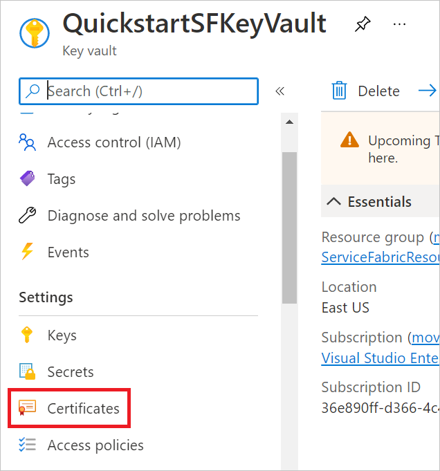
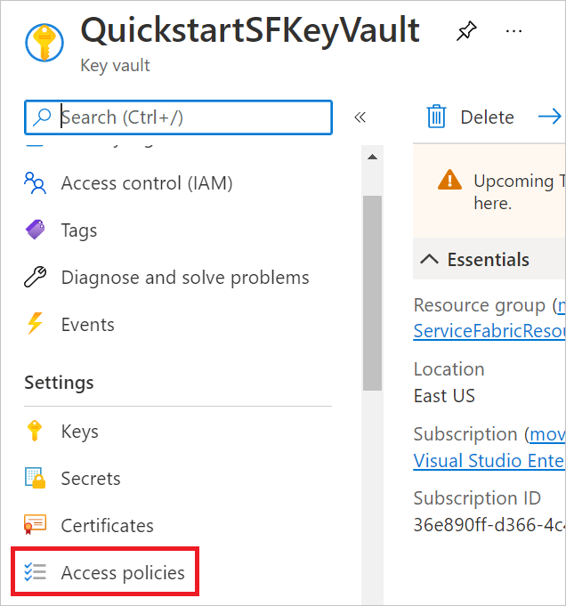
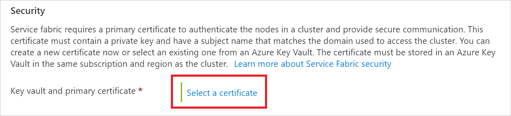
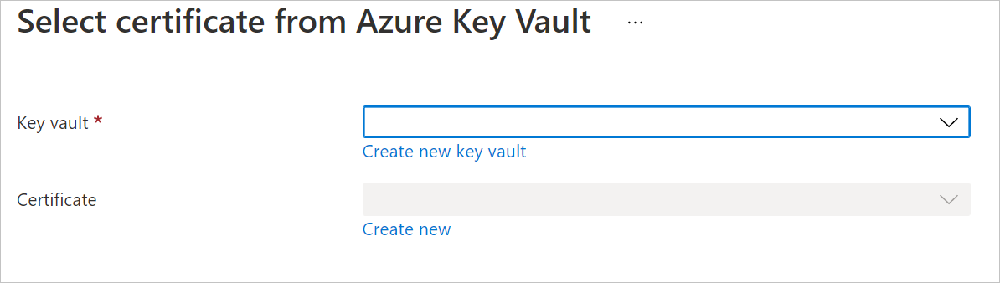

# Quickstart: Deploy a Service Fabric cluster using the Azure portal

Test out Service Fabric clusters in this quickstart by creating a **three-node cluster**.

Azure Service Fabric is a distributed systems platform that makes it easy to package, deploy, and manage scalable and reliable microservices and containers. A Service Fabric cluster is a network-connected set of virtual machines into which your microservices are deployed and managed.

In this quickstart, you learn how to:

* Use Azure Key Vault to create a client certificate for your cluster
* Deploy a Service Fabric cluster
* View your cluster in Service Fabric Explorer

This article describes how to deploy a Service Fabric cluster for testing in Azure using the **Azure portal**. There is also a quickstart for [Azure Resource Manager templates](quickstart-cluster-template.md).

The three-node cluster created in this tutorial is only intended for instructional purposes. The cluster will use a self-signed certificate for authentication and will operate in the bronze reliability tier, so it's not suitable for production workloads. For more information about reliability tiers, see [Reliability characteristics of the cluster](service-fabric-cluster-capacity.md#reliability-characteristics-of-the-cluster).

## Prerequisites

* An Azure subscription. If you don't already have one, create a [free account](https://azure.microsoft.com/free/?WT.mc_id=A261C142F) before you begin.

* A resource group to manage all the resources you use in this quickstart. We use the example resource group name **ServiceFabricResources** throughout this quickstart.

   1. Sign in to the [Azure portal](https://portal.azure.com).

   1. Select **Resource groups** under **Azure services**.

   1. Choose **+ Create**, select your Azure subscription, enter a name for your resource group, and pick your preferred region from the dropdown menu.

   1. Select **Review + create** and, once the validation passes, choose **Create**.

## Create a client certificate

Service Fabric clusters use a client certificate as a key for access control.

In this quickstart, we use a client certificate called **ExampleCertificate** from an Azure Key Vault named **QuickstartSFKeyVault**.

To create your own Azure Key Vault:

1. In the [Azure portal](https://portal.azure.com), select **Key vaults** under **Azure services** and select **+ Create**. Alternatively, select **Create a resource**, enter **Key Vault** in the `Search services and marketplace` box, choose **Key Vault** from the results, and select **Create**.

1. On the **Create a key vault** page, provide the following information:
    - `Subscription`: Choose your Azure subscription.
    - `Resource group`: Choose the resource group you created in the prerequisites or create a new one if you didn't already. For this quickstart, we use **ServiceFabricResources**.
    - `Name`: Enter a unique name. For this quickstart, we use **QuickstartSFKeyVault**.
    - `Region`: Choose your preferred region from the dropdown menu.
    - Leave the other options as their defaults.

1. Select **Review + create** and, once the validation passes, choose **Create**.

To generate and retrieve your client certificate:

1. In the [Azure portal](https://portal.azure.com), navigate to your Azure Key Vault.

1. Under **Settings** in the pane on the left, select **Certificates**.

   

1. Choose **+ Generate/Import**.

1. On the **Create a certificate** page, provide the following information:
    - `Method of Certificate Creation`: Choose **Generate**.
    - `Certificate Name`: Use a unique name. For this quickstart, we use **ExampleCertificate**.
    - `Type of Certificate Authority (CA)`: Choose **Self-signed certificate**.
    - `Subject`: Use a unique domain name. For this quickstart, we use **CN=ExampleDomain**.
    - Leave the other options as their defaults.

1. Select **Create**.

1. Your certificate will appear under **In progress, failed or cancelled**. You may need to refresh the list for it to appear under **Completed**. Once it's completed, select it and choose the version under **CURRENT VERSION**.

1. Select **Download in PFX/PEM format** and select **Download**. The certificate's name will be formatted as `yourkeyvaultname-yourcertificatename-yyyymmdd.pfx`.

   

1. Import the certificate to your computer's certificate store so that you may use it to access your Service Fabric cluster later.

   >[!NOTE]
   >The private key included in this certificate doesn't have a password. If your certificate store prompts you for a private key password, leave the field blank.

Before you create your Service Fabric cluster, you need to make sure Azure Virtual Machines can retrieve certificates from your Azure Key Vault. To do so:

1. In the [Azure portal](https://portal.azure.com), navigate to your Azure Key Vault.

1. Under **Settings** in the pane on the left, select **Access policies**.

   

1. Toggle **Azure Virtual Machines for deployment** under **Enable access to:**.

1. Save your changes.

## Create your Service Fabric cluster

In this quickstart, we use a Service Fabric cluster named **quickstartsfcluster**.

1. In the [Azure portal](https://portal.azure.com), select **Create a resource**, enter **Service Fabric** in the `Search services and marketplace` box, choose **Service Fabric Cluster** from the results, and select **Create**.

1. On the **Create Service Fabric cluster** page, provide the following information:
    - `Subscription`: Choose your Azure subscription.
    - `Resource group`: Choose the resource group you created in the prerequisites or create a new one if you didn't already. For this quickstart, we use **ServiceFabricResources**.
    - `Cluster name`: Enter a unique name. For this quickstart, we use **quickstartsfcluster**.
    - `Location`: Choose your preferred region from the dropdown menu. This must be the same region as your Azure Key Vault.
    - `Operating system`: Choose **WindowsServer 2019-Datacenter-with-Containers** from the dropdown menu.
    - `Username`: Enter a username for your cluster's administrator account.
    - `Password`: Enter a password for your cluster's administrator account.
    - `Confirm password`: Reenter the password you chose.
    - `Initial VM scale set capacity`: Adjust the slider to **3**. You will see a warning that choosing less than 5 for the initial VM scale set capacity will put your cluster on a reliability tier of bronze. Bronze tier is acceptable for the purposes of this quickstart but is not recommended for production workloads.
    - `Key vault and primary certificate`: Choose **Select a certificate**, pictured below. Select your Azure Key Vault from the **Key vault** dropdown menu and your certificate from the **Certificate** dropdown menu, pictured below.
    - Leave the other options as their defaults.

   

   

   If you didn't already change your Azure Key Vault's access policies, you may get text prompting you to do so after you select your key vault and certificate. If so, choose **Edit access policies for yourkeyvaultname**, select **Click to show advanced access policies**, toggle **Azure Virtual Machines for deployment**, and save your changes. Click **Create Service Fabric cluster** to return to the creation page.

1. Select **Review + create** and, once the validation passes, choose **Create**.

Now, your cluster's deployment is in progress. The deployment will likely take around 20 minutes to complete.

>[!NOTE]
> The Azure portal may tell you the deployment succeeded before the deployment has completed. You will know it has completed when your cluster's **Overview** page shows three nodes with an OK **Health state**.

## Validate the deployment

Once the deployment completes, you're ready to view your new Service Fabric cluster.

1. In the [Azure portal](https://portal.azure.com), navigate to your cluster.

1. On your cluster's **Overview** page, find the **Service Fabric Explorer** link and select it.

   

   >[!NOTE]
   >You may get a warning that your connection to your cluster isn't private. Select **Advanced** and choose **continue to yourclusterfqdn (unsafe)**.

1. When prompted for a certificate, choose the certificate you created, downloaded, and stored for this quickstart and select **OK**. If you completed those steps successfully, the certificate should be in the list of certificates.

1. You'll arrive at the Service Fabric Explorer display for your cluster, pictured below.

   

Your Service Fabric cluster consists of three nodes. These nodes are WindowsServer 2019-Datacenter virtual machines with 2 vCPUs and 8 GiB of RAM. These features are determined by the **VM Size** under **Node types** on the **Create Service Fabric cluster** page.

## Clean up resources

When no longer needed, delete the resource group for your Service Fabric cluster. To delete your resource group:

1. In the [Azure portal](https://portal.azure.com), navigate to your resource group.

1. Select **Delete resource group**.

1. In the `TYPE THE RESOURCE GROUP NAME:` box, type the name of your resource group and select **Delete**.

## Next steps

In this quickstart, you deployed a Service Fabric cluster. To learn more about how to scale a cluster, see:

> [!div class="nextstepaction"]
> [Scale a Service Fabric cluster in Azure](service-fabric-tutorial-scale-cluster.md)
