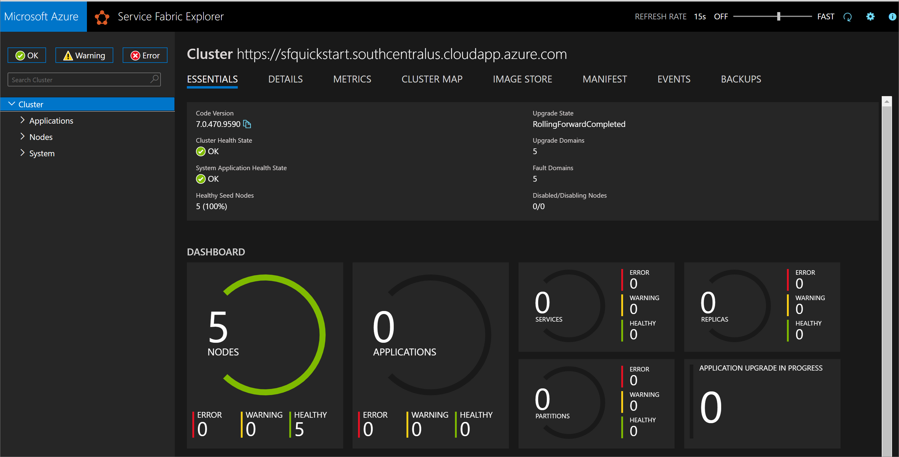
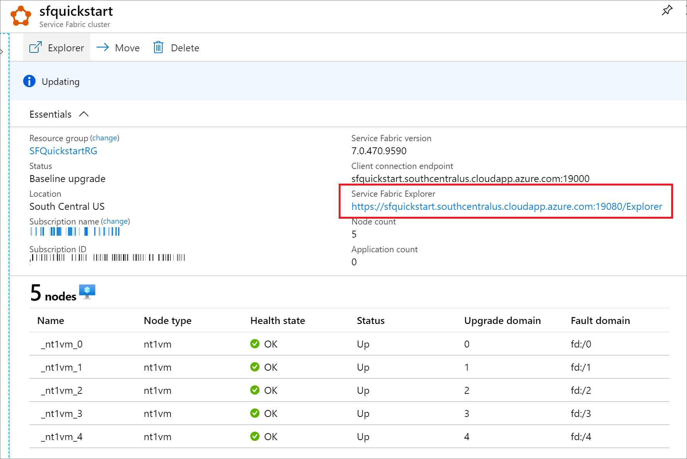

# Quickstart: Create a Service Fabric cluster using Bicep

Azure Service Fabric is a distributed systems platform that makes it easy to package, deploy, and manage scalable and reliable microservices and containers. A Service Fabric *cluster* is a network-connected set of virtual machines into which your microservices are deployed and managed. This article describes how to deploy a Service Fabric test cluster in Azure using Bicep.

[!INCLUDE [About Bicep](../../includes/resource-manager-quickstart-bicep-introduction.md)]

This five-node Windows cluster is secured with a self-signed certificate and thus only intended for instructional purposes (rather than production workloads). We'll use Azure PowerShell to deploy the Bicep file.

## Prerequisites

If you don't have an Azure subscription, create a [free](https://azure.microsoft.com/free/) account before you begin.

### Install Service Fabric SDK and PowerShell modules

To complete this quickstart, you'll need to install the [Service Fabric SDK and PowerShell module](service-fabric-get-started.md).

### Download the sample Bicep file and certificate helper script

Clone or download the [Azure Resource Manager Quickstart Templates](https://github.com/Azure/azure-quickstart-templates) repo. Alternatively, copy down locally the following files we'll be using from the *service-fabric-secure-cluster-5-node-1-nodetype* folder:

* [New-ServiceFabricClusterCertificate.ps1](https://raw.githubusercontent.com/Azure/azure-quickstart-templates/master/quickstarts/microsoft.servicefabric/service-fabric-secure-cluster-5-node-1-nodetype/scripts/New-ServiceFabricClusterCertificate.ps1)
* [main.bicep](https://raw.githubusercontent.com/Azure/azure-quickstart-templates/master/quickstarts/microsoft.servicefabric/service-fabric-secure-cluster-5-node-1-nodetype/main.bicep)
* [azuredeploy.parameters.json](https://raw.githubusercontent.com/Azure/azure-quickstart-templates/master/quickstarts/microsoft.servicefabric/service-fabric-secure-cluster-5-node-1-nodetype/azuredeploy.parameters.json)

### Sign in to Azure

Sign in to Azure and designate the subscription to use for creating your Service Fabric cluster.

```powershell
# Sign in to your Azure account
Login-AzAccount -SubscriptionId "<subscription ID>"
```

### Create a self-signed certificate stored in Key Vault

Service Fabric uses X.509 certificates to [secure a cluster](./service-fabric-cluster-security.md) and provide application security features, and [Key Vault](../key-vault/general/overview.md) to manage those certificates. Successful cluster creation requires a cluster certificate to enable node-to-node communication. For the purpose of creating this quickstart test cluster, we'll create a self-signed certificate for cluster authentication. Production workloads require certificates created using a correctly configured Windows Server certificate service or one from an approved certificate authority (CA).

```powershell
# Designate unique (within cloudapp.azure.com) names for your resources
$resourceGroupName = "SFQuickstartRG"
$keyVaultName = "SFQuickstartKV"

# Create a new resource group for your Key Vault and Service Fabric cluster
New-AzResourceGroup -Name $resourceGroupName -Location SouthCentralUS

# Create a Key Vault enabled for deployment
New-AzKeyVault -VaultName $keyVaultName -ResourceGroupName $resourceGroupName -Location SouthCentralUS -EnabledForDeployment

# Generate a certificate and upload it to Key Vault
.\scripts\New-ServiceFabricClusterCertificate.ps1
```

The script will prompt you for the following (be sure to modify *CertDNSName* and *KeyVaultName* from the example values below):

* **Password:** Password!1
* **CertDNSName:** *sfquickstart*.southcentralus.cloudapp.azure.com
* **KeyVaultName:** *SFQuickstartKV*
* **KeyVaultSecretName:** clustercert

Upon completion, the script will provide the parameter values needed for deployment. Be sure to store these in the following variables, as they will be needed for deployment:

```powershell
$sourceVaultId = "<Source Vault Resource Id>"
$certUrlValue = "<Certificate URL>"
$certThumbprint = "<Certificate Thumbprint>"
```

## Review the Bicep file

The Bicep file used in this quickstart is from [Azure Quickstart Templates](https://azure.microsoft.com/resources/templates/service-fabric-secure-cluster-5-node-1-nodetype/).

:::code language="bicep" source="~/quickstart-templates/quickstarts/microsoft.servicefabric/service-fabric-secure-cluster-5-node-1-nodetype/main.bicep":::

Multiple Azure resources are defined in the Bicep file:

* [Microsoft.Storage/storageAccounts](/azure/templates/microsoft.storage/storageaccounts)
* [Microsoft.Network/virtualNetworks](/azure/templates/microsoft.network/virtualnetworks)
* [Microsoft.Network/publicIPAddresses](/azure/templates/microsoft.network/publicipaddresses)
* [Microsoft.Network/loadBalancers](/azure/templates/microsoft.network/loadbalancers)
* [Microsoft.Compute/virtualMachineScaleSets](/azure/templates/microsoft.compute/virtualmachinescalesets)
* [Microsoft.ServiceFabric/clusters](/azure/templates/microsoft.servicefabric/clusters)

### Customize the parameters file

Open *azuredeploy.parameters.json* and edit the parameter values so that:

* **clusterName** matches the value you supplied for *CertDNSName* when creating your cluster certificate
* **adminUserName** is some value other than the default *GEN-UNIQUE* token
* **adminPassword** is some value other than the default *GEN-PASSWORD* token
* **certificateThumbprint**, **sourceVaultResourceId**, and **certificateUrlValue** are all empty string (`""`)

For example:

```json
{
  "$schema": "https://schema.management.azure.com/schemas/2019-04-01/deploymentParameters.json#",
  "contentVersion": "1.0.0.0",
  "parameters": {
    "clusterName": {
      "value": "sfquickstart"
    },
    "adminUsername": {
      "value": "testadm"
    },
    "adminPassword": {
      "value": "Password#1234"
    },
    "certificateThumbprint": {
      "value": ""
    },
    "sourceVaultResourceId": {
      "value": ""
    },
    "certificateUrlValue": {
      "value": ""
    }
  }
}
```

## Deploy the Bicep file

Store the paths of your Bicep file and parameter file in variables, then deploy the Bicep file.

```powershell
$templateFilePath = "<full path to main.bicep>"
$parameterFilePath = "<full path to azuredeploy.parameters.json>"

New-AzResourceGroupDeployment `
    -ResourceGroupName $resourceGroupName `
    -TemplateFile $templateFilePath `
    -TemplateParameterFile $parameterFilePath `
    -CertificateThumbprint $certThumbprint `
    -CertificateUrlValue $certUrlValue `
    -SourceVaultResourceId $sourceVaultId `
    -Verbose
```

## Review deployed resources

Once the deployment completes, find the `managementEndpoint` value in the output and open the address in a web browser to view your cluster in [Service Fabric Explorer](./service-fabric-visualizing-your-cluster.md).



You can also find the Service Fabric Explorer endpoint from your Service Explorer resource blade in Azure portal.



## Clean up resources

When no longer needed, use the Azure portal, Azure CLI, or Azure PowerShell to delete the resource group and its resources.

# [CLI](#tab/CLI)

```azurecli-interactive
az group delete --name exampleRG
```

# [PowerShell](#tab/PowerShell)

```azurepowershell-interactive
Remove-AzResourceGroup -Name exampleRG
```

---

Next, remove the cluster certificate from your local store. List installed certificates to find the thumbprint for your cluster:

```powershell
Get-ChildItem Cert:\CurrentUser\My\
```

Then remove the certificate:

```powershell
Get-ChildItem Cert:\CurrentUser\My\{THUMBPRINT} | Remove-Item
```

## Next steps

To learn how to create Bicep files with Visual Studio Code, see:

> [!div class="nextstepaction"]
> [Quickstart: Create Bicep files with Visual Studio Code](../azure-resource-manager/bicep/quickstart-create-bicep-use-visual-studio-code.md)
