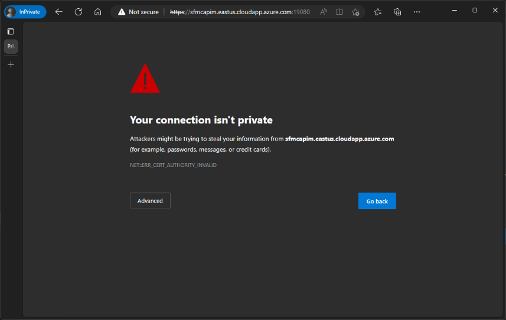

# Quickstart: Deploy a Service Fabric managed cluster with an Azure Resource Manager template

Service Fabric managed clusters are an evolution of the Azure Service Fabric cluster resource model that streamlines your deployment and cluster management experience. A Service Fabric managed cluster is a fully encapsulated resource that enables you to deploy a single Service Fabric cluster resource rather than having to deploy all of the underlying resources that make up a Service Fabric cluster. This article describes how to do deploy a Service Fabric managed cluster for testing in Azure using an Azure Resource Manager template (ARM template).

The three-node Basic SKU cluster deployed in this tutorial is only intended to be used for instructional purposes (rather than production workloads). For further information, see  [Service Fabric managed cluster SKUs](overview-managed-cluster.md#service-fabric-managed-cluster-skus).

## Prerequisites

Before you begin this quickstart:

* If you don't have an Azure subscription, create a [free account](https://azure.microsoft.com/free/?WT.mc_id=A261C142F)

## Review the template

The template used in this quickstart is from [Azure Samples - Service Fabric cluster templates](https://github.com/Azure-Samples/service-fabric-cluster-templates/tree/master/SF-Managed-Basic-SKU-1-NT).

## Create a client certificate

Service Fabric managed clusters use a client certificate as a key for access control. If you already have a client certificate that you would like to use for access control to your cluster, you can skip this step.

If you need to create a new client certificate, follow the steps in [set and retrieve a certificate from Azure Key Vault](../key-vault/certificates/quick-create-portal.md).

Take note of the certificate thumbprint as this will be required to deploy the template in the next step.

## Deploy the template

1. Select the following image to sign in to Azure and open a template.

      :::image type="content" source="~/reusable-content/ce-skilling/azure/media/template-deployments/deploy-to-azure-button.svg" alt-text="Button to deploy the Resource Manager template to Azure." border="false" link="https://portal.azure.com/#create/Microsoft.Template/uri/https%3A%2F%2Fraw.githubusercontent.com%2FAzure-Samples%2Fservice-fabric-cluster-templates%2Fmaster%2FSF-Managed-Basic-SKU-1-NT%2Fazuredeploy.json":::

2. Select or enter the following values

    For this quickstart, provide your own values for the following template parameters:

    * **Subscription**: Select an Azure subscription.
    * **Resource Group**: Select **Create new**. Enter a unique name for the resource group, such as *myResourceGroup*, then choose **OK**.
    * **Location**: Select a location.
    * **Cluster Name**: Enter a unique name for your cluster, such as *mysfcluster*.
    * **Admin Username**: Enter a name for the admin to be used for RDP on the underlying VMs in the cluster.
    * **Admin Password**: Enter a password for the admin to be used for RDP on the underlying VMs in the cluster.
    * **Client Certificate Thumbprint**: Provide the thumbprint of the client certificate that you would like to use to access your cluster. If you do not have a certificate, follow [set and retrieve a certificate](../key-vault/certificates/quick-create-portal.md) to create a self-signed certificate.
    * **Node Type Name**: Enter a unique name for your node type, such as *nt1*.
    * **I agree to the terms and conditions stated above**: Check this box to agree. 

3. Select **Purchase**.

4. It takes a few minutes for your managed Service Fabric cluster to deploy. Wait for the deployment to complete successfully before moving onto the next steps.

## Validate the deployment

### Review deployed resources

Once the deployment completes, find the Service Fabric Explorer value in the output and open the address in a web browser to view your cluster in Service Fabric Explorer. When prompted for a certificate, use the certificate for which the client thumbprint was provided in the template.

> [!NOTE]
> You can find the output of the deployment in Azure Portal under the resource group deployments tab.

Connecting to a Service Fabric Explorer (SFX) endpoint on a managed cluster will result in a certificate error 'NET::ERR_CERT_AUTHORITY_INVALID' regardless of certificate being used or cluster configuration. This is because the cluster nodes are using the managed 'cluster' certificate when binding FabricGateway (19000) and FabricHttpGateway (19080) TCP ports and is by design.

## Clean up resources

When no longer needed, delete the resource group for your Service Fabric managed cluster. To delete the resource group through the portal:

1. Enter the name of your resource group in the *Search* box at the top of the portal. When you see the resource group used in this quickstart in the search results, select it.
2. Select **Delete resource group**.
3. In the **TYPE THE RESOURCE GROUP NAME:** box type in the name of the resource group and select **Delete**.

## Next steps

In this quickstart, you deployed a managed Service Fabric cluster. To learn more about how to scale a cluster, see:

> [!div class="nextstepaction"]
> [Scale out a Service Fabric managed cluster](tutorial-managed-cluster-scale.md)
