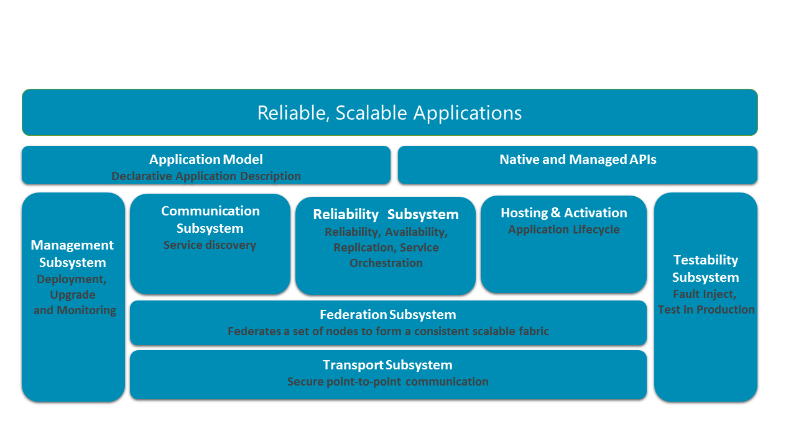

# Service Fabric architecture

Service Fabric is built with layered subsystems. These subsystems enable you to write applications that are:

* Highly available
* Scalable
* Manageable
* Testable

The following diagram shows the major subsystems of Service Fabric.

In a distributed system, the ability to securely communicate between nodes in a cluster is crucial. At the base of the stack is the transport subsystem, which provides secure communication between nodes. Above the transport subsystem lies the federation subsystem, which clusters the different nodes into a single entity (named clusters) so that Service Fabric can detect failures, perform leader election, and provide consistent routing. The reliability subsystem, layered on top of the federation subsystem, is responsible for the reliability of Service Fabric services through mechanisms such as replication, resource management, and failover. The federation subsystem also underlies the hosting and activation subsystem, which manages the lifecycle of an application on a single node. The management subsystem manages the lifecycle of applications and services. The testability subsystem helps application developers test their services through simulated faults before and after deploying applications and services to production environments. Service Fabric provides the ability to resolve service locations through its communication subsystem. The application programming models exposed to developers are layered on top of these subsystems along with the application model to enable tooling.

## Transport subsystem

The transport subsystem implements a point-to-point datagram communication channel. This channel is used for communication within service fabric clusters and communication between the service fabric cluster and clients. It supports one-way and request-reply communication patterns, which provides the basis for implementing broadcast and multicast in the Federation layer. The transport subsystem secures communication by using X509 certificates or Windows security. This subsystem is used internally by Service Fabric and is not directly accessible to developers for application programming.

## Federation subsystem

In order to reason about a set of nodes in a distributed system, you need to have a consistent view of the system. The federation subsystem uses the communication primitives provided by the transport subsystem and stitches the various nodes into a single unified cluster that it can reason about. It provides the distributed systems primitives needed by the other subsystems - failure detection, leader election, and consistent routing. The federation subsystem is built on top of distributed hash tables with a 128-bit token space. The subsystem creates a ring topology over the nodes, with each node in the ring being allocated a subset of the token space for ownership. For failure detection, the layer uses a leasing mechanism based on heart beating and arbitration. The federation subsystem also guarantees through intricate join and departure protocols that only a single owner of a token exists at any time. This provides leader election and consistent routing guarantees.

## Reliability subsystem

The reliability subsystem provides the mechanism to make the state of a Service Fabric service highly available through the use of the *Replicator*, *Failover Manager*, and *Resource Balancer*.

* The Replicator ensures that state changes in the primary service replica will automatically be replicated to secondary replicas, maintaining consistency between the primary and secondary replicas in a service replica set. The replicator is responsible for quorum management among the replicas in the replica set. It interacts with the failover unit to get the list of operations to replicate, and the reconfiguration agent provides it with the configuration of the replica set. That configuration indicates which replicas the operations need to be replicated. Service Fabric provides a default replicator called Fabric Replicator, which can be used by the programming model API to make the service state highly available and reliable.
* The Failover Manager ensures that when nodes are added to or removed from the cluster, the load is automatically redistributed across the available nodes. If a node in the cluster fails, the cluster will automatically reconfigure the service replicas to maintain availability.
* The Resource Manager places service replicas across failure domains in the cluster and ensures that all failover units are operational. The Resource Manager also balances service resources across the underlying shared pool of cluster nodes to achieve optimal uniform load distribution.

## Management subsystem

The management subsystem provides end-to-end service and application lifecycle management. PowerShell cmdlets and administrative APIs enable you to provision, deploy, patch, upgrade, and de-provision applications without loss of availability. The management subsystem performs this through the following services.

* **Cluster Manager**: This is the primary service that interacts with the Failover Manager from reliability to place the applications on the nodes based on the service placement constraints. The Resource Manager in failover subsystem ensures that the constraints are never broken. The cluster manager manages the lifecycle of the applications from provision to de-provision. It integrates with the health manager to ensure that application availability is not lost from a semantic health perspective during upgrades.
* **Health Manager**: This service enables health monitoring of applications, services, and cluster entities. Cluster entities (such as nodes, service partitions, and replicas) can report health information, which is then aggregated into the centralized health store. This health information provides an overall point-in-time health snapshot of the services and nodes distributed across multiple nodes in the cluster, enabling you to take any needed corrective actions. Health query APIs enable you to query the health events reported to the health subsystem. The health query APIs return the raw health data stored in the health store or the aggregated, interpreted health data for a specific cluster entity.
* **Image Store**: This service provides storage and distribution of the application binaries. This service provides a simple distributed file store where the applications are uploaded to and downloaded from.

## Hosting subsystem

The cluster manager informs the hosting subsystem (running on each node) which services it needs to manage for a particular node. The hosting subsystem then manages the lifecycle of the application on that node. It interacts with the reliability and health components to ensure that the replicas are properly placed and are healthy.

## Communication subsystem

This subsystem provides reliable messaging within the cluster and service discovery through the Naming service. The Naming service resolves service names to a location in the cluster and enables users to manage service names and properties. Using the Naming service, clients can securely communicate with any node in the cluster to resolve a service name and retrieve service metadata. Using a simple Naming client API, users of Service Fabric can develop services and clients capable of resolving the current network location despite node dynamism or the re-sizing of the cluster.

## Testability subsystem

Testability is a suite of tools specifically designed for testing services built on Service Fabric. The tools let a developer easily induce meaningful faults and run test scenarios to exercise and validate the numerous states and transitions that a service will experience throughout its lifetime, all in a controlled and safe manner. Testability also provides a mechanism to run longer tests that can iterate through various possible failures without losing availability. This provides you with a test-in-production environment.
