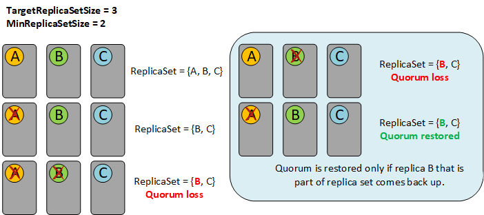

# Stateful service replica set size configuration

Replica set size for stateful services is configured using two parameters.

* TargetReplicaSetSize - number of replicas that the system creates and maintains for each replica set of a service
* MinReplicaSetSize – minimum allowed number of replicas for each replica set of a service

The basic idea behind these two parameters is to allow for such a configuration that it allows for at least two concurrent failures to happen without partition going in quorum loss. That situation can happen when there's one planned failover (upgrade bringing node/replica down) and one unplanned failover (node crashes).

For example, if TargetReplicaSetSize =5, MinReplicaSetSize =3, then normally (without failures) there will be five replicas in the Service Fabrics view of the replica set. When failures happen, Service Fabrics view of the replica set will decrease until it reaches MinReplicaSetSize.

Service Fabric uses the majority quorum of the number of replicas maintained in this view, so majority quorum of the MinReplicaSetSize is minimum level of reliability of any operation. If the total number of replicas drops below the majority quorum of the MinReplicaSetSize then further writes will be disallowed. It's important to note that when service is in quorum loss, it can require replicas to come back in a specific order to get out of quorum loss. 

>[!IMPORTANT]
>In the example where TargetReplicaSetSize = 5, MinReplicaSetSize = 3, majority quorum of MinReplicaSetSize is 2. That means that even if there are three concurrent failures that will result in only two remaining replicas running, Service Fabric will still have 3 replicas in its view of the replica set (two up and one down), and two remaining running replicas will be enough to satisfy the majority quorum.

## Examples of suboptimal configurations

### TargetReplicaSetSize = 3; MinReplicaSetSize = 2
This kind of configuration will often go into [quorum loss](service-fabric-disaster-recovery.md#stateful-services) (whenever planned and unplanned failover happens at the same time). To recover from quorum loss, it's not enough for only one replica to come back up – it's required for the exact replica which was part of replica set to come back up.

1.	Partition has three replicas: A, B, C
2.	Replica A goes down, Service Fabric downshifts replica set to 2 (B, C)
3.	Unplanned failover happens, replica B also goes down - partition is now in quorum loss state
4.	If replica A comes back, partition will remain in quorum loss state as A isn't part of the current replica set (B, C). Quorum loss will be fixed only when replica B comes back.

### TargetReplicaSetSize = 3, MinReplicaSetSize = 3
This kind of configuration will often go into [quorum loss](service-fabric-disaster-recovery.md#stateful-services) (whenever planned and unplanned failover happens at the same time). However, as soon as any of these replicas come back up, partition will recover from quorum loss. 
> [!WARNING]
>This kind of configuration is still not optimal, it is only slightly better than TagetReplicaSetSize =3, MinReplicaSetSize = 2.

1.	Partition has three replicas: A, B, C
2.	Replica A goes down, replica set remains the same (A, B, C)
3.	Unplanned failover happens, replica B also goes down - partition is now in quorum loss state
4.	As soon as any of the replicas A or B come back up, partition will restore quorum as both A and B are part of current replica set

## Next steps

* Learn about quorum loss and [Disaster recovery in Azure Service Fabric](service-fabric-disaster-recovery.md#stateful-services)
* Learn about [Service Fabric support options](service-fabric-support.md).

[image1]: media/service-fabric-best-practices/service-fabric-best-practices-target-3-minimum-2-replica-set-size.png
[image2]: media/service-fabric-best-practices/service-fabric-best-practices-target-3-minimum-3-replica-set-size.png
