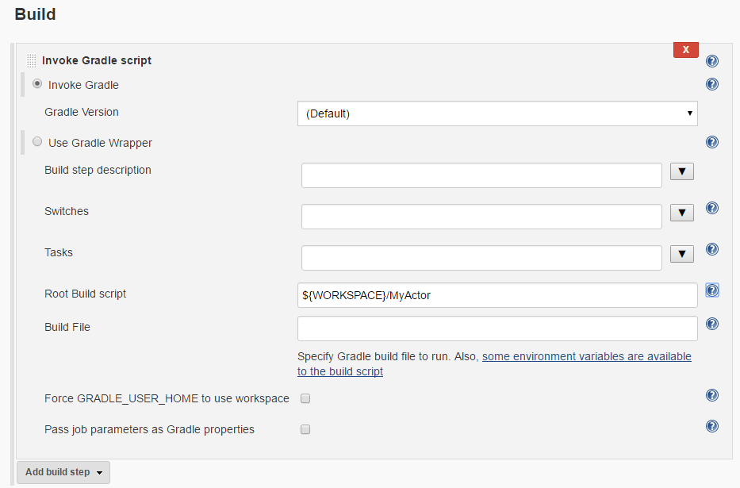
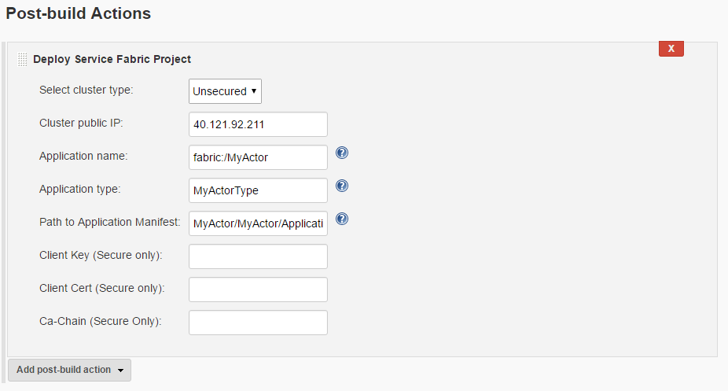

# Build and deploy your Linux Java application using Jenkins
Jenkins is one of the hugely used continuous integration and deployment tools, which is used by the developers. Here we have a similar provision with Jenkins such that, once you have your service-fabric application ready, you can build and deploy

## Prerequisites
1. You need to have docker installed. If not you can type in the following commands in the terminal to install docker.
 `` sudo apt-get install wget``
 `` wget -qO- https://get.docker.io/ | sh``
  Now when you run ``docker info`` in the terminal, you would see in the output that docker service is running.
2. You need to have service-fabric sdk installed locally so that you can start-up a one-box cluster locally or alternately, you need to have access to any service-fabric cluster where you can deploy your service fabric application.
3. You need to have git installed locally, as you would see later in the tutorial.
4. You need to have the service-fabric jenkins plugin handy. In case you do not have it, try downloading it from [here](https://servicefabricdownloads.blob.core.windows.net/jenkins/serviceFabric.hpi).

## Setting up Jenkins (Stand-alone Docker)

1. Pull the docker container image: ``docker pull IMAGE_NAME ``
2. Run the container-image: ``docker run -itd -p 8080:8080 IMAGE_NAME``
3. Get the id of your docker container which has the jenkins image (which you just installed). You can list all the docker containers with the command ``docker ps –a``
4. Get the admin password for the Jenkins account. For that you can do the following -
  * ``docker exec [first-four-digits-of-container-ID] cat /var/jenkins_home/secrets/initialAdminPassword``, Here if container id is 2d24a73b5964, you need to insert just 2d24
  * This password will be required for logging into the Jenkins dashboard from portal which is ``http://<HOST-IP>:8080``
  * Once you login for the first time, you can create your own user-account and use that for future purpose or you can continue to use the administrator account. But once you create a new user, you need to continue with that.
5. Setup github to work with Jenkins using [this](https://help.github.com/articles/generating-a-new-ssh-key-and-adding-it-to-the-ssh-agent/).
	* Then, use the instructions provided from Github to generate the SSH key and add the ssh key to the github-account which is (would be) hosting the repository.
	* You need to run the commands mentioned in the above link in the Jenkins-docker shell (and not on your linux dev-box)
	* To log on to the Jenkins shell from your linux box, you need to do - ``docker exec -t -i [first-four-digits-of-container-ID] /bin/bash ``

## Setting up Jenkins (using ServiceFabric as the container-orchestrator)

1. Ensure you have  azure-cli installed locally on your host. If not, you can the follow the steps mentioned [here](service-fabric-azure-cli.md).
2. Do - ``git clone https://github.com/Azure-Samples/service-fabric-java-getting-started.git -b JenkinsDocker && cd service-fabric-java-getting-started/Services/JenkinsDocker/``
3. Connect to a Service Fabric cluster (say ``http://SOME-IP:19080``) where you want to run the Jenkins-Container image using azure-cli - ``azure servicefabric cluster connect http://SOME-IP:19080``
4. Run ``./install.sh``. It will install the Jenkins container to the cluster you connected. You can monitor your container app using the ususal service-fabric explorer - ``http://SOME-IP:19080``.
5. Then go to the URL ``http://SOME-IP:8081`` from your browser. It will display you from where you will get the initial-admin password required to login to the Jenkins portal, where you can change it and configure Jenkins.
6. Now first get the container instance id using ``docker ps -a``. At this point, you can ssh login to the container using ``docker exec -t -i [first-four-digits-of-container-ID] /bin/bash `` and paste the path you were shown in portal here.
7. The step of integrating it with github etc, will be same as point #5 of last section.

## Install the service-fabric Jenkins Plugin from portal

1. Go to ``http://SOME-IP:8081``
2. From the Jenkins dashboard, select ``Manage Jenkins`` -> ``Manage Plugins`` -> ``Advanced``.
Here, you can upload a plugin. Select the ``Choose file`` option, then select the serviceFabric.hpi file, which you have downloaded under Prerequisites. Once you select upload, Jenkins will automatically install the plugin for you. It might also ask for a restart, please allow it.

## Creating and configuring a Jenkins job

1. Create a ``new item`` from dashboard
2. Enter a new item name - say ``MyJob``, select free-style project and click ok
3. Then go the job page and click ``Configure`` -
  * In the general section, under ``Github project``, give the project url e.g. - ``https://github.com/sayantancs/SFJenkins``
  * Under the ``Source Code Management`` Section, select ``Git``. Give the repository URL, e.g. - ``https://github.com/sayantancs/SFJenkins.git``. Also you can specify which branch to build, e.g. - ``*/master``.
4. You need to configure your *Github* (i.e. which is hosting the repository) so that it is able to talk to Jenkins. For this you need to do the following steps -
  - Go to your Github repository page. Go to ``Settings`` -> ``Integrations and Services``.
  - Select ``Add Service``, type in Jenkins, select the ``Jenkins-Github plugin``.
  - Enter your Jenkins webhook URL (by default, it should be ``http://<SOME-IP>:8081/github-webhook/``). Click on add/update service.
  - A test event will be sent to your Jenkins instance. You should see a green check by the webhook in Github, and your project will build!
  - Under the ``Build Triggers`` section select which build option do you want - for this use-case we plan to trigger a build whenever some push to the repo happens - so the corresponding option would be - ``GitHub hook trigger for GITScm polling`` (previously it was 'Build when a change is pushed to Github')
  - Under the ``Build section`` - from the drop-down ``Add build step``, select the option ``Invoke Gradle Script``. In the widget that comes, specify the path to ``Root build script``, for your application. It picks up the build.gradle from the path specified and works accordingly. Please note that - if you create a project named ``MyActor``(using Eclipse plugin or Yeoman generator), then the root-build-script should contain - ``${WORKSPACE}/MyActor``. As an example, this section mostly looks like -
    
  - Under the ``Post-Build Actions`` drop-down, select ``Deploy Service Fabric Project``. Here you need to provide the details like - Application Name, Application Type, Application manifest Path, cluster-IP, cluster-type etc. Please fill in the details accordingly. You might want to have a look at the following handy screen-shot as a reference -
    

  > [!NOTE]
  > You should keep in mind that the service-fabric cluster where you deployed your container application, must have a public-facing IP (this can be a SF cluster created from azure portal or one-box cluster created on an azure VM). Else, if the cluster is under some corpnet-proxy, then Github would not be able to talk to the Jenkins instance.
  >
