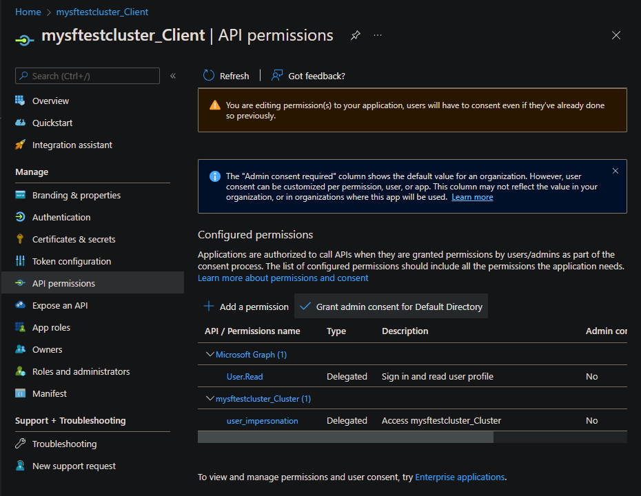

# Set up Microsoft Entra ID for client authentication

> [!WARNING]
> At this time, Microsoft Entra client authentication and the Managed Identity Token Service are mutually incompatible on Linux.

For clusters running on Azure, Microsoft Entra ID is recommended to secure access to management endpoints. This article describes how to set up Microsoft Entra ID to authenticate clients for a Service Fabric cluster.

On Linux, you must complete the following steps before you create the cluster. On Windows, you also have the option to [configure Microsoft Entra authentication for an existing cluster](https://github.com/Azure/Service-Fabric-Troubleshooting-Guides/blob/master/Security/Configure%20Azure%20Active%20Directory%20Authentication%20for%20Existing%20Cluster.md).

In this article, the term "application" refers to [Microsoft Entra applications](../active-directory/develop/developer-glossary.md#client-application), not Service Fabric applications; the distinction is made where necessary. Microsoft Entra ID enables organizations (known as tenants) to manage user access to applications.

A Service Fabric cluster offers several entry points to its management functionality, including the web-based [Service Fabric Explorer][service-fabric-visualizing-your-cluster] and [Visual Studio][service-fabric-manage-application-in-visual-studio]. As a result, you'll create two Microsoft Entra applications to control access to the cluster: one web application and one native application. After the applications are created, you'll assign users to read-only and admin roles.

> [!NOTE]
> At this time, Service Fabric doesn't support Microsoft Entra authentication for storage.

> [!NOTE]
> It's a [known issue](https://github.com/microsoft/service-fabric/issues/399) that applications and nodes on Linux Microsoft Entra ID-enabled clusters cannot be viewed in Azure Portal.

> [!NOTE]
> Microsoft Entra ID now requires an application (app registration) publishers domain to be verified or use of default scheme. See [Configure an application's publisher domain](../active-directory/develop/howto-configure-publisher-domain.md) and [AppId Uri in single tenant applications requires use of default scheme or verified domains](../active-directory/develop/reference-breaking-changes.md#appid-uri-in-single-tenant-applications-will-require-use-of-default-scheme-or-verified-domains) for additional information.

> [!NOTE]
> Starting in Service Fabric 11.0, Service Fabric Explorer requires a Single-page application Redirect URI instead of a Web Redirect URI.


## Prerequisites

In this article, we assume that you have already created a tenant. If you haven't, start by reading [How to get a Microsoft Entra tenant][active-directory-howto-tenant].
To simplify some of the steps involved in configuring Microsoft Entra ID with a Service Fabric cluster, we have created a set of Windows PowerShell scripts. Some actions require administrative level access to Microsoft Entra ID. If the script experiences a 401 or 403 'Authorization_RequestDenied' error, an administrator needs to execute script.

1. Authenticate with Azure administrative permissions.
2. [Clone the repo](https://github.com/Azure-Samples/service-fabric-aad-helpers) to your computer.
3. [Ensure you have all prerequisites](https://github.com/Azure-Samples/service-fabric-aad-helpers#getting-started) for the scripts installed.

<a name='create-azure-ad-applications-and-assign-users-to-roles'></a>

## Create Microsoft Entra applications and assign users to roles

We'll use the scripts to create two Microsoft Entra applications to control access to the cluster: one web application and one native application. After you create applications to represent your cluster, you'll create users for the [roles supported by Service Fabric](service-fabric-cluster-security-roles.md): read-only and admin.

### SetupApplications.ps1

Run `SetupApplications.ps1` and provide the tenant ID, cluster name, web application URI, and web application reply URL as parameters. Use -remove to remove the app registrations. Using -logFile `<log file path>` generates a transcript log. See script help (help .\setupApplications.ps1 -full) for additional information. The script creates the web and native applications to represent your Service Fabric cluster. The two new app registration entries are in the following format:
- ClusterName_Cluster
- ClusterName_Client

> [!NOTE]
> For national clouds (for example Azure Government, Microsoft Azure operated by 21Vianet), you should also specify the `-Location` parameter.

#### Parameters

- **tenantId:** You can find your *TenantId* by executing the PowerShell command `Get-AzureSubscription`. Executing this command displays the TenantId for every subscription.

- **clusterName:** *ClusterName* is used to prefix the Microsoft Entra applications that are created by the script. It doesn't need to match the actual cluster name exactly. It's intended only to make it easier to map Microsoft Entra artifacts to the Service Fabric cluster that they're being used with.

- **SpaApplicationReplyUrl:** *SpaApplicationReplyUrl* is the default endpoint that Microsoft Entra ID returns to your users after they finish signing in. Set this endpoint as the Service Fabric Explorer endpoint for your cluster. If you're creating Microsoft Entra applications to represent an existing cluster, make sure this URL matches your existing cluster's endpoint. If you're creating applications for a new cluster, plan the endpoint for your cluster and make sure not to use the endpoint of an existing cluster. By default the Service Fabric Explorer endpoint is: `https://<cluster_domain>:19080/Explorer/index.html`

- **webApplicationUri:** *WebApplicationUri* is either the URI of a 'verified domain' or URI using API scheme format of API://{{tenant Id}}/{{cluster name}}. See [AppId Uri in single tenant applications requires use of default scheme or verified domains](../active-directory/develop/reference-breaking-changes.md#appid-uri-in-single-tenant-applications-will-require-use-of-default-scheme-or-verified-domains) for additional information.

  Example API scheme: API://0e3d2646-78b3-4711-b8be-74a381d9890c/mysftestcluster

#### SetupApplications.ps1 example

```powershell
# if using cloud shell
# cd clouddrive 
# git clone https://github.com/Azure-Samples/service-fabric-aad-helpers
# cd service-fabric-aad-helpers
# code .

$tenantId = '0e3d2646-78b3-4711-b8be-74a381d9890c'
$clusterName = 'mysftestcluster'
$spaApplicationReplyUrl = 'https://mysftestcluster.eastus.cloudapp.azure.com:19080/Explorer/index.html' # <--- client browser redirect url
#$webApplicationUri = 'https://mysftestcluster.contoso.com' # <--- must be verified domain due to AAD changes
$webApplicationUri = "API://$tenantId/$clusterName" # <--- doesn't have to be verified domain

$configObj = .\SetupApplications.ps1 -TenantId $tenantId `
  -ClusterName $clusterName `
  -SpaApplicationReplyUrl $spaApplicationReplyUrl `
  -AddResourceAccess `
  -WebApplicationUri $webApplicationUri `
  -Verbose
```

The script outputs $configObj variable for subsequent commands and prints the JSON required by the Azure Resource Manager template. Copy the JSON output and use when creating or modifying existing cluster [create your Microsoft Entra ID enabled cluster](service-fabric-cluster-creation-create-template.md#add-azure-ad-configuration-to-use-azure-ad-for-client-access).

#### SetupApplications.ps1 example output

```text
Name                           Value
----                           -----
WebAppId                       f263fd84-ec9e-44c0-a419-673b1b9fd345
TenantId                       0e3d2646-78b3-4711-b8be-74a381d9890c
ServicePrincipalId             3d10f55b-1876-4a62-87db-189bfc54a9f2
NativeClientAppId              b22cc0e2-7c4e-480c-89f5-25f768ecb439

-----ARM template-----
"azureActiveDirectory": {
  "tenantId":"0e3d2646-78b3-4711-b8be-74a381d9890c",
  "clusterApplication":"f263fd84-ec9e-44c0-a419-673b1b9fd345",
  "clientApplication":"b22cc0e2-7c4e-480c-89f5-25f768ecb439"
},
```

#### azureActiveDirectory parameters object JSON

```json
"azureActiveDirectory": {
  "tenantId":"<guid>",
  "clusterApplication":"<guid>",
  "clientApplication":"<guid>"
},
```

### SetupUser.ps1

SetupUser.ps1 is used to add user accounts to the newly created app registration using $configObj output variable from above. Specify username for user account to be configured with app registration and specify 'isAdmin' for administrative permissions. If the user account is new, provide the temporary password for the new user as well. The password needs to be changed on first logon. If you use '-remove', you'll remove the user account, not just the app registration.

#### SetupUser.ps1 user (read) example

```powershell
.\SetupUser.ps1 -ConfigObj $configobj `
  -UserName 'TestUser' `
  -Password 'P@ssword!123' `
  -Verbose
```
#### SetupUser.ps1 admin (read/write) example

```powershell
.\SetupUser.ps1 -ConfigObj $configobj `
  -UserName 'TestAdmin' `
  -Password 'P@ssword!123' `
  -IsAdmin `
  -Verbose
```

### SetupClusterResource.ps1

SetupClusterResource.ps1 can optionally be used to export existing cluster resource ARM template, add / modify 'azureActiveDirectory' configuration, and redeploy template. Use '-Whatif' to only export and modify template but not redeploy configuration change. This script does require Azure 'Az' module and name of the resource group for cluster.

#### SetupClusterResource.ps1 -whatIf example

```powershell
# requires azure module 'az'
# install-module az
$resourceGroupName = 'mysftestcluster'
.\SetupClusterResource.ps1 -configObj $configObj `
  -resourceGroupName $resourceGroupName `
  -WhatIf
```

Once template has been verified and is ready to process, either rerun script without '-WhatIf' or use powershell commandlet 'New-AzResourceGroupDeployment' to deploy template.

#### SetupClusterResource.ps1 example
```powershell
$resourceGroupName = 'mysftestcluster'
.\SetupClusterResource.ps1 -configObj $configObj `
  -resourceGroupName $resourceGroupName
```

> [!NOTE] 
> Update cluster provisioning ARM templates or scripts with new cluster resource Microsoft Entra configuration changes.


## Granting admin consent

It may be necessary to 'Grant admin consent' for the 'API permissions' being configured. Navigate to [Azure App registrations](https://portal.azure.com/#view/Microsoft_AAD_IAM/ActiveDirectoryMenuBlade/~/RegisteredApps) blade and add name of cluster to the filter. For both registrations, open 'API permissions', and select 'Grant admin consent for' if available.




<a name='verifying-azure-ad-configuration'></a>

## Verifying Microsoft Entra Configuration

Navigate to the Service Fabric Explorer (SFX) URL. This should be the same as the parameter spaApplicationReplyUrl. An Azure authentication dialog should be displayed. Log on with an account configured with the new Microsoft Entra configuration. Verify that the administrator account has read/write access and that the user has read access. Any modification to the cluster, for example, performing an action, is an administrative action.


<a name='troubleshooting-help-in-setting-up-azure-active-directory'></a>

## Troubleshooting help in setting up Microsoft Entra ID

Setting up Microsoft Entra ID and using it can be challenging, so here are some pointers on what you can do to debug the issue. PowerShell transcript logging can be enabled by using the '-logFile' argument on 'SetupApplications.ps1' and 'SetupUser.ps1' scripts to review output.

> [!NOTE] 
> With migration of Identities platforms (ADAL to MSAL), deprecation of AzureRM in favor of Azure AZ, and supporting multiple versions of PowerShell, dependencies may not always be correct or up to date causing errors in script execution. Running PowerShell commands and scripts from Azure Cloud Shell reduces the potential for errors with session auto authentication and managed identity.

[](https://shell.azure.com/powershell)


### **Request_BadRequest**

#### **Problem**

Not a valid reference update. Http status code: 400.

```powershell
VERBOSE: POST with 157-byte payload
VERBOSE: received -byte response of content type application/json
>> TerminatingError(Invoke-WebRequest): "{"error":{"code":"Request_BadRequest","message":"Not a valid reference update.","innerError":{"date":"2022-09-11T22:17:16","request-id":"61fadb2a-478b-4483-8f23-d17e13732104","client-request-id":"61fadb2a-478b-4483-8f23-d17e13732104"}}}"
confirm-graphApiRetry returning:True
VERBOSE: invoke-graphApiCall status: 400
exception:
Response status code doesn't indicate success: 400 (Bad Request).

Invoke-WebRequest: /home/<user>/clouddrive/service-fabric-aad-helpers/Common.ps1:239
Line |
 239 |  …   $result = Invoke-WebRequest $uri -Method $method -Headers $headers  …
     |                ~~~~~~~~~~~~~~~~~~~~~~~~~~~~~~~~~~~~~~~~~~~~~~~~~~~~~~~~~
     | {"error":{"code":"Request_BadRequest","message":"Not a valid reference update.","innerError":{"date":"2022-09-11T22:17:16","request-id":"61fadb2a-478b-4483-8f23-d17e13732104","client-request-id":"61fadb2a-478b-4483-8f23-d17e13732104"}}}

at invoke-graphApiCall, /home/<user>/clouddrive/service-fabric-aad-helpers/Common.ps1: line 239
at invoke-graphApi, /home/<user>/clouddrive/service-fabric-aad-helpers/Common.ps1: line 275
at add-roleAssignment, /home/<user>/clouddrive/service-fabric-aad-helpers/SetupUser.ps1: line 193
at add-user, /home/<user>/clouddrive/service-fabric-aad-helpers/SetupUser.ps1: line 244
at enable-AADUser, /home/<user>/clouddrive/service-fabric-aad-helpers/SetupUser.ps1: line 178
at main, /home/<user>/clouddrive/service-fabric-aad-helpers/SetupUser.ps1: line 136
at <ScriptBlock>, /home/<user>/clouddrive/service-fabric-aad-helpers/SetupUser.ps1: line 378
at <ScriptBlock>, /home/<user>/clouddrive/aad-test.ps1: line 43
at <ScriptBlock>, <No file>: line 1
WARNING: invoke-graphApiCall response status: 400
invoke-graphApi count:0 statuscode:400 -uri https://graph.microsoft.com/v1.0/0e3d2646-78b3-4711-b8be-74a381d9890c/servicePrincipals/3d10f55b-1876-4a62-87db-189bfc54a9f2/appRoleAssignedTo -headers System.Collections.Hashtable -body System.Collections.Hashtable -method post
confirm-graphApiRetry returning:True
```

#### **Reason**

Configuration changes haven't propagated. Scripts retry on certain requests with HTTP status codes 400 and 404.

#### **Solution**

Scripts retry on certain requests with HTTP status codes 400 and 404 upto provided '-timeoutMin' which is by default 5 minutes. Script can be re-executed as needed.


### **Service Fabric Explorer prompts you to select a certificate**
#### **Problem**
After you sign in successfully to Microsoft Entra ID in Service Fabric Explorer, the browser returns to the home page but a message prompts you to select a certificate.

![SFX certificate dialog][sfx-select-certificate-dialog]

#### **Reason**
The user isn't assigned a role in the Microsoft Entra ID cluster application. Thus, Microsoft Entra authentication fails on Service Fabric cluster. Service Fabric Explorer falls back to certificate authentication.

#### **Solution**
Follow the instructions for setting up Microsoft Entra ID, and assign user roles. Also, we recommend that you turn on "User assignment required to access app," as `SetupApplications.ps1` does.


### **Connection with PowerShell fails with an error: "The specified credentials are invalid"**
#### **Problem**
When you use PowerShell to connect to the cluster by using "AzureActiveDirectory" security mode, after you sign in successfully to Microsoft Entra ID, the connection fails with an error: "The specified credentials are invalid."

#### **Solution**
This solution is the same as the preceding one.


### **Service Fabric Explorer returns a failure when you sign in: "AADSTS50011"**

#### **Problem**
When you try to sign in to Microsoft Entra ID in Service Fabric Explorer, the page returns a failure: "AADSTS50011: The reply address &lt;url&gt; doesn't match the reply addresses configured for the application: &lt;guid&gt;."

![SFX reply address doesn't match][sfx-reply-address-not-match]

#### **Reason**
The cluster (web) application that represents Service Fabric Explorer attempts to authenticate against Microsoft Entra ID, and as part of the request it provides the redirect return URL. But the URL isn't listed in the Microsoft Entra application **REPLY URL** list.

#### **Solution**
On the Microsoft Entra app registration page for your cluster, select **Authentication**, and under the **Redirect URIs** section, add the Service Fabric Explorer URL to the list. Save your change.

![Web application reply URL][web-application-reply-url]


<a name='connecting-to-the-cluster-using-azure-ad-authentication-via-powershell-gives-an-error-when-you-sign-in-aadsts50011'></a>

### **Connecting to the cluster using Microsoft Entra authentication via PowerShell gives an error when you sign in: "AADSTS50011"**
#### **Problem**
When you try to connect to a Service Fabric cluster using Microsoft Entra ID via PowerShell, the sign-in page returns a failure: "AADSTS50011: The reply url specified in the request doesn't match the reply urls configured for the application: &lt;guid&gt;."

#### **Reason**
Similar to the preceding issue, PowerShell attempts to authenticate against Microsoft Entra ID, which provides a redirect URL that isn't listed in the Microsoft Entra application **Reply URLs** list.  

#### **Solution**
Use the same process as in the preceding issue, but the URL must be set to `urn:ietf:wg:oauth:2.0:oob`, a special redirect for command-line authentication.


### **Execution of script results in error in Authorization error**

#### **Problem**

PowerShell script may fail to perform all of the REST commands required to complete Microsoft Entra configuration with error "Authorization_RequestDenied","Insufficient privileges to complete the operation". Example error:

```powershell
Invoke-WebRequest: /home/<user>/clouddrive/service-fabric-aad-helpers/Common.ps1:239
Line |
 239 |  …   $result = Invoke-WebRequest $uri -Method $method -Headers $headers  …
     |                ~~~~~~~~~~~~~~~~~~~~~~~~~~~~~~~~~~~~~~~~~~~~~~~~~~~~~~~~~
     | {"error":{"code":"Authorization_RequestDenied","message":"Insufficient privileges to complete the
     | operation.","innerError":{"date":"2022-08-29T14:46:37","request-id":"c4fd3acc-1558-4950-8028-68bb058f7bf0","client-request-id":"c4fd3acc-1558-4950-8028-68bb058f7bf0"}}}
...
invoke-graphApi count:0 statuscode:403 -uri https://graph.microsoft.com/v1.0/72f988bf-86f1-41af-91ab-2d7cd011db47/oauth2PermissionGrants -headers System.Collections.Hashtable -body System.Collections.Hashtable -method post
Write-Error: /home/<user>/clouddrive/service-fabric-aad-helpers/SetupApplications.ps1:364
Line |
 364 |      assert-notNull $result "aad app service principal oauth permissio …
     |      ~~~~~~~~~~~~~~~~~~~~~~~~~~~~~~~~~~~~~~~~~~~~~~~~~~~~~~~~~~~~~~~~~
     | aad app service principal oauth permissions User.Read configuration failed

Write-Error: /home/<user>/clouddrive/service-fabric-aad-helpers/SetupApplications.ps1:656
Line |
 656 |  main
     |  ~~~~
     | exception:  exception: assertion failure: object: message:aad app service principal oauth permissions User.Read configuration failed  Exception:
     | /home/<user>/clouddrive/service-fabric-aad-helpers/Common.ps1:22 Line |   22 |          throw "assertion failure: object:$obj message:$msg"      |         
     | ~~~~~~~~~~~~~~~~~~~~~~~~~~~~~~~~~~~~~~~~~~~~~~~~~~~      | assertion failure: object: message:aad app service principal oauth permissions User.Read configuration failed  
...
```

#### **Reason**

This error is returned when the user account executing the script doesn't have the permissions to perform the REST call. This can occur if the user doesn't have Administrator/Manage/Write permissions for the objects being created or modified.

#### **Solution**

Work with an Administrator of Azure tenant or Microsoft Entra ID to complete all remaining actions. The scripts provided are idempotent, so they can be re-executed to complete the process.


<a name='connect-the-cluster-by-using-azure-ad-authentication-via-powershell'></a>

### **Connect the cluster by using Microsoft Entra authentication via PowerShell**
To connect the Service Fabric cluster, use the following PowerShell command example:

```powershell
Connect-ServiceFabricCluster -ConnectionEndpoint <endpoint> -KeepAliveIntervalInSec 10 -AzureActiveDirectory -ServerCertThumbprint <thumbprint>
```

To learn more, see [Connect-ServiceFabricCluster cmdlet](/powershell/module/servicefabric/connect-servicefabriccluster).

<a name='can-i-reuse-the-same-azure-ad-tenant-in-multiple-clusters'></a>

### **Can I reuse the same Microsoft Entra tenant in multiple clusters?**
Yes. But remember to add the URL of Service Fabric Explorer to your cluster (web) application. Otherwise, Service Fabric Explorer doesn’t work.

<a name='why-do-i-still-need-a-server-certificate-while-azure-ad-is-enabled'></a>

### **Why do I still need a server certificate while Microsoft Entra ID is enabled?**
FabricClient and FabricGateway perform a mutual authentication. During Microsoft Entra authentication, Microsoft Entra integration provides a client identity to the server, and the server certificate is used by the client to verify the server's identity. For more information about Service Fabric certificates, see [X.509 certificates and Service Fabric][x509-certificates-and-service-fabric].

## Next steps
After setting up Microsoft Entra applications and setting roles for users, [configure and deploy a cluster](service-fabric-cluster-creation-via-arm.md).

<!-- Links -->

[azure-cli]: /cli/azure/get-started-with-azure-cli
[service-fabric-cluster-security]: service-fabric-cluster-security.md
[active-directory-howto-tenant]:../active-directory/develop/quickstart-create-new-tenant.md
[service-fabric-visualizing-your-cluster]: service-fabric-visualizing-your-cluster.md
[service-fabric-manage-application-in-visual-studio]: service-fabric-manage-application-in-visual-studio.md
[x509-certificates-and-service-fabric]: service-fabric-cluster-security.md#x509-certificates-and-service-fabric

<!-- Images -->
[sfx-select-certificate-dialog]: ./media/service-fabric-cluster-creation-setup-aad/sfx-select-certificate-dialog.png
[sfx-reply-address-not-match]: ./media/service-fabric-cluster-creation-setup-aad/sfx-reply-address-not-match.png
[web-application-reply-url]: ./media/service-fabric-cluster-creation-setup-aad/web-application-reply-url.png
