# Set up Azure Active Directory for client authentication in Azure portal

For clusters running on Azure, Azure Active Directory (Azure AD) is recommended to secure access to management endpoints. This article describes how to set up Azure AD to authenticate clients for a Service Fabric cluster in Azure portal.

In this article, the term "application" will be used to refer to [Azure Active Directory applications](../active-directory/develop/developer-glossary.md#client-application), not Service Fabric applications; the distinction will be made where necessary. Azure AD enables organizations (known as tenants) to manage user access to applications.

A Service Fabric cluster offers several entry points to its management functionality, including the web-based [Service Fabric Explorer][service-fabric-visualizing-your-cluster] and [Visual Studio][service-fabric-manage-application-in-visual-studio]. As a result, you will create two Azure AD applications to control access to the cluster: one web application and one native application. After the applications are created, you will assign users to read-only and admin roles.

> [!NOTE]
> On Linux, you must complete the following steps before you create the cluster. On Windows, you also have the option to [configure Azure AD authentication for an existing cluster](https://github.com/Azure/Service-Fabric-Troubleshooting-Guides/blob/master/Security/Configure%20Azure%20Active%20Directory%20Authentication%20for%20Existing%20Cluster.md).

> [!NOTE]
> It is a [known issue](https://github.com/microsoft/service-fabric/issues/399) that applications and nodes on Linux Azure AD-enabled clusters cannot be viewed in Azure portal.

> [!NOTE]
> Azure Active Directory now requires an application (app registration) publishers domain to be verified or use of default scheme. See [Configure an application's publisher domain](../active-directory/develop/howto-configure-publisher-domain.md) and [AppId Uri in single tenant applications will require use of default scheme or verified domains](../active-directory/develop/reference-breaking-changes.md#appid-uri-in-single-tenant-applications-will-require-use-of-default-scheme-or-verified-domains) for additional information.

## Prerequisites

In this article, we assume that you have already created a tenant. If you have not, start by reading [How to get an Azure Active Directory tenant][active-directory-howto-tenant].

## Azure AD Cluster App Registration

Open Azure AD 'App Registrations' blade in Azure portal and select '+ New registration'.

[Default Directory | App registrations](https://portal.azure.com/#view/Microsoft_AAD_IAM/ActiveDirectoryMenuBlade/~/RegisteredApps)
  
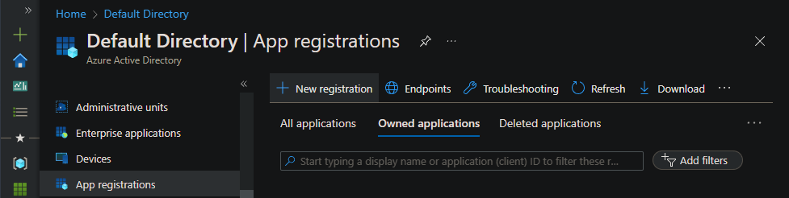

### Properties

- **Name:** Enter a descriptive Name. It is helpful to define registration type in name as shown below.

  - Example: {{cluster name}}_Cluster

- **Supported account types:** Select 'Accounts in this organizational directory only'.

- **Redirect URI:** Select 'Web' and enter the URL that the client will redirect to. In this example the Service Fabric Explorer (SFX) URL is used. After registration is complete, additional Redirect URIs can be added by selecting the 'Authentication' and select 'Add URI'.

  - Example:  'https://{{cluster name}}.{{location}}.cloudapp.azure.com:19080/Explorer/index.html'

> [!NOTE]
> Add additional Redirect URIs if planning to access SFX using a shortened URL such as 'https://{{cluster name}}.{{location}}.cloudapp.azure.com:19080/Explorer'. An exact URL is required to avoid AADSTS50011 error (The redirect URI specified in the request does not match the redirect URIs configured for the application. Make sure the redirect URI sent in the request matches one added to the application in Azure portal. Navigate to https://aka.ms/redirectUriMismatchError to learn more about troubleshooting this error.

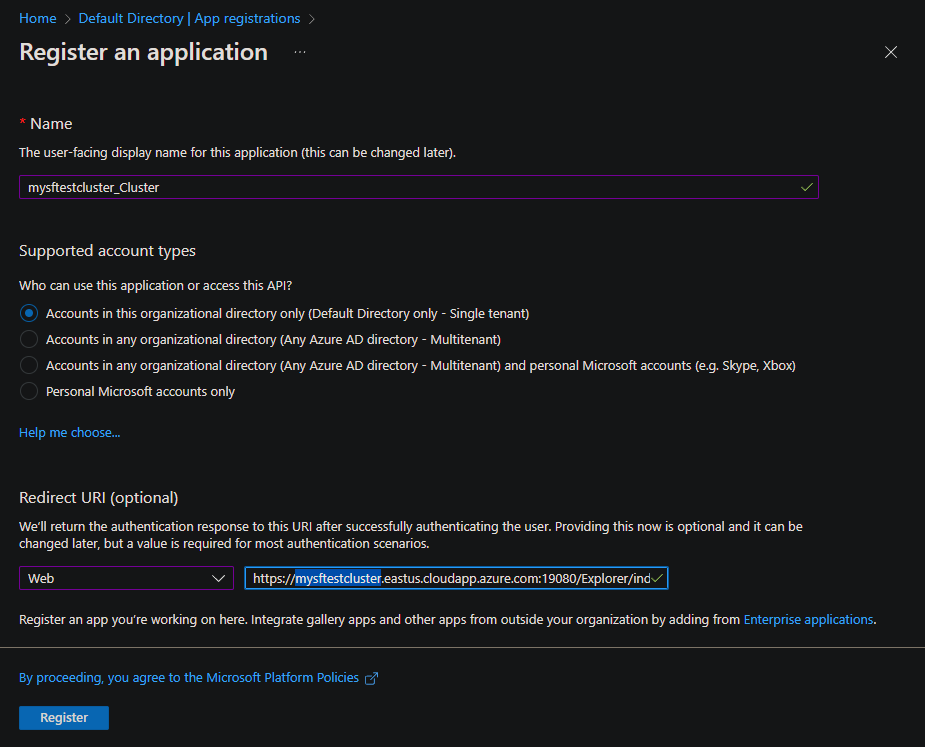

### Branding & properties

After registering the 'Cluster' App Registration, select 'Branding & Properties' and populate any additional information.
- **Home page URL:** Enter SFX URL.

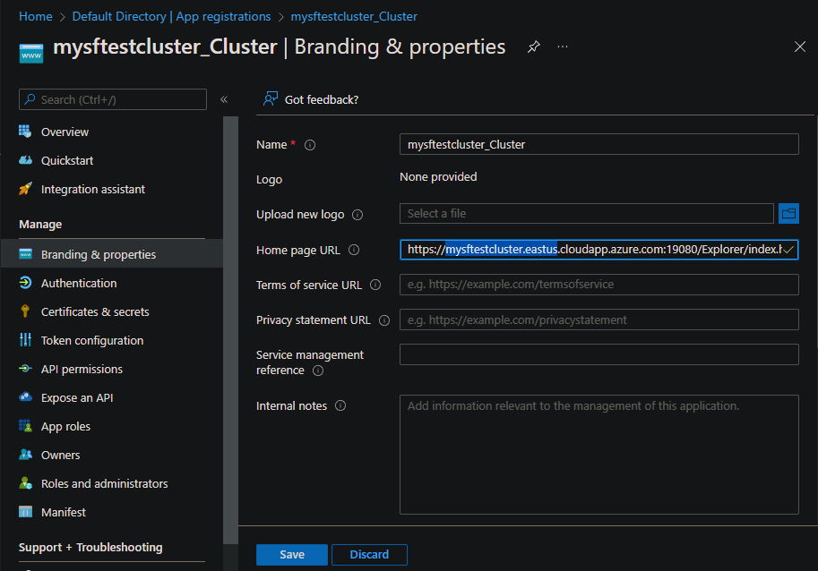

### Authentication

Select 'Authentication'. Under 'Implicit grant and hybrid flows', check 'ID tokens (used for implicit and hybrid flows)'.

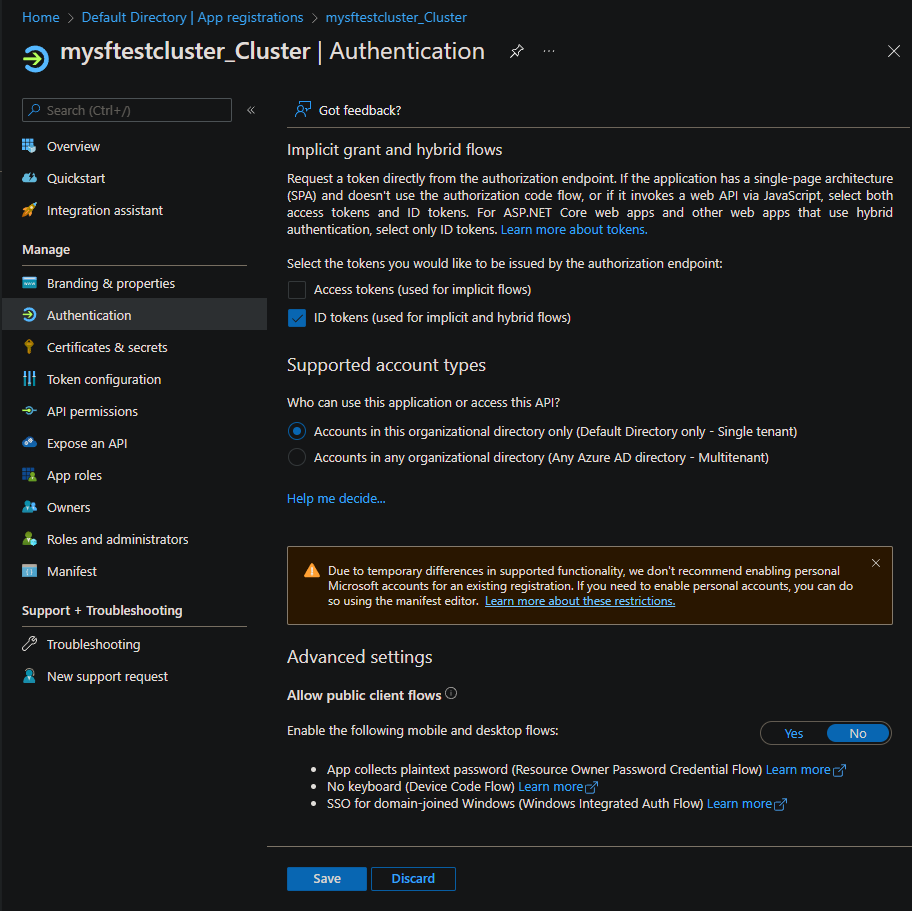

### Expose an API

Select 'Expose an API' and 'Set' link to enter value for 'Application ID URI'. Enter either the uri of a 'verified domain' or uri using api scheme format of api://{{tenant Id}}/{{cluster name}}.

See [AppId Uri in single tenant applications will require use of default scheme or verified domains](../active-directory/develop/reference-breaking-changes.md#appid-uri-in-single-tenant-applications-will-require-use-of-default-scheme-or-verified-domains) for additional information.

Example api scheme: api://{{tenant id}}/{{cluster}}

Example: api://0e3d2646-78b3-4711-b8be-74a381d9890c/mysftestcluster

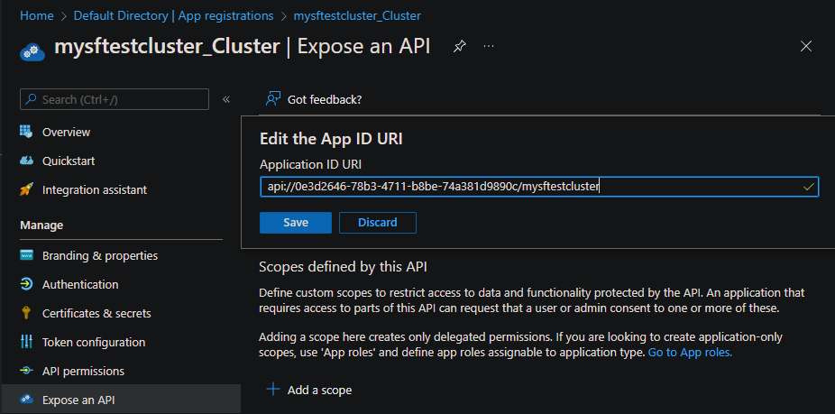

Select '+ Add a scope' to add a new scope with 'user_impersonation'. 

#### Properties

- **Scope name:** user_impersonation
- **Who can consent?:** Select 'Admins and users'
- **Admin consent display name:** Enter a descriptive Name. It is helpful to define cluster name and authentication type as shown below. 

  - Example: Access mysftestcluster_Cluster

- **Admin consent description:** Example: Allow the application to access mysftestcluster_Cluster on behalf of the signed-in user.
- **User consent display name:** Enter a descriptive Name. It is helpful to define cluster name and authentication type as shown below. 

  - Example: Access mysftestcluster_Cluster

- **User consent description:** Example: Allow the application to access mysftestcluster_Cluster on your behalf.
- **State:** Select 'Enabled'.

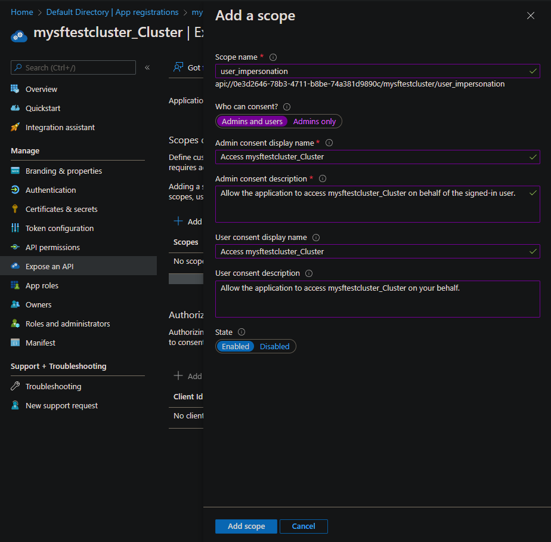

### App roles

Select 'App roles', '+ Create app role' to add 'Admin' and 'ReadOnly' roles.

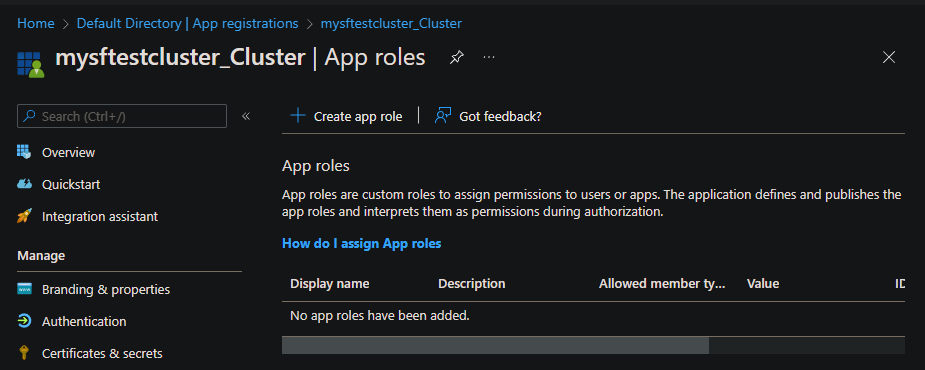

#### Admin User Properties
- **Display Name:** Enter 'Admin'.
- **Allowed member types:** Select 'Users/Groups'.
- **Value:** Enter 'Admin'.
- **Description:** Enter 'Admins can manage roles and perform all task actions'.

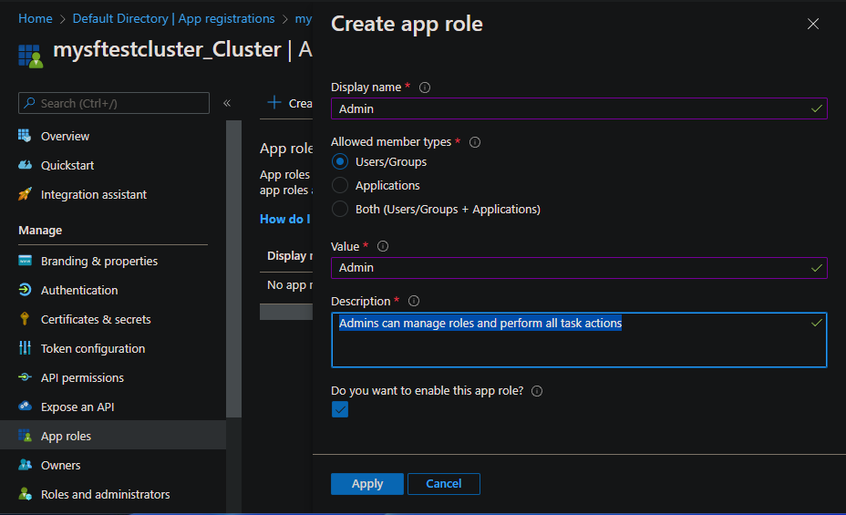

#### ReadOnly User Properties
- **Display Name:** Enter 'ReadOnly'.
- **Allowed member types:** Select 'Users/Groups'.
- **Value:** Enter 'ReadOnly'.
- **Description:** Enter 'ReadOnly roles have limited query access'.

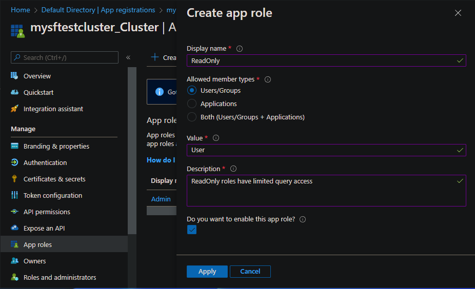

## Azure AD Client App Registration

Open Azure AD 'App Registrations' blade in Azure portal and select '+ New registration'.

[Default Directory | App registrations](https://portal.azure.com/#view/Microsoft_AAD_IAM/ActiveDirectoryMenuBlade/~/RegisteredApps)
  


### Properties

- **Name:** Enter a descriptive Name. It is helpful to define registration type in name as shown below. Example: {{cluster name}}_Client
- **Supported account types:** Select 'Accounts in this organizational directory only'.
- **Redirect URI:** Select 'Public client/native' and Enter 'urn:ietf:wg:oauth:2.0:oob'

  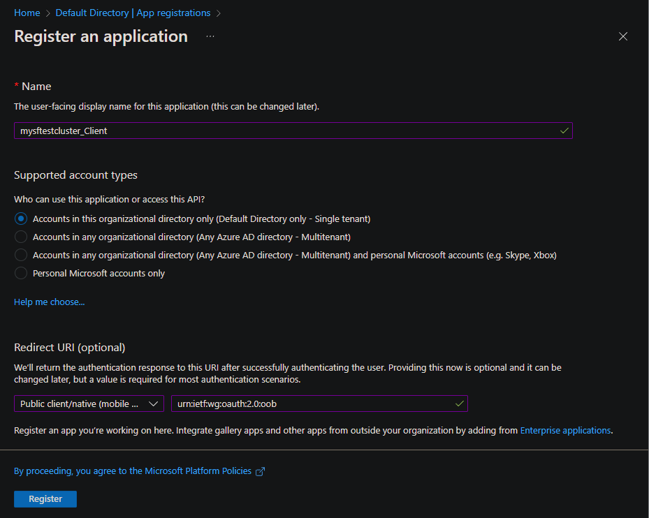

### Authentication

After Registering, select 'Authentication'. Under 'Advanced Settings', select 'Yes' to 'Allow public client flows' and 'Save'.

  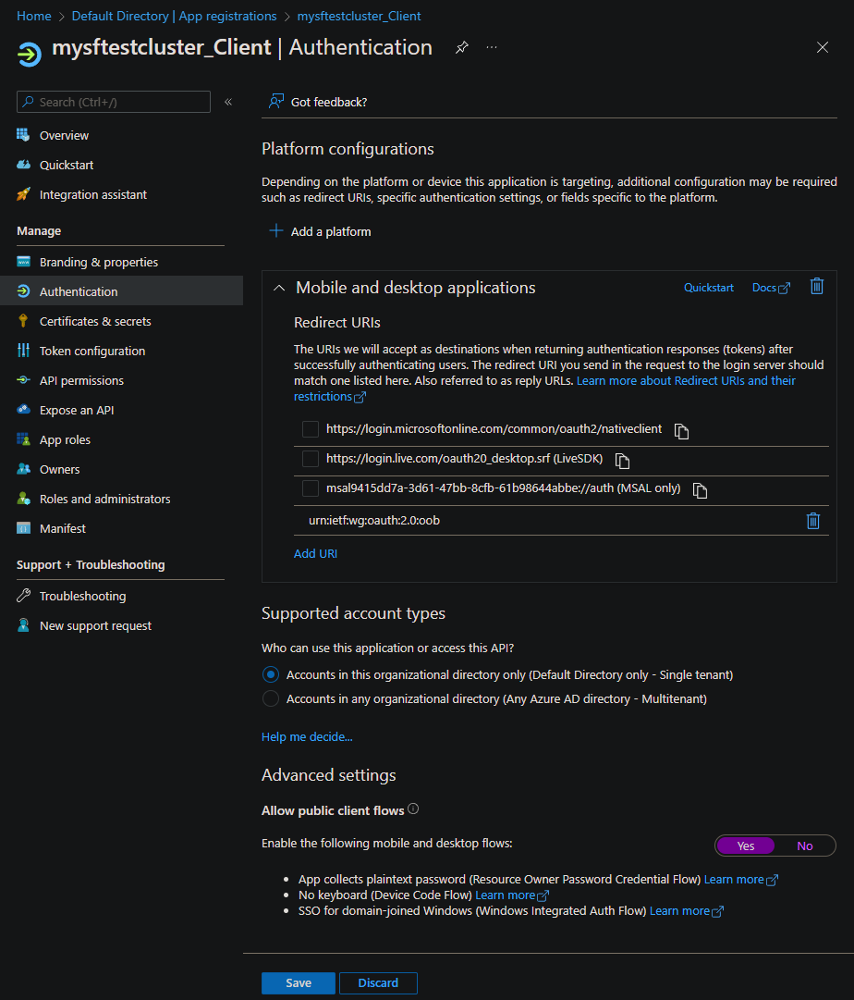

### API Permissions

Select 'API permissions', '+ Add a permission' to add 'user_impersonation' from 'Cluster' App Registration from above.


Select 'Delegated Permissions', select 'user_impersonation' permissions, and 'Add permissions'.

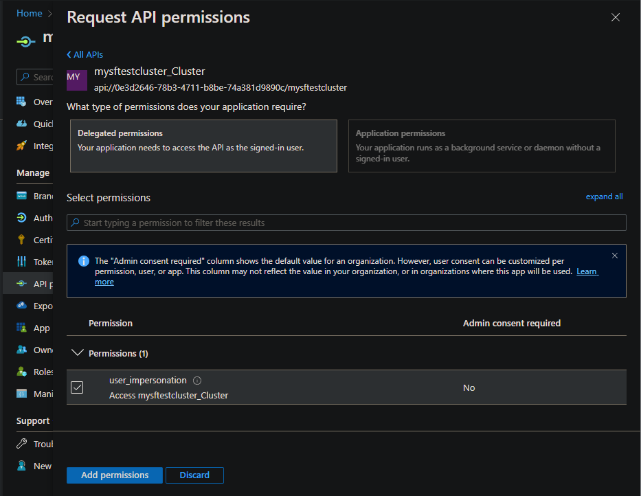

In API permissions list, select 'Grant admin consent for Default Directory'


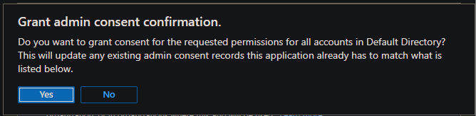

### Disable 'Assignment required' for Azure AD Client App Registration

For the 'Client' App Registration only, navigate to 'Enterprise Applications' blade for 'Client' app registration. Use link above or steps below. 
In the 'Properties' view, select 'No' for 'Assignment required?'.


## Assigning Application Roles to Users

After creation of Service Fabric Azure AD App Registrations, Azure AD users can be modified to use app registrations to connect to cluster with Azure AD. 
For both the ReadOnly and Admin roles, the 'Azure AD Cluster App Registration' is used. 
The 'Azure AD Client App Registration' is not used for role assignments.

Role Assignments are performed from the [Enterprise Applications](https://portal.azure.com/#view/Microsoft_AAD_IAM/StartboardApplicationsMenuBlade/~/AppAppsPreview/menuId~/null) blade. 

> [!NOTE]
> To view the Enterprise applications created during the App Registration process, the default filters for 'Application type' and 'Applicaiton ID starts with' must be removed from the 'All applications' portal view. Optionally, the Enterprise application can also be viewed by opening the 'Enterprise applications' link from the App Registration 'API Permissions' page as shown in figure above.

### Default Filters to be removed

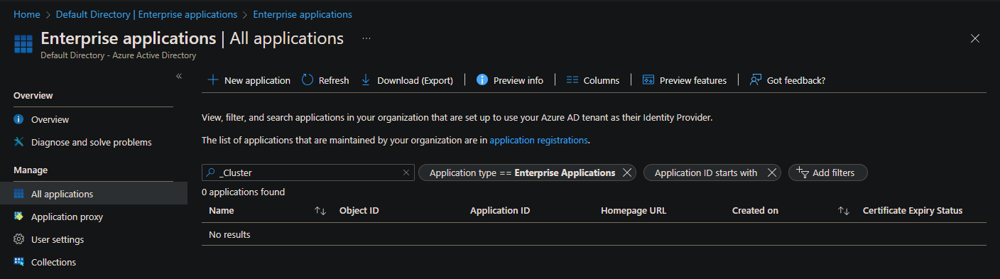

### Filter Removed

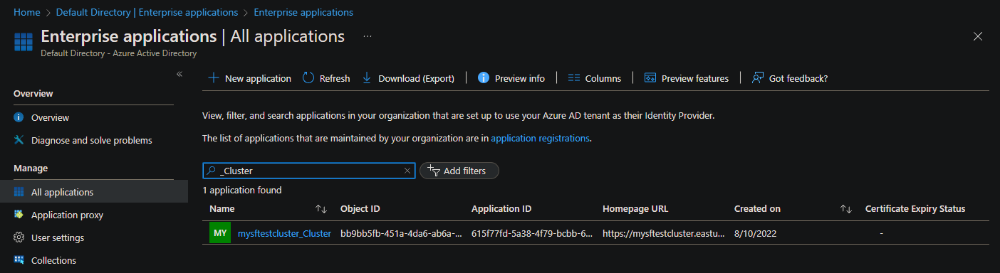

### Adding Role Assignment to Azure AD User

To add applications to existing Azure AD users, navigate to 'Enterprise Applications and find the App Registration created for 'Azure AD Cluster App Registration'. 
Select 'Users and groups' and '+ Add user/group' to add existing Azure AD user role assignment. 

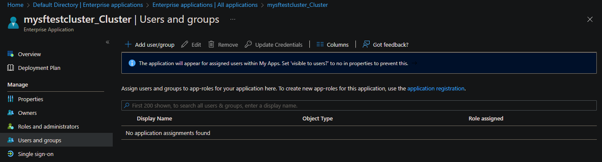

Select 'Users' 'None Selected' link.

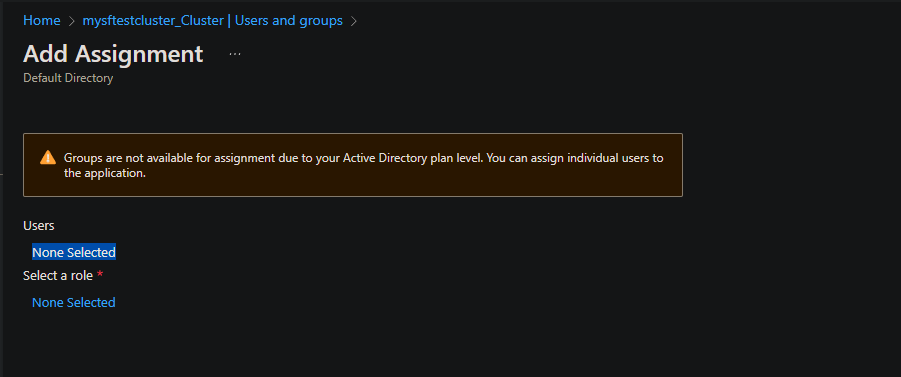

#### Assigning ReadOnly Role

For users needing readonly / view access, find the user, and for 'Select a role', click on the 'None Selected' link to add the 'ReadOnly' role.


#### Assigning Admin Role

For users needing full read / write access, find the user, and for 'Select a role', click on the 'None Selected' link to add the 'Admin' role.

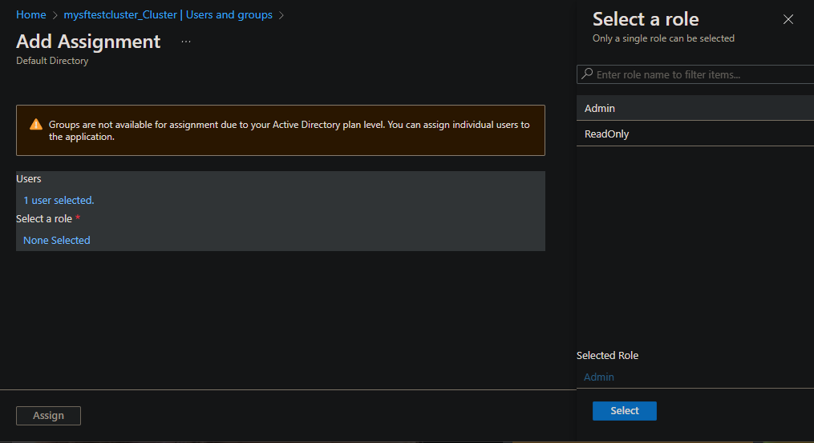

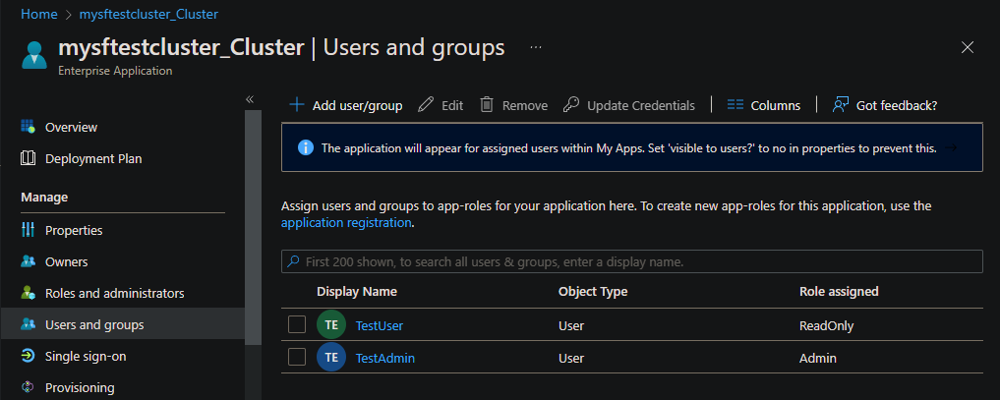

## Configuring Cluster with Azure AD Registrations

In Azure portal, open [Service Fabric Clusters](https://ms.portal.azure.com/#view/HubsExtension/BrowseResource/resourceType/Microsoft.ServiceFabric%2Fclusters) blade.

### Azure Service Fabric Managed Cluster Configuration

Open the managed cluster resource and select 'Security'.
Check 'Enable Azure Active Directory'.

#### Properties
- **TenantID:** Enter Tenant ID 
- **Cluster application:** Enter Azure App Registration 'Application (client)ID' for the 'Azure AD Cluster App Registration'. This is also known as the web application.
- **Client application:** Enter Azure App Registration 'Application (client)ID' for the 'Azure AD Client App Registration'. This is also known as the native application.

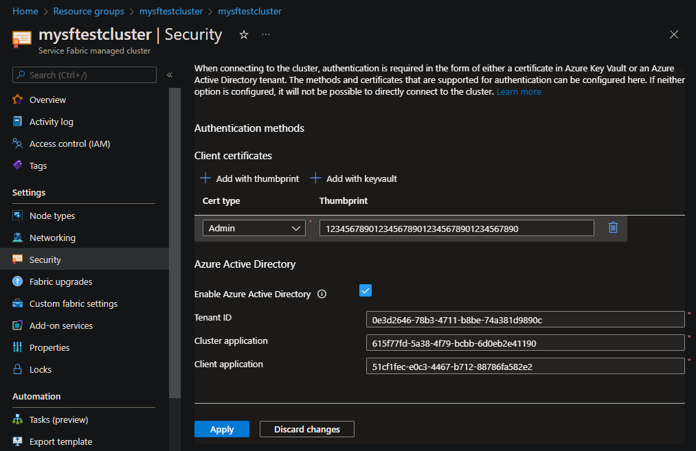

### Azure Service Fabric Cluster Configuration

Open the cluster resource and select 'Security'.
Select '+ Add...'

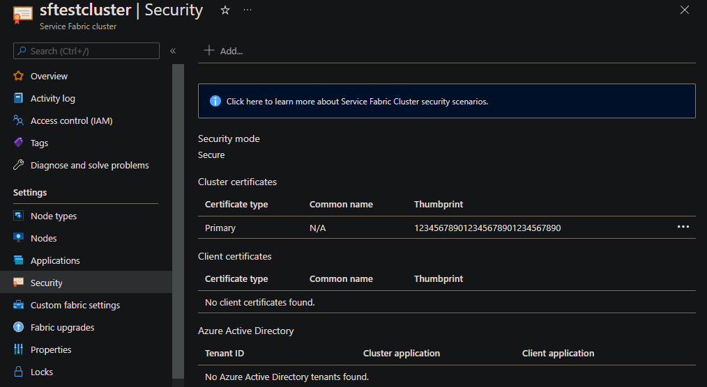

#### Properties

- **Authentication type:** Select 'Azure Active Directory'.
- **TenantID:** Enter Tenant ID.
- **Cluster application:** Enter Azure App Registration 'Application (client)ID' for the 'Azure AD Cluster App Registration'. This is also known as the web application.
- **Client application:** Enter Azure App Registration 'Application (client)ID' for the 'Azure AD Client App Registration'. This is also known as the native application.

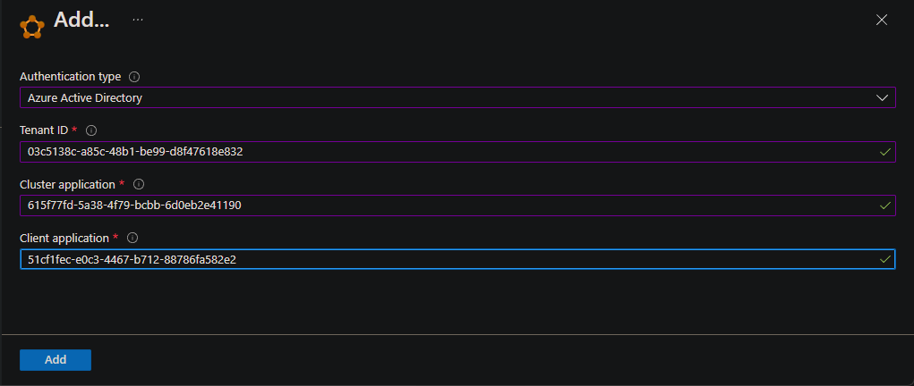

## Connecting to Cluster with Azure AD

### Connect to Service Fabric cluster by using Azure AD authentication via PowerShell

To use PowerShell to connect to a service fabric cluster, the commands have to be run from a machine that has Service Fabric SDK installed which includes nodes currently in a cluster. 
To connect the Service Fabric cluster, use the following PowerShell command example:

```powershell
Import-Module servicefabric

$clusterEndpoint = 'sftestcluster.eastus.cloudapp.azure.com'
$serverCertThumbprint = ''
Connect-ServiceFabricCluster -ConnectionEndpoint $clusterEndpoint `
  -AzureActiveDirectory `
  -ServerCertThumbprint $serverCertThumbprint `
  -Verbose
```

### Connect to Service Fabric managed cluster by using Azure AD authentication via PowerShell

To connect to a managed cluster, 'Az.Resources' PowerShell module is also required to query the dynamic cluster server certificate thumbprint that needs to be enumerated and used. 
To connect the Service Fabric cluster, use the following PowerShell command example:

```powershell
Import-Module servicefabric
Import-Module Az.Resources

$clusterEndpoint = 'mysftestcluster.eastus.cloudapp.azure.com'
$clusterName = 'mysftestcluster'

$clusterResource = Get-AzResource -Name $clusterName -ResourceType 'Microsoft.ServiceFabric/managedclusters'
$serverCertThumbprint = $clusterResource.Properties.clusterCertificateThumbprints

Connect-ServiceFabricCluster -ConnectionEndpoint $clusterEndpoint `
  -AzureActiveDirectory `
  -ServerCertThumbprint $serverCertThumbprint `
  -Verbose
```

## Troubleshooting help in setting up Azure Active Directory
Setting up Azure AD and using it can be challenging, so here are some pointers on what you can do to debug the issue.

### **Service Fabric Explorer prompts you to select a certificate**
#### **Problem**
After you sign in successfully to Azure AD in Service Fabric Explorer, the browser returns to the home page but a message prompts you to select a certificate.

![Screenshot of SFX certificate dialog.][sfx-select-certificate-dialog]

#### **Reason**
The user is not assigned a role in the Azure AD cluster application. Thus, Azure AD authentication fails on Service Fabric cluster. Service Fabric Explorer falls back to certificate authentication.

#### **Solution**
Follow the instructions for setting up Azure AD, and assign user roles. Also, we recommend that you turn on "User assignment required to access app," as `SetupApplications.ps1` does.

### **Connection with PowerShell fails with an error: "The specified credentials are invalid"**
#### **Problem**
When you use PowerShell to connect to the cluster by using "AzureActiveDirectory" security mode, after you sign in successfully to Azure AD, the connection fails with an error: "The specified credentials are invalid."

#### **Solution**
This solution is the same as the preceding one.

### **Service Fabric Explorer returns a failure when you sign in: "AADSTS50011"**
#### **Problem**
When you try to sign in to Azure AD in Service Fabric Explorer, the page returns a failure: "AADSTS50011: The reply address &lt;url&gt; does not match the reply addresses configured for the application: &lt;guid&gt;."

![Screenshot of SFX reply address does not match.][sfx-reply-address-not-match]

#### **Reason**
The cluster (web) application that represents Service Fabric Explorer attempts to authenticate against Azure AD, and as part of the request it provides the redirect return URL. But the URL is not listed in the Azure AD application **REPLY URL** list.

#### **Solution**
On the Azure AD app registration page for your cluster, select **Authentication**, and under the **Redirect URIs** section, add the Service Fabric Explorer URL to the list. Save your change.

![Screenshot of Web application reply URL.][web-application-reply-url]

### **Connecting to the cluster using Azure AD authentication via PowerShell gives an error when you sign in: "AADSTS50011"**
#### **Problem**
When you try to connect to a Service Fabric cluster using Azure AD via PowerShell, the sign-in page returns a failure: "AADSTS50011: The reply url specified in the request does not match the reply urls configured for the application: &lt;guid&gt;."

#### **Reason**
Similar to the preceding issue, PowerShell attempts to authenticate against Azure AD, which provides a redirect URL that isn't listed in the Azure AD application **Reply URLs** list.  

#### **Solution**
Use the same process as in the preceding issue, but the URL must be set to `urn:ietf:wg:oauth:2.0:oob`, a special redirect for command-line authentication.

### **Connect the cluster by using Azure AD authentication via PowerShell**
To connect the Service Fabric cluster, use the following PowerShell command example:

```powershell
Connect-ServiceFabricCluster -ConnectionEndpoint <endpoint> -KeepAliveIntervalInSec 10 -AzureActiveDirectory -ServerCertThumbprint <thumbprint>
```

To learn more, see [Connect-ServiceFabricCluster cmdlet](/powershell/module/servicefabric/connect-servicefabriccluster).

### **Can I reuse the same Azure AD tenant in multiple clusters?**
Yes. But remember to add the URL of Service Fabric Explorer to your cluster (web) application. Otherwise, Service Fabric Explorer does not work.

### **Why do I still need a server certificate while Azure AD is enabled?**
FabricClient and FabricGateway perform a mutual authentication. During Azure AD authentication, Azure AD integration provides a client identity to the server, and the server certificate is used by the client to verify the server's identity. For more information about Service Fabric certificates, see [X.509 certificates and Service Fabric][x509-certificates-and-service-fabric].

## Next steps
After setting up Azure Active Directory applications and setting roles for users, [configure and deploy a cluster](service-fabric-cluster-creation-via-arm.md).

<!-- Links -->

[azure-cli]: /cli/azure/get-started-with-azure-cli
[azure-portal]: https://portal.azure.com/
[service-fabric-cluster-security]: service-fabric-cluster-security.md
[active-directory-howto-tenant]:../active-directory/develop/quickstart-create-new-tenant.md
[service-fabric-visualizing-your-cluster]: service-fabric-visualizing-your-cluster.md
[service-fabric-manage-application-in-visual-studio]: service-fabric-manage-application-in-visual-studio.md
[sf-azure-ad-ps-script-download]:http://servicefabricsdkstorage.blob.core.windows.net/publicrelease/MicrosoftAzureServiceFabric-AADHelpers.zip
[x509-certificates-and-service-fabric]: service-fabric-cluster-security.md#x509-certificates-and-service-fabric

<!-- Images -->
[sfx-select-certificate-dialog]: ./media/service-fabric-cluster-creation-setup-aad/sfx-select-certificate-dialog.png
[sfx-reply-address-not-match]: ./media/service-fabric-cluster-creation-setup-aad/sfx-reply-address-not-match.png
[web-application-reply-url]: ./media/service-fabric-cluster-creation-setup-aad/web-application-reply-url.png
