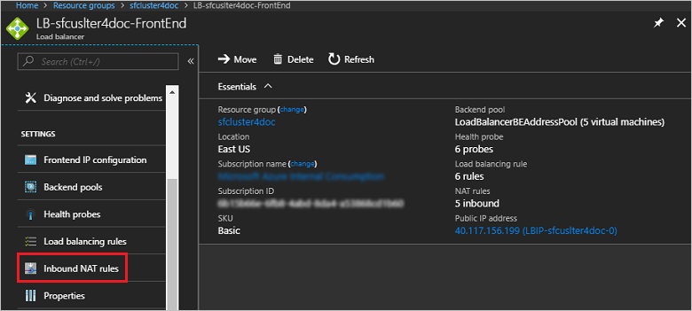
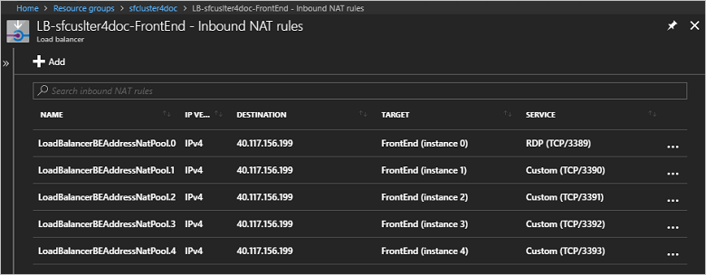
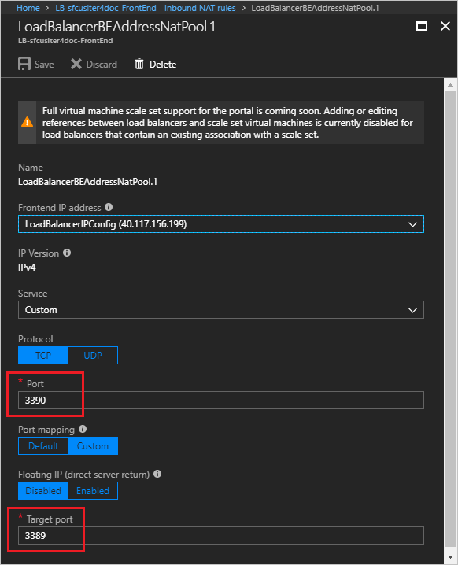
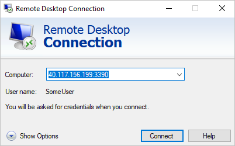

# Remote connect to a virtual machine scale set instance or a cluster node
In a Service Fabric cluster running in Azure, each cluster node type that you define [sets up a virtual machine separate scale](service-fabric-cluster-nodetypes.md).  You can remote connect to specific scale set instances (cluster nodes).  Unlike single-instance VMs, scale set instances don't have their own virtual IP addresses. This can be challenging when you are looking for an IP address and port that you can use to remotely connect to a specific instance.

To find an IP address and port that you can use to remotely connect to a specific instance, complete the following steps.

1. Get the inbound NAT rules for Remote Desktop Protocol (RDP).

    Typically, each node type defined in your cluster has its own virtual IP address and a dedicated load balancer. By default, the load balancer for a node type is named with the following format: *LB-{cluster-name}-{node-type}*; for example, *LB-mycluster-FrontEnd*. 
    
    On the page for your load balancer in Azure portal, select **Settings** > **Inbound NAT rules**: 

    

    The following screenshot shows the inbound NAT rules for a node type named FrontEnd: 

    

    For each node, the IP address appears in the **DESTINATION** column, the **TARGET** column gives the scale set instance, and the **SERVICE** column provides the port number. For remote connection, ports are allocated to each node in ascending order beginning with port 3389.

    You can also find the Inbound NAT rules in the `Microsoft.Network/loadBalancers` section of the Resource Manager template for your cluster.
    
2. To confirm the inbound port to target port mapping for a node, you can click its rule and look at the **Target port** value. The following screenshot shows the inbound NAT rule for the **FrontEnd (Instance 1)** node in the previous step. Notice that, although the (inbound) port number is 3390, the target port is mapped to port 3389, the port for the RDP service on the target.  

    

    By default, for Windows clusters, the target port is port 3389, which maps to the RDP service on the target node. For Linux clusters, the target port is port 22, which maps to the Secure Shell (SSH) service.

3. Remotely connect to the specific node (scale set instance). You can use the user name and password that you set when you created the cluster or any other credentials you have configured. 

    The following screenshot shows using Remote Desktop Connection to connect to the **FrontEnd (Instance 1)** node in a Windows cluster:
    
    

    On Linux nodes, you can connect with SSH (the following example reuses the same IP address and port for brevity):

    ``` bash
    ssh SomeUser@40.117.156.199 -p 3390
    ```


For next steps, read the following articles:
* See the [overview of the "Deploy anywhere" feature and a comparison with Azure-managed clusters](service-fabric-deploy-anywhere.md).
* Learn about [cluster security](service-fabric-cluster-security.md).
* [Update the RDP port range values](./scripts/service-fabric-powershell-change-rdp-port-range.md) on cluster VMs after deployment
* [Change the admin username and password](./scripts/service-fabric-powershell-change-rdp-user-and-pw.md) for cluster VMs

