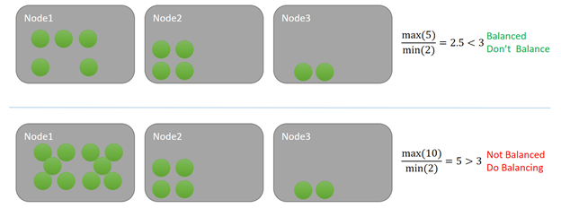
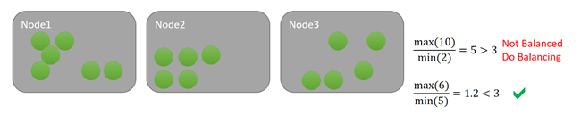
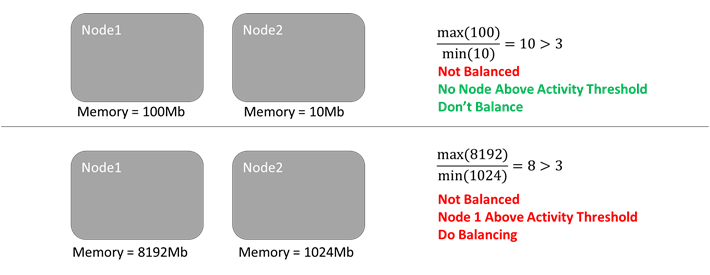
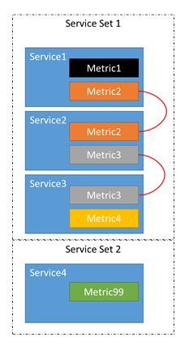
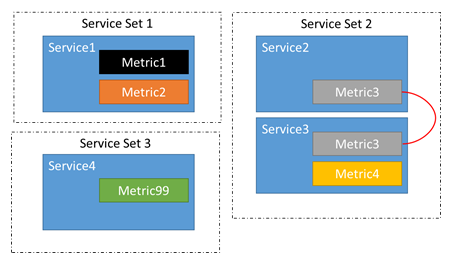
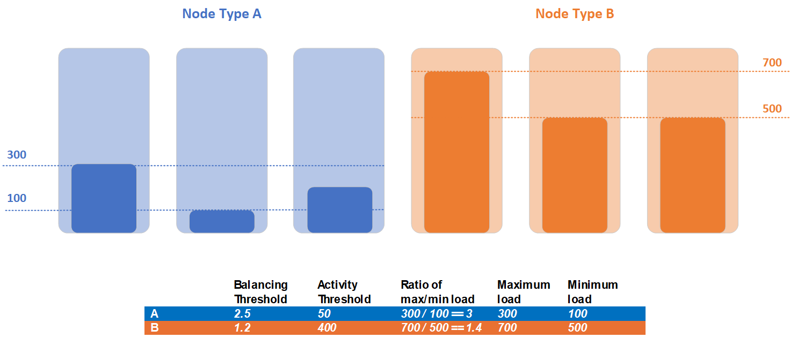
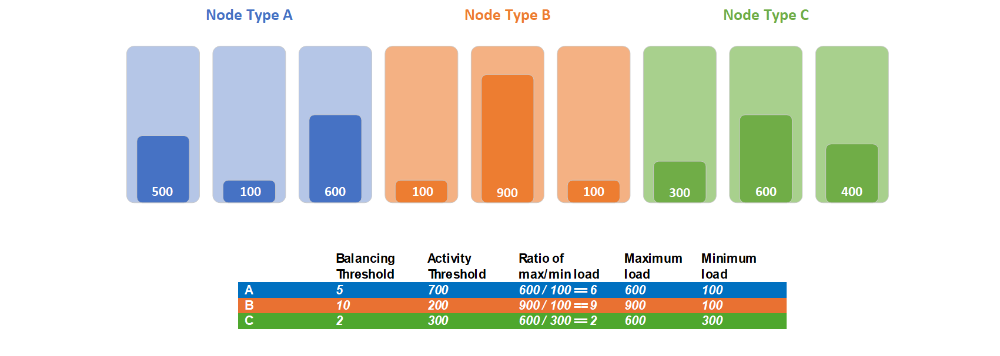

# Balancing your service fabric cluster
The Service Fabric Cluster Resource Manager supports dynamic load changes, reacting to additions or removals of nodes or services. It also automatically corrects constraint violations, and proactively rebalances the cluster. But how often are these actions taken, and what triggers them?

There are three different categories of work that the Cluster Resource Manager performs:

* Placement – this stage deals with placing any stateful replicas or stateless instances that are missing. Placement includes both new services and handling stateful replicas or stateless instances that have failed. Deleting and dropping replicas or instances are handled here.
* Constraint Checks – this stage checks for and corrects violations of the different placement constraints (rules) within the system. Examples of rules are things like ensuring that nodes aren't over capacity and that a service’s placement constraints are met.
* Balancing – this stage checks to see if rebalancing is required based on the configured desired level of balance for different metrics. If so it attempts to find an arrangement in the cluster that is more balanced.

## Configuring Cluster Resource Manager Timers
The first set of controls around balancing is a set of timers. These timers govern how often the Cluster Resource Manager examines the cluster and takes corrective actions.

Each of these different types of corrections the Cluster Resource Manager can make is controlled by a different timer that governs its frequency. When each timer fires, the task is scheduled. By default the Resource Manager:

* scans its state and applies updates (like recording that a node is down) every 1/10th of a second
* sets the placement check flag every second
* sets the constraint check flag every second
* sets the balancing flag every five seconds

Examples of the configuration governing these timers are below:

ClusterManifest.xml:

``` xml
        <Section Name="PlacementAndLoadBalancing">
            <Parameter Name="PLBRefreshGap" Value="0.1" />
            <Parameter Name="MinPlacementInterval" Value="1.0" />
            <Parameter Name="MinConstraintCheckInterval" Value="1.0" />
            <Parameter Name="MinLoadBalancingInterval" Value="5.0" />
        </Section>
```

via ClusterConfig.json for Standalone deployments or Template.json for Azure hosted clusters:

```json
"fabricSettings": [
  {
    "name": "PlacementAndLoadBalancing",
    "parameters": [
      {
          "name": "PLBRefreshGap",
          "value": "0.10"
      },
      {
          "name": "MinPlacementInterval",
          "value": "1.0"
      },
      {
          "name": "MinConstraintCheckInterval",
          "value": "1.0"
      },
      {
          "name": "MinLoadBalancingInterval",
          "value": "5.0"
      }
    ]
  }
]
```

Today the Cluster Resource Manager only performs one of these actions at a time, sequentially. This is why we refer to these timers as “minimum intervals” and the actions that get taken when the timers go off as "setting flags". For example, the Cluster Resource Manager takes care of pending requests to create services before balancing the cluster. As you can see by the default time intervals specified, the Cluster Resource Manager scans for anything it needs to do frequently. Normally this means that the set of changes made during each step is small. Small, frequent changes allow the Cluster Resource Manager to be responsive when things happen in the cluster. The default timers provide some batching since many of the same types of events tend to occur simultaneously. 

For example, when nodes fail they can do so entire fault domains at a time. All these failures are captured during the next state update after the *PLBRefreshGap*. The corrections are determined during the following placement, constraint check, and balancing runs. By default the Cluster Resource Manager isn't scanning through hours of changes in the cluster and trying to address all changes at once. Doing so would lead to bursts of churn.

The Cluster Resource Manager also needs some additional information to determine if the cluster imbalanced. For that we have two other pieces of configuration: *BalancingThresholds* and *ActivityThresholds*.

## Balancing thresholds
A Balancing Threshold is the main control for triggering rebalancing. The Balancing Threshold for a metric is a _ratio_. If the load for a metric on the most loaded node divided by the amount of load on the least loaded node exceeds that metric's *BalancingThreshold*, then the cluster is imbalanced. As a result balancing is triggered the next time the Cluster Resource Manager checks. The *MinLoadBalancingInterval* timer defines how often the Cluster Resource Manager should check if rebalancing is necessary. Checking doesn't mean that anything happens. 

Balancing Thresholds are defined on a per-metric basis as a part of the cluster definition. For more information on metrics, check out the [metrics article](service-fabric-cluster-resource-manager-metrics.md).

ClusterManifest.xml

```xml
    <Section Name="MetricBalancingThresholds">
      <Parameter Name="MetricName1" Value="2"/>
      <Parameter Name="MetricName2" Value="3.5"/>
    </Section>
```

via ClusterConfig.json for Standalone deployments or Template.json for Azure hosted clusters:

```json
"fabricSettings": [
  {
    "name": "MetricBalancingThresholds",
    "parameters": [
      {
          "name": "MetricName1",
          "value": "2"
      },
      {
          "name": "MetricName2",
          "value": "3.5"
      }
    ]
  }
]
```



In this example, each service is consuming one unit of some metric. In the top example, the maximum load on a node is five and the minimum is two. Let’s say that the balancing threshold for this metric is three. Since the ratio in the cluster is 5/2 = 2.5 and that is less than the specified balancing threshold of three, the cluster is balanced. No balancing is triggered when the Cluster Resource Manager checks.

In the bottom example, the maximum load on a node is 10, while the minimum is two, resulting in a ratio of five. Five is greater than the designated balancing threshold of three for that metric. As a result, a rebalancing run will be scheduled next time the balancing timer fires. In a situation like this some load is usually distributed to Node 3. Because the Service Fabric Cluster Resource Manager doesn't use a greedy approach, some load could also be distributed to Node 2. 



> [!NOTE]
> "Balancing" handles two different strategies for managing load in your cluster. The default strategy that the Cluster Resource Manager uses is to distribute load across the nodes in the cluster. The other strategy is [defragmentation](service-fabric-cluster-resource-manager-defragmentation-metrics.md). Defragmentation is performed during the same balancing run. The balancing and defragmentation strategies can be used for different metrics within the same cluster. A service can have both balancing and defragmentation metrics. For defragmentation metrics, the ratio of the loads in the cluster triggers rebalancing when it's _below_ the balancing threshold. 
>

Getting below the balancing threshold isn't an explicit goal. Balancing Thresholds are just a *trigger*. When balancing runs, the Cluster Resource Manager determines what improvements it can make, if any. Just because a balancing search is kicked off doesn't mean anything moves. Sometimes the cluster is imbalanced but too constrained to correct. Alternatively, the improvements require movements that are too [costly](service-fabric-cluster-resource-manager-movement-cost.md)).

## Activity thresholds
Sometimes, although nodes are relatively imbalanced, the *total* amount of load in the cluster is low. The lack of load could be a transient dip, or because the cluster is new and just getting bootstrapped. In either case, you may not want to spend time balancing the cluster because there’s little to be gained. If the cluster underwent balancing, you’d spend network and compute resources to move things around without making any large *absolute* difference. To avoid unnecessary moves, there’s another control known as Activity Thresholds. Activity Thresholds allows you to specify some absolute lower bound for activity. If no node is over this threshold, balancing isn't triggered even if the Balancing Threshold is met.

Let’s say that we retain our Balancing Threshold of three for this metric. Let's also say we have an Activity Threshold of 1536. In the first case, while the cluster is imbalanced per the Balancing Threshold there's no node meets that Activity Threshold, so nothing happens. In the bottom example, Node 1 is over the Activity Threshold. Since both the Balancing Threshold and the Activity Threshold for the metric are exceeded, balancing is scheduled. As an example, let's look at the following diagram: 



Just like Balancing Thresholds, Activity Thresholds are defined per-metric via the cluster definition:

ClusterManifest.xml

``` xml
    <Section Name="MetricActivityThresholds">
      <Parameter Name="Memory" Value="1536"/>
    </Section>
```

via ClusterConfig.json for Standalone deployments or Template.json for Azure hosted clusters:

```json
"fabricSettings": [
  {
    "name": "MetricActivityThresholds",
    "parameters": [
      {
          "name": "Memory",
          "value": "1536"
      }
    ]
  }
]
```

Balancing and activity thresholds are both tied to a specific metric - balancing is triggered only if both the Balancing Threshold and Activity Threshold are exceeded for the same metric.

> [!NOTE]
> When not specified, the Balancing Threshold for a metric is 1, and the Activity Threshold is 0. This means that the Cluster Resource Manager will try to keep that metric perfectly balanced for any given load. If you are using custom metrics, it's recommended that you explicitly define your own balancing and activity thresholds for your metrics. 
>

## Balancing services together
Whether the cluster is imbalanced or not is a cluster-wide decision. However, we fix it by moving individual service replicas and instances around. This makes sense, right? If memory is stacked up on one node, multiple replicas or instances could be contributing to it. Fixing the imbalance could require moving any of the stateful replicas or stateless instances that use the imbalanced metric.

Occasionally though, a service that wasn’t itself imbalanced gets moved (remember the discussion of local and global weights earlier). Why would a service get moved when all that service’s metrics were balanced? Let’s see an example:

- Let's say there are four services, Service 1, Service 2, Service 3, and Service 4. 
- Service 1 reports metrics Metric 1 and Metric 2. 
- Service 2 reports metrics Metric 2 and Metric 3. 
- Service 3 reports metrics Metric 3 and Metric 4.
- Service 4 reports metric Metric 99. 

We don’t really have four independent services, we have three services that are related and one that is off on its own.



Because of this chain, it's possible that an imbalance in metrics 1-4 can cause replicas or instances belonging to services 1-3 to move around. We also know that an imbalance in Metrics 1, 2, or 3 can't cause movements in Service 4. There would be no point since moving the replicas or instances belonging to Service 4 around can do absolutely nothing to impact the balance of Metrics 1-3.

The Cluster Resource Manager automatically figures out what services are related. Adding, removing, or changing the metrics for services can impact their relationships. For example, between two runs of balancing Service 2 may have been updated to remove Metric 2. This breaks the chain between Service 1 and Service 2. Now instead of two groups of related services, there are three:



## Balancing of a cluster per node type

As we described in the earlier sections, the main controls of triggering rebalancing are [activity thresholds](#activity-thresholds), [balancing thresholds](#balancing-thresholds) and [timers](#configuring-cluster-resource-manager-timers). The Service Fabric Cluster Resource Manager provides more granular control over triggering rebalancing with specifying parameters per node type and allowing movement only on imbalanced node types. The main benefit of balancing per node type is allowing performance improvement on node types that require more strict balancing rules, without performance degradation on other node types. The feature contains two main parts:

- Detection of imbalance is done per node type. Previously global calculation of imbalance is calculated for each node type. If all node types are balanced, the CRM won't trigger balancing phase. Otherwise, if at least one node type is imbalanced, balancing phase is needed.
- Balancing moves replicas only on a node types that are imbalanced, other node types aren't impacted by balancing phase.

### How balancing per node type affects a cluster

During balancing of a cluster per node type, the Service Fabric Cluster Resource Manager calculates the imbalance state for each node type. If at least one node type is imbalanced, the balancing phase will be triggered. Balancing phase won't move replicas on node types that are imbalanced, when balancing is temporarily paused on these node types (e.g. minimal balancing interval hasn't passed since a previous balancing phase). The detection of an imbalanced state uses common mechanisms already available for classical cluster balancing, but improves configuration granularity and flexibility. The mechanisms used for balancing per node type to detect imbalance are provided in the list below:
- **Metric balancing thresholds** per node type are values that have a similar role as the globally defined balancing threshold used in classical balancing. The ratio of minimum and maximum metric load is calculated for each node type. If that ratio of a node type is higher than the defined balancing threshold of the node type, the node type is marked as imbalanced. For more details regarding configuration of metric activity thresholds per node type, please check the [balancing thresholds per node type section](#balancing-thresholds-per-node-type).
- **Metric activity thresholds** per node type are values that have a similar role to the globally defined activity threshold used in classical balancing. The maximum metric load is calculated for each node type. If the maximum load of a node type is higher than the defined activity threshold for that node type, the node type is marked as imbalanced. For more details regarding configuration of metric activity thresholds per node type, please check the [activity-thresholds-per-node-type section](#activity-thresholds-per-node-type).
- **Minimum balancing interval** per node type has a role similar to the globally defined minimum balancing interval. For each node type, the Cluster Resource Manager preserves the timestamp of the last balancing. Two consecutive balancing phases couldn't be executed on a node type within the defined minimum balancing interval. For more details regarding configuration of minimum balancing interval per node type, please check the [minimum balancing interval per node type section](#minimum-balancing-interval-per-node-type).

### Describe balancing per node type

In order to enable balancing per node type, parameter SeparateBalancingStrategyPerNodeType needs to be enabled in a cluster manifest. Additionally, subclustering feature needs to be enabled as well. Example of a cluster manifest PlacementAndLoadBalancing section for enabling the feature:

``` xml
<Section Name="PlacementAndLoadBalancing">
    <Parameter Name="SeparateBalancingStrategyPerNodeType" Value="true" />
    <Parameter Name="SubclusteringEnabled" Value="true" />
    <Parameter Name="SubclusteringReportingPolicy" Value="1" />
</Section>
```

ClusterConfig.json for Standalone deployments or Template.json for Azure hosted clusters:

``` JSON
"fabricSettings": [
  {
    "name": "PlacementAndLoadBalancing",
    "parameters": [
      {
          "name": "SeparateBalancingStrategyPerNodeType",
          "value": "true"
      },
      {
          "name": "SubclusteringEnabled",
          "value": "true"
      },
      {
          "name": "SubclusteringReportingPolicy",
          "value": "1"
      },
    ]
  }
]
```

As we described in [the previous section](#how-balancing-per-node-type-affects-a-cluster), thresholds and intervals could be specified per node type. For more details about updating specific parameter, please check following sections:
- [Metric balancing thresholds per node type](#balancing-thresholds-per-node-type)
- [Metric activity thresholds per node type](#activity-thresholds-per-node-type)
- [Minimum balancing interval per node type](#minimum-balancing-interval-per-node-type)

#### Balancing thresholds per node type

Metric balancing threshold could be defined per node type in order to increase granularity from balancing configuration. Balancing thresholds have floating-point type, since they represent threshold for ratio of maximum and minimum load value within particular node type. Balancing thresholds are defined in **PlacementAndLoadBalancingOverrides** section for each node type:

``` xml
<NodeTypes>
    <NodeType Name="NodeType1">
        <PlacementAndLoadBalancingOverrides>
            <MetricBalancingThresholdsPerNodeType>
                <BalancingThreshold Name="Metric1" Value="2.5">
                <BalancingThreshold Name="Metric2" Value="4">
                <BalancingThreshold Name="Metric3" Value="3.25">
            </MetricBalancingThresholdsPerNodeType>
        </PlacementAndLoadBalancingOverrides>
    </NodeType>
</NodeTypes>
```

If balancing threshold for a metric isn't defined for a node type, threshold inherits value of metric balancing threshold defined globally in the **PlacementAndLoadBalancing** section. Otherwise, if balancing threshold for a metric isn't defined neither for a node type nor globally in a **PlacementAndLoadBalancing** section, threshold will have default value of *one*.

#### Activity thresholds per node type

Metric activity threshold could be defined per node type in order to increase granularity of balancing configuration. Activity thresholds have integer type, since they represent threshold for maximum load value within particular node type. Activity thresholds are defined in **PlacementAndLoadBalancingOverrides** section for each node type:

``` xml
<NodeTypes>
    <NodeType Name="NodeType1">
        <PlacementAndLoadBalancingOverrides>
            <MetricActivityThresholdsPerNodeType>
                <ActivityThreshold Name="Metric1" Value="500">
                <ActivityThreshold Name="Metric2" Value="40">
                <ActivityThreshold Name="Metric3" Value="1000">
            </MetricActivityThresholdsPerNodeType>
        </PlacementAndLoadBalancingOverrides>
    </NodeType>
</NodeTypes>
```

If activity threshold for a metric isn't defined for a node type, threshold inherits value from metric activity threshold defined globally in the **PlacementAndLoadBalancing** section. Otherwise, if activity threshold for a metric isn't defined neither for a node type nor globally in a **PlacementAndLoadBalancing** section, threshold will have default value of *zero*.

#### Minimum balancing interval per node type

Minimal balancing interval could be defined per node type in order to increase granularity of balancing configuration. Minimal balancing interval has integer type, since it represents the minimum amount of time that must pass before two consecutive balancing rounds on a same node type. Minimum balancing interval is defined in **PlacementAndLoadBalancingOverrides** section for each node type:

``` xml
<NodeTypes>
    <NodeType Name="NodeType1">
        <PlacementAndLoadBalancingOverrides>
            <MinLoadBalancingIntervalPerNodeType>100</MinLoadBalancingIntervalPerNodeType>
        </PlacementAndLoadBalancingOverrides>
    </NodeType>
</NodeTypes>
```

If minimal balancing interval isn't defined for a node type, interval inherits value from minimum balancing interval defined globally in the **PlacementAndLoadBalancing** section. Otherwise, if minimal interval isn't defined neither for a node type nor globally in a **PlacementAndLoadBalancing** section, minimal interval will have default value of *zero* which indicates that pause between consecutive balancing rounds isn't required.

### Examples

#### Example 1

Let's consider a case where a cluster contains two node types, node type **A** and node type **B**. All services report a same metric and they're split between these node types, thus load statistics are different for them. In the example, the node type **A** has maximum load of 300 and minimum of 100, and the node type **B** has maximum load of 700 and minimum load of 500: 



Customer detected that workloads of two node types have different balancing needs and decided to set different balancing and activity thresholds per node type. Balancing threshold of node type **A** is *2.5*, and activity threshold is *50*. For node type **B**, customer set balancing threshold to *1.2*, and activity threshold to *400*.

During detection of imbalance for the cluster in this example, both node types violate activity threshold. Maximum load of node type **A** of *300* is higher than defined activity threshold of *50*. Maximum load of node type **B** of *700* is higher than defined activity threshold of *400*. Node type **A** violates balancing threshold criteria, since current ratio of maximum and minimum load is *3*, and balancing threshold is *2.5*. Opposite, node type **B** doesn't violate balancing threshold criteria, since current ratio of maximum and minimum load for this node type is *1.2*, but balancing threshold is *1.4*. Balancing is required only for replicas in the node type **A**, and the only set of replicas that will be eligible for movements during balancing phase are replicas placed in the node type **A**. 

#### Example 2

Let's consider a case where a cluster contains three node types, node type **A**, **B** and **C**. All services report a same metric and they're split between these node types, thus load statistics are different for them. In the example, the node type **A** has maximum load of 600 and minimum of 100, the node type **B** has maximum load of 900 and minimum load of 100, and node type **C** has maximum load of 600 and minimum load of 300: 



Customer detected that workloads of these node types have different balancing needs and decided to set different balancing and activity thresholds per node type. Balancing threshold of node type **A** is *5*, and activity threshold is *700*. For node type **B**, customer set balancing threshold to *10*, and activity threshold to *200*. For node type **C**, customer set balancing threshold to *2*, and activity threshold to *300*.

Maximum load of node type **A** of *600* is lower than defined activity threshold of *700*, thus node type **A** won't be balanced. Maximum load of node type **B** of *900* is higher than defined activity threshold of *200*. The node type **B** violates activity threshold criteria. Maximum load of node type **C** of *600* is higher than defined activity threshold of *300*. The node type **C** violates activity threshold criteria. The node type **B** doesn't violate balancing threshold criteria, since current ratio of maximum and minimum load for this node type is *9*, but balancing threshold is *10*. Node type **C** violates balancing threshold criteria, since current ratio of maximum and minimum load is *2*, and balancing threshold is *2*.  Balancing is required only for replicas in the node type **C**, and the only set of replicas that will be eligible for movements during balancing phase are replicas placed in the node type **C**. 

## Next steps
* Metrics are how the Service Fabric Cluster Resource Manger manages consumption and capacity in the cluster. To learn more about metrics and how to configure them, check out the [metrics article](service-fabric-cluster-resource-manager-metrics.md)
* Movement Cost is one way of signaling to the Cluster Resource Manager that certain services are more expensive to move than others. For more about movement cost, refer to the [movement cost article](service-fabric-cluster-resource-manager-movement-cost.md)
* The Cluster Resource Manager has several throttles that you can configure to slow down churn in the cluster. They're not normally necessary, but if you need them you can learn about them the [advanced throttling article](service-fabric-cluster-resource-manager-advanced-throttling.md)
* The Cluster Resource Manager can recognize and handle subclustering. Subclustering can arise when you use placement constraints and balancing. To learn how subclustering can affect balancing and how you can handle it, see the [subclustering article](cluster-resource-manager-subclustering.md)
