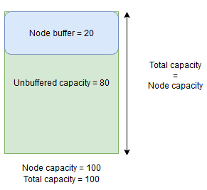
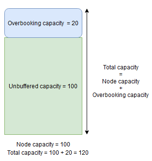

# Describe a Service Fabric cluster by using Cluster Resource Manager

The Cluster Resource Manager feature of Azure Service Fabric provides several mechanisms for describing a cluster:

* Fault domains
* Upgrade domains
* Node properties
* Node capacities

During runtime, Cluster Resource Manager uses this information to ensure high availability of the services running in the cluster. While enforcing these important rules, it also tries to optimize resource consumption within the cluster.

## Fault domains

A fault domain is any area of coordinated failure. A single machine is a fault domain. It can fail on its own for various reasons, from power supply failures to drive failures to bad NIC firmware.

Machines connected to the same Ethernet switch are in the same fault domain. So are machines that share a single source of power or in a single location.

Because it's natural for hardware faults to overlap, fault domains are inherently hierarchical. They're represented as URIs in Service Fabric.

It's important that fault domains are set up correctly because Service Fabric uses this information to safely place services. Service Fabric doesn't want to place services such that the loss of a fault domain (caused by the failure of some component) causes a service to go down.

In the Azure environment, Service Fabric uses the fault domain information provided by the environment to correctly configure the nodes in the cluster on your behalf. For standalone instances of Service Fabric, fault domains are defined at the time that the cluster is set up.

> [!WARNING]
> It's important that the fault domain information provided to Service Fabric is accurate. For example, let's say that your Service Fabric cluster's nodes are running inside 10 virtual machines, running on 5 physical hosts. In this case, even though there are 10 virtual machines, there are only 5 different (top level) fault domains. Sharing the same physical host causes VMs to share the same root fault domain, because the VMs experience coordinated failure if their physical host fails.  
>
> Service Fabric expects the fault domain of a node not to change. Other mechanisms of ensuring high availability of the VMs, such as [HA-VMs](/previous-versions/system-center/virtual-machine-manager-2008-r2/cc967323(v=technet.10)), might cause conflicts with Service Fabric. These mechanisms use transparent migration of VMs from one host to another. They don't reconfigure or notify the running code inside the VM. As such, they're *not supported* as environments for running Service Fabric clusters. 
>
> Service Fabric should be the only high-availability technology employed. Mechanisms like live VM migration and SANs are not necessary. If these mechanisms are used in conjunction with Service Fabric, they _reduce_ application availability and reliability. The reason is that they introduce additional complexity, add centralized sources of failure, and use reliability and availability strategies that conflict with those in Service Fabric.
>
>

In the following graphic, we color all the entities that contribute to fault domains and list all the different fault domains that result. In this example, we have datacenters ("DC"), racks ("R"), and blades ("B"). If each blade holds more than one virtual machine, there might be another layer in the fault domain hierarchy.

![Nodes organized via fault domains][Image1]

During runtime, Service Fabric Cluster Resource Manager considers the fault domains in the cluster and plans layouts. The stateful replicas or stateless instances for a service are distributed so they're in separate fault domains. Distributing the service across fault domains ensures that the availability of the service isn't compromised when a fault domain fails at any level of the hierarchy.

Cluster Resource Manager doesn’t care how many layers there are in the fault domain hierarchy. It tries to ensure that the loss of any one portion of the hierarchy doesn’t affect services running in it.

It's best if the same number of nodes is at each level of depth in the fault domain hierarchy. If the “tree” of fault domains is unbalanced in your cluster, it's harder for Cluster Resource Manager to figure out the best allocation of services. Imbalanced fault domain layouts mean that the loss of some domains affects the availability of services more than other domains. As a result, Cluster Resource Manager is torn between two goals:

* It wants to use the machines in that “heavy” domain by placing services on them. 
* It wants to place services in other domains so that the loss of a domain doesn’t cause problems.

What do imbalanced domains look like? The following diagram shows two different cluster layouts. In the first example, the nodes are distributed evenly across the fault domains. In the second example, one fault domain has many more nodes than the other fault domains.

![Two different cluster layouts][Image2]

In Azure, the choice of which fault domain contains a node is managed for you. But depending on the number of nodes that you provision, you can still end up with fault domains that have more nodes in them than in others.

For example, say you have five fault domains in the cluster but provision seven nodes for a node type (**NodeType**). In this case, the first two fault domains end up with more nodes. If you continue to deploy more **NodeType** instances with only a couple of instances, the problem gets worse. For this reason, we recommend that the number of nodes in each node type is a multiple of the number of fault domains.

## Upgrade domains

Upgrade domains are another feature that helps Service Fabric Cluster Resource Manager understand the layout of the cluster. Upgrade domains define sets of nodes that are upgraded at the same time. Upgrade domains help Cluster Resource Manager understand and orchestrate management operations like upgrades.

Upgrade domains are a lot like fault domains, but with a couple key differences. First, areas of coordinated hardware failures define fault domains. Upgrade domains, on the other hand, are defined by policy. You get to decide how many you want, instead of letting the environment dictate the number. You can have as many upgrade domains as you do nodes. Another difference between fault domains and upgrade domains is that upgrade domains are not hierarchical. Instead, they're more like a simple tag.

The following diagram shows three upgrade domains striped across three fault domains. It also shows one possible placement for three different replicas of a stateful service, where each ends up in different fault and upgrade domains. This placement allows the loss of a fault domain while in the middle of a service upgrade and still have one copy of the code and data.  

![Placement With fault and upgrade domains][Image3]

There are pros and cons to having large numbers of upgrade domains. More upgrade domains mean each step of the upgrade is more granular and affects a smaller number of nodes or services. Fewer services have to move at a time, introducing less churn into the system. This tends to improve reliability, because less of the service is affected by any issue introduced during the upgrade. More upgrade domains also mean that you need less available buffer on other nodes to handle the impact of the upgrade.

For example, if you have five upgrade domains, the nodes in each are handling roughly 20 percent of your traffic. If you need to take down that upgrade domain for an upgrade, the load usually needs to go somewhere. Because you have four remaining upgrade domains, each must have room for about 25 percent of the total traffic. More upgrade domains mean that you need less buffer on the nodes in the cluster.

Consider if you had 10 upgrade domains instead. In that case, each upgrade domain would be handling only about 10 percent of the total traffic. When an upgrade steps through the cluster, each domain would need to have room for only about 11 percent of the total traffic. More upgrade domains generally allow you to run your nodes at higher utilization, because you need less reserved capacity. The same is true for fault domains.  

The downside of having many upgrade domains is that upgrades tend to take longer. Service Fabric waits a short period after an upgrade domain is completed and performs checks before starting to upgrade the next one. These delays enable detecting issues introduced by the upgrade before the upgrade proceeds. The tradeoff is acceptable because it prevents bad changes from affecting too much of the service at a time.

The presence of too few upgrade domains has many negative side effects. While each upgrade domain is down and being upgraded, a large portion of your overall capacity is unavailable. For example, if you have only three upgrade domains, you're taking down about one-third of your overall service or cluster capacity at a time. Having so much of your service down at once isn’t desirable because you need enough capacity in the rest of your cluster to handle the workload. Maintaining that buffer means that during normal operation, those nodes are less loaded than they would be otherwise. This increases the cost of running your service.

There’s no real limit to the total number of fault or upgrade domains in an environment, or constraints on how they overlap. But there are common patterns:

* Fault domains and upgrade domains mapped 1:1
* One upgrade domain per node (physical or virtual OS instance)
* A “striped” or “matrix” model where the fault domains and upgrade domains form a matrix with machines usually running down the diagonals

![Layouts of fault and upgrade domains][Image4]

There’s no best answer for which layout to choose. Each has pros and cons. For example, the 1FD:1UD model is simple to set up. The model of one upgrade domain per node model is most like what people are used to. During upgrades, each node is updated independently. This is similar to how small sets of machines were upgraded manually in the past.

The most common model is the FD/UD matrix, where the fault domains and upgrade domains form a table and nodes are placed starting along the diagonal. This is the model used by default in Service Fabric clusters in Azure. For clusters with many nodes, everything ends up looking like a dense matrix pattern.

> [!NOTE]
> Service Fabric clusters hosted in Azure don't support changing the default strategy. Only standalone clusters offer that customization.
>

## Fault and upgrade domain constraints and resulting behavior
### Default approach

By default, Cluster Resource Manager keeps services balanced across fault and upgrade domains. This is modeled as a [constraint](service-fabric-cluster-resource-manager-management-integration.md). The constraint for fault and upgrade domains states: “For a given service partition, there should never be a difference greater than one in the number of service objects (stateless service instances or stateful service replicas) between any two domains on the same level of hierarchy.”

Let's say that this constraint provides a “maximum difference” guarantee. The constraint for fault and upgrade domains prevents certain moves or arrangements that violate the rule.

For example, let's say that we have a cluster with six nodes, configured with five fault domains and five upgrade domains.

|  | FD0 | FD1 | FD2 | FD3 | FD4 |
| --- |:---:|:---:|:---:|:---:|:---:|
| **UD0** |N1 | | | | |
| **UD1** |N6 |N2 | | | |
| **UD2** | | |N3 | | |
| **UD3** | | | |N4 | |
| **UD4** | | | | |N5 |

Now let's say that we create a service with a **TargetReplicaSetSize** (or, for a stateless service, **InstanceCount**) value of five. The replicas land on N1-N5. In fact, N6 is never used no matter how many services like this you create. But why? Let's look at the difference between the current layout and what would happen if N6 is chosen.

Here's the layout we got and the total number of replicas per fault and upgrade domain:

|  | FD0 | FD1 | FD2 | FD3 | FD4 | UDTotal |
| --- |:---:|:---:|:---:|:---:|:---:|:---:|
| **UD0** |R1 | | | | |1 |
| **UD1** | |R2 | | | |1 |
| **UD2** | | |R3 | | |1 |
| **UD3** | | | |R4 | |1 |
| **UD4** | | | | |R5 |1 |
| **FDTotal** |1 |1 |1 |1 |1 |- |

This layout is balanced in terms of nodes per fault domain and upgrade domain. It's also balanced in terms of the number of replicas per fault and upgrade domain. Each domain has the same number of nodes and the same number of replicas.

Now, let's look at what would happen if we'd used N6 instead of N2. How would the replicas be distributed then?

|  | FD0 | FD1 | FD2 | FD3 | FD4 | UDTotal |
| --- |:---:|:---:|:---:|:---:|:---:|:---:|
| **UD0** |R1 | | | | |1 |
| **UD1** |R5 | | | | |1 |
| **UD2** | | |R2 | | |1 |
| **UD3** | | | |R3 | |1 |
| **UD4** | | | | |R4 |1 |
| **FDTotal** |2 |0 |1 |1 |1 |- |

This layout violates our definition of the “maximum difference” guarantee for the fault domain constraint. FD0 has two replicas, whereas FD1 has zero. The difference between FD0 and FD1 is a total of two, which is greater than the maximum difference of one. Because the constraint is violated, Cluster Resource Manager does not allow this arrangement.

Similarly, if we picked N2 and N6 (instead of N1 and N2), we'd get:

|  | FD0 | FD1 | FD2 | FD3 | FD4 | UDTotal |
| --- |:---:|:---:|:---:|:---:|:---:|:---:|
| **UD0** | | | | | |0 |
| **UD1** |R5 |R1 | | | |2 |
| **UD2** | | |R2 | | |1 |
| **UD3** | | | |R3 | |1 |
| **UD4** | | | | |R4 |1 |
| **FDTotal** |1 |1 |1 |1 |1 |- |

This layout is balanced in terms of fault domains. But now it's violating the upgrade domain constraint, because UD0 has zero replicas and UD1 has two. This layout is also invalid and won't be picked by Cluster Resource Manager.

This approach to the distribution of stateful replicas or stateless instances provides the best possible fault tolerance. If one domain goes down, the minimal number of replicas/instances is lost.

On the other hand, this approach can be too strict and not allow the cluster to utilize all resources. For certain cluster configurations, certain nodes can't be used. This can cause Service Fabric to not place your services, resulting in warning messages. In the previous example, some of the cluster nodes can’t be used (N6 in the example). Even if you added nodes to that cluster (N7-N10), replicas/instances would be placed only on N1–N5 because of constraints on fault and upgrade domains.

|  | FD0 | FD1 | FD2 | FD3 | FD4 |
| --- |:---:|:---:|:---:|:---:|:---:|
| **UD0** |N1 | | | |N10 |
| **UD1** |N6 |N2 | | | |
| **UD2** | |N7 |N3 | | |
| **UD3** | | |N8 |N4 | |
| **UD4** | | | |N9 |N5 |

### Alternative approach

Cluster Resource Manager supports another version of the constraint for fault and upgrade domains. It allows placement while still guaranteeing a minimum level of safety. The alternative constraint can be stated as follows: “For a given service partition, replica distribution across domains should ensure that the partition does not suffer a quorum loss.” Let’s say that this constraint provides a “quorum safe” guarantee.

> [!NOTE]
> For a stateful service, we define *quorum loss* in a situation when a majority of the partition replicas are down at the same time. For example, if **TargetReplicaSetSize** is five, a set of any three replicas represents quorum. Similarly, if **TargetReplicaSetSize** is six, four replicas are necessary for quorum. In both cases, no more than two replicas can be down at the same time if the partition wants to continue functioning normally.
>
> For a stateless service, there's no such thing as *quorum loss*. Stateless services continue to function normally even if a majority of instances go down at the same time. So, we'll focus on stateful services in the rest of this article.
>

Let’s go back to the previous example. With the “quorum safe” version of the constraint, all three layouts would be valid. Even if FD0 failed in the second layout or UD1 failed in the third layout, the partition would still have quorum. (A majority of the replicas would still be up.) With this version of the constraint, N6 can almost always be utilized.

The “quorum safe” approach provides more flexibility than the “maximum difference” approach. The reason is that it's easier to find replica distributions that are valid in almost any cluster topology. However, this approach can’t guarantee the best fault tolerance characteristics because some failures are worse than others.

In the worst case scenario, a majority of the replicas can be lost with the failure of one domain and one additional replica. For example, instead of three failures being required to lose quorum with five replicas or instances, you can now lose a majority with just two failures.

### Adaptive approach

Because both approaches have strengths and weaknesses, we've introduced an adaptive approach that combines these two strategies.

> [!NOTE]
> This is the default behavior starting with Service Fabric version 6.2.
>
> The adaptive approach uses the “maximum difference” logic by default and switches to the “quorum safe” logic only when necessary. Cluster Resource Manager automatically figures out which strategy is necessary by looking at how the cluster and services are configured.
>
> Cluster Resource Manager should use the “quorum based” logic for a service both of these conditions are true:
>
> * **TargetReplicaSetSize** for the service is evenly divisible by the number of fault domains and the number of upgrade domains.
> * The number of nodes is less than or equal to the number of fault domains multiplied by the number of upgrade domains.
>
> Bear in mind that Cluster Resource Manager will use this approach for both stateless and stateful services, even though quorum loss isn't relevant for stateless services.

Let’s go back to the previous example and assume that a cluster now has eight nodes. The cluster is still configured with five fault domains and five upgrade domains, and the **TargetReplicaSetSize** value of a service hosted on that cluster remains five.

|  | FD0 | FD1 | FD2 | FD3 | FD4 |
| --- |:---:|:---:|:---:|:---:|:---:|
| **UD0** |N1 | | | | |
| **UD1** |N6 |N2 | | | |
| **UD2** | |N7 |N3 | | |
| **UD3** | | |N8 |N4 | |
| **UD4** | | | | |N5 |

Because all necessary conditions are satisfied, Cluster Resource Manager will use the “quorum based” logic in distributing the service. This enables usage of N6-N8. One possible service distribution in this case might look like this:

|  | FD0 | FD1 | FD2 | FD3 | FD4 | UDTotal |
| --- |:---:|:---:|:---:|:---:|:---:|:---:|
| **UD0** |R1 | | | | |1 |
| **UD1** |R2 | | | | |1 |
| **UD2** | |R3 |R4 | | |2 |
| **UD3** | | | | | |0 |
| **UD4** | | | | |R5 |1 |
| **FDTotal** |2 |1 |1 |0 |1 |- |

If your service’s **TargetReplicaSetSize** value is reduced to four (for example), Cluster Resource Manager will notice that change. It will resume using the “maximum difference” logic because **TargetReplicaSetSize** isn’t dividable by the number of fault domains and upgrade domains anymore. As a result, certain replica movements will occur to distribute the remaining four replicas on nodes N1-N5. That way, the “maximum difference” version of the fault domain and upgrade domain logic is not violated.

In the previous layout, if the **TargetReplicaSetSize** value is five and N1 is removed from the cluster, the number of upgrade domains becomes equal to four. Again, Cluster Resource Manager starts using “maximum difference” logic because the number of upgrade domains doesn’t evenly divide the service’s **TargetReplicaSetSize** value anymore. As a result, replica R1, when built again, has to land on N4 so that the constraint for the fault and upgrade domain is not violated.

|  | FD0 | FD1 | FD2 | FD3 | FD4 | UDTotal |
| --- |:---:|:---:|:---:|:---:|:---:|:---:|
| **UD0** |N/A |N/A |N/A |N/A |N/A |N/A |
| **UD1** |R2 | | | | |1 |
| **UD2** | |R3 |R4 | | |2 |
| **UD3** | | | |R1 | |1 |
| **UD4** | | | | |R5 |1 |
| **FDTotal** |1 |1 |1 |1 |1 |- |

## Configuring fault and upgrade domains

In Azure-hosted Service Fabric deployments, fault domains and upgrade domains are defined automatically. Service Fabric picks up and uses the environment information from Azure.

If you’re creating your own cluster (or want to run a particular topology in development), you can provide the fault domain and upgrade domain information yourself. In this example, we define a nine-node local development cluster that spans three datacenters (each with three racks). This cluster also has three upgrade domains striped across those three datacenters. Here's an example of the configuration in ClusterManifest.xml:

```xml
  <Infrastructure>
    <!-- IsScaleMin indicates that this cluster runs on one box/one single server -->
    <WindowsServer IsScaleMin="true">
      <NodeList>
        <Node NodeName="Node01" IPAddressOrFQDN="localhost" NodeTypeRef="NodeType01" FaultDomain="fd:/DC01/Rack01" UpgradeDomain="UpgradeDomain1" IsSeedNode="true" />
        <Node NodeName="Node02" IPAddressOrFQDN="localhost" NodeTypeRef="NodeType02" FaultDomain="fd:/DC01/Rack02" UpgradeDomain="UpgradeDomain2" IsSeedNode="true" />
        <Node NodeName="Node03" IPAddressOrFQDN="localhost" NodeTypeRef="NodeType03" FaultDomain="fd:/DC01/Rack03" UpgradeDomain="UpgradeDomain3" IsSeedNode="true" />
        <Node NodeName="Node04" IPAddressOrFQDN="localhost" NodeTypeRef="NodeType04" FaultDomain="fd:/DC02/Rack01" UpgradeDomain="UpgradeDomain1" IsSeedNode="true" />
        <Node NodeName="Node05" IPAddressOrFQDN="localhost" NodeTypeRef="NodeType05" FaultDomain="fd:/DC02/Rack02" UpgradeDomain="UpgradeDomain2" IsSeedNode="true" />
        <Node NodeName="Node06" IPAddressOrFQDN="localhost" NodeTypeRef="NodeType06" FaultDomain="fd:/DC02/Rack03" UpgradeDomain="UpgradeDomain3" IsSeedNode="true" />
        <Node NodeName="Node07" IPAddressOrFQDN="localhost" NodeTypeRef="NodeType07" FaultDomain="fd:/DC03/Rack01" UpgradeDomain="UpgradeDomain1" IsSeedNode="true" />
        <Node NodeName="Node08" IPAddressOrFQDN="localhost" NodeTypeRef="NodeType08" FaultDomain="fd:/DC03/Rack02" UpgradeDomain="UpgradeDomain2" IsSeedNode="true" />
        <Node NodeName="Node09" IPAddressOrFQDN="localhost" NodeTypeRef="NodeType09" FaultDomain="fd:/DC03/Rack03" UpgradeDomain="UpgradeDomain3" IsSeedNode="true" />
      </NodeList>
    </WindowsServer>
  </Infrastructure>
```

This example uses ClusterConfig.json for standalone deployments:

```json
"nodes": [
  {
    "nodeName": "vm1",
    "iPAddress": "localhost",
    "nodeTypeRef": "NodeType0",
    "faultDomain": "fd:/dc1/r0",
    "upgradeDomain": "UD1"
  },
  {
    "nodeName": "vm2",
    "iPAddress": "localhost",
    "nodeTypeRef": "NodeType0",
    "faultDomain": "fd:/dc1/r0",
    "upgradeDomain": "UD2"
  },
  {
    "nodeName": "vm3",
    "iPAddress": "localhost",
    "nodeTypeRef": "NodeType0",
    "faultDomain": "fd:/dc1/r0",
    "upgradeDomain": "UD3"
  },
  {
    "nodeName": "vm4",
    "iPAddress": "localhost",
    "nodeTypeRef": "NodeType0",
    "faultDomain": "fd:/dc2/r0",
    "upgradeDomain": "UD1"
  },
  {
    "nodeName": "vm5",
    "iPAddress": "localhost",
    "nodeTypeRef": "NodeType0",
    "faultDomain": "fd:/dc2/r0",
    "upgradeDomain": "UD2"
  },
  {
    "nodeName": "vm6",
    "iPAddress": "localhost",
    "nodeTypeRef": "NodeType0",
    "faultDomain": "fd:/dc2/r0",
    "upgradeDomain": "UD3"
  },
  {
    "nodeName": "vm7",
    "iPAddress": "localhost",
    "nodeTypeRef": "NodeType0",
    "faultDomain": "fd:/dc3/r0",
    "upgradeDomain": "UD1"
  },
  {
    "nodeName": "vm8",
    "iPAddress": "localhost",
    "nodeTypeRef": "NodeType0",
    "faultDomain": "fd:/dc3/r0",
    "upgradeDomain": "UD2"
  },
  {
    "nodeName": "vm9",
    "iPAddress": "localhost",
    "nodeTypeRef": "NodeType0",
    "faultDomain": "fd:/dc3/r0",
    "upgradeDomain": "UD3"
  }
],
```

> [!NOTE]
> When you're defining clusters via Azure Resource Manager, Azure assigns fault domains and upgrade domains. So the definition of your node types and virtual machine scale sets in your Azure Resource Manager template doesn't include information about fault domain or upgrade domain.
>

## Node properties and placement constraints

Sometimes (in fact, most of the time) you’ll want to ensure that certain workloads run only on certain types of nodes in the cluster. For example, some workloads might require GPUs or SSDs, and others might not.

A great example of targeting hardware to particular workloads is almost every n-tier architecture. Certain machines serve as the front end or API-serving side of the application and are exposed to the clients or the internet. Different machines, often with different hardware resources, handle the work of the compute or storage layers. These are usually _not_ directly exposed to clients or the internet.

Service Fabric expects that in some cases, particular workloads might need to run on particular hardware configurations. For example:

* An existing n-tier application has been “lifted and shifted” into a Service Fabric environment.
* A workload must be run on specific hardware for performance, scale, or security isolation reasons.
* A workload should be isolated from other workloads for policy or resource consumption reasons.

To support these sorts of configurations, Service Fabric includes tags that you can apply to nodes. These tags are called *node properties*. *Placement constraints* are the statements attached to individual services that you select for one or more node properties. Placement constraints define where services should run. The set of constraints is extensible. Any key/value pair can work.

![Different workloads for a cluster layout][Image5]

### Built-in node properties

Service Fabric defines some default node properties that can be used automatically so you don't have to define them. The default properties defined at each node are **NodeType** and **NodeName**.

For example, you can write a placement constraint as `"(NodeType == NodeType03)"`. **NodeType** is a commonly used property. It's useful because it corresponds 1:1 with a type of a machine. Each type of machine corresponds to a type of workload in a traditional n-tier application.

![Placement constraints and node properties][Image6]

## Placement constraints and node property syntax

The value specified in the node property can be a string, Boolean, or signed long. The statement at the service is called a placement *constraint* because it constrains where the service can run in the cluster. The constraint can be any Boolean statement that operates on the node properties in the cluster. The valid selectors in these Boolean statements are:

* Conditional checks for creating particular statements:

  | Statement | Syntax |
  | --- |:---:|
  | "equal to" | "==" |
  | "not equal to" | "!=" |
  | "greater than" | ">" |
  | "greater than or equal to" | ">=" |
  | "less than" | "<" |
  | "less than or equal to" | "<=" |

* Boolean statements for grouping and logical operations:

  | Statement | Syntax |
  | --- |:---:|
  | "and" | "&&" |
  | "or" | "&#124;&#124;" |
  | "not" | "!" |
  | "group as single statement" | "()" |

Here are some examples of basic constraint statements:

* `"Value >= 5"`
* `"NodeColor != green"`
* `"((OneProperty < 100) || ((AnotherProperty == false) && (OneProperty >= 100)))"`

Only nodes where the overall placement constraint statement evaluates to “True” can have the service placed on it. Nodes that don't have a property defined don't match any placement constraint that contains the property.

Let’s say that the following node properties were defined for a node type in ClusterManifest.xml:

```xml
    <NodeType Name="NodeType01">
      <PlacementProperties>
        <Property Name="HasSSD" Value="true"/>
        <Property Name="NodeColor" Value="green"/>
        <Property Name="SomeProperty" Value="5"/>
      </PlacementProperties>
    </NodeType>
```

The following example shows node properties defined via ClusterConfig.json for standalone deployments or Template.json for Azure-hosted clusters.

> [!NOTE]
> In your Azure Resource Manager template, the node type is usually parameterized. It would look like `"[parameters('vmNodeType1Name')]"` rather than NodeType01.
>

```json
"nodeTypes": [
    {
        "name": "NodeType01",
        "placementProperties": {
            "HasSSD": "true",
            "NodeColor": "green",
            "SomeProperty": "5"
        },
    }
],
```

You can create service placement *constraints* for a service as follows:

```csharp
FabricClient fabricClient = new FabricClient();
StatefulServiceDescription serviceDescription = new StatefulServiceDescription();
serviceDescription.PlacementConstraints = "(HasSSD == true && SomeProperty >= 4)";
// Add other required ServiceDescription fields
//...
await fabricClient.ServiceManager.CreateServiceAsync(serviceDescription);
```

```PowerShell
New-ServiceFabricService -ApplicationName $applicationName -ServiceName $serviceName -ServiceTypeName $serviceType -Stateful -MinReplicaSetSize 3 -TargetReplicaSetSize 3 -PartitionSchemeSingleton -PlacementConstraint "HasSSD == true && SomeProperty >= 4"
```

If all nodes of NodeType01 are valid, you can also select that node type with the constraint `"(NodeType == NodeType01)"`.

A service’s placement constraints can be updated dynamically during runtime. If you need to, you can move a service around in the cluster, add and remove requirements, and so on. Service Fabric ensures that the service stays up and available even when these types of changes are made.

```csharp
StatefulServiceUpdateDescription updateDescription = new StatefulServiceUpdateDescription();
updateDescription.PlacementConstraints = "NodeType == NodeType01";
await fabricClient.ServiceManager.UpdateServiceAsync(new Uri("fabric:/app/service"), updateDescription);
```

```PowerShell
Update-ServiceFabricService -Stateful -ServiceName $serviceName -PlacementConstraints "NodeType == NodeType01"
```

Placement constraints are specified for every named service instance. Updates always take the place of (overwrite) what was previously specified.

The cluster definition defines the properties on a node. Changing a node's properties requires an upgrade to the cluster configuration. Upgrading a node's properties requires each affected node to restart to report its new properties. Service Fabric manages these rolling upgrades.

## Describing and managing cluster resources

One of the most important jobs of any orchestrator is to help manage resource consumption in the cluster. Managing cluster resources can mean a couple of different things.

First, there's ensuring that machines are not overloaded. This means making sure that machines aren't running more services than they can handle.

Second, there's balancing and optimization, which are critical to running services efficiently. Cost-effective or performance-sensitive service offerings can't allow some nodes to be hot while others are cold. Hot nodes lead to resource contention and poor performance. Cold nodes represent wasted resources and increased costs.

Service Fabric represents resources as *metrics*. Metrics are any logical or physical resource that you want to describe to Service Fabric. Examples of metrics are “WorkQueueDepth” or “MemoryInMb.” For information about the physical resources that Service Fabric can govern on nodes, see [Resource governance](service-fabric-resource-governance.md). For information on the default metrics used by the Cluster Resource Manager and how to configure custom metrics, see [this article](service-fabric-cluster-resource-manager-metrics.md).

Metrics are different from placement constraints and node properties. Node properties are static descriptors of the nodes themselves. Metrics describe resources that nodes have and that services consume when they run on a node. A node property might be **HasSSD** and might be set to true or false. The amount of space available on that SSD and how much is consumed by services would be a metric like “DriveSpaceInMb.”

Just like for placement constraints and node properties, Service Fabric Cluster Resource Manager doesn't understand what the names of the metrics mean. Metric names are just strings. It's a good practice to declare units as a part of the metric names that you create when they might be ambiguous.

## Capacity

If you turned off all resource *balancing*, Service Fabric Cluster Resource Manager would still ensure that no node goes over its capacity. Managing capacity overruns is possible unless the cluster is too full or the workload is larger than any node. Capacity is another *constraint* that Cluster Resource Manager uses to understand how much of a resource a node has. Remaining capacity is also tracked for the cluster as a whole.

Both the capacity and the consumption at the service level are expressed in terms of metrics. For example, the metric might be "ClientConnections" and a node might have a capacity for "ClientConnections" of 32,768. Other nodes can have other limits. A service running on that node can say it's currently consuming 32,256 of the metric "ClientConnections."

During runtime, Cluster Resource Manager tracks remaining capacity in the cluster and on nodes. To track capacity, Cluster Resource Manager subtracts each service's usage from a node's capacity where the service runs. With this information, Cluster Resource Manager can figure out where to place or move replicas so that nodes don’t go over capacity.

![Cluster nodes and capacity][Image7]

```csharp
StatefulServiceDescription serviceDescription = new StatefulServiceDescription();
ServiceLoadMetricDescription metric = new ServiceLoadMetricDescription();
metric.Name = "ClientConnections";
metric.PrimaryDefaultLoad = 1024;
metric.SecondaryDefaultLoad = 0;
metric.Weight = ServiceLoadMetricWeight.High;
serviceDescription.Metrics.Add(metric);
await fabricClient.ServiceManager.CreateServiceAsync(serviceDescription);
```

```PowerShell
New-ServiceFabricService -ApplicationName $applicationName -ServiceName $serviceName -ServiceTypeName $serviceTypeName –Stateful -MinReplicaSetSize 3 -TargetReplicaSetSize 3 -PartitionSchemeSingleton –Metric @("ClientConnections,High,1024,0)
```

You can see capacities defined in the cluster manifest. Here's an example for ClusterManifest.xml:

```xml
    <NodeType Name="NodeType03">
      <Capacities>
        <Capacity Name="ClientConnections" Value="65536"/>
      </Capacities>
    </NodeType>
```

Here's an example of capacities defined via ClusterConfig.json for standalone deployments or Template.json for Azure-hosted clusters:

```json
"nodeTypes": [
    {
        "name": "NodeType03",
        "capacities": {
            "ClientConnections": "65536",
        }
    }
],
```

A service’s load often changes dynamically. Say that a replica's load of "ClientConnections" changed from 1,024 to 2,048. The node that it was running on then had a capacity of only 512 remaining for that metric. Now that replica or instance's placement is invalid, because there's not enough room on that node. Cluster Resource Manager has to get the node back below capacity. It reduces load on the node that's over capacity by moving one or more of the replicas or instances from that node to other nodes.

Cluster Resource Manager tries to minimize the cost of moving replicas. You can learn more about [movement cost](service-fabric-cluster-resource-manager-movement-cost.md) and about [rebalancing strategies and rules](service-fabric-cluster-resource-manager-metrics.md).

## Cluster capacity

How does the Service Fabric Cluster Resource Manager keep the overall cluster from being too full? With dynamic load, there’s not a lot it can do. Services can have their load spike independently of actions that Cluster Resource Manager takes. As a result, your cluster with plenty of headroom today might be underpowered if there's a spike tomorrow.

Controls in Cluster Resource Manager help prevent problems. The first thing you can do is prevent the creation of new workloads that would cause the cluster to become full.

Let's say that you create a stateless service, and it has some load associated with it. The service cares about the "DiskSpaceInMb" metric. The service will consume five units of "DiskSpaceInMb" for every instance of the service. You want to create three instances of the service. That means you need 15 units of "DiskSpaceInMb" to be present in the cluster for you to even create these service instances.

Cluster Resource Manager continually calculates the capacity and consumption of each metric so it can determine the remaining capacity in the cluster. If there isn't enough space, Cluster Resource Manager rejects the call to create a service.

Because the requirement is only that 15 units will be available, you can allocate this space in many different ways. For example, there might be one remaining unit of capacity on 15 different nodes, or three remaining units of capacity on five different nodes. If Cluster Resource Manager can rearrange things so there are five units available on three nodes, it places the service. Rearranging the cluster is usually possible unless the cluster is almost full or the existing services can't be consolidated for some reason.

## Node buffer and overbooking capacity

If a node capacity for a metric is specified, Cluster Resource Manager will never place or move replicas to a node if total load would go above the specified node capacity. This can sometimes prevent placement of new replicas or replacing failed replicas if the cluster is near full capacity and a replica with a large load must be placed, replaced or moved.

In order to provide more flexibility you can specify either node buffer or overbooking capacity. When node buffer or overbooking capacity is specified for a metric, the Cluster Resource Manager will attempt to place or move replicas in such a way that the buffer or overbooking capacity remains unused, but allows the buffer or overbooking capacity to be used if necessary for actions that increase service availability such as:

* New replica placement or replacing failed replicas
* Placement during upgrades
* Fixing of soft and hard constraint violations
* Defragmentation

Node buffer capacity represents a reserved portion of capacity below specified node capacity and overbooking capacity represents a portion of extra capacity above specified node capacity. In both cases the Cluster Resource Manager will attempt to keep this capacity free.

For example, if a node has a specified capacity for metric *CpuUtilization* of 100 and node buffer percentage for that metric is set to 20%, then total and unbuffered capacities will be 100 and 80, respectively, and the Cluster Resource Manager will not place more than 80 units of load onto the node during normal circumstances.



Node buffer should be used when you want to reserve a portion of node capacity that will only be used for actions that increase service availability mentioned above.

On the other hand, if node overbooking percentage is used and set to 20% then total and unbuffered capacities will be 120 and 100, respectively.



Overbooking capacity should be used when you want to allow Cluster Resource Manager to place replicas on a node even if their total resource usage would exceed capacity. This can be used to provide additional availability for services at the expense of performance. If overbooking is used, user application logic needs to be able to function with fewer physical resources than it might require.

If node buffer or overbooking capacities are specified, Cluster Resource Manager will not move or place replicas if the total load on target node would go over total capacity (node capacity in case of node buffer and node capacity + overbooking capacity in case of overbooking).

Overbooking capacity can also be specified to be infinite. In this case, Cluster Resource Manager will attempt to keep the total load on the node below the specified node capacity but is allowed to potentially place a far greater load on the node which might lead to serious performance degradation.

A metric cannot have both node buffer and overbooking capacity specified for it at the same time.

Here's an example of how to specify node buffer or overbooking capacities in *ClusterManifest.xml*:

```xml
<Section Name="NodeBufferPercentage">
    <Parameter Name="SomeMetric" Value="0.15" />
</Section>
<Section Name="NodeOverbookingPercentage">
    <Parameter Name="SomeOtherMetric" Value="0.2" />
    <Parameter Name=”MetricWithInfiniteOverbooking” Value=”-1.0” />
</Section>
```

Here's an example of how to specify node buffer or overbooking capacities via *ClusterConfig.json* for standalone deployments or *Template.json* for Azure-hosted clusters:

```json
"fabricSettings": [
  {
    "name": "NodeBufferPercentage",
    "parameters": [
      {
          "name": "SomeMetric",
          "value": "0.15"
      }
    ]
  },
  {
    "name": "NodeOverbookingPercentage",
    "parameters": [
      {
          "name": "SomeOtherMetric",
          "value": "0.20"
      },
      {
          "name": "MetricWithInfiniteOverbooking",
          "value": "-1.0"
      }
    ]
  }
]
```

## Next steps

* For information on the architecture and information flow within Cluster Resource Manager, see [Cluster Resource Manager architecture overview](service-fabric-cluster-resource-manager-architecture.md).
* Defining defragmentation metrics is one way to consolidate load on nodes instead of spreading it out. To learn how to configure defragmentation, see [Defragmentation of metrics and load in Service Fabric](service-fabric-cluster-resource-manager-defragmentation-metrics.md).
* Start from the beginning and [get an introduction to Service Fabric Cluster Resource Manager](service-fabric-cluster-resource-manager-introduction.md).
* To learn how Cluster Resource Manager manages and balances load in the cluster, see [Balancing your Service Fabric cluster](service-fabric-cluster-resource-manager-balancing.md).

[Image1]:./media/service-fabric-cluster-resource-manager-cluster-description/cluster-fault-domains.png
[Image2]:./media/service-fabric-cluster-resource-manager-cluster-description/cluster-uneven-fault-domain-layout.png
[Image3]:./media/service-fabric-cluster-resource-manager-cluster-description/cluster-fault-and-upgrade-domains-with-placement.png
[Image4]:./media/service-fabric-cluster-resource-manager-cluster-description/cluster-fault-and-upgrade-domain-layout-strategies.png
[Image5]:./media/service-fabric-cluster-resource-manager-cluster-description/cluster-layout-different-workloads.png
[Image6]:./media/service-fabric-cluster-resource-manager-cluster-description/cluster-placement-constraints-node-properties.png
[Image7]:./media/service-fabric-cluster-resource-manager-cluster-description/cluster-nodes-and-capacity.png
