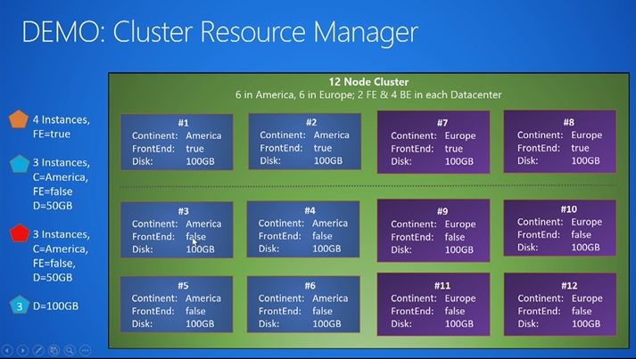

# Introducing the Service Fabric cluster resource manager
Traditionally managing IT systems or a set of services meant getting a few physical or virtual machines dedicated to those specific services or systems. Many major services were broken down into a “web” tier and a “data” or “storage” tier, maybe with a few other specialized components like a cache. Other types of applications would have a messaging tier where requests flowed in and out. This tier would connect to a work tier for any analysis or transformation necessary as a part of the messaging. Each type of workload got specific machines dedicated to it: the database got a couple machines dedicated to it, the web servers a few. If a particular type of workload caused the machines it was on to run too hot, then you added more machines with that same configuration. Most of the time though you replaced a few of the machines with larger machines. Easy. If a machine failed, that part of the overall application ran at lower capacity until the machine could be restored. Still fairly easy (if not necessarily fun).

Now however, let’s say you’ve found a need to scale out and have taken the containers and/or microservice plunge. Suddenly you find yourself with tens, hundreds, or thousands of machines. You have dozens of different types of services (none consuming a full machine's worth of resources), perhaps hundreds of different instances of those services. Each named instance has one or more instances or replicas for High Availability (HA).

Suddenly managing your environment is not so simple as managing a few machines dedicated to single types of workloads. Your servers are virtual and no longer have names (you *have* switched mindsets from [pets to cattle](http://www.slideshare.net/randybias/architectures-for-open-and-scalable-clouds/20) after all). Configuration is less about the machines and more about the services themselves. Dedicated hardware is a thing of the past, and services themselves have become small distributed systems, spanning multiple smaller pieces of commodity hardware.

As a consequence of breaking your formerly monolithic, tiered app into separate services running on commodity hardware, you now have many more combinations to deal with. Who decides what types of workloads can run on which hardware, or how many? Which workloads work well on the same hardware, and which conflict? When a machine goes down… what was even running there? Who is in charge of making sure that workload starts running again? Do you wait for the (virtual?) machine to come back or do your workloads automatically fail over to other machines and keep running? Is human intervention required? What about upgrades in this environment?

As developers and operators dealing with this, we’re going to need some help managing this complexity. You get the sense that a hiring binge and trying to hide the complexity with people is not the right answer.

What to do?

## Introducing orchestrators
An “Orchestrator” is the general term for a piece of software that helps administrators manage these types of environments. Orchestrators are the components that take in requests like “I would like five copies of this service running in my environment”. They try to make the environment match the desired state, no matter what happens.

Orchestrators (not humans) are what swing into action when a machine fails or a workload terminates for some unexpected reason. Most Orchestrators do more than just deal with failure. Other features they have are managing new deployments, handling upgrades, and dealing with resource consumption. All Orchestrators are fundamentally about maintaining some desired state of configuration in the environment. You want to be able to tell an Orchestrator what you want and have it do the heavy lifting. Chronos or Marathon on top of Mesos, Fleet, Docker Datacenter/Docker Swarm, Kubernetes, and Service Fabric are all examples of Orchestrators (or have them built in). More are being created all the time as the complexities of managing real world deployments in different types of environments and conditions grow and change.

## Orchestration as a service
The job of the Orchestrator within a Service Fabric cluster is handled primarily by the Cluster Resource Manager. The Service Fabric Cluster Resource Manager is one of the System Services within Service Fabric and is automatically started up within each cluster. Generally, the Cluster Resource Manager’s job is broken down into three parts:

1. Enforcing Rules
2. Optimizing Your Environment
3. Helping with Other Processes

To see how the Cluster Resource Manager works, watch the following Microsoft Virtual Academy video:

### What it isn’t
In traditional N tier applications there was always some notion of a “Load Balancer”. Usually this was a Network Load Balancer (NLB) or an Application Load Balancer (ALB) depending on where it sat in the networking stack. Some load balancers are Hardware-based like F5’s BigIP offering, others are software-based such as Microsoft’s NLB. In other environments, you might see something like HAProxy or nginx in this role. In these architectures, the job of load balancing is to ensure stateless workloads receive (roughly) the same amount of work. Strategies balancing load varied. Some balancers would send each different call to a different server. Others provided session pinning/stickiness. More advanced balancers use actual estimation or reporting to route a calls based on its expected cost and current machine load.

Network balancers or message routers tried to ensure that the web/worker tier remained roughly balanced. Strategies for balancing the data tier were different and depended on the data storage mechanism, usually centering around data sharding, caching, managed views, stored procedures, and other store-specific mechanisms.

While some of these strategies are interesting, the Service Fabric Cluster Resource Manager is not anything like a network load balancer or a cache. A Network Load Balancer ensures that the frontends are balanced by moving traffic to where the services are running. The Service Fabric Cluster Resource Manager takes a different strategy. Fundamentally, Service Fabric moves *services* to where they make the most sense, expecting traffic or load to follow. For example, it might move services to nodes that are currently cold because the services that are there are not doing much work. The nodes may be cold since the services that were present were deleted or moved elsewhere. As another example, the Cluster Resource Manager could also move a service away from a machine. Perhaps the machine is about to be upgraded or is overloaded due to a spike in consumption by the services running on it.

Because the Cluster Resource Manager is responsible for moving services around (not delivering network traffic to where services already are), it contains a different feature set compared to what you would find in a network load balancer. As we look in more detail, we'll find it employs fundamentally different strategies for ensuring that the hardware resources in the cluster are efficiently utilized.

## Next steps
* For information on the architecture and information flow within the Cluster Resource Manager, check out [this article ](service-fabric-cluster-resource-manager-architecture.md)
* The Cluster Resource Manager has many options for describing the cluster. To find out more about them, check out this article on [describing a Service Fabric cluster](service-fabric-cluster-resource-manager-cluster-description.md)
* For more information about the other options available for configuring services, check out the topic on the other Cluster Resource Manager configurations available [Learn about configuring Services](service-fabric-cluster-resource-manager-configure-services.md)
* Metrics are how the Service Fabric Cluster Resource Manger manages consumption and capacity in the cluster. To learn more about them and how to configure them check out [this article](service-fabric-cluster-resource-manager-metrics.md)
* The Cluster Resource Manager works with Service Fabric's management capabilities. To find out more about that integration, read [this article](service-fabric-cluster-resource-manager-management-integration.md)
* To find out about how the Cluster Resource Manager manages and balances load in the cluster, check out the article on [balancing load](service-fabric-cluster-resource-manager-balancing.md)
