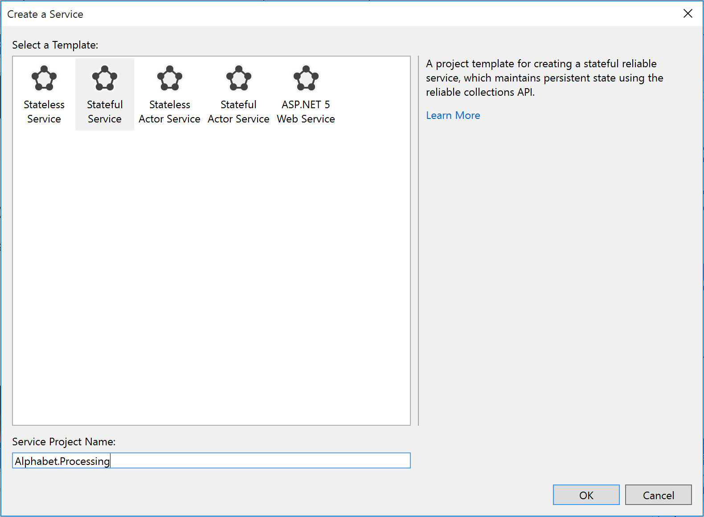

<properties
   pageTitle="Partitioning Service Fabric Services | Microsoft Azure"
   description="Describes how to partition Service Fabric services"
   services="service-fabric"
   documentationCenter=".net"
   authors="bscholl"
   manager="timlt"
   editor=""/>

<tags
   ms.service="service-fabric"
   ms.devlang="dotnet"
   ms.topic="article"
   ms.tgt_pltfrm="NA"
   ms.workload="NA"
   ms.date="08/26/2015"
   ms.author="bscholl"/>

# Getting started with partitioning Service Fabric reliable services
In this article we will cover the basic concepts of Service Fabric service partitions, partition planning and how to build reliable services using partitions.    

## What is partitioning
Partitioning is not unique to Service Fabric, in fact it is a core pattern of building scalable services. In a broader sense we can think about partitioning as a concept of dividing state (data) into smaller accessible units to improve performance. A well known form of partitioning is [data partitioning]( https://en.wikipedia.org/wiki/Partition_(database)) also known as sharding.

### Service Fabric service partitioning
Service Fabric provides service partitioning for both stateless and stateful services.
### Partitioning stateless services
For stateless services you can think about a partition being a logical unit that contains one or more instances of a service. Figure 1 shows a stateless service with 5 instances distributed across a cluster using one partition. This, multiple instances in one partition, is in fact the most common configuration for a stateless service. The only times you want to consider multiple partitions for stateless service instances is when you need to meet special routing requests for example users with a certain id should only be served by a particular service instance or you have a truly partitioned backend, e.g. a sharded SQL database, and you want to control which service instance should write to the database shard. Again those are very rare scenarios that can also be solved in other ways.


For the remainder of this walkthrough we focus on stateful services.

### Partitioning stateful services
Service Fabric makes it easy to develop stateful services that scale by offering a first-class way to partition state. Please note that state also refers to data in this context. Just as with databases, partitioning in this case refers to the process of determining that a particular service or set of services is responsible for a portion of the complete state of the service. It enables each service to individually address only a portion of the complete state. As a result the load is better distributed, the overall performance of the application is improved, and contention on access to chunks of data is reduced.

Conceptually we can think about a partition of a stateful service being a unit that is made [highly available](service-fabric-availability-services.md) through [replicas](service-fabric-availability-services.md) of partitions that are distributed and balanced across the nodes in the cluster.

What does that mean?
Let's say we start with a 5 node cluster and 10 partitions. In this case we would end up with 2 primary [replicas](service-fabric-availability-services.md) per node, if we now scale out our cluster to 10 nodes Service Fabric would rebalance the primary [replicas](service-fabric-availability-services.md) across all 10 nodes. Likewise if we scaled back to 5 nodes Service Fabric would rebalance all the replicas across the 5 nodes.  

Figure 2 shows the distribution of 10 partitions before and after a scale out.


## Planning for partitioning
Before implementing a service we should always think about our partitioning strategy. For a detailed planning guide see [the capacity planning guide](http://en.wikipedia.org/wiki/Hash_function).
For the context of this article we keep it a higher level and just look at some of the important aspects to get us started.

A good approach is to think about the structure of the state that needs to be partitioned as the first step.

Let's look at the following simple example. If we were to build a service for a county wide poll we could say we want to create a partition for every city in the county and store the state of polls for every user in a city in its partition. The image below shows the distribution for a small amount of state and just a view cities.


As the population of cities varies widely we may end up with partitions that contain lots of state (e.g. Seattle) and partitions with very little state (e.g. Kirkland). So what is the impact of having partitions with unevenly amounts of state?  

If we think about our little sample we can easily see that the partition that holds the votes for Seattle will get way more traffic than the Kirkland one. As we have seen before Service Fabric makes sure that there is about the same number of primaries and secondary replicas on each node by default, so we may end up with nodes that hold replicas that serve a lot of traffic and others that serve very little traffic. As we want to avoid hot and cold spots in a cluster this is not an ideal situation.

From a partitioning strategy we should do two things:

- try to partition the state so that it is evenly distributed across all partitions.
- [Report load for the service (add topic)](). Service Fabric provides the capability to report load, such as amount of memory or number of records, on a service. Based on the load reported Service Fabric will detect that some partitions have to serve higher loads than others and balance the cluster out by moving replicas around.

Sometimes we cannot know with how much data we will end up, so a general recommendation is to do both, try to find a partitioning strategy that spreads the data evenly across the partitions and report load.  

Another aspect of partition planning is to choose the right amount of partitions to begin with.
From a Service Fabric perspective there is nothing preventing us from starting out with the highest number of partitions anticipated for our scenario.
In fact assuming the maximum number of partitions is a valid approach given the fact that we cannot increase the number of partitions after the fact.
>[AZURE.NOTE] In order to increase partitions after the fact one would need to create a new service instance of the same service type and implement some logic that routes the request between the two service instances based on the hash.

The limiting factors of this approach are the machine resources available. As the state needs to be accessed and stored we are bound to following machine resources:

- Estimated level on concurrent partition activity
- Limits of network bandwidth
- Limits of system memory
- Limits of disk storage

So what happens if we went with the maximum number of partitions and we run into resource constraints in our cluster? The answer is that we can simply scale out our cluster to accommodate the new requirements.

[The capacity planning guide](http://en.wikipedia.org/wiki/Hash_function) offers sample calculations for how many partitions you can fit on node based on some input parameters.

## Choosing a partitioning scheme
Service Fabric supports three partition schemes.

- Ranged Partitioning Scheme (UniformInt64Partition)
- Named Partitioning Scheme
- Singleton Partitioning Scheme

Named and Singleton partitioning schemes are really just a special form of ranged partitions. By default Visual Studio uses the ranged partitioning scheme as it is the most common and useful one. For the remainder of this article we will focus on the ranged partitioning scheme.

### Ranged Partitioning Scheme
This is used to specify an integer range (identified by a low and a high key) and a number of partitions (n). It creates n partitions, each responsible for a non-overlapping subrange. Example: A ranged partitioning scheme (for a service with three replicas) with a low key of 0, a high key of 99 and a count of 4 would create 4 partitions as shown below.


The common case is to create a hash for a unique key within a dataset. Some common examples of keys would be a vehicle identification number (VIN), employee ID, or a unique string. Using that unique key you would then create a long hash code, modulus the key range, to use as your key. You can specify upper and lower bounds of the allowed key range.


### Selecting a hash algorithm
An important part of hashing is selecting your hash algorithm. An important consideration is whether the goal is to group similar keys near each other (Locality sensitive hashing), or if activity should be distributed broadly across all partitions (Distribution Hashing).

A good resource for general hash code algorithm choices is [the Wikipedia page on Hash Functions](http://en.wikipedia.org/wiki/Hash_function).

## Building a stateful service with multiple partitions
Now it is time to create our first reliable stateful service with multiple partitions. In this example we build a very simple application where we want to store all last names that start with the same letter in the same partition.

Before we write any code we need to think about the partitions and partition keys. We need 26 partitions, one for each letter in the alphabet, but what about the low and high keys?
As we literally want to have one partition per letter we need to use 0 as the low key and 25 as the high key as each letter is its own key.


>[AZURE.NOTE] This is a very simplified scenario as in reality the distribution would be very uneven. Last names starting with letter S or M are way more common than the ones starting with X or Y.


1. Open Visual Studio -> File New -> Project
2. In the New Project dialog choose Service Fabric application
3. Call the project AlphabetPartitions
4. In the Create a Service dialog choose Stateful Service and call it Alphabet.Processing as shown below.

5. Next set the number of partitions. Open the ApplicationManifest.xml in the AlphabetPartitions project and update the parameter Processing_PartitionCount to 26 as shown below.
```xml
<Parameter Name="Processing_PartitionCount" DefaultValue="26" />
```
We also need to update the LowKey and HighKey properties of the StatefulService element as shown below.
```xml
<Service Name="Processing">
      <StatefulService ServiceTypeName="ProcessingType" TargetReplicaSetSize="[Processing_TargetReplicaSetSize]" MinReplicaSetSize="[Processing_MinReplicaSetSize]">
        <UniformInt64Partition PartitionCount="[Processing_PartitionCount]" LowKey="0" HighKey="25" />
      </StatefulService>
    </Service>
```
6. For the service to be accessible open up an endpoint on a port by adding updating the endpoint element of ServiceManifest.xml (located in the PackageRoot folder) for the Alphabet.Processing service as shown below:
```xml
<Endpoint Name="ProcessingServiceEndpoint" Port="8089" Protocol="http" Type="Internal" />
```
Now the service is configured to listen to an internal endpoint on port 8089 with 26 partitions.
7. Next you need to override the `CreateServiceReplicaListeners()` method of the Processing class.
>[AZURE.NOTE] For this sample we assume that you are using a simple HttpCommunicationListener. More information on reliable service communication can be found [here](service-fabric-reliable-services-communication.md).
8. A partition replica url has the following format `http://nodeip:port/partitionid/replicaid/guid` so you need to make sure that your communication listener listens on the correct endpoints. The code below shows an example.
```
protected override IEnumerable<ServiceReplicaListener> CreateServiceReplicaListeners()
{
            return new[] { new ServiceReplicaListener(CreateInternalListener, "Internal", false) };
}
private ICommunicationListener CreateInternalListener(StatefulServiceInitializationParameters args)
{
        EndpointResourceDescription internalEndpoint = args.CodePackageActivationContext.GetEndpoint("ProcessingServiceEndpoint");
        var uriPrefix = $"{internalEndpoint.Protocol}://+:{internalEndpoint.Port}/"+ $"{ServiceInitializationParameters.PartitionId}/{ServiceInitializationParameters.ReplicaId}"+ $"-{Guid.NewGuid()}/";   // Uniqueness
        var uriPublished = uriPrefix.Replace("+", m_nodeIP);
        return new HttpCommunicationListener(uriPrefix, uriPublished, ProcessInternalRequest);
}
```
9. The last step is to add the processing logic to the service as shown below.
```
protected override async Task RunAsync(CancellationToken cancellationToken)
{
        m_name = await this.StateManager.GetOrAddAsync<IReliableDictionary<string, string>>("lastname");
}
private async Task ProcessInternalRequest(HttpListenerContext context, CancellationToken cancelRequest)
{
            String output = null;
            HttpListenerRequest request = context.Request;
            NameValueCollection parameters = request.QueryString;
            try
            {
                output = await AddUserAsync(parameters);
            }
            catch (Exception ex) { output = ex.Message; }
            using (var response = context.Response)
            {
                if (output != null)
                {
                    byte[] outBytes = Encoding.UTF8.GetBytes(output);
                    response.OutputStream.Write(outBytes, 0, outBytes.Length);
                }
            }
}
private async Task<String> AddUserAsync(NameValueCollection parameters)
{
        String output;
        using (var tx = StateManager.CreateTransaction())
        {
                String user = parameters["lastname"].ToString();
                if (await m_name.TryAddAsync(tx, user.ToUpperInvariant(), user))
                { // Does user already exist
                    await tx.CommitAsync();
                    output = $"User '{user}' successfully added.";
                }
                else output = $"User '{user}' already exists";
        }
        return output;
}
```   

10. For testing the service you need 

This service serves as a simple web interface that accepts the lastname as a query string parameter, determines the partition key and sends it to the Alphabet.Service for processing.

6. In the Create a Service dialog choose Stateful service and call it Alphabet.Processing as shown below.

8. The next step is to add class library project that contains an HttpCommunicationListener which will be used by both the Alphabet.WebApi and the Alphabet.Processing projects.


## Next steps

For information on Service Fabric concepts, see the following:

- [Availability of Service Fabric Services](service-fabric-availability-services.md)

- [Scalability of Service Fabric Services](service-fabric-concepts-scalability.md)
