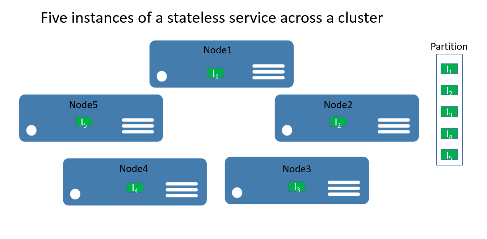
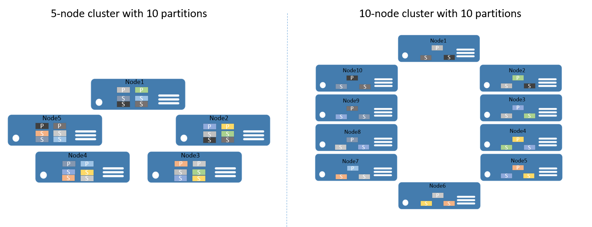
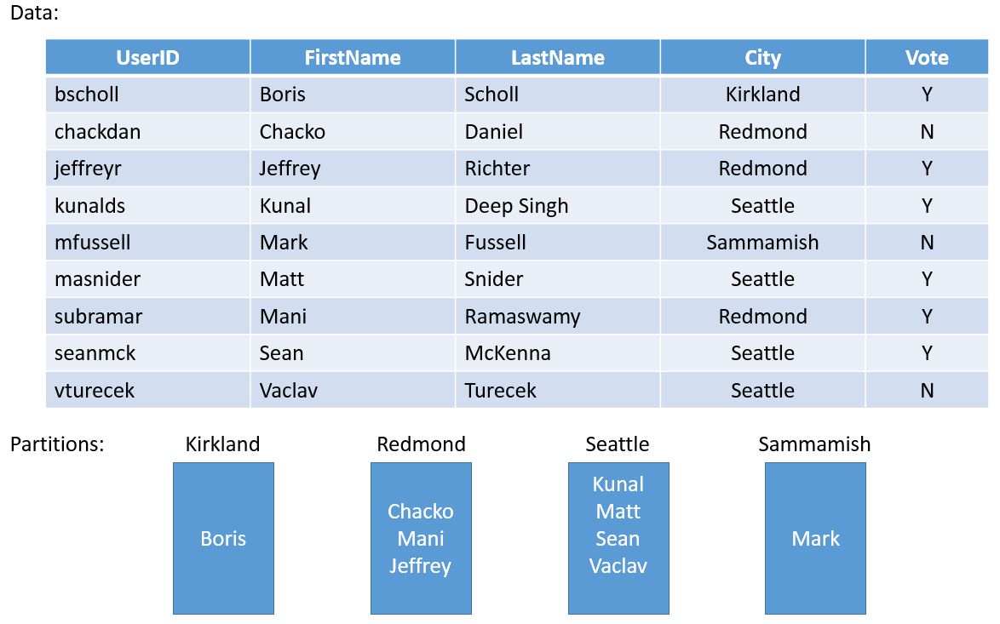
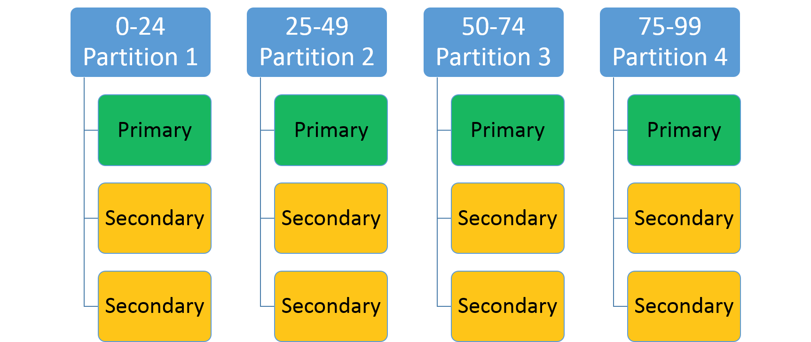
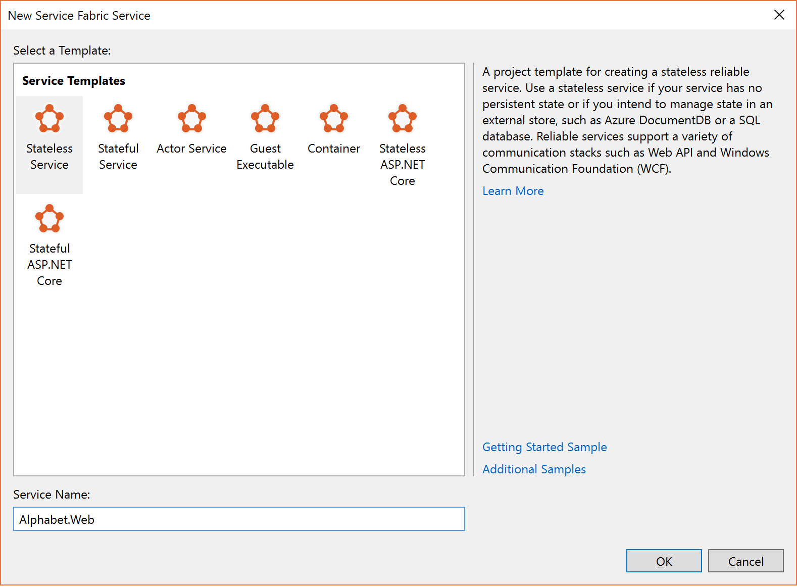
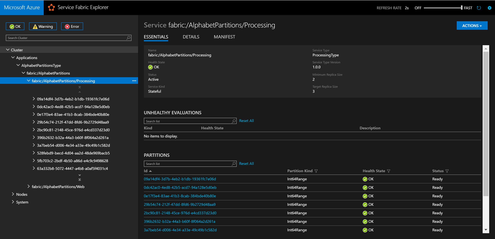
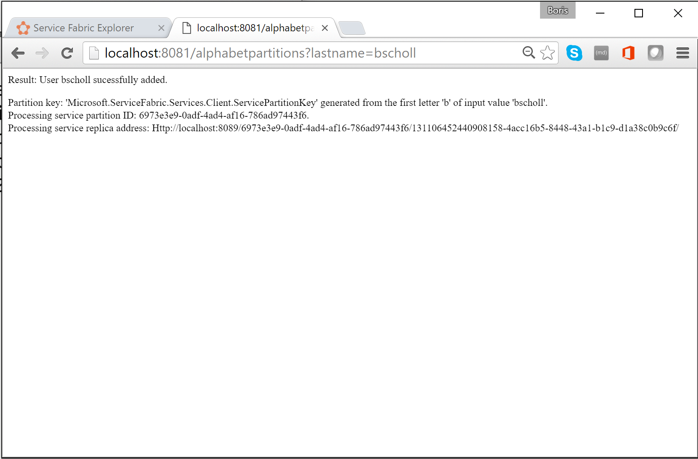

# Partition Service Fabric reliable services
This article provides an introduction to the basic concepts of partitioning Azure Service Fabric reliable services. The source code used in the article is also available on [GitHub](https://github.com/Azure-Samples/service-fabric-dotnet-getting-started/tree/classic/Services/AlphabetPartitions).

## Partitioning
Partitioning is not unique to Service Fabric. In fact, it is a core pattern of building scalable services. In a broader sense, we can think about partitioning as a concept of dividing state (data) and compute into smaller accessible units to improve scalability and performance. A well-known form of partitioning is [data partitioning][wikipartition], also known as sharding.

### Partition Service Fabric stateless services
For stateless services, you can think about a partition being a logical unit that contains one or more instances of a service. Figure 1 shows a stateless service with five instances distributed across a cluster using one partition.



There are really two types of stateless service solutions. The first one is a service that persists its state externally, for example in an Azure SQL database (like a website that stores the session information and data). The second one is computation-only services (like a calculator or image thumbnailing) that do not manage any persistent state.

In either case, partitioning a stateless service is a very rare scenario--scalability and availability are normally achieved by adding more instances. The only time you want to consider multiple partitions for stateless service instances is when you need to meet special routing requests.

As an example, consider a case where users with IDs in a certain range should only be served by a particular service instance. Another example of when you could partition a stateless service is when you have a truly partitioned backend (e.g. a sharded SQL database) and you want to control which service instance should write to the database shard--or perform other preparation work within the stateless service that requires the same partitioning information as is used in the backend. Those types of scenarios can also be solved in different ways and do not necessarily require service partitioning.

The remainder of this walkthrough focuses on stateful services.

### Partition Service Fabric stateful services
Service Fabric makes it easy to develop scalable stateful services by offering a first-class way to partition state (data). Conceptually, you can think about a partition of a stateful service as a scale unit that is highly reliable through [replicas](service-fabric-availability-services.md) that are distributed and balanced across the nodes in a cluster.

Partitioning in the context of Service Fabric stateful services refers to the process of determining that a particular service partition is responsible for a portion of the complete state of the service. (As mentioned before, a partition is a set of [replicas](service-fabric-availability-services.md)). A great thing about Service Fabric is that it places the partitions on different nodes. This allows them to grow to a node's resource limit. As the data needs grow, partitions grow, and Service Fabric rebalances partitions across nodes. This ensures the continued efficient use of hardware resources.

To give you an example, say you start with a 5-node cluster and a service that is configured to have 10 partitions and a target of three replicas. In this case, Service Fabric would balance and distribute the replicas across the cluster--and you would end up with two primary [replicas](service-fabric-availability-services.md) per node.
If you now need to scale out the cluster to 10 nodes, Service Fabric would rebalance the primary [replicas](service-fabric-availability-services.md) across all 10 nodes. Likewise, if you scaled back to 5 nodes, Service Fabric would rebalance all the replicas across the 5 nodes.  

Figure 2 shows the distribution of 10 partitions before and after scaling the cluster.



As a result, the scale-out is achieved since requests from clients are distributed across computers, overall performance of the application is improved, and contention on access to chunks of data is reduced.

## Plan for partitioning
Before implementing a service, you should always consider the partitioning strategy that is required to scale out. There are different ways, but all of them focus on what the application needs to achieve. For the context of this article, let's consider some of the more important aspects.

A good approach is to think about the structure of the state that needs to be partitioned, as the first step.

Let's take a simple example. If you were to build a service for a county-wide poll, you could create a partition for each city in the county. Then, you could store the votes for every person in the city in the partition that corresponds to that city. Figure 3 illustrates a set of people and the city in which they reside.



As the population of cities varies widely, you may end up with some partitions that contain a lot of data (e.g. Seattle) and other partitions with very little state (e.g. Kirkland). So what is the impact of having partitions with uneven amounts of state?

If you think about the example again, you can easily see that the partition that holds the votes for Seattle will get more traffic than the Kirkland one. By default, Service Fabric makes sure that there is about the same number of primary and secondary replicas on each node. So you may end up with nodes that hold replicas that serve more traffic and others that serve less traffic. You would preferably want to avoid hot and cold spots like this in a cluster.

In order to avoid this, you should do two things, from a partitioning point of view:

* Try to partition the state so that it is evenly distributed across all partitions.
* Report load from each of the replicas for the service. (For information on how, check out this article on [Metrics and Load](service-fabric-cluster-resource-manager-metrics.md)). Service Fabric provides the capability to report load consumed by services, such as amount of memory or number of records. Based on the metrics reported, Service Fabric detects that some partitions are serving higher loads than others and rebalances the cluster by moving replicas to more suitable nodes, so that overall no node is overloaded.

Sometimes, you cannot know how much data will be in a given partition. So a general recommendation is to do both--first, by adopting a partitioning strategy that spreads the data evenly across the partitions and second, by reporting load.  The first method prevents situations described in the voting example, while the second helps smooth out temporary differences in access or load over time.

Another aspect of partition planning is to choose the correct number of partitions to begin with.
From a Service Fabric perspective, there is nothing that prevents you from starting out with a higher number of partitions than anticipated for your scenario.
In fact, assuming the maximum number of partitions is a valid approach.

In rare cases, you may end up needing more partitions than you have initially chosen. As you cannot change the partition count after the fact, you would need to apply some advanced partition approaches, such as creating a new service instance of the same service type. You would also need to implement some client-side logic that routes the requests to the correct service instance, based on client-side knowledge that your client code must maintain.

Another consideration for partitioning planning is the available computer resources. As the state needs to be accessed and stored, you are bound to follow:

* Network bandwidth limits
* System memory limits
* Disk storage limits

So what happens if you run into resource constraints in a running cluster? The answer is that you can simply scale out the cluster to accommodate the new requirements.

[The capacity planning guide](service-fabric-capacity-planning.md) offers guidance for how to determine how many nodes your cluster needs.

## Get started with partitioning
This section describes how to get started with partitioning your service.

Service Fabric offers a choice of three partition schemes:

* Ranged partitioning (otherwise known as UniformInt64Partition).
* Named partitioning. Applications using this model usually have data that can be bucketed, within a bounded set. Some common examples of data fields used as named partition keys would be regions, postal codes, customer groups, or other business boundaries.
* Singleton partitioning. Singleton partitions are typically used when the service does not require any additional routing. For example, stateless services use this partitioning scheme by default.

Named and Singleton partitioning schemes are special forms of ranged partitions. By default, the Visual Studio templates for Service Fabric use ranged partitioning, as it is the most common and useful one. The remainder of this article focuses on the ranged partitioning scheme.

### Ranged partitioning scheme
This is used to specify an integer range (identified by a low key and high key) and a number of partitions (n). It creates n partitions, each responsible for a non-overlapping subrange of the overall partition key range. For example, a ranged partitioning scheme with a low key of 0, a high key of 99, and a count of 4 would create four partitions, as shown below.



A common approach is to create a hash based on a unique key within the data set. Some common examples of keys would be a vehicle identification number (VIN), an employee ID, or a unique string. By using this unique key, you would then generate a hash code, modulus the key range, to use as your key. You can specify the upper and lower bounds of the allowed key range.

### Select a hash algorithm
An important part of hashing is selecting your hash algorithm. A consideration is whether the goal is to group similar keys near each other (locality sensitive hashing)--or if activity should be distributed broadly across all partitions (distribution hashing), which is more common.

The characteristics of a good distribution hashing algorithm are that it is easy to compute, it has few collisions, and it distributes the keys evenly. A good example of an efficient hash algorithm is the [FNV-1](https://en.wikipedia.org/wiki/Fowler%E2%80%93Noll%E2%80%93Vo_hash_function) hash algorithm.

A good resource for general hash code algorithm choices is the [Wikipedia page on hash functions](https://en.wikipedia.org/wiki/Hash_function).

## Build a stateful service with multiple partitions
Let's create your first reliable stateful service with multiple partitions. In this example, you will build a very simple application where you want to store all last names that start with the same letter in the same partition.

Before you write any code, you need to think about the partitions and partition keys. You need 26 partitions (one for each letter in the alphabet), but what about the low and high keys?
As we literally want to have one partition per letter, we can use 0 as the low key and 25 as the high key, as each letter is its own key.

> [!NOTE]
> This is a simplified scenario, as in reality the distribution would be uneven. Last names starting with the letters "S" or "M" are more common than the ones starting with "X" or "Y".
> 
> 

1. Open **Visual Studio** > **File** > **New** > **Project**.
2. In the **New Project** dialog box, choose the Service Fabric application.
3. Call the project "AlphabetPartitions".
4. In the **Create a Service** dialog box, choose **Stateful** service and call it "Alphabet.Processing".
5. Set the number of partitions. Open the Applicationmanifest.xml file located in the ApplicationPackageRoot folder of the AlphabetPartitions project and update the parameter Processing_PartitionCount to 26 as shown below.
   
    ```xml
    <Parameter Name="Processing_PartitionCount" DefaultValue="26" />
    ```
   
    You also need to update the LowKey and HighKey properties of the StatefulService element in the ApplicationManifest.xml as shown below.
   
    ```xml
    <Service Name="Processing">
      <StatefulService ServiceTypeName="ProcessingType" TargetReplicaSetSize="[Processing_TargetReplicaSetSize]" MinReplicaSetSize="[Processing_MinReplicaSetSize]">
        <UniformInt64Partition PartitionCount="[Processing_PartitionCount]" LowKey="0" HighKey="25" />
      </StatefulService>
    </Service>
    ```
6. For the service to be accessible, open up an endpoint on a port by adding the endpoint element of ServiceManifest.xml (located in the PackageRoot folder) for the Alphabet.Processing service as shown below:
   
    ```xml
    <Endpoint Name="ProcessingServiceEndpoint" Port="8089" Protocol="http" Type="Internal" />
    ```
   
    Now the service is configured to listen to an internal endpoint with 26 partitions.
7. Next, you need to override the `CreateServiceReplicaListeners()` method of the Processing class.
   
   > [!NOTE]
   > For this sample, we assume that you are using a simple HttpCommunicationListener. For more information on reliable service communication, see [The Reliable Service communication model](service-fabric-reliable-services-communication.md).
   > 
   > 
8. A recommended pattern for the URL that a replica listens on is the following format: `{scheme}://{nodeIp}:{port}/{partitionid}/{replicaid}/{guid}`.
    So you want to configure your communication listener to listen on the correct endpoints and with this pattern.
   
    Multiple replicas of this service may be hosted on the same computer, so this address needs to be unique to the replica. This is why   partition ID + replica ID are in the URL. HttpListener can listen on multiple addresses on the same port as long as the URL prefix    is unique.
   
    The extra GUID is there for an advanced case where secondary replicas also listen for read-only requests. When that's the case, you want to make sure that a new unique address is used when transitioning from primary to secondary to force clients to re-resolve the address. '+' is used as the address here so that the replica listens on all available hosts (IP, FQDN, localhost, etc.) The code below shows an example.
   
    ```csharp
    protected override IEnumerable<ServiceReplicaListener> CreateServiceReplicaListeners()
    {
         return new[] { new ServiceReplicaListener(context => this.CreateInternalListener(context))};
    }
    private ICommunicationListener CreateInternalListener(ServiceContext context)
    {
   
         EndpointResourceDescription internalEndpoint = context.CodePackageActivationContext.GetEndpoint("ProcessingServiceEndpoint");
         string uriPrefix = String.Format(
                "{0}://+:{1}/{2}/{3}-{4}/",
                internalEndpoint.Protocol,
                internalEndpoint.Port,
                context.PartitionId,
                context.ReplicaOrInstanceId,
                Guid.NewGuid());
   
         string nodeIP = FabricRuntime.GetNodeContext().IPAddressOrFQDN;
   
         string uriPublished = uriPrefix.Replace("+", nodeIP);
         return new HttpCommunicationListener(uriPrefix, uriPublished, this.ProcessInternalRequest);
    }
    ```
   
    It's also worth noting that the published URL is slightly different from the listening URL prefix.
    The listening URL is given to HttpListener. The published URL is the URL that is published to the Service Fabric Naming Service, which is used for service discovery. Clients will ask for this address through that discovery service. The address that clients get needs to have the actual IP or FQDN of the node in order to connect. So you need to replace '+' with the node's IP or FQDN as shown above.
9. The last step is to add the processing logic to the service as shown below.
   
    ```csharp
    private async Task ProcessInternalRequest(HttpListenerContext context, CancellationToken cancelRequest)
    {
        string output = null;
        string user = context.Request.QueryString["lastname"].ToString();
   
        try
        {
            output = await this.AddUserAsync(user);
        }
        catch (Exception ex)
        {
            output = ex.Message;
        }
   
        using (HttpListenerResponse response = context.Response)
        {
            if (output != null)
            {
                byte[] outBytes = Encoding.UTF8.GetBytes(output);
                response.OutputStream.Write(outBytes, 0, outBytes.Length);
            }
        }
    }
    private async Task<string> AddUserAsync(string user)
    {
        IReliableDictionary<String, String> dictionary = await this.StateManager.GetOrAddAsync<IReliableDictionary<String, String>>("dictionary");
   
        using (ITransaction tx = this.StateManager.CreateTransaction())
        {
            bool addResult = await dictionary.TryAddAsync(tx, user.ToUpperInvariant(), user);
   
            await tx.CommitAsync();
   
            return String.Format(
                "User {0} {1}",
                user,
                addResult ? "successfully added" : "already exists");
        }
    }
    ```
   
    `ProcessInternalRequest` reads the values of the query string parameter used to call the partition and calls `AddUserAsync` to add the lastname to the reliable dictionary `dictionary`.
10. Let's add a stateless service to the project to see how you can call a particular partition.
    
    This service serves as a simple web interface that accepts the lastname as a query string parameter, determines the partition key, and sends it to the Alphabet.Processing service for processing.
11. In the **Create a Service** dialog box, choose **Stateless** service and call it "Alphabet.Web" as shown below.
    
    .
12. Update the endpoint information in the ServiceManifest.xml of the Alphabet.WebApi service to open up a port as shown below.
    
    ```xml
    <Endpoint Name="WebApiServiceEndpoint" Protocol="http" Port="8081"/>
    ```
13. You need to return a collection of ServiceInstanceListeners in the class Web. Again, you can choose to implement a simple HttpCommunicationListener.
    
    ```csharp
    protected override IEnumerable<ServiceInstanceListener> CreateServiceInstanceListeners()
    {
        return new[] {new ServiceInstanceListener(context => this.CreateInputListener(context))};
    }
    private ICommunicationListener CreateInputListener(ServiceContext context)
    {
        // Service instance's URL is the node's IP & desired port
        EndpointResourceDescription inputEndpoint = context.CodePackageActivationContext.GetEndpoint("WebApiServiceEndpoint")
        string uriPrefix = String.Format("{0}://+:{1}/alphabetpartitions/", inputEndpoint.Protocol, inputEndpoint.Port);
        var uriPublished = uriPrefix.Replace("+", FabricRuntime.GetNodeContext().IPAddressOrFQDN);
        return new HttpCommunicationListener(uriPrefix, uriPublished, this.ProcessInputRequest);
    }
    ```
14. Now you need to implement the processing logic. The HttpCommunicationListener calls `ProcessInputRequest` when a request comes in. So let's go ahead and add the code below.
    
    ```csharp
    private async Task ProcessInputRequest(HttpListenerContext context, CancellationToken cancelRequest)
    {
        String output = null;
        try
        {
            string lastname = context.Request.QueryString["lastname"];
            char firstLetterOfLastName = lastname.First();
            ServicePartitionKey partitionKey = new ServicePartitionKey(Char.ToUpper(firstLetterOfLastName) - 'A');
    
            ResolvedServicePartition partition = await this.servicePartitionResolver.ResolveAsync(alphabetServiceUri, partitionKey, cancelRequest);
            ResolvedServiceEndpoint ep = partition.GetEndpoint();
    
            JObject addresses = JObject.Parse(ep.Address);
            string primaryReplicaAddress = (string)addresses["Endpoints"].First();
    
            UriBuilder primaryReplicaUriBuilder = new UriBuilder(primaryReplicaAddress);
            primaryReplicaUriBuilder.Query = "lastname=" + lastname;
    
            string result = await this.httpClient.GetStringAsync(primaryReplicaUriBuilder.Uri);
    
            output = String.Format(
                    "Result: {0}. <p>Partition key: '{1}' generated from the first letter '{2}' of input value '{3}'. <br>Processing service partition ID: {4}. <br>Processing service replica address: {5}",
                    result,
                    partitionKey,
                    firstLetterOfLastName,
                    lastname,
                    partition.Info.Id,
                    primaryReplicaAddress);
        }
        catch (Exception ex) { output = ex.Message; }
    
        using (var response = context.Response)
        {
            if (output != null)
            {
                output = output + "added to Partition: " + primaryReplicaAddress;
                byte[] outBytes = Encoding.UTF8.GetBytes(output);
                response.OutputStream.Write(outBytes, 0, outBytes.Length);
            }
        }
    }
    ```
    
    Let's walk through it step by step. The code reads the first letter of the query string parameter `lastname` into a char. Then, it determines the partition key for this letter by subtracting the hexadecimal value of `A` from the hexadecimal value of the last names' first letter.
    
    ```csharp
    string lastname = context.Request.QueryString["lastname"];
    char firstLetterOfLastName = lastname.First();
    ServicePartitionKey partitionKey = new ServicePartitionKey(Char.ToUpper(firstLetterOfLastName) - 'A');
    ```
    
    Remember, for this example, we are using 26 partitions with one partition key per partition.
    Next, we obtain the service partition `partition` for this key by using the `ResolveAsync` method on the `servicePartitionResolver` object. `servicePartitionResolver` is defined as
    
    ```csharp
    private readonly ServicePartitionResolver servicePartitionResolver = ServicePartitionResolver.GetDefault();
    ```
    
    The `ResolveAsync` method takes the service URI, the partition key, and a cancellation token as parameters. The service URI for the processing service is `fabric:/AlphabetPartitions/Processing`. Next, we get the endpoint of the partition.
    
    ```csharp
    ResolvedServiceEndpoint ep = partition.GetEndpoint()
    ```
    
    Finally, we build the endpoint URL plus the querystring and call the processing service.
    
    ```csharp
    JObject addresses = JObject.Parse(ep.Address);
    string primaryReplicaAddress = (string)addresses["Endpoints"].First();
    
    UriBuilder primaryReplicaUriBuilder = new UriBuilder(primaryReplicaAddress);
    primaryReplicaUriBuilder.Query = "lastname=" + lastname;
    
    string result = await this.httpClient.GetStringAsync(primaryReplicaUriBuilder.Uri);
    ```
    
    Once the processing is done, we write the output back.
15. The last step is to test the service. Visual Studio uses application parameters for local and cloud deployment. To test the service with 26 partitions locally, you need to update the `Local.xml` file in the ApplicationParameters folder of the AlphabetPartitions project as shown below:
    
    ```xml
    <Parameters>
      <Parameter Name="Processing_PartitionCount" Value="26" />
      <Parameter Name="WebApi_InstanceCount" Value="1" />
    </Parameters>
    ```
16. Once you finish deployment, you can check the service and all of its partitions in the Service Fabric Explorer.
    
    
17. In a browser, you can test the partitioning logic by entering `http://localhost:8081/?lastname=somename`. You will see that each last name that starts with the same letter is being stored in the same partition.
    
    

The entire source code of the sample is available on [GitHub](https://github.com/Azure-Samples/service-fabric-dotnet-getting-started/tree/classic/Services/AlphabetPartitions).

## Next steps
For information on Service Fabric concepts, see the following:

* [Availability of Service Fabric services](service-fabric-availability-services.md)
* [Scalability of Service Fabric services](service-fabric-concepts-scalability.md)
* [Capacity planning for Service Fabric applications](service-fabric-capacity-planning.md)

[wikipartition]: https://en.wikipedia.org/wiki/Partition_(database)

[1]: ./media/service-fabric-create-your-first-application-in-visual-studio/new-project-dialog-2.png
