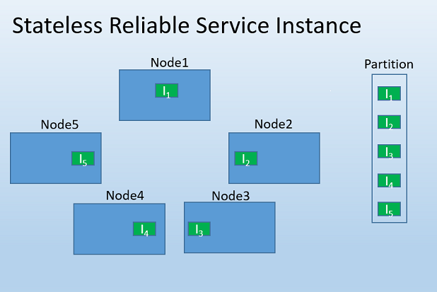
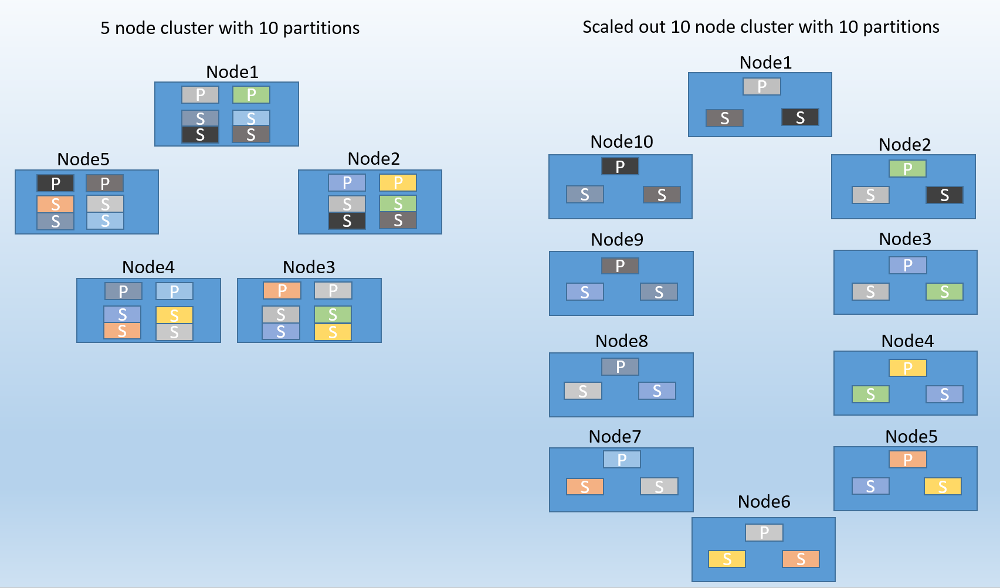
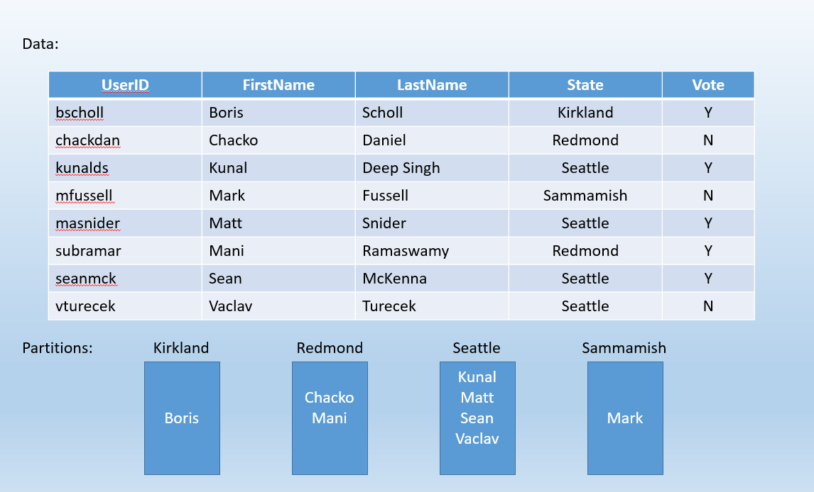

<properties
   pageTitle="Partitioning Service Fabric Services | Microsoft Azure"
   description="Describes how to partition Service Fabric services"
   services="service-fabric"
   documentationCenter=".net"
   authors="bscholl"
   manager="timlt"
   editor=""/>

<tags
   ms.service="service-fabric"
   ms.devlang="dotnet"
   ms.topic="article"
   ms.tgt_pltfrm="NA"
   ms.workload="NA"
   ms.date="08/26/2015"
   ms.author="bscholl"/>

# Partitioning Service Fabric services
In this walkthrough we will cover the basic concepts of Service Fabric service partitions, partition planning and how to build reliable services using partitions.    

## What is partitioning
Partitioning is not unique to Service Fabric, in fact it is a core pattern of building scalable services. In a broader sense we can think about partitioning as a concept of dividing state (data) into smaller accessible units to improve performance. A well known form of partitioning is [data partitioning]( https://en.wikipedia.org/wiki/Partition_(database)) also known as sharding.

### Service Fabric service partitioning
Service Fabric provides service partitioning for both stateless and stateful services.
### Partitioning stateless services
For stateless services we can think about a partition being a logical unit that contains one or more instances of a service. Figure 1 shows a stateless service with 5 instances distributed across a cluster using one partition. This, multiple instances in one partition, is in fact the most common configuration for a stateless service. The only times you want to consider multiple partitions for stateless service instances is when you need to meet special routing requests for example users with a certain id should only be served by a particular service instance or you have a truly partitioned backend, e.g. a sharded SQL database, and you want to control which service instance should write to the database shard. Again those are very rare scenarios that can also be solved in other ways.

For the remainder of this walkthrough we focus on stateful services.

### Partitioning stateful services
Service Fabric makes it easy to develop stateful services that scale by offering a first-class way to partition state. Just as with databases, partitioning in this case refers to the process of determining that a particular service or set of services is responsible for a portion of the complete state of the service. It enables each service to individually address only a portion of the complete state. As a result the load is better distributed, the overall performance of the application is improved, and contention on access to chunks of data is reduced.

Conceptually we can think about a partition of a stateful service being a unit that is made [highly available](service-fabric-availability-services.md) through [replicas](service-fabric-availability-services.md) of partitions that are distributed and balanced across the nodes in the cluster.

What does that mean?
Let's say we start with a 5 node cluster and 10 partitions. In this case we would end up with 2 primary [replicas](service-fabric-availability-services.md) per node, if we now scale out our cluster to 10 nodes Service Fabric would rebalance the primary [replicas](service-fabric-availability-services.md) across all 10 nodes. Likewise if we scaled back to 5 nodes Service Fabric would rebalance all the replicas across the 5 nodes.  

Figure 2 shows the distribution of 10 partitions before and after a scale out.

## Planning for partitioning
Before implementing a service we should always think about our partitioning strategy. There are many factors, such as amount of data, data structure, machine resources etc., that influence the partitioning strategy. For a detailed planning guide see [the capacity planning guide](http://en.wikipedia.org/wiki/Hash_function).
For the context of this article we keep it a higher level and just look at some of the important aspects.

In either case, a good approach is to think about the structure of the state(data) that needs to be partitioned. One thing we want to watch out when choosing a partitioning strategy is that we want to have state evenly distributed across all partitions.

Let's look at the following simple example. If we were to build a service for a county wide poll we could say we want to create a partition for every city in the county and store the state of polls for every user in a city in its partition. The image below shows the distribution for a small amount of data and just a view cities.

Even with such a small set of data we can see that choosing partitions based on cities might not be the optimal approach for this service. As the population of cities varies widely we may end up with partitions that contain lots of data (e.g. Seattle) and partitions with very little data (e.g. Kirkland). In this case choosing partitions based on user IDs may have been more appropriate, in fact a user ID is a natural partitioning key.

Other factors that need to be considered when choosing a partitioning strategy is that partitions or to be more precise replicas are constraint by machine resources such as   

    - Network
    - Disk
    - Memory

[The capacity planning guide](http://en.wikipedia.org/wiki/Hash_function) offers some configurations that show what some tested sample partitioning strategies look like.

How do we choose how many partitions we should start with?

>[AZURE.NOTE] In order to increase partitions after the fact one would need to create a new service instance of the same service type and implement some logic that routes the request between the two service instances based on the hash.

- Start out with as many partitions as possible on a cluster. When we need to scale we just need to add add machines. Each partition is going to consume that much memory, disk etc. this is the boundary for that model.
>[AZURE.NOTE]if box dies many reconfiguration will be kicked off which may be create some overhead  

- Guess how much data we will have and how much resources they are going to consume in a non linear key space.
For example address book. One instance with 10000 partitions   

## Choosing a partitioning scheme
Service Fabric supports three partition schemes.

- Ranged Partitioning Scheme
- Named Partitioning Scheme
- Singleton Partitioning Scheme

Named and Singleton partitioning schemes are really just a special form of ranged partitions. In most cases we want to choose the ranged partitioning scheme.

### Ranged Partitioning Scheme (preferred)
This is used to specify an integer range (identified by a low and a high key) and a number of partitions (n). It creates n partitions, each responsible for a non-overlapping subrange. Example: A ranged partitioning scheme (for a service with three replicas) with a low key of 0, a high key of 99 and a count of 4 would create 4 partitions as shown below.

The common case is to create a hash for a unique key within a dataset. Some common examples of keys would be a vehicle identification number (VIN), employee ID, or a unique string. Using that unique key you would then create a long hash code, modulus the key range, to use as your key. You can specify upper and lower bounds of the allowed key range.

Additionally, you should estimate the number of partitions high enough to handle worst-case resource load (such as memory limitations or network bandwidth) but not so much that partitions are extremely sparse.

### Selecting a hash algorithm
An important part of hashing is selecting your hash algorithm. An important consideration is whether the goal is to group similar keys near each other (Locality sensitive hashing), or if activity should be distributed broadly across all partitions (Distribution Hashing).

A good resource for general hash code algorithm choices is [the Wikipedia page on Hash Functions](http://en.wikipedia.org/wiki/Hash_function).

## Building a simple stateful service with multiple partitions

## Next steps

For information on Service Fabric concepts, see the following:

- [Availability of Service Fabric Services](service-fabric-availability-services.md)

- [Scalability of Service Fabric Services](service-fabric-concepts-scalability.md)
