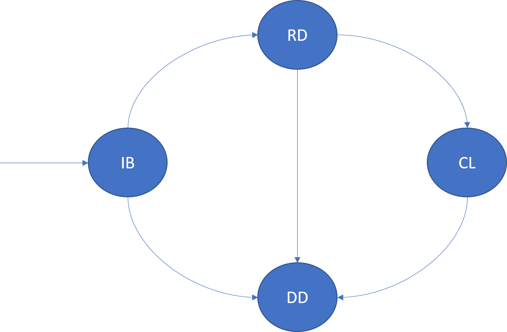
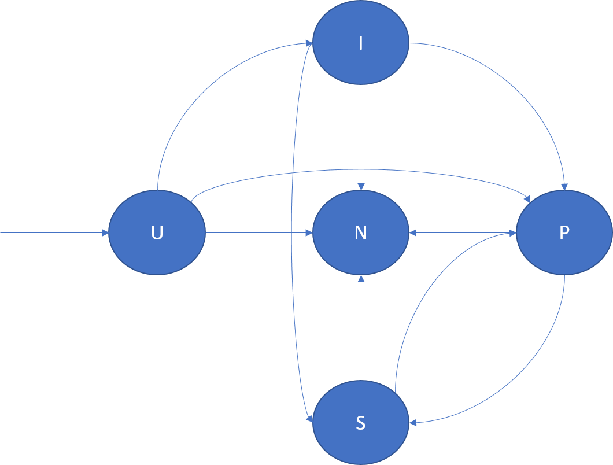

# Replicas and instances 
This article gives an overview of the lifecycle of replicas of stateful services and instances of stateless services.

## Instances of stateless services
An instance of a stateless service is a copy of the service logic that runs on one of the nodes of the cluster. An instance within a partition is uniquely identified by its **InstanceId**. The lifecycle of an instance is modeled in the following diagram:

### InBuild (IB)
After the Cluster Resource Manager determines a placement for the instance, it enters this lifecycle state. The instance is started on the node. The application host is started, the instance is created and then opened. After the startup finishes, the instance transitions to the ready state. 

If the application host or node for this instance crashes, it transitions to the dropped state.

### Ready (RD)
In the ready state, the instance is up and running on the node. If this instance is a reliable service, **RunAsync** has been invoked. 

If the application host or node for this instance crashes, it transitions to the dropped state.

### Closing (CL)
In the closing state, Azure Service Fabric is in the process of shutting down the instance on this node. This shutdown might be due to many reasons--for example, an application upgrade, load balancing, or the service being deleted. After shutdown finishes, it transitions to the dropped state.

### Dropped (DD)
In the dropped state, the instance is no longer running on the node. At this point, Service Fabric maintains the metadata about this instance, which is eventually deleted as well.

> [!NOTE]
> It is possible to transition from any state to the dropped state by using the **ForceRemove** option on `Remove-ServiceFabricReplica`.
>

## Replicas of stateful services
A replica of a stateful service is a copy of the service logic running on one of the nodes of the cluster. In addition, the replica maintains a copy of the state of that service. Two related concepts describe the lifecycle and behavior of stateful replicas:
- Replica lifecycle
- Replica role

The following discussion describes persisted stateful services. For volatile (or in-memory) stateful services, the down and dropped states are equivalent.

### InBuild (IB)
An InBuild replica is a replica that's created or prepared for joining the replica set. Depending on the replica role, the IB has different semantics. 

If the application host or the node for an InBuild replica crashes, it transitions to the down state.

   - **Primary InBuild replicas**: Primary InBuild are the first replicas for a partition. This replica usually happens when the partition is being created. Primary InBuild replicas also arise when all the replicas of a partition restart or are dropped.

   - **IdleSecondary InBuild replicas**: These are either new replicas that are created by the Cluster Resource Manager, or existing replicas that went down and need to be added back into the set. These replicas are seeded or built by the primary before they can join the replica set as ActiveSecondary and participate in quorum acknowledgement of operations.

   - **ActiveSecondary InBuild replicas**: This state is observed in some queries. It is an optimization where the replica set is not changing, but a replica needs to be built. The replica itself follows the normal state machine transitions (as described in the section on replica roles).

### Ready (RD)
A Ready replica is a replica that's participating in replication and quorum acknowledgement of operations. The ready state is applicable to primary and active secondary replicas.

If the application host or the node for a ready replica crashes, it transitions to the down state.

### Closing (CL)
A replica enters the closing state in the following scenarios:

- **Shutting down the code for the replica**: Service Fabric might need to shut down the running code for a replica. This shutdown might be for many reasons. For example, it can happen because of an application, fabric, or infrastructure upgrade, or because of a fault reported by the replica. When the replica close finishes, the replica transitions to the down state. The persisted state associated with this replica that's stored on disk is not cleaned up.

- **Removing the replica from the cluster**: Service Fabric might need to remove the persisted state and shut down the running code for a replica. This shutdown might be for many reasons, for example, load balancing.

### Dropped (DD)
In the dropped state, the instance is no longer running on the node. There is also no state left on the node. At this point, Service Fabric maintains the metadata about this instance, which is eventually deleted as well.

### Down (D)
In the down state, the replica code is not running, but the persisted state for that replica exists on that node. A replica can be down for many reasons--for example, the node being down, a crash in the replica code, an application upgrade, or replica faults.

A down replica is opened by Service Fabric as required, for example, when the upgrade finishes on the node.

The replica role is not relevant in the down state.

### Opening (OP)
A down replica enters the opening state when Service Fabric needs to bring the replica back up again. For example, this state might be after a code upgrade for the application finishes on a node. 

If the application host or the node for an opening replica crashes, it transitions to the down state.

The replica role is not relevant in the opening state.

### StandBy (SB)
A StandBy replica is a replica of a persisted service that went down and was then opened. This replica might be used by Service Fabric if it needs to add another replica to the replica set (because the replica already has some portion of the state and the build process is faster). After the StandByReplicaKeepDuration expires, the standby replica is discarded.

If the application host or the node for a standby replica crashes, it transitions to the down state.

The replica role is not relevant in the standby state.

> [!NOTE]
> Any replica that's not down or dropped is considered to be *up*.
>

> [!NOTE]
> It's possible to transition from any state to the dropped state by using the **ForceRemove** option on `Remove-ServiceFabricReplica`.
>

## Replica role 
The role of the replica determines its function in the replica set:

- **Primary (P)**: There is one primary in the replica set that is responsible for performing read and write operations. 
- **ActiveSecondary (S)**: These are replicas that receive state updates from the primary, apply them, and then send back acknowledgements. There are multiple active secondaries in the replica set. The number of these active secondaries determines the number of faults the service can handle.
- **IdleSecondary (I)**: These replicas are being built by the primary. They are receiving state from the primary before they can be promoted to active secondary. 
- **None (N)**: These replicas don't have a responsibility in the replica set.
- **Unknown (U)**: This is the initial role of a replica before it receives any **ChangeRole** API call from Service Fabric.

The following diagram illustrates the replica role transitions and some example scenarios in which they can occur:

- U -> P: Creation of a new primary replica.
- U -> I: Creation of a new idle replica.
- U -> N: Deletion of a standby replica.
- I -> S: Promotion of the idle secondary to active secondary so that its acknowledgements contribute toward quorum.
- I -> P: Promotion of the idle secondary to primary. This can happen under special reconfigurations when the idle secondary is the correct candidate to be primary.
- I -> N: Deletion of the idle secondary replica.
- S -> P: Promotion of the active secondary to primary. This can be due to failover of the primary or a primary movement initiated by the Cluster Resource Manager. For example, it might be in response to an application upgrade or load balancing.
- S -> N: Deletion of the active secondary replica.
- P -> S: Demotion of the primary replica. This can be due to a primary movement initiated by the Cluster Resource Manager. For example, it might be in response to an application upgrade or load balancing.
- P -> N: Deletion of the primary replica.

> [!NOTE]
> Higher-level programming models, such as [Reliable Actors](service-fabric-reliable-actors-introduction.md) and [Reliable Services](service-fabric-reliable-services-introduction.md), hide the concept of replica roles from the developer. In Actors, the notion of a role is unnecessary. In Services, it's largely simplified for most scenarios.
>

## Next steps
For more information on Service Fabric concepts, see the following article:

[Reliable Services lifecycle - C#](service-fabric-reliable-services-lifecycle.md)

