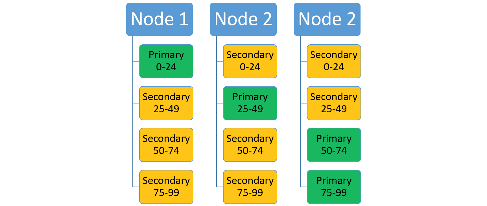
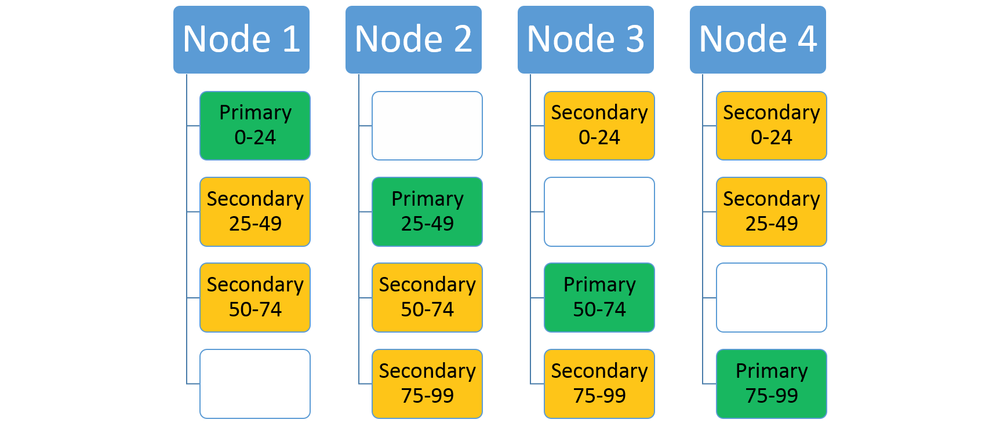

# Scaling in Service Fabric
Azure Service Fabric makes it easy to build scalable applications by managing the services, partitions, and replicas on the nodes of a cluster. Running many workloads on the same hardware enables maximum resource utilization, but also provides flexibility in terms of how you choose to scale your workloads. This Channel 9 video describes how you can build scalable microservices applications:

> [!VIDEO https://channel9.msdn.com/Events/Connect/2017/T116/player]

Scaling in Service Fabric is accomplished several different ways:

1. Scaling by creating or removing stateless service instances
2. Scaling by creating or removing new named services
3. Scaling by creating or removing new named application instances
4. Scaling by using partitioned services
5. Scaling by adding and removing nodes from the cluster 
6. Scaling by using Cluster Resource Manager metrics

## Scaling by creating or removing stateless service instances
One of the simplest ways to scale within Service Fabric works with stateless services. When you create a stateless service, you get a chance to define an `InstanceCount`. `InstanceCount` defines how many running copies of that service's code are created when the service starts up. Let's say, for example, that there are 100 nodes in the cluster. Let's also say that a service is created with an `InstanceCount` of 10. During runtime, those 10 running copies of the code could all become too busy (or could be not busy enough). One way to scale that workload is to change the number of instances. For example, some piece of monitoring or management code can change the existing number of instances to 50, or to 5, depending on whether the workload needs to scale in or out based on the load. 

C#:

```csharp
StatelessServiceUpdateDescription updateDescription = new StatelessServiceUpdateDescription(); 
updateDescription.InstanceCount = 50;
await fabricClient.ServiceManager.UpdateServiceAsync(new Uri("fabric:/app/service"), updateDescription);
```

Powershell:

```posh
Update-ServiceFabricService -Stateless -ServiceName $serviceName -InstanceCount 50
```
### Using Dynamic Instance Count
Specifically for stateless services, Service Fabric offers an automatic way to change the instance count. This allows the service to scale dynamically with the number of nodes that are available. The way to opt into this behavior is to set the instance count = -1. InstanceCount = -1 is an instruction to Service Fabric that says "Run this stateless service on every node." If the number of nodes changes, Service Fabric automatically changes the instance count to match, ensuring that the service is running on all valid nodes. 

C#:

```csharp
StatelessServiceDescription serviceDescription = new StatelessServiceDescription();
//Set other service properties necessary for creation....
serviceDescription.InstanceCount = -1;
await fc.ServiceManager.CreateServiceAsync(serviceDescription);
```

Powershell:

```posh
New-ServiceFabricService -ApplicationName $applicationName -ServiceName $serviceName -ServiceTypeName $serviceTypeName -Stateless -PartitionSchemeSingleton -InstanceCount "-1"
```

## Scaling by creating or removing new named services
A named service instance is a specific instance of a service type (see [Service Fabric application life cycle](service-fabric-application-lifecycle.md)) within some named application instance in the cluster. 

New named service instances can be created (or removed) as services become more or less busy. This allows requests to be spread across more service instances, usually allowing load on existing services to decrease. When creating services, the Service Fabric Cluster Resource Manager places the services in the cluster in a distributed fashion. The exact decisions are governed by the [metrics](service-fabric-cluster-resource-manager-metrics.md) in the cluster and other placement rules. Services can be created several different ways, but the most common are either through administrative actions like someone calling [`New-ServiceFabricService`](https://docs.microsoft.com/powershell/module/servicefabric/new-servicefabricservice?view=azureservicefabricps), or by code calling [`CreateServiceAsync`](https://docs.microsoft.com/dotnet/api/system.fabric.fabricclient.servicemanagementclient.createserviceasync?view=azure-dotnet). `CreateServiceAsync` can even be called from within other services running in the cluster.

Creating services dynamically can be used in all sorts of scenarios, and is a common pattern. For example, consider a stateful service that represents a particular workflow. Calls representing work are going to show up to this service, and this service is going to execute the steps to that workflow and record progress. 

How would you make this particular service scale? The service could be multi-tenant in some form, and accept calls and kick off steps for many different instances of the same workflow all at once. However, that can make the code more complex, since now it has to worry about many different instances of the same workflow, all at different stages and from different customers. Also, handling multiple workflows at the same time doesn't solve the scale problem. This is because at some point this service will consume too many resources to fit on a particular machine. Many services not built for this pattern in the first place also experience difficulty due to some inherent bottleneck or slowdown in their code. These types of issues cause the service not to work as well when the number of concurrent workflows it is tracking gets larger.  

A solution is to create an instance of this service for every different instance of the workflow you want to track. This is a great pattern and works whether the service is stateless or stateful. For this pattern to work, there's usually another service that acts as a "Workload Manager Service". The job of this service is to receive requests and to route those requests to other services. The manager can dynamically create an instance of the workload service when it receives the message, and then pass on requests to those services. The manager service could also receive callbacks when a given workflow service completes its job. When the manager receives these callbacks it could delete that instance of the workflow service, or leave it if more calls are expected. 

Advanced versions of this type of manager can even create pools of the services that it manages. The pool helps ensure that when a new request comes in it doesn't have to wait for the service to spin up. Instead, the manager can just pick a workflow service that is not currently busy from the pool, or route randomly. Keeping a pool of services available makes handling new requests faster, since it is less likely that the request has to wait for a new service to be spun up. Creating new services is quick, but not free or instantaneous. The pool helps minimize the amount of time the request has to wait before being serviced. You'll often see this manager and pool pattern when response times matter the most. Queuing the request and creating the service in the background and _then_ passing it on is also a popular manager pattern, as is creating and deleting services based on some tracking of the amount of work that service currently has pending. 

## Scaling by creating or removing new named application instances
Creating and deleting whole application instances is similar to the pattern of creating and deleting services. For this pattern, there's some manager service that is making the decision based on the requests that it is seeing and the information it is receiving from the other services inside the cluster. 

When should creating a new named application instance be used instead of creating a new named service instances in some already existing application? There's a few cases:

  * The new application instance is for a customer whose code needs to run under some particular identity or security settings.
    * Service Fabric allows defining different code packages to run under particular identities. In order to launch the same code package under different identities, the activations need to occur in different application instances. Consider a case where you have an existing customer's workloads deployed. These may be running under a particular identity so you can monitor and control their access to other resources, such as remote databases or other systems. In this case, when a new customer signs up, you probably don't want to activate their code in the same context (process space). While you could, this makes it harder for your service code to act within the context of a particular identity. You typically must have more security, isolation, and identity management code. Instead of using different named service instances within the same application instance and hence the same process space, you can use different named Service Fabric Application instances. This makes it easier to define different identity contexts.
  * The new application instance also serves as a means of configuration
    * By default, all of the named service instances of a particular service type within an application instance will run in the same process on a given node. What this means is that while you can configure each service instance differently, doing so is complicated. Services must have some token they use to look up their config within a configuration package. Usually this is just the service's name. This works fine, but it couples the configuration to the names of the individual named service instances within that application instance. This can be confusing and hard to manage since configuration is normally a design time artifact with application instance specific values. Creating more services always means more application upgrades to change the information within the config packages or to deploy new ones so that the new services can look up their specific information. It's often easier to create a whole new named application instance. Then you can use the application parameters to set whatever configuration is necessary for the services. This way all of the services that are created within that named application instance can inherit particular configuration settings. For example, instead of having a single configuration file with the settings and customizations for every customer, such as secrets or per customer resource limits, you'd instead have a different application instance for each customer with these settings overridden. 
  * The new application serves as an upgrade boundary
    * Within Service Fabric, different named application instances serve as boundaries for upgrade. An upgrade of one named application instance will not impact the code that another named application instance is running. The different applications will end up running different versions of the same code on the same nodes. This can be a factor when you need to make a scaling decision because you can choose whether the new code should follow the same upgrades as another service or not. For example, say that a call arrives at the manager service that is responsible for scaling a particular customer's workloads by creating and deleting services dynamically. In this case however, the call is for a workload associated with a _new_ customer. Most customers like being isolated from each other not just for the security and configuration reasons listed previously, but because it provides more flexibility in terms of running specific versions of the software and choosing when they get upgraded. You may also create a new application instance and create the service there simply to further partition the amount of your services that any one upgrade will touch. Separate application instances provide greater granularity when doing application upgrades, and also enable A/B testing and Blue/Green deployments. 
  * The existing application instance is full
    * In Service Fabric, [application capacity](service-fabric-cluster-resource-manager-application-groups.md) is a concept that you can use to control the amount of resources available for particular application instances. For example, you may decide that a given service needs to have another instance created in order to scale. However, this application instance is out of capacity for a certain metric. If this particular customer or workload should still be granted more resources, then you could either increase the existing capacity for that application or create a new application. 

## Scaling at the partition level
Service Fabric supports partitioning. Partitioning splits a service into several logical and physical sections, each of which operates independently. This is useful with stateful services, since no one set of replicas has to handle all the calls and manipulate all of the state at once. The [partitioning overview](service-fabric-concepts-partitioning.md) provides information on the types of partitioning schemes that are supported. The replicas of each partition are spread across the nodes in a cluster, distributing that service's load and ensuring that neither the service as a whole or any partition has a single point of failure. 

Consider a service that uses a ranged partitioning scheme with a low key of 0, a high key of 99, and a partition count of 4. In a three-node cluster, the service might be laid out with four replicas that share the resources on each node as shown here:

<center>


</center>

If you increase the number of nodes, Service Fabric will move some of the existing replicas there. For example, let's say the number of nodes increases to four and the replicas get redistributed. Now the service now has three replicas running on each node, each belonging to different partitions. This allows better resource utilization since the new node isn't cold. Typically, it also improves performance as each service has more resources available to it.

<center>


</center>

## Scaling by using the Service Fabric Cluster Resource Manager and metrics
[Metrics](service-fabric-cluster-resource-manager-metrics.md) are how services express their resource consumption to Service Fabric. Using metrics gives the Cluster Resource Manager an opportunity to reorganize and optimize the layout of the cluster. For example, there may be plenty of resources in the cluster, but they might not be allocated to the services that are currently doing work. Using metrics allows the Cluster Resource Manager to reorganize the cluster to ensure that services have access to the available resources. 


## Scaling by adding and removing nodes from the cluster 
Another option for scaling with Service Fabric is to change the size of the cluster. Changing the size of the cluster means adding or removing nodes for one or more of the node types in the cluster. For example, consider a case where all of the nodes in the cluster are hot. This means that the cluster's resources are almost all consumed. In this case, adding more nodes to the cluster is the best way to scale. Once the new nodes join the cluster the Service Fabric Cluster Resource Manager moves services to them, resulting in less total load on the existing nodes. For stateless services with instance count = -1, more service instances are automatically created. This allows some calls to move from the existing nodes to the new nodes. 

For more information, see [cluster scaling](service-fabric-cluster-scaling.md).

## Putting it all together
Let's take all the ideas that we've discussed here and talk through an example. Consider the following service: you are trying to build a service that acts as an address book, holding on to names and contact information. 

Right up front you have a bunch of questions related to scale: How many users are you going to have? How many contacts will each user store? Trying to figure this all out when you are standing up your service for the first time is difficult. Let's say you were going to go with a single static service with a specific partition count. The consequences of picking the wrong partition count could cause you to have scale issues later. Similarly, even if you pick the right count you might not have all the information you need. For example, you also have to decide the size of the cluster up front, both in terms of the number of nodes and their sizes. It's usually hard to predict how many resources a service is going to consume over its lifetime. It can also be hard to know ahead of time the traffic pattern that the service actually sees. For example, maybe people add and remove their contacts only first thing in the morning, or maybe it's distributed evenly over the course of the day. Based on this you might need to scale out and in dynamically. Maybe you can learn to predict when you're going to need to scale out and in, but either way you're probably going to need to react to changing resource consumption by your service. This can involve changing the size of the cluster in order to provide more resources when reorganizing use of existing resources isn't enough. 

But why even try to pick a single partition scheme out for all users? Why limit yourself to one service and one static cluster? The real situation is usually more dynamic. 

When building for scale, consider the following dynamic pattern. You may need to adapt it to your situation:

1. Instead of trying to pick a partitioning scheme for everyone up front, build a "manager service".
2. The job of the manager service is to look at customer information when they sign up for your service. Then depending on that information the manager service create an instance of your _actual_ contact-storage service _just for that customer_. If they require particular configuration, isolation, or upgrades, you can also decide to spin up an Application instance for this customer. 

This dynamic creation pattern many benefits:

  - You're not trying to guess the correct partition count for all users up front or build a single service that is infinitely scalable all on its own. 
  - Different users don't have to have the same partition count, replica count, placement constraints, metrics, default loads, service names, dns settings, or any of the other properties specified at the service or application level. 
  - You gain additional data segmentation. Each customer has their own copy of the service
    - Each customer service can be configured differently and granted more or fewer resources, with more or fewer partitions or replicas as necessary based on their expected scale.
      - For example, say the customer paid for the "Gold" tier - they could get more replicas or greater partition count, and potentially resources dedicated to their services via metrics and application capacities.
      - Or say they provided information indicating the number of contacts they needed was "Small" - they would get only a few partitions, or could even be put into a shared service pool with other customers.
  - You're not running a bunch of service instances or replicas while you're waiting for customers to show up
  - If a customer ever leaves, then removing their information from your service is as simple as having the manager delete that service or application that it created.

## Next steps
For more information on Service Fabric concepts, see the following articles:

* [Availability of Service Fabric services](service-fabric-availability-services.md)
* [Partitioning Service Fabric services](service-fabric-concepts-partitioning.md)
