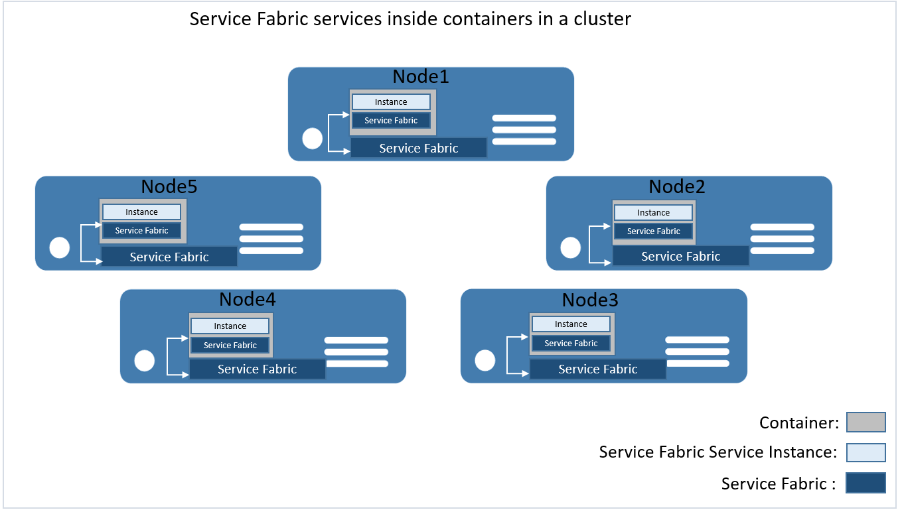

<properties
   pageTitle="Service Fabric container integration | Microsoft Azure"
   description="Overview of using Docker and Windows containers with Service Fabric"
   services="service-fabric"
   documentationCenter=".net"
   authors="bmscholl"
   manager="timlt"
   editor=""/>
   
<tags
   ms.service="service-fabric"
   ms.devlang="dotnet"
   ms.topic="article"
   ms.tgt_pltfrm="NA"
   ms.workload="NA"
   ms.date="03/26/2016"
   ms.author="bscholl"/>

#Orchestrating containers with Service Fabric

## Introduction
At a high level containers can be seen as encapsulated, individually deployable components running as isolated instances on the same kernel leveraging operating 
system level virtualization. This means each applications, its runtime, dependencies, system libraries etc., running inside a container have full, 
private access to their own isolated view of operating system constructs. In order to take full advantage of the isolation features you typically 
run one service per container. Besides the portability aspects of containers, this degree of isolation is the main benefit for using containers with Service Fabric. Without containers Service Fabric services run inside processes.
Containers provide better isolation than processes through cgroups and namespaces. In addition, you can limit the resource consumption
of containers and monitor them individually. That said there are scenarios where you want an even
better security isolation than provided by cgroups and namespaces, for example in hostile multi-tenant scenarios. Windows addresses that higher isoliation need 
by introducing Hyper-V containers. Figure 1 shows the different isolation levels.   


Service Fabric will support the different types of containers discussed above. We are looking to enable this functionality shortly after GA. This document provides
an early look at the upcoming Service Fabric container integration, it's scenarios and implementation.

For more information on Docker and Windows Containers in general, see Mark Russinovich's blog post 
about [containers, docker, windows and trends ](https://azure.microsoft.com/en-us/blog/containers-docker-windows-and-trends/).

## Service Fabric container integration
Service Fabric leverages Docker for container management on both Linux and Windows containers. Under the covers Docker is used to create, manage, and delete containers and container images.
From a user perspective Service Fabric will support two container scenarios: 

1. **Guest Container**
In this use case you can take advantage of Service Fabric's cluster management and orchestration capabilities 
in the same way as guest executables do. Click [here](service-fabric-deploy-existing-app.md) for more information on running guest executables in Service Fabric. You would just define a container image and additional parameters such as environment variables in the ServiceManifest.xml.
The image can be located either in Docker Hub, a Docker Trusted registry or a private registry. Service Fabric will pull down the image, in case it is not already in the local registry, and 
launch a container based on arguments you provide. Below is an early example of a ServiceManifest.xml that 
defines the container image contoso/frontend. 
    ```xml
    <ServiceManifest Name=“ContosoServiceTypePkg" Version="1.0">
     <ServiceTypes>
        <StatelessServiceType ServiceTypeName=“ContosoServiceType" ... >
        </StatelessServiceType>
     </ServiceTypes>
     <CodePackage Name="CodePkg" Version="1.0">
        <EntryPoint> 
        <ContainerHost>
            <ImageName>contoso/frontend</ImageName>
            <Commands></Commands>
        </ContainerHost> 
        </EntryPoint>
     </CodePackage>
     . . . 
    </ServiceManifest>
    ```

2. **Service Fabric Services inside a container**   
In this scenario, you build Service Fabric stateless and stateful services the same way you are building native Service Fabric services and package them inside a container.
This will give you all the benefits of native Service Fabric services, such as networking naming service support, self-reporting of instance’s load metrics
and integration with code, config, & data upgrades, just to name a few, in addition to higher isolation levels provided through containers.
 
    Figure 2 shows a Service Fabric cluster with running containers that communicate with Service Fabric on the host machine.

       

    At a very high level Service Fabric accomplishes the integration with the Service Fabric runtime on the host system by using Docker data volumes.

## Summary
This article was a quick introduction of what is coming with regards to Service Fabric container integration. The biggest take away should be that Service Fabric
will provide full support for containers on Linux as well as Windows and that it will use Docker as the management tool for containers.

