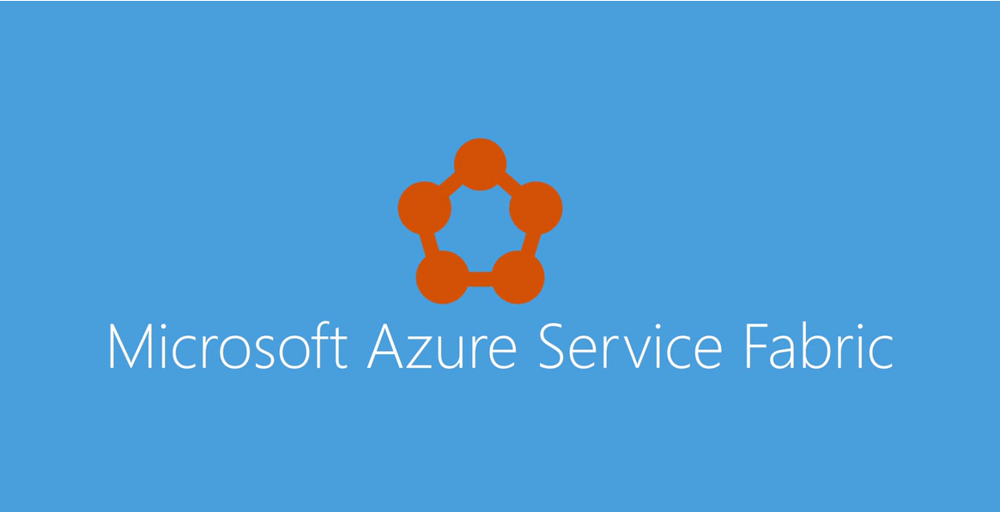
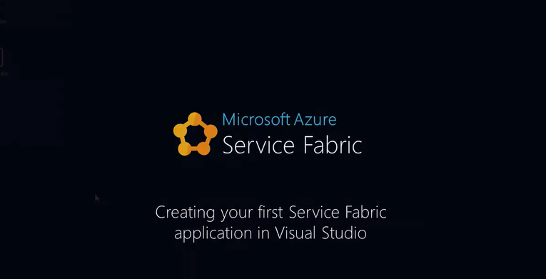

# So you want to learn about Service Fabric?
This learning roadmap will help you get started developing scalable, reliable, and easily-managed applications on Service Fabric.

## The five-minute overview
Azure Service Fabric is a distributed systems platform that makes it easy to package, deploy, and manage scalable and reliable microservices and addresses the significant challenges in developing and managing cloud applications. By using Service Fabric, developers and administrators can avoid solving complex infrastructure problems and focus instead on implementing mission-critical, demanding workloads knowing that they are scalable, reliable, and manageable. Service Fabric represents the next-generation middleware platform for building and managing these enterprise-class, Tier-1 cloud-scale applications.  

This short Channel9 video introduces Service Fabric and microservices:

## The detailed overview
Service Fabric enables you to build and manage scalable and reliable applications composed of microservices that run at very high density on a shared pool of machines, which is referred to as a cluster. It provides a sophisticated runtime to build distributed, scalable, stateless and stateful microservices. It also provides comprehensive application management capabilities to provision, deploy, monitor, upgrade/patch, and delete deployed applications.  Read [Overview of Service Fabric](service-fabric-overview.md) to learn more.

Why a microservices design approach? All applications evolve over time. Successful applications evolve by being useful to people. How much do you know about your requirements today, and what will they be in the future? Sometimes, getting a simple app out the door as proof of concept is the driving factor (knowing that the application can be redesigned later). On the other hand, when companies talk about building for the cloud there is the expectation of growth and usage. The issue is that growth and scale are unpredictable. We would like to be able to prototype quickly while knowing that the app can scale to react to unpredictable growth and usage.  [What are microservices?](service-fabric-overview-microservices.md) describes how the microservice design approach meet these challenges and how you can create microservices which you can scale up or down, test, deploy, and manage independently.

Service Fabric offers a reliable and flexible platform that enables you to write and run many types of business applications and services.  You can also run any of your existing applications (written in any language).  These applications and microservices can be stateless or stateful, and they are resource-balanced across virtual machines to maximize efficiency. The unique architecture of Service Fabric enables you to perform near real-time data analysis, in-memory computation, parallel transactions, and event processing in your applications. You can easily scale your applications up or down (really in or out), depending on your changing resource requirements. Read [Application scenarios](service-fabric-application-scenarios.md) to learn about the categories of applications and services you can create as well as customer case studies.

This longer Microsoft Virtual Academy video describes the Service Fabric core concepts:

## Get started and create your first app 
Using the Service Fabric SDKs and tools, you can develop apps in Windows, Linux, or MacOS environments and deploy those apps to clusters running on Windows or Linux.  The following guides will have you deploying an app within minutes.  After you've run your first application, download and run some of our [sample apps](http://aka.ms/servicefabricsamples). In particular start with the [Getting Started Samples](https://github.com/Azure-Samples/service-fabric-dotnet-getting-started)

### On Windows
The Service Fabric SDK includes an add-in for Visual Studio that provides templates and tools for creating, deploying, and debugging Service Fabric applications. These topics walk you through the process of creating your first application in Visual Studio and running it on your development computer.

[Set up your dev environment](service-fabric-get-started.md)
[Create your first app (C#)](service-fabric-create-your-first-application-in-visual-studio.md)

#### Practical hands on labs
Try this extensive [hands-on-lab Part 1](https://msdnshared.blob.core.windows.net/media/2016/07/SF-Lab-Part-I.docx) to get familiar with the end-to-end development flow for Service Fabric.  Learn to create a stateless service, configure monitoring and health reports, and perform an application upgrade. After this do the [hands-on-lab Part 2](http://aka.ms/sflab2) which takes you through stateful services.

The following Channel9 video walks you through the process of creating a C# app in Visual Studio:  

### On Linux
Service Fabric provides SDKs for building services on Linux in both .NET Core and Java. These topics walk you through the process of creating your first Java or C# application on Linux and running it on your development computer.
[Set up your dev environment](service-fabric-get-started-linux.md)
[Create your first app (Java)](service-fabric-create-your-first-linux-application-with-java.md)
[Create your first app (C#)](service-fabric-create-your-first-linux-application-with-csharp.md)

The following Microsoft Virtual Academy video walks you through the process of creating a Java app on Linux:  

### On MacOS
You can build Service Fabric applications on MacOS X to run on Linux clusters. These articles describe how to set up your Mac for development and walk you through the process of creating your first Java application on MacOS and running it on an Ubuntu virtual machine.
[Set up your dev environment](service-fabric-get-started-mac.md)
[Create your first app (Java)](service-fabric-create-your-first-linux-application-with-java.md)

## Core concepts
[Service Fabric terminology](service-fabric-technical-overview.md), [Application model](service-fabric-application-model.md), and [Supported programming models](service-fabric-choose-framework.md) provide more concepts and descriptions, but here are the basics.

<table><tr><th>Core concepts</th><th>Design time</th><th>Run time</th></tr>
<tr><td></td>
<td></td>
<td></td></tr>
</table>

### Design time: app type, service type, app package and manifest, service package and manifest
An application type is the name/version assigned to a collection of service types. Defined in an ApplicationManifest.xml file, embedded in an application package directory, which is then copied to the Service Fabric cluster's image store. You can then create a named application from this application type which then runs within the cluster. 

A service type is the name/version assigned to a service's code packages, data packages, and configuration packages. Defined in a ServiceManifest.xml file, embedded in a service package directory and the service package directory is then referenced by an application package's ApplicationManifest.xml file. Within the cluster, after creating a named application, you can create a named service from one of the application type's service types. A service type is described by it's ServiceManifest.xml file and is composed of executable code service configuration settings which are loaded at run time, and static data that is consumed by the service.

![Service Fabric application types and service types][cluster-imagestore-apptypes]

The application package is a disk directory containing the application type's ApplicationManifest.xm file, which references the service packages for each service type that makes up the application type. For example, an application package for an email application type could contain references to a queue service package, a frontend service package, and a database service package. The files in the application package directory are copied to the Service Fabric cluster's image store. 

A service package is a disk directory containing the service type's ServiceManifest.xml file, which references the code, static data, and configuration packages for the service type. The files in the service package directory are referenced by the application type's ApplicationManifest.xml file. For example, a service package could refer to the code, static data, and configuration packages that make up a database service.

### Run time: clusters and nodes, named apps, named services, partitions, and replicas
A [Service Fabric cluster](service-fabric-deploy-anywhere.md) is a network-connected set of virtual or physical machines into which your microservices are deployed and managed. Clusters can scale to thousands of machines.

A machine or VM that is part of a cluster is called a node. Each node is assigned a node name (a string). Nodes have characteristics such as placement properties. Each machine or VM has an auto-start Windows service, FabricHost.exe, which starts running upon boot and then starts two executables: Fabric.exe and FabricGateway.exe. These two executables make up the node. For development or testing scenarios, you can host multiple nodes on a single machine or VM by running multiple instances of Fabric.exe and FabricGateway.exe.

A named application is a collection of named services that performs a certain function or functions. A service performs a complete and standalone function (it can start and run independently of other services) and is composed of code, configuration, and data. After an application package is copied to the image store, you create an instance of the application within the cluster by specifying the application package's application type (using its name/version). Each application type instance is assigned a URI name that looks like this: *fabric:/MyNamedApp*. Within a cluster, you can create multiple named applications from a single application type. You can also create named applications from different application types. Each named application is managed and versioned independently.

After creating a named application, you can create an instance of one of its service types (a named service) within the cluster by specifying the service type (using its name/version). Each service type instance is assigned a URI name scoped under its named application's URI. For example, if you create a "MyDatabase" named service within a "MyNamedApp" named application, the URI looks like: *fabric:/MyNamedApp/MyDatabase*. Within a named application, you can create one or more named services. Each named service can have its own partition scheme and instance/replica counts. 

There are two types of services: stateless and stateful.  A stateless service's persistent state is stored in an external storage service such as Azure Storage, Azure SQL Database, or Azure DocumentDB. Use a stateless service when the service has no persistent storage at all. A stateful service uses Service Fabric to manage your service's state via its Reliable Collections or Reliable Actors programming models.  

When creating a named service, you specify a partition scheme. Services with large amounts of state split the data across partitions which spreads it across the cluster's nodes. This allows your named service's state to scale. Within a partition, stateless named services have instances while stateful named services have replicas. Usually, stateless named services only ever have one partition since they have no internal state. The partition instances provide for availability; if one instance fails, other instances continue to operate normally and then Service Fabric will create a new instance. Stateful named services maintain their state within replicas and each partition has its own replica set with all the state being kept in sync. Should a replica fail, Service Fabric builds a new replica from the existing replicas.

The following diagram shows the relationship between applications and service instances, partitions, and replicas.

![Partitions and replicas within a service][cluster-application-instances]

## Supported programming models
Service Fabric offers multiple ways to write and manage your services. Services can choose to use the Service Fabric APIs to take full advantage of the platform's features and application frameworks, or services can simply be any compiled executable program written in any language and simply hosted on a Service Fabric cluster. For more information, see [Supported programming models](service-fabric-choose-framework.md).

### Guest executables
A [guest executable](service-fabric-deploy-existing-app.md) is an arbitrary executable, written in any language, so you can take your existing applications and host them on a Service Fabric cluster alongside other services. Guest executables do not integrate directly with Service Fabric APIs, however, so they do not benefit from the full set of features the platform offers, such as custom health and load reporting, service endpoint registration, and stateful compute.

### Containers
By default, Service Fabric deploys and activates services as processes. Service Fabric can also deploy services in [container images](service-fabric-containers-overview.md). Importantly, you can mix services in processes and services in containers in the same application.  Service Fabric currently supports deployment of Docker containers on Linux and Windows Server containers on Windows Server 2016. In the Service Fabric application model, a container represents an application host in which multiple service replicas are placed.  You can deploy existing applications, stateless services, or stateful services in a container using Service Fabric.  

### Reliable Services
[Reliable Services](service-fabric-reliable-services-introduction.md) is a light-weight framework for writing services that integrate with the Service Fabric platform and benefit from the full set of platform features. Reliable Services can be stateless (similar to most service platforms, such as web servers or Worker Roles in Azure Cloud Services) in which state is persisted in an external solution, such as Azure DB or Azure Table Storage. Reliable Services can also be stateful, where state is persisted directly in the service itself using Reliable Collections. State is made highly-available through replication and distributed through partitioning, all managed automatically by Service Fabric.

### Reliable Actors
Built on top of Reliable Services, the [Reliable Actor](service-fabric-reliable-actors-introduction.md) framework is an application framework that implements the Virtual Actor pattern, based on the actor design pattern. The Reliable Actor framework uses independent units of compute and state with single-threaded execution called actors. The Reliable Actor framework provides built-in communication for actors and pre-set state persistence and scale-out configurations.

## Next steps
* Learn how to create a [cluster in Azure](service-fabric-cluster-creation-via-portal.md) or a [standalone cluster on Windows](service-fabric-cluster-creation-for-windows-server.md).
* Try creating a service using the [Reliable Services](service-fabric-reliable-services-quick-start.md) or [Reliable Actors](service-fabric-reliable-actors-get-started.md) programming models.
* Learn about the [application lifecycle](service-fabric-application-lifecycle.md).
* Learn to [inspect application and cluster health](service-fabric-health-introduction.md).
* Learn to [monitor and diagnose services](service-fabric-diagnostics-how-to-monitor-and-diagnose-services-locally.md). 
* Learn about [Service Fabric support options](service-fabric-support.md).

[cluster-application-instances]: media/service-fabric-content-roadmap/cluster-application-instances.png
[cluster-imagestore-apptypes]: ./media/service-fabric-content-roadmap/cluster-imagestore-apptypes.png
