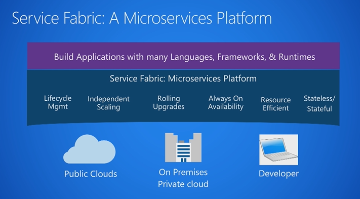
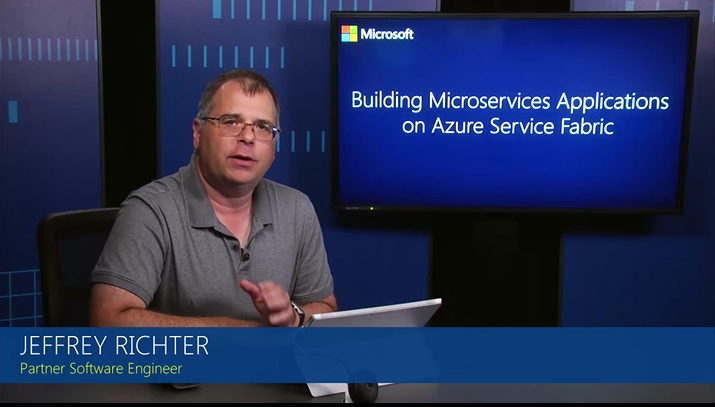
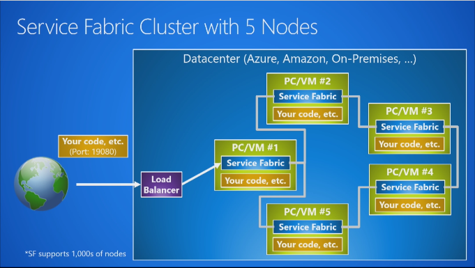

# So you want to learn about Service Fabric?
Azure Service Fabric is a distributed systems platform that makes it easy to package, deploy, and manage scalable and reliable microservices.  Service Fabric has a large surface area, however, and there's a lot to learn.  This article provides a synopsis of Service Fabric and describes the core concepts, programming models, application lifecycle, testing, clusters, and health monitoring. Read the [Overview](service-fabric-overview.md) and [What are microservices?](service-fabric-overview-microservices.md) for an introduction and how Service Fabric can be used to create microservices. This article does not contain a comprehensive content list, but does link to overview and getting started articles for every area of Service Fabric. 

## Core concepts
[Service Fabric terminology](service-fabric-technical-overview.md), [Application model](service-fabric-application-model.md), and [Supported programming models](service-fabric-choose-framework.md) provide more concepts and descriptions, but here are the basics.

<table><tr><th>Core concepts</th><th>Design time</th><th>Run time</th></tr>
<tr><td></td>
<td></td>
<td></td></tr>
</table>

### Design time: application type, service type, application package and manifest, service package and manifest
An application type is the name/version assigned to a collection of service types. This is defined in an *ApplicationManifest.xml* file, which is embedded in an application package directory. The application package is then copied to the Service Fabric cluster's image store. You can then create a named application from this application type, which then runs within the cluster. 

A service type is the name/version assigned to a service's code packages, data packages, and configuration packages. This is defined in a ServiceManifest.xml file, which is embedded in a service package directory. The service package directory is then referenced by an application package's *ApplicationManifest.xml* file. Within the cluster, after creating a named application, you can create a named service from one of the application type's service types. A service type is described by its *ServiceManifest.xml* file. The service type is composed of executable code service configuration settings, which are loaded at run time, and static data that is consumed by the service.

![Service Fabric application types and service types][cluster-imagestore-apptypes]

The application package is a disk directory containing the application type's *ApplicationManifest.xml* file, which references the service packages for each service type that makes up the application type. For example, an application package for an email application type could contain references to a queue service package, a frontend service package, and a database service package. The files in the application package directory are copied to the Service Fabric cluster's image store. 

A service package is a disk directory containing the service type's *ServiceManifest.xml* file, which references the code, static data, and configuration packages for the service type. The files in the service package directory are referenced by the application type's *ApplicationManifest.xml* file. For example, a service package could refer to the code, static data, and configuration packages that make up a database service.

### Run time: clusters and nodes, named applications, named services, partitions, and replicas
A [Service Fabric cluster](service-fabric-deploy-anywhere.md) is a network-connected set of virtual or physical machines into which your microservices are deployed and managed. Clusters can scale to thousands of machines.

A machine or VM that is part of a cluster is called a node. Each node is assigned a node name (a string). Nodes have characteristics such as placement properties. Each machine or VM has an auto-start Windows service, `FabricHost.exe`, which starts running upon boot and then starts two executables: `Fabric.exe` and `FabricGateway.exe`. These two executables make up the node. For development or testing scenarios, you can host multiple nodes on a single machine or VM by running multiple instances of `Fabric.exe` and `FabricGateway.exe`.

A named application is a collection of named services that performs a certain function or functions. A service performs a complete and standalone function (it can start and run independently of other services) and is composed of code, configuration, and data. After an application package is copied to the image store, you create an instance of the application within the cluster by specifying the application package's application type (using its name/version). Each application type instance is assigned a URI name that looks like *fabric:/MyNamedApp*. Within a cluster, you can create multiple named applications from a single application type. You can also create named applications from different application types. Each named application is managed and versioned independently.

After creating a named application, you can create an instance of one of its service types (a named service) within the cluster by specifying the service type (using its name/version). Each service type instance is assigned a URI name scoped under its named application's URI. For example, if you create a "MyDatabase" named service within a "MyNamedApp" named application, the URI looks like: *fabric:/MyNamedApp/MyDatabase*. Within a named application, you can create one or more named services. Each named service can have its own partition scheme and instance/replica counts. 

There are two types of services: stateless and stateful. Stateless services do not store state within the service. Stateless services have no persistent storage at all or store persistent state in an external storage service such as Azure Storage, Azure SQL Database, or Azure Cosmos DB. A stateful service stores state within the service and uses Reliable Collections or Reliable Actors programming models to manage state. 

When creating a named service, you specify a partition scheme. Services with large amounts of state split the data across partitions. Each partition is responsible for a portion of the complete state of the service, which is spread across the cluster's nodes.  

The following diagram shows the relationship between applications and service instances, partitions, and replicas.

![Partitions and replicas within a service][cluster-application-instances]

### Partitioning, scaling, and availability
[Partitioning](service-fabric-concepts-partitioning.md) is not unique to Service Fabric. A well known form of partitioning is data partitioning, or sharding. Stateful services with large amounts of state split the data across partitions. Each partition is responsible for a portion of the complete state of the service. 

The replicas of each partition are spread across the cluster's nodes, which allows your named service's state to [scale](service-fabric-concepts-scalability.md). As the data needs grow, partitions grow, and Service Fabric rebalances partitions across nodes to make efficient use of hardware resources. If you add new nodes to the cluster, Service Fabric will rebalance the partition replicas across the increased number of nodes. Overall application performance improves and contention for access to memory decreases. If the nodes in the cluster are not being used efficiently, you can decrease the number of nodes in the cluster. Service Fabric again rebalances the partition replicas across the decreased number of nodes to make better use of the hardware on each node.

Within a partition, stateless named services have instances while stateful named services have replicas. Usually, stateless named services only ever have one partition since they have no internal state. The partition instances provide for [availability](service-fabric-availability-services.md). If one instance fails, other instances continue to operate normally and then Service Fabric creates a new instance. Stateful named services maintain their state within replicas and each partition has its own replica set. Read and write operations are performed at one replica (called the Primary). Changes to state from write operations are replicated to multiple other replicas (called Active Secondaries). Should a replica fail, Service Fabric builds a new replica from the existing replicas.

## Stateless and stateful microservices for Service Fabric
Service Fabric enables you to build applications that consist of microservices or containers. Stateless microservices (such as protocol gateways and web proxies) do not maintain a mutable state outside a request and its response from the service. Azure Cloud Services worker roles are an example of a stateless service. Stateful microservices (such as user accounts, databases, devices, shopping carts, and queues) maintain a mutable, authoritative state beyond the request and its response. Today's Internet-scale applications consist of a combination of stateless and stateful microservices. 

A key differentiation with Service Fabric is its strong focus on building stateful services, either with the [built in programming models ](service-fabric-choose-framework.md) or with containerized stateful services. The [application scenarios](service-fabric-application-scenarios.md) describe the scenarios where stateful services are used.

Why have stateful microservices along with stateless ones? The two main reasons are:

* You can build high-throughput, low-latency, failure-tolerant online transaction processing (OLTP) services by keeping code and data close on the same machine. Some examples are interactive storefronts, search, Internet of Things (IoT) systems, trading systems, credit card processing and fraud detection systems, and personal record management.
* You can simplify application design. Stateful microservices remove the need for additional queues and caches, which are traditionally required to address the availability and latency requirements of a purely stateless application. Stateful services are naturally high-availability and low-latency, which reduces the number of moving parts to manage in your application as a whole.

## Supported programming models
Service Fabric offers multiple ways to write and manage your services. Services can use the Service Fabric APIs to take full advantage of the platform's features and application frameworks. Services can also be any compiled executable program written in any language and hosted on a Service Fabric cluster. For more information, see [Supported programming models](service-fabric-choose-framework.md).

### Containers
By default, Service Fabric deploys and activates services as processes. Service Fabric can also deploy services in [containers](service-fabric-containers-overview.md). Importantly, you can mix services in processes and services in containers in the same application. Service Fabric supports deployment of Linux containers and Windows containers on Windows Server 2016. You can deploy existing applications, stateless services, or stateful services in containers. 

### Reliable Services
[Reliable Services](service-fabric-reliable-services-introduction.md) is a lightweight framework for writing services that integrate with the Service Fabric platform and benefit from the full set of platform features. Reliable Services can be stateless (similar to most service platforms, such as web servers or Worker Roles in Azure Cloud Services), where state is persisted in an external solution, such as Azure DB or Azure Table Storage. Reliable Services can also be stateful, where state is persisted directly in the service itself using Reliable Collections. State is made [highly available](service-fabric-availability-services.md) through replication and distributed through [partitioning](service-fabric-concepts-partitioning.md), all managed automatically by Service Fabric.

### Reliable Actors
Built on top of Reliable Services, the [Reliable Actor](service-fabric-reliable-actors-introduction.md) framework is an application framework that implements the Virtual Actor pattern, based on the actor design pattern. The Reliable Actor framework uses independent units of compute and state with single-threaded execution called actors. The Reliable Actor framework provides built in communication for actors and pre-set state persistence and scale-out configurations.

### ASP.NET Core
Service Fabric integrates with [ASP.NET Core](service-fabric-reliable-services-communication-aspnetcore.md) as a first class programming model for building web and API applications.  ASP.NET Core can be used in two different ways in Service Fabric:

- Hosted as a guest executable. This is primarily used to run existing ASP.NET Core applications on Service Fabric with no code changes.
- Run inside a Reliable Service. This allows better integration with the Service Fabric runtime and allows stateful ASP.NET Core services.

### Guest executables
A [guest executable](service-fabric-guest-executables-introduction.md) is an existing, arbitrary executable (written in any language) hosted on a Service Fabric cluster alongside other services. Guest executables do not integrate directly with Service Fabric APIs. However they still benefit from features the platform offers, such as custom health and load reporting and service discoverability by calling REST APIs. They also have full application lifecycle support. 

## Application lifecycle
As with other platforms, an application on Service Fabric usually goes through the following phases: design, development, testing, deployment, upgrade, maintenance, and removal. Service Fabric provides first-class support for the full application lifecycle of cloud applications, from development through deployment, daily management, and maintenance to eventual decommissioning. The service model enables several different roles to participate independently in the application lifecycle. [Service Fabric application lifecycle](service-fabric-application-lifecycle.md) provides an overview of the APIs and how they are used by the different roles throughout the phases of the Service Fabric application lifecycle. 

The entire app lifecycle can be managed using [PowerShell cmdlets](/powershell/module/ServiceFabric/), [CLI commands](service-fabric-sfctl.md), [C# APIs](/dotnet/api/system.fabric.fabricclient.applicationmanagementclient), [Java APIs](/java/api/system.fabric._application_management_client), and [REST APIs](/rest/api/servicefabric/). You can also set up continuous integration/continuous deployment pipelines using tools such as [Azure Pipelines](service-fabric-set-up-continuous-integration.md) or [Jenkins](service-fabric-cicd-your-linux-applications-with-jenkins.md).

The following Microsoft Virtual Academy video describes how to manage your application lifecycle:

## Test applications and services
To create truly cloud-scale services, it is critical to verify that your applications and services can withstand real-world failures. The Fault Analysis Service is designed for testing services that are built on Service Fabric. With the [Fault Analysis Service](service-fabric-testability-overview.md), you can induce meaningful faults and run complete test scenarios against your applications. These faults and scenarios exercise and validate the numerous states and transitions that a service will experience throughout its lifetime, all in a controlled, safe, and consistent manner.

[Actions](service-fabric-testability-actions.md) target a service for testing using individual faults. A service developer can use these as building blocks to write complicated scenarios. Examples of simulated faults are:

* Restart a node to simulate any number of situations where a machine or VM is rebooted.
* Move a replica of your stateful service to simulate load balancing, failover, or application upgrade.
* Invoke quorum loss on a stateful service to create a situation where write operations can't proceed because there aren't enough "back-up" or "secondary" replicas to accept new data.
* Invoke data loss on a stateful service to create a situation where all in-memory state is completely wiped out.

[Scenarios](service-fabric-testability-scenarios.md) are complex operations composed of one or more actions. The Fault Analysis Service provides two built-in complete scenarios:

* [Chaos scenario](service-fabric-controlled-chaos.md)- simulates continuous, interleaved faults (both graceful and ungraceful) throughout the cluster over extended periods of time.
* [Failover scenario](service-fabric-testability-scenarios.md#failover-test)- a version of the chaos test scenario that targets a specific service partition while leaving other services unaffected.

## Clusters
A [Service Fabric cluster](service-fabric-deploy-anywhere.md) is a network-connected set of virtual or physical machines into which your microservices are deployed and managed. Clusters can scale to thousands of machines. A machine or VM that is part of a cluster is called a cluster node. Each node is assigned a node name (a string). Nodes have characteristics such as placement properties. Each machine or VM has an auto-start service, `FabricHost.exe`, which starts running upon boot and then starts two executables: Fabric.exe and FabricGateway.exe. These two executables make up the node. For testing scenarios, you can host multiple nodes on a single machine or VM by running multiple instances of `Fabric.exe` and `FabricGateway.exe`.

Service Fabric clusters can be created on virtual or physical machines running Windows Server or Linux. You are able to deploy and run Service Fabric applications in any environment where you have a set of Windows Server or Linux computers that are interconnected: on-premises, on Microsoft Azure, or on any cloud provider.

The following Microsoft Virtual Academy video describes Service Fabric clusters:

### Clusters on Azure
Running Service Fabric clusters on Azure provides integration with other Azure features and services, which makes operations and management of the cluster easier and more reliable. A cluster is an Azure Resource Manager resource, so you can model clusters like any other resources in Azure. Resource Manager also provides easy management of all resources used by the cluster as a single unit. Clusters on Azure are integrated with Azure diagnostics and Log Analytics. Cluster node types are [virtual machine scale sets](/azure/virtual-machine-scale-sets/index), so autoscaling functionality is built in.

You can create a cluster on Azure through the [Azure portal](service-fabric-cluster-creation-via-portal.md), from a [template](service-fabric-cluster-creation-via-arm.md), or from [Visual Studio](service-fabric-cluster-creation-via-visual-studio.md).

Service Fabric on Linux enables you to build, deploy, and manage highly available, highly scalable applications on Linux just as you would on Windows. The Service Fabric frameworks (Reliable Services and Reliable Actors) are available in Java on Linux, in addition to C# (.NET Core). You can also build [guest executable services](service-fabric-guest-executables-introduction.md) with any language or framework. Orchestrating Docker containers is also supported. Docker containers can run guest executables or native Service Fabric services, which use the Service Fabric frameworks. For more information, read about [Service Fabric on Linux](service-fabric-deploy-anywhere.md).

There are some features that are supported on Windows, but not on Linux. To learn more, read [Differences between Service Fabric on Linux and Windows](service-fabric-linux-windows-differences.md).

### Standalone clusters
Service Fabric provides an installation package for you to create standalone Service Fabric clusters on-premises or on any cloud provider. Standalone clusters give you the freedom to host a cluster wherever you want. If your data is subject to compliance or regulatory constraints, or you want to keep your data local, you can host your own cluster and applications. Service Fabric applications can run in multiple hosting environments with no changes, so your knowledge of building applications carries over from one hosting environment to another. 

[Create your first Service Fabric standalone cluster](service-fabric-cluster-creation-for-windows-server.md)

Linux standalone clusters are not yet supported.

### Cluster security
Clusters must be secured to prevent unauthorized users from connecting to your cluster, especially when it has production workloads running on it. Although it is possible to create an unsecured cluster, doing so allows anonymous users to connect to it if management endpoints are exposed to the public internet. It is not possible to later enable security on an unsecured cluster: cluster security is enabled at cluster creation time.

The cluster security scenarios are:
* Node-to-node security
* Client-to-node security
* Role-based access control (RBAC)

For more information, read [Secure a cluster](service-fabric-cluster-security.md).

### Scaling
If you add new nodes to the cluster, Service Fabric rebalances the partition replicas and instances across the increased number of nodes. Overall application performance improves and contention for access to memory decreases. If the nodes in the cluster are not being used efficiently, you can decrease the number of nodes in the cluster. Service Fabric again rebalances the partition replicas and instances across the decreased number of nodes to make better use of the hardware on each node. You can scale clusters on Azure either [manually](service-fabric-cluster-scale-up-down.md) or [programmatically](service-fabric-cluster-programmatic-scaling.md). Standalone clusters can be scaled [manually](service-fabric-cluster-windows-server-add-remove-nodes.md).

### Cluster upgrades
Periodically, new versions of the Service Fabric runtime are released. Perform runtime, or fabric, upgrades on your cluster so that you are always running a [supported version](service-fabric-support.md). In addition to fabric upgrades, you can also update cluster configuration such as certificates or application ports.

A Service Fabric cluster is a resource that you own, but is partly managed by Microsoft. Microsoft is responsible for patching the underlying OS and performing fabric upgrades on your cluster. You can set your cluster to receive automatic fabric upgrades, when Microsoft releases a new version, or choose to select a supported fabric version that you want. Fabric and configuration upgrades can be set through the Azure portal or through Resource Manager. For more information, read [Upgrade a Service Fabric cluster](service-fabric-cluster-upgrade.md). 

A standalone cluster is a resource that you entirely own. You are responsible for patching the underlying OS and initiating fabric upgrades. If your cluster can connect to [https://www.microsoft.com/download](https://www.microsoft.com/download), you can set your cluster to automatically download and provision the new Service Fabric runtime package. You would then initiate the upgrade. If your cluster can't access [https://www.microsoft.com/download](https://www.microsoft.com/download), you can manually download the new runtime package from an internet connected machine and then initiate the upgrade. For more information, read [Upgrade a standalone Service Fabric cluster](service-fabric-cluster-upgrade-windows-server.md).

## Health monitoring
Service Fabric introduces a [health model](service-fabric-health-introduction.md) designed to flag unhealthy cluster and application conditions on specific entities (such as cluster nodes and service replicas). The health model uses health reporters (system components and watchdogs). The goal is easy and fast diagnosis and repair. Service writers need to think upfront about health and how to [design health reporting](service-fabric-report-health.md#design-health-reporting). Any condition that can impact health should be reported on, especially if it can help flag problems close to the root. The health information can save time and effort on debugging and investigation once the service is up and running at scale in production.

The Service Fabric reporters monitor identified conditions of interest. They report on those conditions based on their local view. The [health store](service-fabric-health-introduction.md#health-store) aggregates health data sent by all reporters to determine whether entities are globally healthy. The model is intended to be rich, flexible, and easy to use. The quality of the health reports determines the accuracy of the health view of the cluster. False positives that wrongly show unhealthy issues can negatively impact upgrades or other services that use health data. Examples of such services are repair services and alerting mechanisms. Therefore, some thought is needed to provide reports that capture conditions of interest in the best possible way.

Reporting can be done from:
* The monitored Service Fabric service replica or instance.
* Internal watchdogs deployed as a Service Fabric service (for example, a Service Fabric stateless service that monitors conditions and issues reports). The watchdogs can be deployed on all nodes or can be affinitized to the monitored service.
* Internal watchdogs that run on the Service Fabric nodes but are not implemented as Service Fabric services.
* External watchdogs that probe the resource from outside the Service Fabric cluster (for example, monitoring service like Gomez).

Out of the box, Service Fabric components report health on all entities in the cluster. [System health reports](service-fabric-understand-and-troubleshoot-with-system-health-reports.md) provide visibility into cluster and application functionality and flag issues through health. For applications and services, system health reports verify that entities are implemented and are behaving correctly from the perspective of the Service Fabric runtime. The reports do not provide any health monitoring of the business logic of the service or detect hung processes. To add health information specific to your service's logic, [implement custom health reporting](service-fabric-report-health.md) in your services.

Service Fabric provides multiple ways to [view health reports](service-fabric-view-entities-aggregated-health.md) aggregated in the health store:
* [Service Fabric Explorer](service-fabric-visualizing-your-cluster.md) or other visualization tools.
* Health queries (through [PowerShell](/powershell/module/ServiceFabric/), [CLI](service-fabric-sfctl.md), the [C# FabricClient APIs](/dotnet/api/system.fabric.fabricclient.healthclient) and [Java FabricClient APIs](/java/api/system.fabric), or [REST APIs](/rest/api/servicefabric)).
* General queries that return a list of entities that have health as one of the properties (through PowerShell, CLI, the APIs, or REST).

The following Microsoft Virtual Academy video describes the Service Fabric health model and how it's used:

## Monitoring and diagnostics
[Monitoring and diagnostics](service-fabric-diagnostics-overview.md) are critical to developing, testing, and deploying applications and services in any environment. Service Fabric solutions work best when you plan and implement monitoring and diagnostics that help ensure applications and services are working as expected in a local development environment or in production.

The main goals of monitoring and diagnostics are to:

- Detect and diagnose hardware and infrastructure issues
- Detect software and app issues, reduce service downtime
- Understand resource consumption and help drive operations decisions
- Optimize application, service, and infrastructure performance
- Generate business insights and identify areas of improvement
 
The overall workflow of monitoring and diagnostics consists of three steps:

1. Event generation: this includes events (logs, traces, custom events) at the infrastructure (cluster), platform, and application / service level
2. Event aggregation: generated events need to be collected and aggregated before they can be displayed
3. Analysis: events need to be visualized and accessible in some format, to allow for analysis and display as needed

Multiple products are available that cover these three areas, and you are free to choose different technologies for each. For more information, read [Monitoring and diagnostics for Azure Service Fabric](service-fabric-diagnostics-overview.md).

## Next steps
* Learn how to create a [cluster in Azure](service-fabric-cluster-creation-via-portal.md) or a [standalone cluster on Windows](service-fabric-cluster-creation-for-windows-server.md).
* Try creating a service using the [Reliable Services](service-fabric-reliable-services-quick-start.md) or [Reliable Actors](service-fabric-reliable-actors-get-started.md) programming models.
* Learn how to [migrate from Cloud Services](service-fabric-cloud-services-migration-differences.md).
* Learn to [monitor and diagnose services](service-fabric-diagnostics-how-to-monitor-and-diagnose-services-locally.md). 
* Learn to [test your apps and services](service-fabric-testability-overview.md).
* Learn to [manage and orchestrate cluster resources](service-fabric-cluster-resource-manager-introduction.md).
* Look through the [Service Fabric samples](http://aka.ms/servicefabricsamples).
* Learn about [Service Fabric support options](service-fabric-support.md).
* Read the [team blog](https://blogs.msdn.microsoft.com/azureservicefabric/) for articles and announcements.

[cluster-application-instances]: media/service-fabric-content-roadmap/cluster-application-instances.png
[cluster-imagestore-apptypes]: ./media/service-fabric-content-roadmap/cluster-imagestore-apptypes.png
