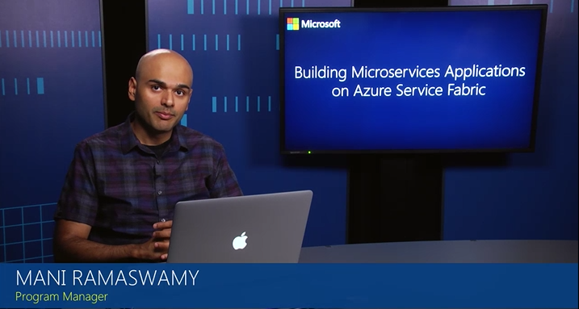

# Create your first Azure Service Fabric application
> [!div class="op_single_selector"]
> * [C# - Windows](service-fabric-create-your-first-application-in-visual-studio.md)
> * [Java - Linux](service-fabric-create-your-first-linux-application-with-java.md)
> * [C# - Linux](service-fabric-create-your-first-linux-application-with-csharp.md)
>
>

Service Fabric provides SDKs for building services on Linux in both .NET Core and Java. In this tutorial, we create an application for Linux and build a service using Java.  

> [!NOTE]
> Java as a first class built-in programming language is supported for the Linux preview only (Windows support is planned). However, any applications including Java applications can be run as guest executables or inside containers on Windows or Linux. For more information, see [Deploy an existing executable to Azure Service Fabric](service-fabric-deploy-existing-app.md) and [Deploy containers to Service Fabric](service-fabric-deploy-container.md).
>

## Video tutorial

The following Microsoft Virtual Academy video walks you through the process of creating a Java app on Linux:  
<center><a target="\_blank" href="https://mva.microsoft.com/en-US/training-courses/building-microservices-applications-on-azure-service-fabric-16747?l=DOX8K86yC_206218965">  
  
</a></center>


## Prerequisites
Before you get started, make sure that you have [set up your Linux development environment](service-fabric-get-started-linux.md). If you are using Mac OS X, you can [set up a Linux one-box environment in a virtual machine using Vagrant](service-fabric-get-started-mac.md).

## Create the application
A Service Fabric application can contain one or more services, each with a specific role in delivering the application's functionality. The Service Fabric SDK for Linux includes a [Yeoman](http://yeoman.io/) generator that makes it easy to create your first service and to add more later. Let's use Yeoman to create an application with a single service.

1. In a terminal, type ``yo azuresfjava``.
2. Name your application.
3. Choose the type of your first service and name it. For the purposes of this tutorial, we choose a Reliable Actor Service.

   ![Service Fabric Yeoman generator for Java][sf-yeoman]

> [!NOTE]
> For more information about the options, see [Service Fabric programming model overview](service-fabric-choose-framework.md).
>

## Build the application
The Service Fabric Yeoman templates include a build script for [Gradle](https://gradle.org/), which you can use to build the app from the terminal.

  ```bash
  cd myapp
  gradle
  ```

## Deploy the application
Once the application is built, you can deploy it to the local cluster using the Azure CLI.

1. Connect to the local Service Fabric cluster.

    ```bash
    azure servicefabric cluster connect
    ```

2. Use the install script provided in the template to copy the application package to the cluster's image store, register the application type, and create an instance of the application.

    ```bash
    ./install.sh
    ```

3. Open a browser and navigate to Service Fabric Explorer at http://localhost:19080/Explorer (replace localhost with the private IP of the VM if using Vagrant on Mac OS X).

4. Expand the Applications node and note that there is now an entry for your application type and another for the first instance of that type.

## Start the test client and perform a failover
Actor projects do not do anything on their own. They require another service or client to send them messages. The actor template includes a simple test script that you can use to interact with the actor service.

1. Run the script using the watch utility to see the output of the actor service.

    ```bash
    cd myactorsvcTestClient
    watch -n 1 ./testclient.sh
    ```

2. In Service Fabric Explorer, locate node hosting the primary replica for the actor service. In the screenshot below, it is node 3.

    ![Finding the primary replica in Service Fabric Explorer][sfx-primary]

3. Click the node you found in the previous step, then select **Deactivate (restart)** from the Actions menu. This action restarts one of the five nodes in your local cluster and force a failover to one of the secondary replicas running on another node. As you perform this action, pay attention to the output from the test client and note that the counter continues to increment despite the failover.

## Create and deploy an application with the Eclipse Neon plugin

Service Fabric also gives you the provision to create, build and deploy Service Fabric Java application using Eclipse. When installing Eclipse, choose the **Eclipse IDE for Java developers**. Also, Service Fabric currently supports the plugin for Eclipse **Neon**. Please refer to the detailed documentation - [Create and deploy your first Service Fabric Java application using Service Fabric Plugin for Eclipse on Linux](service-fabric-get-started-eclipse.md)

## Adding more services to an existing application

### Using command line utility
To add another service to an application already created using `yo`, perform the following steps:
1. Change directory to the root of the existing application.  For example, `cd ~/YeomanSamples/MyApplication`, if `MyApplication` is the application created by Yeoman.
2. Run `yo azuresfjava:AddService`

### Using Service Fabric Eclipse plugin for Java on Linux
To add service to an existing application created using Eclipse plugin for Service Fabric refer to documentation [here](service-fabric-get-started-eclipse.md#add-a-service-fabric-service-to-your-service-fabric-application).

## Next steps
* [Create and deploy your first Service Fabric Java application using Service Fabric Plugin for Eclipse on Linux](service-fabric-get-started-eclipse.md)
* [Learn more about Reliable Actors](service-fabric-reliable-actors-introduction.md)
* [Interacting with Service Fabric clusters using the Azure CLI](service-fabric-azure-cli.md)
* [Troubleshooting deployment](service-fabric-azure-cli.md#troubleshooting)
* Learn about [Service Fabric support options](service-fabric-support.md)

<!-- Images -->
[sf-yeoman]: ./media/service-fabric-create-your-first-linux-application-with-java/sf-yeoman.png
[sfx-primary]: ./media/service-fabric-create-your-first-linux-application-with-java/sfx-primary.png
[sf-eclipse-templates]: ./media/service-fabric-create-your-first-linux-application-with-java/sf-eclipse-templates.png
