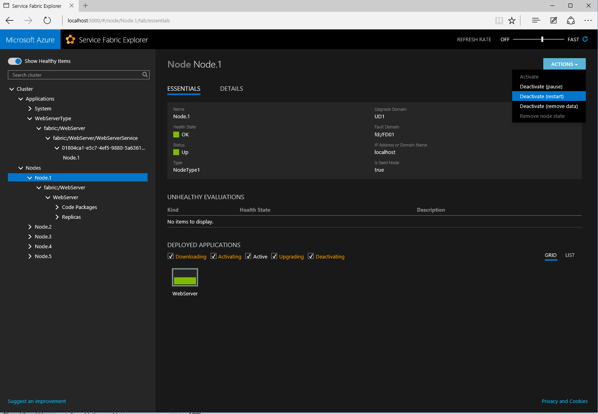
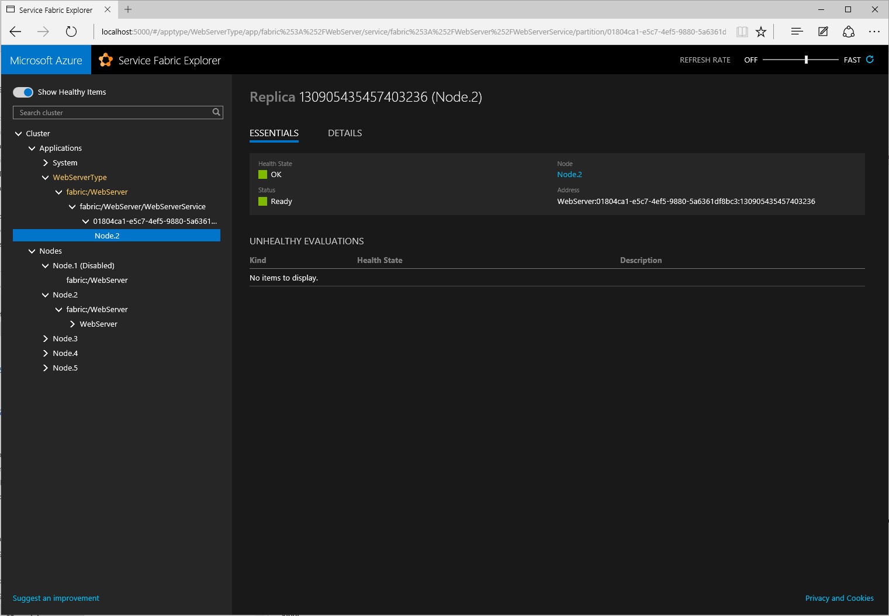
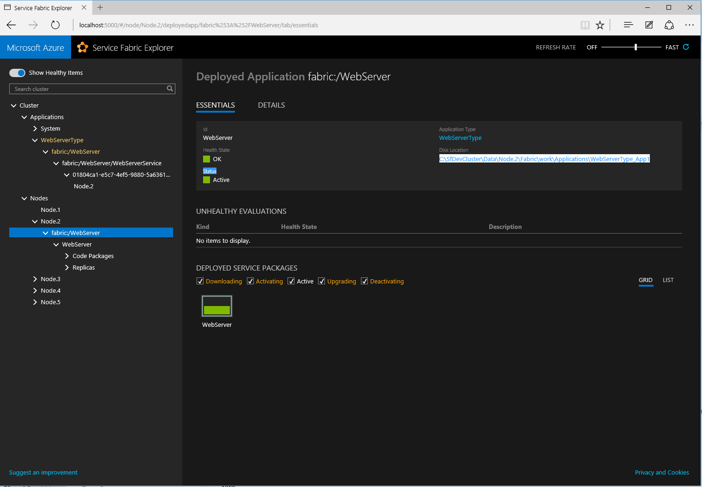

<properties
   pageTitle="Deploy an existing application in Azure Service Fabric | Microsoft Azure"
   description="Walkthrough on how to package an existing application so it can be deployed on an Azure Service Fabric cluster"
   services="service-fabric"
   documentationCenter=".net"
   authors="bscholl"
   manager=""
   editor=""/>

<tags
   ms.service="service-fabric"
   ms.devlang="dotnet"
   ms.topic="article"
   ms.tgt_pltfrm="NA"
   ms.workload="NA"
   ms.date="09/09/2015"
   ms.author="bscholl"/>


# Deploy an existing application to Service Fabric

You can run any type of existing application, such as Node.js, Java or native applications in Service Fabric. Service Fabric treats those applications like stateless services and places them on nodes in a cluster based on availability and other metrics. This article describes how to package and deploy an existing application to a Service Fabric cluster.

## Benefits of running an existing application in Service Fabric

A valid question is why we should use Service Fabric to host an application? There are a couple of advantages that come with running the application in Service Fabric Cluster:

- High availability: Applications that are run in Service Fabric are highly available out of the box. Service Fabric makes sure that always one instance of an application is up and running
- Health monitoring: Out of the box Service Fabric health monitoring detects if the application is up and running and provides diagnostics information the case of a failure   
- Application Life cycle management: Besides no downtime upgrades Service Fabric also allows to roll back to the previous version if there is an issue during upgrade.    
- Density: You can run multiple applications in cluster which eliminates the need for each application to run on its own hardware

In this article we cover the basic steps to package an existing application and deploy it to Service Fabric.  

### Process of packaging and deploying and existing application
At a high level you need to follow the steps below in order to deploy an existing application to Service Fabric:

1. Package the existing application
2. Make necessary changes to the manifest files
3. Deploy application to Service Fabric
4. Test application   

### Package a single application

The first step is to create a Service Fabric application package. Service Fabric expects an application package that contains the definition of the application as well the binaries and all other files that are needed for the application, so that Service Fabric knows what to execute and how to execute it.

Please read [Service Fabric Packaging format ](service-fabric-deploy-existing-app.md) for more details of the Service Fabric packaging format.

The easiest way to create an application package is using the Service Fabric packaging tool that ships as part of the Service Fabric SDK. The packaging tool is located in the Tools folder of the Service Fabric SDK installation path. The default installation location is C:\Program Files\Microsoft SDKs\Service Fabric\Tools.
The sample below shows how to run the packaging tool to package a simple application. ([A complete sample application is available on Gihub](https://github.com/Azure/servicefabric-samples/tree/comingsoon/samples/RealWorld/Hosting/SimpleApplication)):

Commandline:
```
ServiceFabricAppPackageUtil.exe /source:[directory of the application] /target:[directory that will contain the package] /appname:ApplicationName /exe:SimpleWebServer.exe
```
The tool supports the following parameters:

Mandatory parameters:

- **/source**: Points to the directory of the application that should be packaged.

>[AZURE.NOTE]:Make sure that this directory includes all the files/dependencies that the application needs. Service Fabric will copy the content of the application package on all nodes in the cluster where the application's services are going to be deployed. It is not recommended to assume that the dependencies are already installed, instead you may want to distribute the dependencies as part of the package.

- **/target**: Defines the directory in which the package should be created.

>[AZURE.NOTE]:The target directory cannot be a child of the source directory.

- **/appname**: Defines the application name of the application that will be packaged.
- **/exe**: Defines the executable that Service Fabric is supposed to launch. It does not need to be an .exe file. It could also be a batch file or a script.

Optional parameters:

- **/AppType**: Defines the application type name
- **/ver**: Defines the application type version
- **/ma**: Arguments that are needed to launch the application
- **/setup**: Defines what should be executed at startup, for example a startup script or executable
- **/sa**: Arguments for the start up script or executable
- **/cv**: Version of the code package
- **/count**: Number of instances of the application

    `InstanCount = "1" (Default setting)`: in this case only one instance of the service will be deployed on the cluster. Service Fabric's scheduler determines on which node the service is going to be deployed. A single instance count also makes sense for applications that require a different configuration if they run on multiple instances. In that case it is easier to define multiple services in the same application manifest file and use `InstanceCount = "1"`. So the end result will be to have multiple instances of the same service but each with a specific configuration. A value of `InstanceCount` greater than one makes sense only if the goal is to have multiple instance of the exact same configuration.

    `InstanceCount ="-1"`: in this case one instance of the service will be deployed on every node in the Service Fabric cluster. The end result will be having one (and only one) instance of the service for each node in the cluster. This is a useful configuration for front-end applications (ex. a REST endpoint) because client applications just need to 'connect' to any of the node in the cluster in order to use the endpoint. This configuration can also be used when, for instance, all nodes of the Service Fabric cluster are connected to a load balancer so client traffic can be distributed across the service running on all nodes in the cluster.

The output of the packaging tool is a Service Fabric package containing the application.
The sample below shows the package structure of the ([SimpleWebServer sample](https://github.com/Azure/servicefabric-samples/tree/comingsoon/samples/RealWorld/Hosting/SimpleApplication)):

```
|-- WebServer
	|-- C
		|-- SimpleWebServer.exe
	|-- config
		|--Settings.xml
	|-- ServiceManifest.xml
|-- ApplicationManifest.xml
```

The root contains the `ApplicationManifest.xml` file that defines the application. A subdirectory for each service (remember that Service Fabric executes an existing application as a stateless service) included in the application is used to contain all the artifacts that the service requires: The `ServiceManifest.xml` and, typically 2 directories:

- *C*: contains the existing application and its dependencies.
- *config*: contains a settings.xml file (and other files if necessary) that the application can access at runtime to retrieve specific configuration settings.

### Make necessary changes to the manifest files
The packaging tool provides parameters for the most common settings in the manifest files. However there are some occasions where you need to make some changes for your application to work. The most common ones are adding a port to an endpoint and adding logging capabilities. Both settings need to be added in the `ServiceManifest.xml`.
The sample below shows how to add port 8080 to the generated Endpoint element.

```xml
<Resources>
    <Endpoints>
     <Endpoint Name="WebServerTypeEndpoint" Protocol="http" Port="8080" Type="Input" />
    </Endpoints>
</Resources>
```
The sample below shows how to add `ConsoleRedirection` element to the `ServiceManifest.xml`

```xml
<EntryPoint>
  <ExeHost>
    <Program>SimpleWebServer.exe</Program>
    <ConsoleRedirection FileRetentionCount="5" FileMaxSizeInKb="2048"/>
  </ExeHost>
</EntryPoint>
```

* `ConsoleRedirection` can be used to redirect console output (both stdout and stderr) to a working directory so they can be used to verify that there are no errors during the setup or execution of the application in the Service Fabric cluster.

	* `FileRetentionCount` determines how many files are saved in the working directory. A value of, for instance, 5 means that the log files for the previous 5 executions are stored in the working directory.
	* `FileMaxSizeInKb` specifies the max size of the log files.

### Deploy application to Service Fabric

The script below demonstrates how to use PowerShell to deploy the application package to a local development cluster.

>[AZURE.NOTE]:If you want to use the script to deploy to a Service Fabric cluster in Azure you need to change the -ImageStoreConnectionString parameter to 'fabric:imagestore' and the -ApplicationPackagePathInImageStore parameter must not contain 'Store\'.

```
Connect-ServiceFabricCluster localhost:19000

Write-Host 'Copying application package...'
Copy-ServiceFabricApplicationPackage -ApplicationPackagePath '[Service Fabric package directory]' -ImageStoreConnectionString 'file:C:\SfDevCluster\Data\ImageStore' -ApplicationPackagePathInImageStore 'Store\WebServer'

Write-Host 'Registering application type...'
Register-ServiceFabricApplicationType -ApplicationPathInImageStore 'Store\WebServer'

New-ServiceFabricApplication -ApplicationName 'fabric:/WebServer' -ApplicationTypeName 'WebServerType' -ApplicationTypeVersion 1.0  
```

### Testing the application

Once the application is successfully published to the local cluster you can test it through accessing its endpoint, for example through a browser in case it offers a web endpoint.

#### Test failover
This is also a good opportunity to check on one of the advantages of running an application in Service Fabric. You can test what happens if you reboot the node on which you application runs, you can use Service Fabric Explorer to do that. Figure 1 shows that the application fabric:/WebServer runs on Node1 and  how to restart the node in Service Fabric Explorer.



Service Fabric will immediately failover and start the application on another node. If you now look at the Service Fabric Explorer again, you can see that Service Fabric started the application on another node. Figure 2 shows fabric:/WebServer running on Node 2 after the failover.



#### Check application logs
In case the application is not starting or is not showing the desired behavior you can check the logs that were written to the logs directory (assuming you added the `ConsoleRedirection` to the `ServiceManifest.xml`). The log files are saved on one of the service's working directories `Logs`. In order to determine where the files are located, you need to use the Service Fabric Explorer to determine in which node the service is running and which is the working directory that is currently used. The image below shows how to find the working directory.



### Summary
In this topic you have learned how to package and deploy an existing application so that it can benefit from some of the Service Fabric features such as high availability and heath system integration.

For more information see the following topics

[Service Fabric Packaging format ](service-fabric-deploy-existing-app.md)

[Deploy multiple existing applications to Service Fabric ](service-fabric-custom-application-orchestration-multiple-apps.md)
