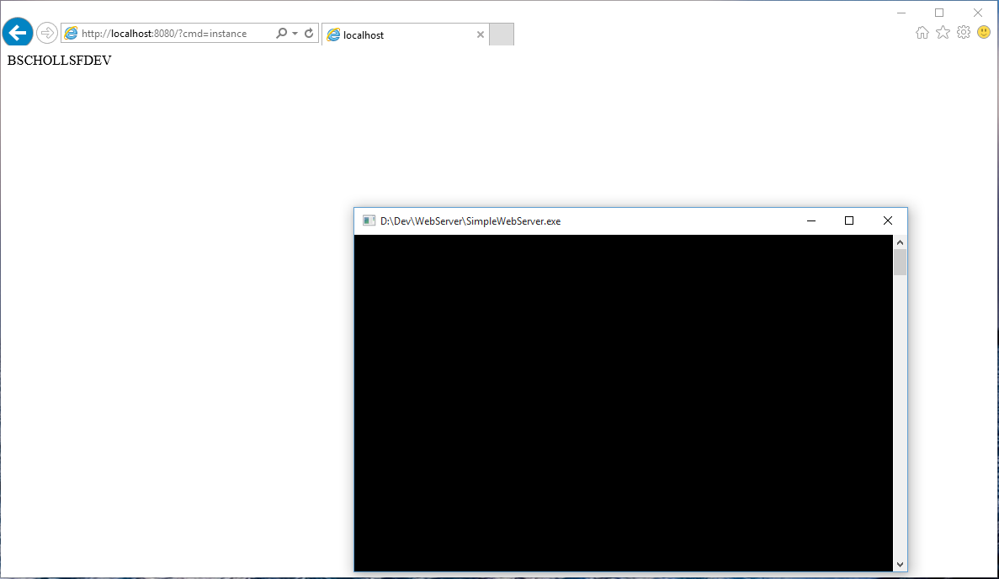
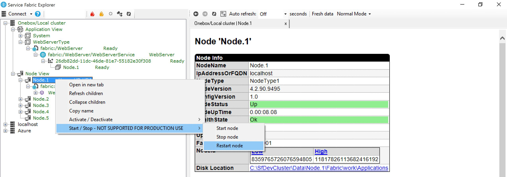
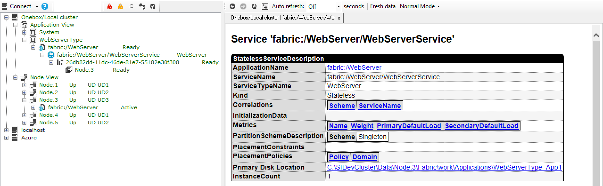

<properties
   pageTitle="Deploy an existing application in Azure Service Fabric | Microsoft Azure"
   description="Walkthrough on how to package an existing application so it can be deployed on an Azure Service Fabric cluster"
   services="service-fabric"
   documentationCenter=".net"
   authors="bscholl"
   manager=""
   editor=""/>

<tags
   ms.service="service-fabric"
   ms.devlang="dotnet"
   ms.topic="article"
   ms.tgt_pltfrm="NA"
   ms.workload="NA"
   ms.date="09/09/2015"
   ms.author="bscholl"/>


# Deploy an existing application to Service Fabric

Azure Service Fabric can be used to run existing applications such as Node.js, Java or native applications. Service Fabric treats those applications like stateless services and places them on nodes in a cluster based on availability and other metrics.

## Benefits of running an existing application in Service Fabric

A valid question is why we should use Service Fabric to host an application? There are a couple of advantages that come with running the application in Service Fabric Cluster:

- High availability: Applications that are run in Service Fabric are highly available out of the box. Service Fabric makes sure that always one instance of an application is up and running
- Health monitoring: Out of the box Service Fabric health monitoring detects if the application is up and running and provides diagnostics information the case of a failure   
- Application Life cycle management: Besides no downtime upgrades Service Fabric also allows to roll back to the previous version if there is an issue during upgrade.    
- Density: You can run multiple applications in cluster which eliminates the need for each application to run on its own hardware

In this article we cover the basic steps to package an existing application and deploy it to Service Fabric.  

## Package and deploy a single application

Let's have a quick look at the application we want to package and publish to Service Fabric first. The application consists of a single executable, SimpleWebServer.exe, which listens to port 8080 and returns the machine name. In reality it could be any .exe file. You can download the sample application from [GitHub ](https://github.com/bmscholl/servicefabric-samples/tree/comingsoon/samples/RealWorld/Hosting/SimpleApplication).

The image below shows the running application and accessing it through the browser.


The first step is to create a Service Fabric application package. Service Fabric expects an application package that contains the definition of the application as well the binaries and all other files that are needed for the application, so that Service Fabric knows what to execute and how to execute it.

Please read [Service Fabric Packaging format ](service-fabric-deploy-existing-app.md) for more details of the Service Fabric packaging format.

The easiest way to create an application package is using the Service Fabric packaging tool that ships as part of the SDK. The packaging tool is located in the Tools folder of the Service Fabric SDK installation path. The default installation location is C:\Program Files\Microsoft SDKs\Service Fabric\Tools. Let's go ahead an browse to the tools folder using command line or PowerShell and execute the following command:

```
ServiceFabricAppPackageUtil.exe /source:[directory of SimpleWebServer.exe] /target:[directory that will contain the package] /appname:WebServer /exe:SimpleWebServer.exe
```
This will create a Service Fabric application package that contains the SimpleWebServer executable. Before we look at the package we should look at the parameters we used:

- **/source**: Points to the directory of the application that should be packaged
- **/target**: Defines the directory in which the package should be created
- **/appname**: Defines the application name of the application that we want to package.
- **/exe**: Defines the executable that Service Fabric is supposed to launch. It does not need to be an .exe file. It could also be a batch file or a script.

These four parameters are always needed. Below is the list of optional parameters:

- **/AppType**: Defines the application type name
- **/ver**: Defines the application type version
- **/ma**: Arguments that are needed to launch the application
- **/setup**: Defines what should be executed at startup, for example a startup script or executable
- **/sa**: Arguments for the start up script or executable
- **/cv**: Version of the code package
- **/count**: Instance count. The default setting is 1.

If we browse to the directory that we specified in the /target parameter we can see that the tool has created a fully functioning Service Fabric package as shown below:
```
|-- WebServer
	|-- C
		|-- SimpleWebServer.exe
	|-- config
		|--Settings.xml
	|-- ServiceManifest.xml
|-- ApplicationManifest.xml
```

Before we can test our WebServer on the local Service Fabric cluster we need to define an endpoint on port 8080. To do this we need to update the ServiceManifest.xml EndPoint element as shown below.

```xml
<Resources>
    <Endpoints>
     <Endpoint Name="WebServerTypeEndpoint" Protocol="http" Port="8080" Type="Input" />
    </Endpoints>
</Resources>
```

The last step is to publish the application to the local Service Fabric cluster using the PowerShell scripts below:

```
Connect-ServiceFabricCluster localhost:19000

Write-Host 'Copying application package...'
Copy-ServiceFabricApplicationPackage -ApplicationPackagePath 'D:\Dev\WebServerPackage' -ImageStoreConnectionString 'file:C:\SfDevCluster\Data\ImageStore' -ApplicationPackagePathInImageStore 'Store\WebServer'

Write-Host 'Registering application type...'
Register-ServiceFabricApplicationType -ApplicationPathInImageStore 'Store\WebServer'

New-ServiceFabricApplication -ApplicationName 'fabric:/WebServer' -ApplicationTypeName 'WebServerType' -ApplicationTypeVersion 1.0  
```

Once the application is successfully published to the local cluster we can access the web server through http://localhost:8080.
This is a good opportunity to check on one of the advantages of running an application in Service Fabric. Let's test what happens if we reboot the node on which our web server runs, we can use Service Fabric Explorer to restart nodes. Figure 1 shows that our web server runs on Node1 and that we are about to restart the node in Service Fabric Explorer.



Service Fabric will immediately failover and start the application on another node. If we now look at the Service Fabric explorer again we can see that Service Fabric started our web server on another node. Figure 2 shows our web server running on Node 3 after the failover.



In this topic we have seen how to package and deploy an existing application so that it can benefit from some of the Service Fabric features such as high availability and heath system integration.

For more information see the following topics

[Service Fabric Packaging format ](service-fabric-deploy-existing-app.md)

[Deploy multiple existing applications to Service Fabric ](service-fabric-custom-application-orchestration-multiple-apps.md)
