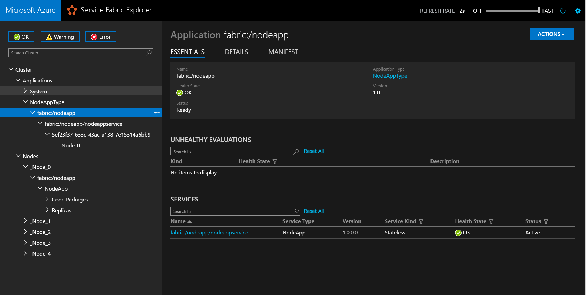
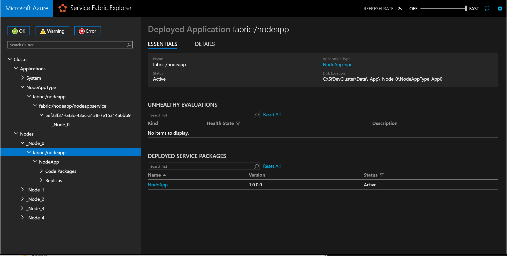
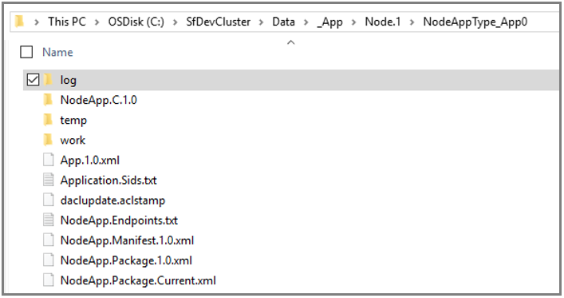

# Package and deploy an existing executable to Service Fabric
When packaging an existing executable as a [guest executable](service-fabric-guest-executables-introduction.md), you can choose either to use a Visual Studio project template or to [create the application package manually](#manually). Using Visual Studio, the application package structure and manifest files are created by the new project template for you.

> [!TIP]
> The easiest way to package an existing Windows executable into a service is to use Visual Studio and on Linux to use Yeoman
>

## Use Visual Studio to package and deploy an existing executable
Visual Studio provides a Service Fabric service template to help you deploy a guest executable to a Service Fabric cluster.

1. Choose **File** > **New Project**, and create a Service Fabric application.
2. Choose **Guest Executable** as the service template.
3. Click **Browse** to select the folder with your executable and fill in the rest of the parameters to create the service.
   * *Code Package Behavior*. Can be set to copy all the content of your folder to the Visual Studio Project, which is useful if the executable does not change. If you expect the executable to change and want the ability to pick up new builds dynamically, you can choose to link to the folder instead. You can use linked folders when creating the application project in Visual Studio. This links to the source location from within the project, making it possible for you to update the guest executable in its source destination. Those updates become part of the application package on build.
   * *Program* specifies the executable that should be run to start the service.
   * *Arguments* specifies the arguments that should be passed to the executable. It can be a list of parameters with arguments.
   * *WorkingFolder* specifies the working directory for the process that is going to be started. You can specify three values:
     * `CodeBase` specifies that the working directory is going to be set to the code directory in the application package (`Code` directory shown in the preceding file structure).
     * `CodePackage` specifies that the working directory is going to be set to the root of the application package    (`GuestService1Pkg` shown in the preceding file structure).
     * `Work` specifies that the files are placed in a subdirectory called work.
4. Give your service a name, and click **OK**.
5. If your service needs an endpoint for communication, you can now add the protocol, port, and type to the ServiceManifest.xml file. For example: `<Endpoint Name="NodeAppTypeEndpoint" Protocol="http" Port="3000" UriScheme="http" PathSuffix="myapp/" Type="Input" />`.
6. You can now use the package and publish action against your local cluster by debugging the solution in Visual Studio. When ready, you can publish the application to a remote cluster or check in the solution to source control.
7. Read [check your running application](#check-your-running-application) to see how to view your guest executable service running in Service Fabric Explorer.

For an example walkthrough, see [Create your first guest executable application using Visual Studio](quickstart-guest-app.md).

## Use Yeoman to package and deploy an existing executable on Linux

The procedure for creating and deploying a guest executable on Linux is the same as deploying a csharp or java application.

1. In a terminal, type `yo azuresfguest`.
2. Name your application.
3. Name your service, and provide the details including path of the executable and the parameters it must be invoked with.

Yeoman creates an application package with the appropriate application and manifest files along with install and uninstall scripts.

<a id="manually"></a>

## Manually package and deploy an existing executable
The process of manually packaging a guest executable is based on the following general steps:

1. Create the package directory structure.
2. Add the application's code and configuration files.
3. Edit the service manifest file.
4. Edit the application manifest file.

<!--
>[AZURE.NOTE] We do provide a packaging tool that allows you to create the ApplicationPackage automatically. The tool is currently in preview. You can download it from [here](https://aka.ms/servicefabricpacktool).
-->

### Create the package directory structure
You can start by creating the directory structure, as described in [Package an Azure Service Fabric App](https://docs.microsoft.com/azure/service-fabric/service-fabric-package-apps).

### Add the application's code and configuration files
After you have created the directory structure, you can add the application's code and configuration files under the code and config directories. You can also create additional directories or subdirectories under the code or config directories.

Service Fabric does an `xcopy` of the content of the application root directory, so there is no predefined structure to use other than creating two top directories, code and settings. (You can pick different names if you want. More details are in the next section.)

> [!NOTE]
> Make sure that you include all the files and dependencies that the application needs. Service Fabric copies the content of the application package on all nodes in the cluster where the application's services are going to be deployed. The package should contain all the code that the application needs to run. Do not assume that the dependencies are already installed.
>
>

### Edit the service manifest file
The next step is to edit the service manifest file to include the following information:

* The name of the service type. This is an ID that Service Fabric uses to identify a service.
* The command to use to launch the application (ExeHost).
* Any script that needs to be run to set up the application (SetupEntrypoint).

The following is an example of a `ServiceManifest.xml` file:

```xml
<?xml version="1.0" encoding="utf-8"?>
<ServiceManifest xmlns:xsd="https://www.w3.org/2001/XMLSchema" xmlns:xsi="https://www.w3.org/2001/XMLSchema-instance" Name="NodeApp" Version="1.0.0.0" xmlns="http://schemas.microsoft.com/2011/01/fabric">
   <ServiceTypes>
      <StatelessServiceType ServiceTypeName="NodeApp" UseImplicitHost="true"/>
   </ServiceTypes>
   <CodePackage Name="code" Version="1.0.0.0">
      <SetupEntryPoint>
         <ExeHost>
             <Program>scripts\launchConfig.cmd</Program>
         </ExeHost>
      </SetupEntryPoint>
      <EntryPoint>
         <ExeHost>
            <Program>node.exe</Program>
            <Arguments>bin/www</Arguments>
            <WorkingFolder>CodePackage</WorkingFolder>
         </ExeHost>
      </EntryPoint>
   </CodePackage>
   <Resources>
      <Endpoints>
         <Endpoint Name="NodeAppTypeEndpoint" Protocol="http" Port="3000" Type="Input" />
      </Endpoints>
   </Resources>
</ServiceManifest>
```

The following sections go over the different parts of the file that you need to update.

#### Update ServiceTypes
```xml
<ServiceTypes>
  <StatelessServiceType ServiceTypeName="NodeApp" UseImplicitHost="true" />
</ServiceTypes>
```

* You can pick any name that you want for `ServiceTypeName`. The value is used in the `ApplicationManifest.xml` file to identify the service.
* Specify `UseImplicitHost="true"`. This attribute tells Service Fabric that the service is based on a self-contained app, so all Service Fabric needs to do is to launch it as a process and monitor its health.

#### Update CodePackage
The CodePackage element specifies the location (and version) of the service's code.

```xml
<CodePackage Name="Code" Version="1.0.0.0">
```

The `Name` element is used to specify the name of the directory in the application package that contains the service's code. `CodePackage` also has the `version` attribute. This can be used to specify the version of the code, and can also potentially be used to upgrade the service's code by using the application lifecycle management infrastructure in Service Fabric.

#### Optional: Update SetupEntrypoint
```xml
<SetupEntryPoint>
   <ExeHost>
       <Program>scripts\launchConfig.cmd</Program>
   </ExeHost>
</SetupEntryPoint>
```
The SetupEntryPoint element is used to specify any executable or batch file that should be executed before the service's code is launched. It is an optional step, so it does not need to be included if there is no initialization required. The SetupEntryPoint is executed every time the service is restarted.

There is only one SetupEntryPoint, so setup scripts need to be grouped in a single batch file if the application's setup requires multiple scripts. The SetupEntryPoint can execute any type of file: executable files, batch files, and PowerShell cmdlets. For more details, see [Configure SetupEntryPoint](service-fabric-application-runas-security.md).

In the preceding example, the SetupEntryPoint runs a batch file called `LaunchConfig.cmd` that is located in the `scripts` subdirectory of the code directory (assuming the WorkingFolder element is set to CodeBase).

#### Update EntryPoint
```xml
<EntryPoint>
  <ExeHost>
    <Program>node.exe</Program>
    <Arguments>bin/www</Arguments>
    <WorkingFolder>CodeBase</WorkingFolder>
  </ExeHost>
</EntryPoint>
```

The `EntryPoint` element in the service manifest file is used to specify how to launch the service.

The `ExeHost` element specifies the executable (and arguments) that should be used to launch the service. You can optionally add the `IsExternalExecutable="true"` attribute to `ExeHost` to indicate that the program is an external executable outside of the code package. For example, `<ExeHost IsExternalExecutable="true">`.

* `Program` specifies the name of the executable that should start the service.
* `Arguments` specifies the arguments that should be passed to the executable. It can be a list of parameters with arguments.
* `WorkingFolder` specifies the working directory for the process that is going to be started. You can specify three values:
  * `CodeBase` specifies that the working directory is going to be set to the code directory in the application package (`Code` directory in the preceding file structure).
  * `CodePackage` specifies that the working directory is going to be set to the root of the application package    (`GuestService1Pkg` in the preceding file structure).
    * `Work` specifies that the files are placed in a subdirectory called work.

The WorkingFolder is useful to set the correct working directory so that relative paths can be used by either the application or initialization scripts.

#### Update Endpoints and register with Naming Service for communication
```xml
<Endpoints>
   <Endpoint Name="NodeAppTypeEndpoint" Protocol="http" Port="3000" Type="Input" />
</Endpoints>

```
In the preceding example, the `Endpoint` element specifies the endpoints that the application can listen on. In this example, the Node.js application listens on http on port 3000.

Furthermore you can ask Service Fabric to publish this endpoint to the Naming Service so other services can discover the endpoint address to this service. This enables you to be able to communicate between services that are guest executables.
The published endpoint address is of the form `UriScheme://IPAddressOrFQDN:Port/PathSuffix`. `UriScheme` and `PathSuffix` are optional attributes. `IPAddressOrFQDN` is the IP address or fully qualified domain name of the node this executable gets placed on, and it is calculated for you.

In the following example, once the service is deployed, in Service Fabric Explorer you see an endpoint similar to `http://10.1.4.92:3000/myapp/` published for the service instance. Or if this is a local machine, you see `http://localhost:3000/myapp/`.

```xml
<Endpoints>
   <Endpoint Name="NodeAppTypeEndpoint" Protocol="http" Port="3000"  UriScheme="http" PathSuffix="myapp/" Type="Input" />
</Endpoints>
```
You can use these addresses with [reverse proxy](service-fabric-reverseproxy.md) to communicate between services.

### Edit the application manifest file
Once you have configured the `Servicemanifest.xml` file, you need to make some changes to the `ApplicationManifest.xml` file to ensure that the correct service type and name are used.

```xml
<?xml version="1.0" encoding="utf-8"?>
<ApplicationManifest xmlns:xsd="https://www.w3.org/2001/XMLSchema" xmlns:xsi="https://www.w3.org/2001/XMLSchema-instance" ApplicationTypeName="NodeAppType" ApplicationTypeVersion="1.0" xmlns="http://schemas.microsoft.com/2011/01/fabric">
   <ServiceManifestImport>
      <ServiceManifestRef ServiceManifestName="NodeApp" ServiceManifestVersion="1.0.0.0" />
   </ServiceManifestImport>
</ApplicationManifest>
```

#### ServiceManifestImport
In the `ServiceManifestImport` element, you can specify one or more services that you want to include in the app. Services are referenced with `ServiceManifestName`, which specifies the name of the directory where the `ServiceManifest.xml` file is located.

```xml
<ServiceManifestImport>
  <ServiceManifestRef ServiceManifestName="NodeApp" ServiceManifestVersion="1.0.0.0" />
</ServiceManifestImport>
```

## Set up logging
For guest executables, it is useful to be able to see console logs to find out if the application and configuration scripts show any errors.
Console redirection can be configured in the `ServiceManifest.xml` file using the `ConsoleRedirection` element.

> [!WARNING]
> Never use the console redirection policy in an application that is deployed in production because this can affect the application failover. *Only* use this for local development and debugging purposes.  
>
>

```xml
<EntryPoint>
  <ExeHost>
    <Program>node.exe</Program>
    <Arguments>bin/www</Arguments>
    <WorkingFolder>CodeBase</WorkingFolder>
    <ConsoleRedirection FileRetentionCount="5" FileMaxSizeInKb="2048"/>
  </ExeHost>
</EntryPoint>
```

`ConsoleRedirection` can be used to redirect console output (both stdout and stderr) to a working directory. This provides the ability to verify that there are no errors during the setup or execution of the application in the Service Fabric cluster.

`FileRetentionCount` determines how many files are saved in the working directory. A value of 5, for example, means that the log files for the previous five executions are stored in the working directory.

`FileMaxSizeInKb` specifies the maximum size of the log files.

Log files are saved in one of the service's working directories. To determine where the files are located, use Service Fabric Explorer to determine which node the service is running on, and which working directory is being used. This process is covered later in this article.

## Deployment
The last step is to [deploy your application](service-fabric-deploy-remove-applications.md). The following PowerShell script shows how to deploy your application to the local development cluster, and start a new Service Fabric service.

```powershell

Connect-ServiceFabricCluster localhost:19000

Write-Host 'Copying application package...'
Copy-ServiceFabricApplicationPackage -ApplicationPackagePath 'C:\Dev\MultipleApplications' -ImageStoreConnectionString 'file:C:\SfDevCluster\Data\ImageStoreShare' -ApplicationPackagePathInImageStore 'nodeapp'

Write-Host 'Registering application type...'
Register-ServiceFabricApplicationType -ApplicationPathInImageStore 'nodeapp'

New-ServiceFabricApplication -ApplicationName 'fabric:/nodeapp' -ApplicationTypeName 'NodeAppType' -ApplicationTypeVersion 1.0

New-ServiceFabricService -ApplicationName 'fabric:/nodeapp' -ServiceName 'fabric:/nodeapp/nodeappservice' -ServiceTypeName 'NodeApp' -Stateless -PartitionSchemeSingleton -InstanceCount 1

```

>[!TIP]
> [Compress the package](service-fabric-package-apps.md#compress-a-package) before copying to the image store if the package is large or has many files. Read more [here](service-fabric-deploy-remove-applications.md#upload-the-application-package).
>

A Service Fabric service can be deployed in various "configurations." For example, it can be deployed as single or multiple instances, or it can be deployed in such a way that there is one instance of the service on each node of the Service Fabric cluster.

The `InstanceCount` parameter of the `New-ServiceFabricService` cmdlet is used to specify how many instances of the service should be launched in the Service Fabric cluster. You can set the `InstanceCount` value, depending on the type of application that you are deploying. The two most common scenarios are:

* `InstanceCount = "1"`. In this case, only one instance of the service is deployed in the cluster. Service Fabric's scheduler determines which node the service is going to be deployed on.
* `InstanceCount ="-1"`. In this case, one instance of the service is deployed on every node in the Service Fabric cluster. The result is having one (and only one) instance of the service for each node in the cluster.

This is a useful configuration for front-end applications (for example, a REST endpoint), because client applications need to "connect" to any of the nodes in the cluster to use the endpoint. This configuration can also be used when, for example, all nodes of the Service Fabric cluster are connected to a load balancer. Client traffic can then be distributed across the service that is running on all nodes in the cluster.

## Check your running application
In Service Fabric Explorer, identify the node where the service is running. In this example, it runs on Node1:



If you navigate to the node and browse to the application, you see the essential node information, including its location on disk.



If you browse to the directory by using Server Explorer, you can find the working directory and the service's log folder, as shown in the following screenshot: 



## Next steps
In this article, you have learned how to package a guest executable and deploy it to Service Fabric. See the following articles for related information and tasks.

* [Sample for packaging and deploying a guest executable](https://github.com/Azure-Samples/service-fabric-dotnet-getting-started), including a link to the prerelease of the packaging tool
* [Sample of two guest executables (C# and nodejs) communicating via the Naming service using REST](https://github.com/Azure-Samples/service-fabric-containers)
* [Deploy multiple guest executables](service-fabric-deploy-multiple-apps.md)
* [Create your first Service Fabric application using Visual Studio](service-fabric-tutorial-create-dotnet-app.md)
