# Develop C# Service Fabric applications with Visual Studio Code

The [Service Fabric Reliable Services extension for VS Code](https://marketplace.visualstudio.com/items?itemName=ms-azuretools.vscode-service-fabric-reliable-services) makes it easy to build .NET Core Service Fabric applications on Windows, Linux, and  macOS operating systems.

This article shows you how to build, deploy, and debug a .NET Core Service Fabric application using Visual Studio Code.

## Prerequisites

This article assumes that you have already installed VS Code, the Service Fabric Reliable Services extension for VS Code, and any dependencies required for your development environment. To learn more, see [Getting Started](./service-fabric-get-started-vs-code.md#prerequisites).

## Download the sample
This article uses the CounterService application in the [Service Fabric .NET Core getting started samples GitHub repository](https://github.com/Azure-Samples/service-fabric-dotnet-core-getting-started). 

To clone the repository to your development machine, run the following command from a terminal window (command window on Windows):

```
git clone https://github.com/Azure-Samples/service-fabric-dotnet-core-getting-started.git
```

## Open the application in VS Code

### Windows
Right-click the VS Code icon in the Start Menu and choose **Run as administrator**. To attach the debugger to your services, you need to run VS Code as administrator.

### Linux
Using the terminal, navigate to the path /service-fabric-dotnet-core-getting-started/Services/CounterService from the directory that the application was cloned into locally.

Run the following command to open VS Code as a root user so that the debugger can attach to your services.
```
sudo code . --user-data-dir='.'
```

The application should now appear in your VS Code workspace.

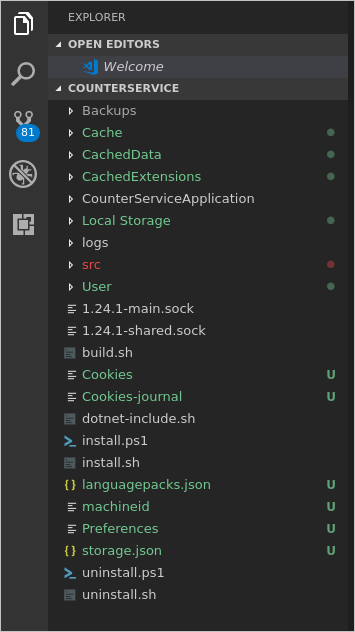

## Build the application
1. Press (Ctrl + Shift + p) to open the **Command Palette** in VS Code.
2. Search for and select the **Service Fabric: Build Application** command. The build output is sent to the integrated terminal.

   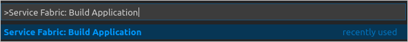

## Deploy the application to the local cluster
After you have built the application, you can deploy it to the local cluster. 

1. From the **Command Palette**, select the **Service Fabric: Deploy Application (Localhost) command**. The output of the install process is sent to the integrated terminal.

   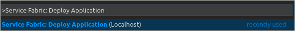

4. When the deployment is complete, launch a browser and open Service Fabric Explorer: http:\//localhost:19080/Explorer. You should see that the application is running. This may take some time, so be patient. 

   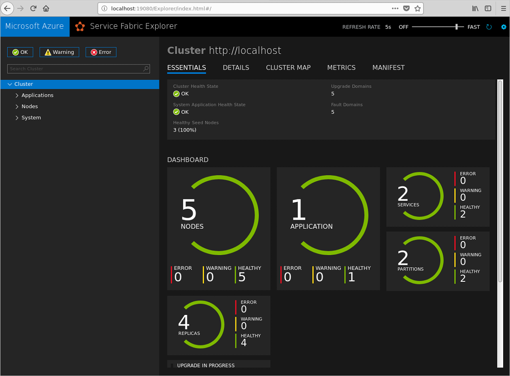

4. After you've verified the application is running, launch a browser and open this page: http:\//localhost:31002. This is the web front-end of the application. Refresh the page to see the current value of the counter as it increments.

   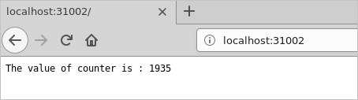

## Publish the application to an Azure Service Fabric cluster
Along with deploying the application to the local cluster, you can also publish the application to a remote Azure Service Fabric cluster. 

1. Ensure that you have built your application using the instructions above. Update the generated configuration file `Cloud.json` with the details of the remote cluster you want to publish to.

2. From the **Command Palette**, select the **Service Fabric: Publish Application command**. The output of the install process is sent to the integrated terminal.

   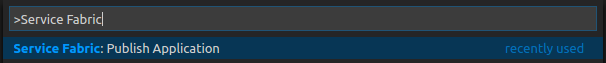

3. When the deployment is complete, launch a browser and open Service Fabric Explorer: `https:<clusterurl>:19080/Explorer`. You should see that the application is running. This may take some time, so be patient. 

## Debug the application
When debugging applications in VS Code, the application must be running on a local cluster. Breakpoints can then be added to the code.

To set a breakpoint and debug, complete the following steps:
1. In Explorer, open the */src/CounterServiceApplication/CounterService/CounterService.cs* file and set a breakpoint at line 62 inside the `RunAsync` method.
3. Click the Debug icon in the **Activity Bar** to open the debugger view in VS Code. Click the gear icon at the top of the debugger view and select **.NET Core** from the dropdown environment menu. The launch.json file opens. You can close this file. Now you should see configuration choices in the debug configuration menu located next to the run button (green arrow).

   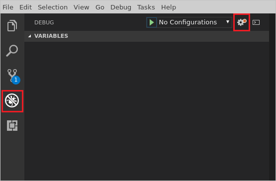

2. Select **.NET Core Attach** from the debug configuration menu.

   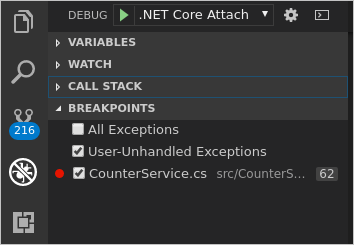

3. Open Service Fabric Explorer in a browser: http:\//localhost:19080/Explorer. Click **Applications** and drill down to determine the primary node that the CounterService is running on. In the image below the primary node for the CounterService is Node 0.

   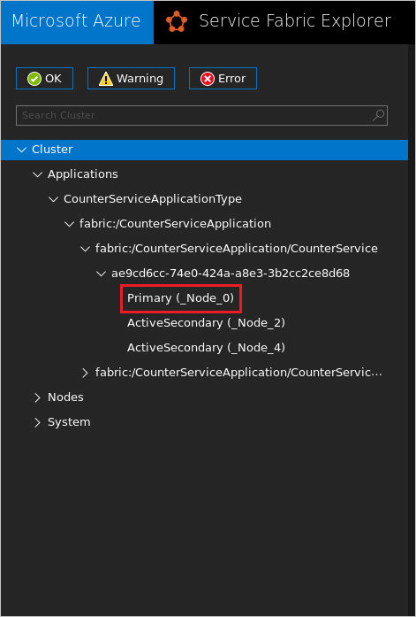

4. In VS Code, click the run icon (green arrow) beside the **.NET Core Attach** debug configuration. In the process selection dialog, select the CounterService process that is running on the primary node that you identified in step 4.

   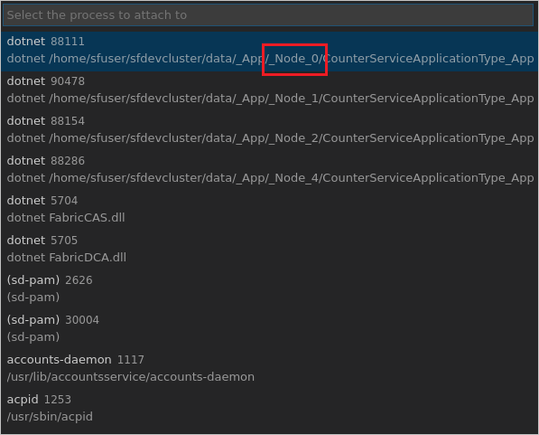

5. The breakpoint in the *CounterService.cs* file will be hit very quickly. You can then explore the values of the local variables. Use the Debug toolbar at the top of VS Code to continue execution, step over lines, step into methods, or step out of the current method. 

   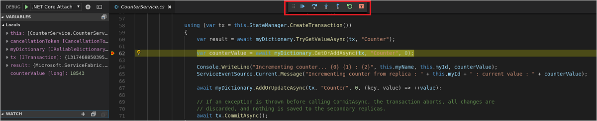

6. To end the debugging session, click the plug icon on the Debug toolbar at the top of VS Code..
   
   
       
7. When you've finished debugging, you can use the **Service Fabric: Remove Application** command to remove the CounterService application from your local cluster. 

## Next steps

* Learn how to [develop and debug Java Service Fabric applications with VS Code](./service-fabric-develop-java-applications-with-vs-code.md).
