# Diagnose common scenarios with Service Fabric

This article illustrates common scenarios users have encountered in the area of monitoring and diagnostics with Service Fabric. The scenarios presented cover all 3 layers of service fabric: Application, Cluster, and Infrastructure. Each solution uses Application Insights and Azure Monitor logs, Azure monitoring tools, to complete each scenario. The steps in each solution give users an introduction on how to use Application Insights and Azure Monitor logs in the context of Service Fabric.

[!INCLUDE [azure-monitor-log-analytics-rebrand](../../includes/azure-monitor-log-analytics-rebrand.md)]

## Prerequisites and Recommendations

The solutions in this article will use the following tools. We recommend you have these set up and configured:

* [Application Insights with Service Fabric](service-fabric-tutorial-monitoring-aspnet.md)
* [Enable Azure Diagnostics on your cluster](service-fabric-diagnostics-event-aggregation-wad.md)
* [Set up a Log Analytics workspace](service-fabric-diagnostics-oms-setup.md)
* [Log Analytics agent to track Performance Counters](service-fabric-diagnostics-oms-agent.md)

## How can I see unhandled exceptions in my application?

1. Navigate to your Application Insights resource that your application is configured with.
2. Click on *Search* in the top left. Then click filter on the next panel.

    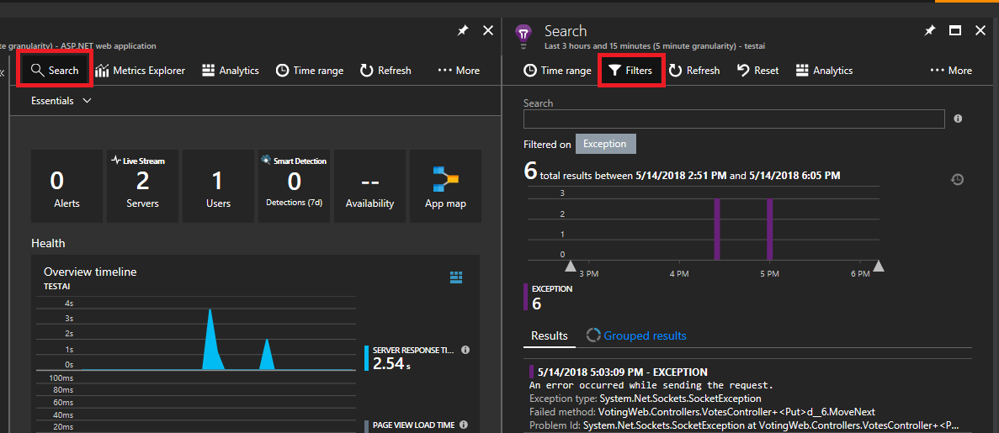

3. You will see lots of types of events (traces, requests, custom events). Choose "Exception" as your filter.

    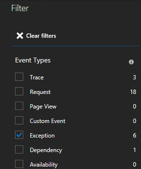

    By clicking an exception in the list, you can look at more details including the service context if you are using the Service Fabric Application Insights SDK.

    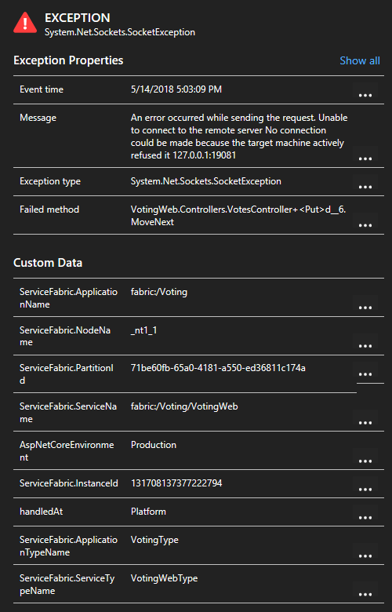

## How do I view which HTTP calls are used in my services?

1. In the same Application Insights resource, you can filter on "requests" instead of exceptions and view all requests made
2. If you are using the Service Fabric Application Insights SDK, you can see a visual representation of your services connected to one another, and the number of succeeded and failed requests. On the left click "Application Map"

    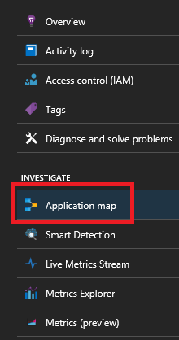
    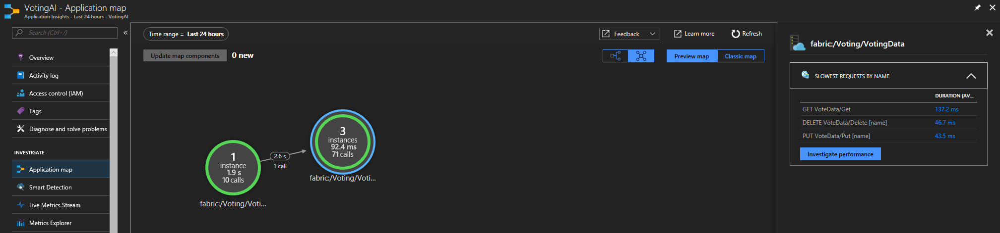

    For more information on the application map, visit the [Application Map documentation](../azure-monitor/app/app-map.md)

## How do I create an alert when a node goes down

1. Node events are tracked by your Service Fabric cluster. Navigate to the Service Fabric Analytics solution resource named **ServiceFabric(NameofResourceGroup)**
2. Click on the graph on the bottom of the blade titled "Summary"

    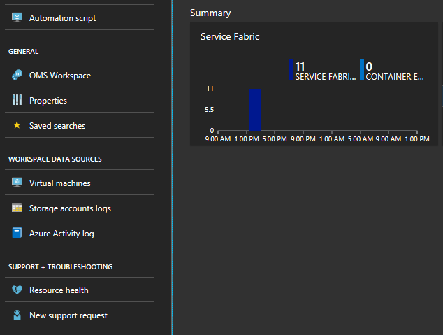

3. Here you have many graphs and tiles displaying various metrics. Click on one of the graphs and it will take you to the Log Search. Here you can query for any cluster events or performance counters.
4. Enter the following query. These event IDs are found in the [Node events reference](service-fabric-diagnostics-event-generation-operational.md#application-events)

    ```kusto
    ServiceFabricOperationalEvent
    | where EventID >= 25622 and EventID <= 25626
    ```

5. Click "New Alert Rule" at the top and now anytime an event arrives based on this query, you will receive an alert in your chosen method of communication.

    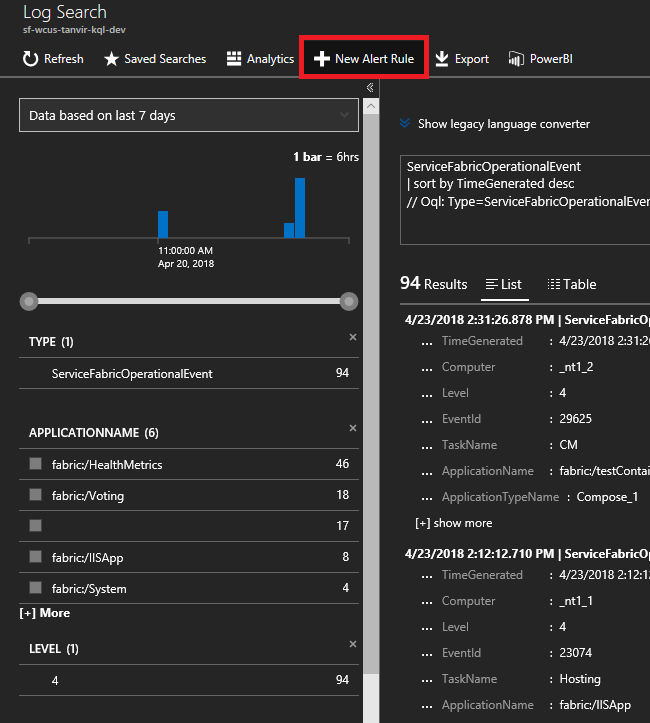

## How can I be alerted of application upgrade rollbacks?

1. On the same Log Search window as before enter the following query for upgrade rollbacks. These event IDs are found under [Application events reference](service-fabric-diagnostics-event-generation-operational.md#application-events)

    ```kusto
    ServiceFabricOperationalEvent
    | where EventID == 29623 or EventID == 29624
    ```

2. Click "New Alert Rule" at the top and now anytime an event arrives based on this query, you will receive an alert.

## How do I see container metrics?

In the same view with all the graphs, you will see some tiles for the performance of your containers. You need the Log Analytics Agent and [Container Monitoring solution](service-fabric-diagnostics-oms-containers.md) for these tiles to populate.

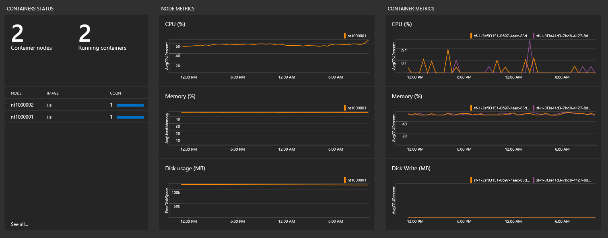

>[!NOTE]
>To instrument telemetry from **inside** your container you will need to add the [Application Insights nuget package for containers](https://github.com/Microsoft/ApplicationInsights-servicefabric#microsoftapplicationinsightsservicefabric--for-service-fabric-lift-and-shift-scenarios).

## How can I monitor performance counters?

1. Once you have added the Log Analytics agent to your cluster, you need to add the specific performance counters you want to track. Navigate to the Log Analytics workspace’s page in the portal – from the solution’s page the workspace tab is on the left menu.

    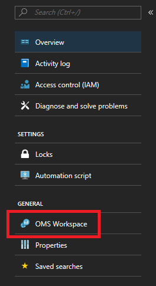

2. Once you’re on the workspace’s page, click on “Advanced settings” in the same left menu.

    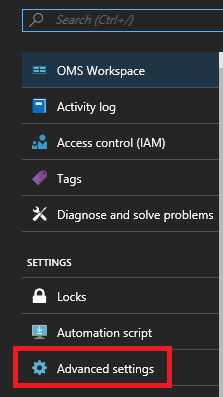

3. Click on Data > Windows Performance Counters (Data > Linux Performance Counters for Linux machines) to start collecting specific counters from your nodes via the Log Analytics agent. Here are examples of the format for counters to add

   * `.NET CLR Memory(<ProcessNameHere>)\\# Total committed Bytes`
   * `Processor(_Total)\\% Processor Time`

     In the quickstart, VotingData and VotingWeb are the process names used, so tracking these counters would look like

   * `.NET CLR Memory(VotingData)\\# Total committed Bytes`
   * `.NET CLR Memory(VotingWeb)\\# Total committed Bytes`

     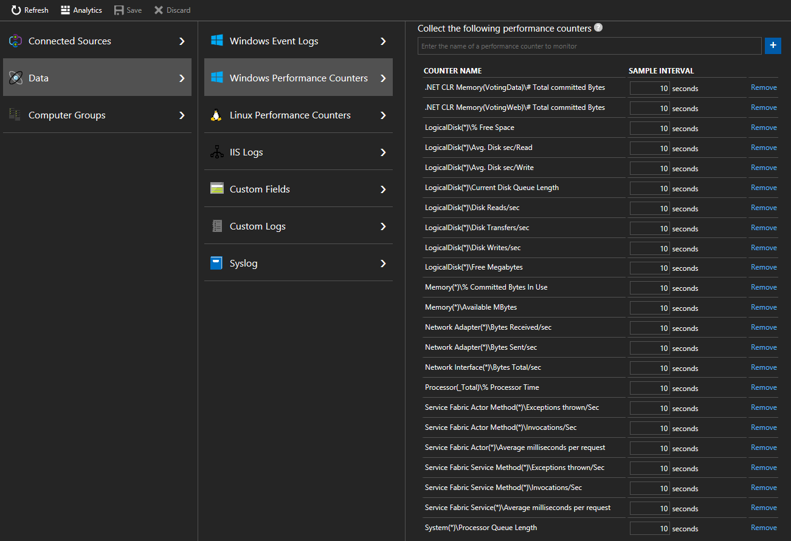

4. This will allow you to see how your infrastructure is handling your workloads, and set relevant alerts based on resource utilization. For example – you may want to set an alert if the total Processor utilization goes above 90% or below 5%. The counter name you would use for this is “% Processor Time.” You could do this by creating an alert rule for the following query:

    ```kusto
    Perf | where CounterName == "% Processor Time" and InstanceName == "_Total" | where CounterValue >= 90 or CounterValue <= 5.
    ```

## How do I track performance of my Reliable Services and Actors?

To track the performance of Reliable Services or Actors in your applications, you should collect the Service Fabric Actor, Actor Method, Service, and Service Method counters as well. Here are examples of reliable service and actor performance counters to collect

>[!NOTE]
>Service Fabric performance counters cannot be collected by the Log Analytics agent currently, but can be collected by [other diagnostic solutions](service-fabric-diagnostics-partners.md)

* `Service Fabric Service(*)\\Average milliseconds per request`
* `Service Fabric Service Method(*)\\Invocations/Sec`
* `Service Fabric Actor(*)\\Average milliseconds per request`
* `Service Fabric Actor Method(*)\\Invocations/Sec`

Check these links for the full list of performance counters on Reliable [Services](service-fabric-reliable-serviceremoting-diagnostics.md) and [Actors](service-fabric-reliable-actors-diagnostics.md)

## Next steps

* [Look Up Common Code Package Activation Errors](./service-fabric-diagnostics-code-package-errors.md)
* [Set up Alerts in AI](../azure-monitor/alerts/alerts-log.md) to be notified about changes in performance or usage
* [Smart Detection in Application Insights](../azure-monitor/alerts/proactive-diagnostics.md) performs a proactive analysis of the telemetry being sent to AI to warn you of potential performance problems
* Learn more about Azure Monitor logs [alerting](../azure-monitor/alerts/alerts-overview.md) to aid in detection and diagnostics.
* For on-premises clusters, Azure Monitor logs offers a gateway (HTTP Forward Proxy) that can be used to send data to Azure Monitor logs. Read more about that in [Connecting computers without Internet access to Azure Monitor logs using the Log Analytics gateway](../azure-monitor/agents/gateway.md)
* Get familiarized with the [log search and querying](../azure-monitor/logs/log-query-overview.md) features offered as part of Azure Monitor logs
* Get a more detailed overview of Azure Monitor logs and what it offers, read [What is Azure Monitor logs?](../azure-monitor/overview.md)
